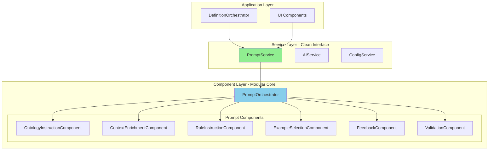
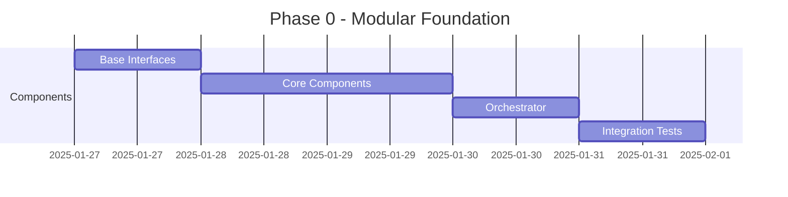
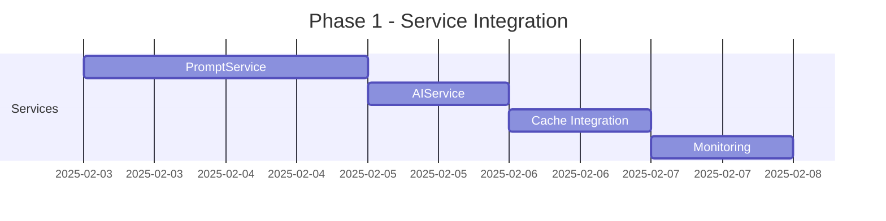
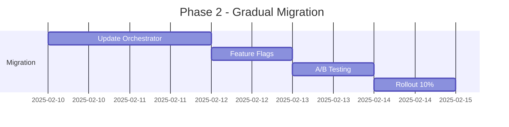
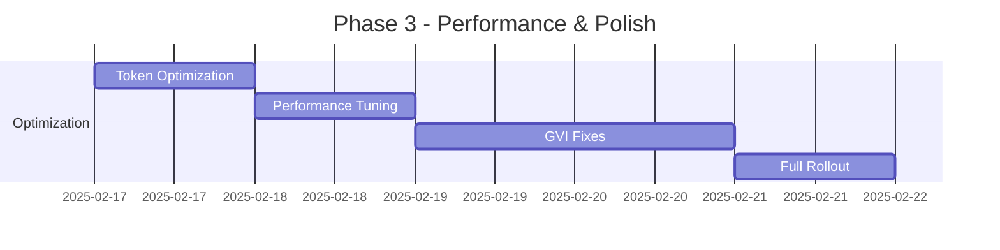

# Hybrid Prompt Architecture Proposal

**Versie**: 1.0
**Datum**: 2025-08-26
**Auteur**: Winston (Architect)
**Status**: Voorstel - Combineert Service & Modulaire Architectuur

---

## Executive Summary

Dit document presenteert een **hybride architectuur** die het beste van twee werelden combineert:
- **Service-level abstractie** voor clean integration met bestaande architectuur
- **Component-based modularity** voor maximale flexibiliteit en herbruikbaarheid

Deze aanpak maakt gradual migration mogelijk terwijl we direct de voordelen van modulariteit benutten.

---

## 1. Architectuur Overzicht

### 1.1 High-Level Design



### 1.2 Waarom Hybride?

**Service Layer Voordelen**:
- ✅ Clean interface voor rest van applicatie
- ✅ Backward compatibility
- ✅ Eenvoudige dependency injection
- ✅ Past in huidige architectuur

**Component Layer Voordelen**:
- ✅ Maximale flexibiliteit
- ✅ Herbruikbare componenten
- ✅ Fine-grained testing
- ✅ Makkelijk uit te breiden

---

## 2. Component Architectuur

### 2.1 Base Component Interface

```python
from abc import ABC, abstractmethod
from dataclasses import dataclass
from typing import Any, Optional

@dataclass
class PromptContext:
    """Shared context passed between components."""
    request: GenerationRequest
    enriched_data: dict[str, Any]
    accumulated_prompt: list[str]
    metadata: dict[str, Any]

    def add_section(self, section: str, source: str):
        """Add prompt section with source tracking."""
        self.accumulated_prompt.append(section)
        self.metadata[f"section_{len(self.accumulated_prompt)}"] = source

class PromptComponent(ABC):
    """Base interface for all prompt components."""

    @abstractmethod
    def applies_to(self, context: PromptContext) -> bool:
        """Check if this component should be used."""
        pass

    @abstractmethod
    def generate(self, context: PromptContext) -> Optional[str]:
        """Generate component's contribution to prompt."""
        pass

    @abstractmethod
    def get_priority(self) -> int:
        """Return priority for ordering (higher = earlier)."""
        pass

    @abstractmethod
    def estimate_tokens(self, section: str) -> int:
        """Estimate token count for this section."""
        pass
```

### 2.2 Core Components Implementation

#### 2.2.1 OntologyInstructionComponent

```python
class OntologyInstructionComponent(PromptComponent):
    """Handles ontological category specific instructions."""

    def __init__(self):
        self.category_instructions = {
            "ENT": {
                "prefix": "een entiteit die",
                "focus": "wat het IS",
                "examples": ["persoon", "organisatie", "document"]
            },
            "ACT": {
                "prefix": "een activiteit waarbij",
                "focus": "het proces/handeling",
                "examples": ["verificatie", "behandeling", "analyse"]
            },
            "REL": {
                "prefix": "een relatie die",
                "focus": "de verbinding tussen entiteiten",
                "examples": ["koppeling", "verband", "associatie"]
            },
            # ... andere categorieën
        }

    def applies_to(self, context: PromptContext) -> bool:
        return context.request.ontologische_categorie is not None

    def generate(self, context: PromptContext) -> Optional[str]:
        category = context.request.ontologische_categorie
        if category not in self.category_instructions:
            return None

        instruction = self.category_instructions[category]

        return f"""
## Ontologische Categorie: {category}

De definitie moet:
- Beginnen met "{instruction['prefix']}"
- Focus leggen op {instruction['focus']}
- Vergelijkbaar zijn met termen als: {', '.join(instruction['examples'])}

LET OP: Pas de structuur aan de categorie aan!
"""

    def get_priority(self) -> int:
        return 100  # Hoge prioriteit

    def estimate_tokens(self, section: str) -> int:
        return len(section) // 4  # Rough estimate
```

#### 2.2.2 ContextEnrichmentComponent

```python
class ContextEnrichmentComponent(PromptComponent):
    """Enriches context with relevant information."""

    def __init__(self, enrichment_service: ContextEnrichmentService):
        self.enrichment_service = enrichment_service

    def applies_to(self, context: PromptContext) -> bool:
        return bool(context.request.context or context.request.domein)

    async def generate(self, context: PromptContext) -> Optional[str]:
        # Enrich context
        enriched = await self.enrichment_service.enrich(
            begrip=context.request.begrip,
            raw_context=context.request.context,
            domein=context.request.domein
        )

        # Store for other components
        context.enriched_data['enriched_context'] = enriched

        # Generate prompt section
        if not enriched.has_meaningful_content():
            return None

        return f"""
## Context Informatie

{enriched.to_prompt_text(max_chars=2000)}
"""

    def get_priority(self) -> int:
        return 90
```

#### 2.2.3 RuleInstructionComponent

```python
class RuleInstructionComponent(PromptComponent):
    """Provides relevant validation rules."""

    def __init__(self, rule_service: RuleSelectionService):
        self.rule_service = rule_service
        self.max_rules = 10  # Limit for token optimization

    def applies_to(self, context: PromptContext) -> bool:
        return True  # Always include some rules

    def generate(self, context: PromptContext) -> Optional[str]:
        # Select most relevant rules
        relevant_rules = self.rule_service.select_relevant_rules(
            category=context.request.ontologische_categorie,
            context_type=self._determine_context_type(context),
            max_rules=self.max_rules
        )

        if not relevant_rules:
            return None

        rules_text = "\n".join([
            f"- {rule.id}: {rule.summary}"
            for rule in relevant_rules
        ])

        return f"""
## Belangrijke Kwaliteitsregels

Houd rekening met deze regels:
{rules_text}

Focus vooral op regels die relevant zijn voor {context.request.ontologische_categorie}.
"""
```

#### 2.2.4 FeedbackComponent (GVI Rode Kabel!)

```python
class FeedbackComponent(PromptComponent):
    """Integrates feedback from previous attempts."""

    def __init__(self, regeneration_service: RegenerationService):
        self.regeneration_service = regeneration_service

    def applies_to(self, context: PromptContext) -> bool:
        return self.regeneration_service.has_active_context()

    def generate(self, context: PromptContext) -> Optional[str]:
        feedback_history = self.regeneration_service.get_feedback_history()

        if not feedback_history:
            return None

        # Format feedback for prompt
        feedback_sections = []
        for i, feedback in enumerate(feedback_history[-3:], 1):  # Last 3
            feedback_sections.append(f"""
Poging {i}:
- Definitie: {feedback['definition'][:200]}...
- Problemen: {', '.join(feedback['violations'])}
- Suggesties: {', '.join(feedback['suggestions'])}
""")

        return f"""
## ⚠️ Eerdere Pogingen - VERMIJD DEZE FOUTEN

{chr(10).join(feedback_sections)}

GENERATIE INSTRUCTIE: Leer van bovenstaande feedback en vermijd dezelfde fouten.
"""

    def get_priority(self) -> int:
        return 95  # High priority - moet vroeg in prompt
```

### 2.3 Prompt Orchestrator

```python
class PromptOrchestrator:
    """Orchestrates modular prompt components."""

    def __init__(
        self,
        components: list[PromptComponent],
        token_limit: int = 10000,
        config: PromptOrchestratorConfig = None
    ):
        self.components = sorted(
            components,
            key=lambda c: c.get_priority(),
            reverse=True
        )
        self.token_limit = token_limit
        self.config = config or PromptOrchestratorConfig()

    async def build_prompt(
        self,
        request: GenerationRequest,
        feedback_history: list[dict] = None
    ) -> PromptResult:
        """Build prompt using all applicable components."""

        # Initialize context
        context = PromptContext(
            request=request,
            enriched_data={},
            accumulated_prompt=[],
            metadata={
                "timestamp": datetime.now().isoformat(),
                "components_used": []
            }
        )

        # Add feedback to context if provided
        if feedback_history:
            context.enriched_data['feedback_history'] = feedback_history

        # Build prompt from components
        total_tokens = 0

        for component in self.components:
            if not component.applies_to(context):
                continue

            try:
                # Generate section
                section = await self._generate_component_section(
                    component, context
                )

                if not section:
                    continue

                # Check token limit
                section_tokens = component.estimate_tokens(section)
                if total_tokens + section_tokens > self.token_limit:
                    logger.warning(
                        f"Skipping {component.__class__.__name__} - "
                        f"would exceed token limit"
                    )
                    continue

                # Add to prompt
                context.add_section(section, component.__class__.__name__)
                total_tokens += section_tokens
                context.metadata["components_used"].append(
                    component.__class__.__name__
                )

            except Exception as e:
                logger.error(
                    f"Component {component.__class__.__name__} failed: {e}"
                )
                if self.config.fail_on_component_error:
                    raise

        # Combine sections
        final_prompt = self._combine_sections(context)

        return PromptResult(
            text=final_prompt,
            token_count=total_tokens,
            components_used=context.metadata["components_used"],
            metadata=context.metadata
        )

    async def _generate_component_section(
        self,
        component: PromptComponent,
        context: PromptContext
    ) -> Optional[str]:
        """Generate section handling async/sync components."""
        if asyncio.iscoroutinefunction(component.generate):
            return await component.generate(context)
        return component.generate(context)

    def _combine_sections(self, context: PromptContext) -> str:
        """Combine all sections into final prompt."""
        # Add header
        header = f"""
# Definitie Generatie Opdracht

Genereer een definitie voor: **{context.request.begrip}**
"""

        # Add sections
        sections = [header] + context.accumulated_prompt

        # Add footer
        footer = """
## Generatie Instructies

1. Maak een heldere, eenduidige definitie
2. Vermijd cirkelredeneringen
3. Gebruik correcte Nederlandse juridische terminologie
4. Houd de definitie beknopt maar volledig

Definitie:"""

        sections.append(footer)

        return "\n".join(sections)
```

---

## 3. Service Layer Implementation

### 3.1 PromptService - Clean Interface

```python
class PromptService:
    """Service layer providing clean interface for prompt generation."""

    def __init__(
        self,
        orchestrator: PromptOrchestrator,
        cache_service: CacheService = None,
        monitoring_service: MonitoringService = None
    ):
        self.orchestrator = orchestrator
        self.cache = cache_service
        self.monitoring = monitoring_service

    async def build_generation_prompt(
        self,
        request: GenerationRequest,
        feedback_history: list[dict] = None,
        options: PromptOptions = None
    ) -> PromptServiceResult:
        """Build prompt with caching and monitoring."""

        start_time = time.time()
        cache_key = self._generate_cache_key(request, feedback_history)

        # Check cache
        if self.cache and not (options and options.skip_cache):
            cached = await self.cache.get(cache_key)
            if cached:
                return PromptServiceResult(
                    prompt_text=cached['text'],
                    token_count=cached['tokens'],
                    from_cache=True,
                    generation_time=0
                )

        # Generate new prompt
        result = await self.orchestrator.build_prompt(
            request, feedback_history
        )

        # Cache result
        if self.cache:
            await self.cache.set(cache_key, {
                'text': result.text,
                'tokens': result.token_count
            }, ttl=3600)  # 1 hour

        # Monitor
        generation_time = time.time() - start_time
        if self.monitoring:
            await self.monitoring.track_prompt_generation(
                request_id=request.id,
                token_count=result.token_count,
                generation_time=generation_time,
                components_used=result.components_used
            )

        return PromptServiceResult(
            prompt_text=result.text,
            token_count=result.token_count,
            from_cache=False,
            generation_time=generation_time,
            metadata=result.metadata
        )
```

### 3.2 Integration met DefinitionOrchestrator

```python
class DefinitionOrchestrator:
    """Updated to use new PromptService."""

    def __init__(self, prompt_service: PromptService, ai_service: AIService, ...):
        self.prompt_service = prompt_service
        self.ai_service = ai_service
        # ... other services

    async def _generate_definition(self, context: ProcessingContext) -> Definition:
        """Clean implementation using services."""

        # Build prompt via service
        prompt_result = await self.prompt_service.build_generation_prompt(
            request=context.request,
            feedback_history=context.feedback_history
        )

        # Generate via AI service
        generation_result = await self.ai_service.generate_text(
            prompt=prompt_result.prompt_text,
            temperature=context.options.temperature,
            max_tokens=context.options.max_tokens
        )

        # Create definition
        return self._create_definition(
            request=context.request,
            generated_text=generation_result.text,
            metadata={
                **prompt_result.metadata,
                **generation_result.metadata
            }
        )
```

---

## 4. Implementation Roadmap

### Phase 0: Foundation (Week 1)



**Deliverables**:
- ✅ PromptComponent base interface
- ✅ 5-6 core components implemented
- ✅ PromptOrchestrator working
- ✅ Basic integration tests

### Phase 1: Service Layer (Week 2)



**Deliverables**:
- ✅ Clean service interfaces
- ✅ Caching for performance
- ✅ Monitoring/metrics
- ✅ End-to-end tests

### Phase 2: Migration (Week 3)



**Deliverables**:
- ✅ DefinitionOrchestrator using new services
- ✅ Feature flag system
- ✅ A/B testing framework
- ✅ 10% traffic on new system

### Phase 3: Optimization (Week 4)



**Deliverables**:
- ✅ <10k token prompts
- ✅ <5s response time
- ✅ GVI Rode Kabel fixed
- ✅ 100% traffic migrated

---

## 5. Key Benefits

### 5.1 Immediate Benefits

1. **Testability**
   - Each component can be unit tested
   - Integration tests at orchestrator level
   - Service tests for full flow

2. **Flexibility**
   - Add/remove components without touching others
   - A/B test different component combinations
   - Easy to experiment with new approaches

3. **Performance**
   - Components can be cached individually
   - Parallel component generation possible
   - Token limits enforced per component

### 5.2 Long-term Benefits

1. **Maintainability**
   - Clear separation of concerns
   - Easy to understand component responsibilities
   - New developers can contribute single components

2. **Extensibility**
   - New prompt requirements = new component
   - Domain-specific components possible
   - Plugin architecture for future

3. **Quality**
   - Each component can be optimized independently
   - Better prompt consistency
   - Easier to debug issues

---

## 6. Migration Strategy

### 6.1 Backward Compatibility

```python
class LegacyPromptAdapter:
    """Maintains compatibility during transition."""

    def __init__(self, prompt_service: PromptService):
        self.prompt_service = prompt_service

    def bouw_prompt(self) -> str:
        """Legacy interface."""
        # Convert legacy format
        request = self._convert_legacy_request()

        # Use new service
        result = asyncio.run(
            self.prompt_service.build_generation_prompt(request)
        )

        return result.prompt_text
```

### 6.2 Feature Flags

```python
class FeatureFlagService:
    """Control rollout of new prompt system."""

    def should_use_modular_prompts(self, user_id: str) -> bool:
        # Start with 10%
        if self.is_in_test_group(user_id, percentage=10):
            return True

        # Check explicit opt-in
        if self.is_opted_in(user_id):
            return True

        return False
```

### 6.3 Rollback Plan

```python
# Quick rollback via environment variable
if os.getenv('USE_LEGACY_PROMPTS', 'false').lower() == 'true':
    return LegacyPromptBuilder()
else:
    return ModularPromptService()
```

---

## 7. Success Metrics

### 7.1 Technical Metrics

| Metric | Current | Target | Measurement |
|--------|---------|--------|-------------|
| Prompt Size | ~35k chars | <10k chars | Token counter per component |
| Response Time | 8-12s | <5s | End-to-end timing |
| Test Coverage | 11% | 80% | Component + integration tests |
| API Cost | €0.35/req | €0.10/req | Token usage tracking |

### 7.2 Quality Metrics

| Metric | Current | Target | Measurement |
|--------|---------|--------|-------------|
| First-Time-Right | 60% | 90% | Validation success rate |
| Feedback Integration | 0% | 100% | Rode Kabel usage |
| Component Reuse | 0% | 70% | Cross-domain usage |

---

## 8. Example Implementation

### 8.1 Complete Example - Ontology Component

```python
# src/services/prompt_components/ontology_component.py

from dataclasses import dataclass
from typing import Optional, Dict, List
import logging

from services.prompt_components.base import PromptComponent, PromptContext

logger = logging.getLogger(__name__)

@dataclass
class OntologyInstruction:
    """Instruction set for a specific ontology category."""
    category: str
    prefix: str
    focus: str
    examples: List[str]
    constraints: List[str]

class OntologyInstructionComponent(PromptComponent):
    """
    Generates ontology-specific instructions for definition generation.

    This component ensures definitions follow the correct pattern
    based on their ontological category (ENT, ACT, REL, etc.).
    """

    def __init__(self, instruction_repository: OntologyInstructionRepository = None):
        """Initialize with optional custom instruction repository."""
        self.instruction_repo = instruction_repository or self._default_instructions()
        self._token_estimator = TokenEstimator()

    def _default_instructions(self) -> Dict[str, OntologyInstruction]:
        """Default ontology instructions."""
        return {
            "ENT": OntologyInstruction(
                category="ENT",
                prefix="een entiteit die",
                focus="wat het IS (zelfstandig naamwoord)",
                examples=["persoon", "organisatie", "document", "systeem"],
                constraints=[
                    "Moet een zelfstandig naamwoord zijn",
                    "Geen werkwoorden in de kern definitie",
                    "Duidelijk afgebakend concept"
                ]
            ),
            "ACT": OntologyInstruction(
                category="ACT",
                prefix="een activiteit waarbij",
                focus="het proces of de handeling",
                examples=["verificatie", "behandeling", "beoordeling"],
                constraints=[
                    "Moet een werkwoord of handelingsnaam bevatten",
                    "Beschrijf het proces, niet het resultaat",
                    "Vermeld actoren indien relevant"
                ]
            ),
            # ... meer categorieën
        }

    def applies_to(self, context: PromptContext) -> bool:
        """Check if ontology instructions should be included."""
        has_category = context.request.ontologische_categorie is not None
        is_known = context.request.ontologische_categorie in self.instruction_repo

        if has_category and not is_known:
            logger.warning(
                f"Unknown ontology category: {context.request.ontologische_categorie}"
            )

        return has_category and is_known

    def generate(self, context: PromptContext) -> Optional[str]:
        """Generate ontology-specific instructions."""
        category = context.request.ontologische_categorie
        instruction = self.instruction_repo.get(category)

        if not instruction:
            return None

        # Build instruction text
        instruction_text = f"""
## 🎯 Ontologische Categorie: {category}

### Definitie Structuur
De definitie voor '{context.request.begrip}' moet:
- **Beginnen met**: "{instruction.prefix}"
- **Focus op**: {instruction.focus}

### Vergelijkbare Termen
Ter referentie, andere {category} termen:
{self._format_examples(instruction.examples)}

### Belangrijke Richtlijnen
{self._format_constraints(instruction.constraints)}

### ⚠️ VERPLICHT
De definitie MOET passen bij categorie {category}.
Indien het begrip niet past, meld dit expliciet.
"""

        # Store instruction in context for other components
        context.enriched_data['ontology_instruction'] = instruction

        return instruction_text

    def get_priority(self) -> int:
        """High priority - shapes entire definition."""
        return 100

    def estimate_tokens(self, section: str) -> int:
        """Estimate tokens for this section."""
        return self._token_estimator.estimate(section)

    def _format_examples(self, examples: List[str]) -> str:
        """Format examples as bullet list."""
        return "\n".join([f"- {example}" for example in examples[:4]])

    def _format_constraints(self, constraints: List[str]) -> str:
        """Format constraints as numbered list."""
        return "\n".join([
            f"{i+1}. {constraint}"
            for i, constraint in enumerate(constraints)
        ])

# Usage in configuration
def create_ontology_component() -> OntologyInstructionComponent:
    """Factory function for dependency injection."""
    # Could load from database or config file
    return OntologyInstructionComponent()
```

### 8.2 Orchestrator Configuration Example

```python
# src/services/prompt_orchestrator_factory.py

def create_prompt_orchestrator(
    config: AppConfig,
    services: ServiceContainer
) -> PromptOrchestrator:
    """Create fully configured prompt orchestrator."""

    # Create components
    components = [
        # Ontology - highest priority
        OntologyInstructionComponent(),

        # Feedback - very high priority
        FeedbackComponent(
            regeneration_service=services.get_regeneration_service()
        ),

        # Context enrichment
        ContextEnrichmentComponent(
            enrichment_service=services.get_context_enrichment_service()
        ),

        # Rule selection
        RuleInstructionComponent(
            rule_service=services.get_rule_selection_service(),
            max_rules=10
        ),

        # Example selection
        ExampleSelectionComponent(
            example_service=services.get_example_service(),
            max_examples=3
        ),

        # Validation hints
        ValidationHintComponent(
            validator=services.get_validator()
        ),

        # Domain-specific components (if applicable)
        *create_domain_components(config.domain)
    ]

    # Create orchestrator
    return PromptOrchestrator(
        components=components,
        token_limit=config.prompt_token_limit or 10000,
        config=PromptOrchestratorConfig(
            fail_on_component_error=config.is_production,
            enable_caching=True,
            cache_ttl=3600
        )
    )
```

---

## 9. Testing Strategy

### 9.1 Component Testing

```python
# tests/services/prompt_components/test_ontology_component.py

class TestOntologyComponent:
    """Test ontology instruction component."""

    def test_generates_correct_instructions_for_entity(self):
        # Arrange
        component = OntologyInstructionComponent()
        context = create_test_context(
            begrip="Verdachte",
            ontologische_categorie="ENT"
        )

        # Act
        result = component.generate(context)

        # Assert
        assert result is not None
        assert "een entiteit die" in result
        assert "zelfstandig naamwoord" in result
        assert "ENT" in result

    def test_returns_none_for_unknown_category(self):
        # Test graceful handling of unknown categories
        component = OntologyInstructionComponent()
        context = create_test_context(
            ontologische_categorie="UNKNOWN"
        )

        assert not component.applies_to(context)

    def test_token_estimation_reasonable(self):
        # Test token estimation is within expected range
        component = OntologyInstructionComponent()
        section = "A" * 1000  # 1000 chars

        tokens = component.estimate_tokens(section)
        assert 200 < tokens < 300  # ~4 chars per token
```

### 9.2 Integration Testing

```python
# tests/services/test_prompt_orchestrator_integration.py

class TestPromptOrchestratorIntegration:
    """Integration tests for complete prompt generation."""

    async def test_complete_prompt_generation_flow(self):
        # Create orchestrator with all components
        orchestrator = create_test_orchestrator()

        # Create request
        request = GenerationRequest(
            begrip="Verdachte",
            context="Strafrechtelijke vervolging",
            domein="Juridisch",
            ontologische_categorie="ENT"
        )

        # Generate prompt
        result = await orchestrator.build_prompt(request)

        # Verify structure
        assert result.text
        assert result.token_count < 10000
        assert "ENT" in result.text
        assert "een entiteit die" in result.text
        assert len(result.components_used) >= 3

    async def test_feedback_integration(self):
        """Test GVI Rode Kabel integration."""
        orchestrator = create_test_orchestrator()

        feedback = [{
            "definition": "Previous attempt",
            "violations": ["CON-01", "STR-03"],
            "suggestions": ["Remove context", "Fix structure"]
        }]

        result = await orchestrator.build_prompt(
            request=create_test_request(),
            feedback_history=feedback
        )

        assert "Eerdere Pogingen" in result.text
        assert "CON-01" in result.text
```

---

## 10. Conclusie

Deze hybride architectuur biedt:

1. **Direct Implementeerbaar**: Begin met componenten, voeg service layer toe
2. **Maximale Flexibiliteit**: Modulaire componenten zijn herbruikbaar
3. **Clean Integration**: Service layer past in huidige architectuur
4. **Gradual Migration**: Geen big-bang, feature flags voor rollout
5. **GVI Ready**: Feedback component lost Rode Kabel direct op

De combinatie van service-level abstractie met component-based modulariteit geeft het beste van beide werelden: een clean interface voor de applicatie met maximale flexibiliteit in de implementatie.

---

## Appendix A: Component Catalog

| Component | Priority | Purpose | Token Impact |
|-----------|----------|---------|-------------|
| OntologyInstruction | 100 | Ontological category rules | ~500 |
| Feedback | 95 | Previous attempts (Rode Kabel) | ~800 |
| ContextEnrichment | 90 | Enrich context information | ~2000 |
| RuleInstruction | 85 | Relevant validation rules | ~1000 |
| ExampleSelection | 80 | Dynamic examples | ~1500 |
| ValidationHint | 75 | Validation guidance | ~500 |
| DomainSpecific | 70 | Domain-specific rules | ~1000 |
| MetaInstruction | 60 | General instructions | ~500 |

## Appendix B: Configuration Example

```json
{
  "prompt_orchestrator": {
    "token_limit": 10000,
    "components": {
      "ontology": {
        "enabled": true,
        "priority": 100,
        "custom_instructions_path": "config/ontology_instructions.json"
      },
      "feedback": {
        "enabled": true,
        "max_history": 3,
        "priority": 95
      },
      "context": {
        "enabled": true,
        "max_chars": 2000,
        "enrichment_service": "advanced"
      }
    },
    "caching": {
      "enabled": true,
      "ttl_seconds": 3600,
      "redis_url": "redis://localhost:6379/1"
    }
  }
}
```
