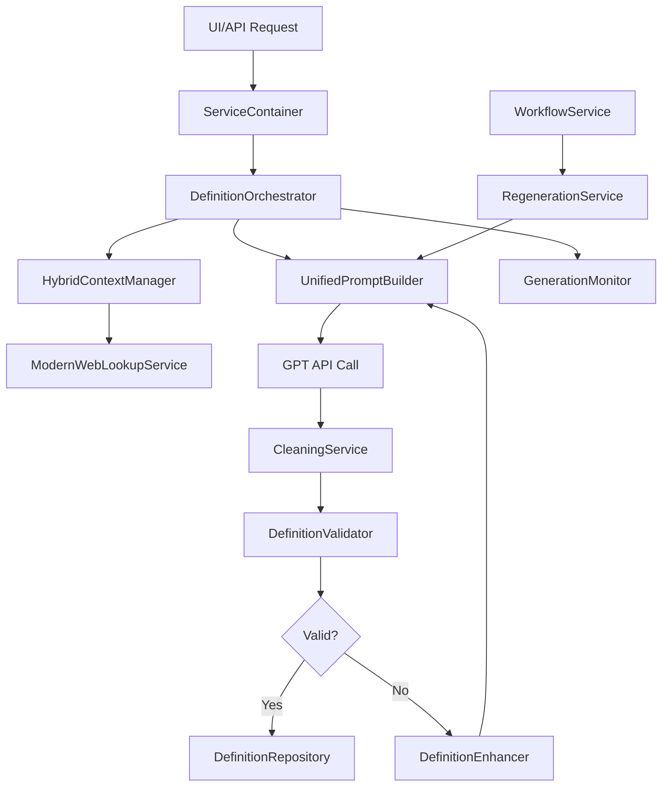

# Overzicht Definitie Generatie Services

Dit document geeft een gestructureerd overzicht van alle services betrokken bij het genereren van definities in de Definitie-app.

## Primaire Generatie Services

### 1. **DefinitionOrchestrator** (`definition_orchestrator.py`)
**Primaire rol:** Hoofdservice die het complete definitie generatie proces orkestreert

**Belangrijkste methoden:**
- `create_definition()` - Orkestreert generatie, validatie, verrijking en opslag
- `_generate_definition()` - Roept onderliggende generator aan
- `_validate_definition()` - Valideert via DefinitionValidator
- `_enrich_definition()` - Verrijkt met web lookup en voorbeelden
- `_save_definition()` - Slaat op via DefinitionRepository

**Relatie tot andere services:**
- Gebruikt DefinitionValidator voor kwaliteitscontrole
- Gebruikt DefinitionRepository voor opslag
- Gebruikt CleaningService voor opschoning
- Vervangt de deprecated UnifiedDefinitionGenerator

### 2. **UnifiedPromptBuilder** (`definition_generator_prompts.py`)
**Primaire rol:** Bouwt intelligente prompts voor GPT aanroepen

**Belangrijkste methoden:**
- `build_prompt()` - Hoofdmethode voor prompt generatie
- `_select_strategy()` - Kiest beste prompt strategie
- Bevat meerdere strategieën: Legacy, Basic, ContextAware

**Prompt strategieën:**
- **LegacyPromptBuilder**: Gebruikt oude prompt_builder module
- **BasicPromptBuilder**: Template-gebaseerde prompts
- **ContextAwarePromptBuilder**: Adapteert aan context rijkheid

**Relatie tot andere services:**
- Gebruikt door DefinitionOrchestrator voor prompt building
- Integreert met HybridContextManager voor context

### 3. **HybridContextManager** (`definition_generator_context.py`)
**Primaire rol:** Verrijkt context informatie voor betere definities

**Belangrijkste methoden:**
- `build_enriched_context()` - Bouwt verrijkte context
- `_build_base_context()` - Extraheert basis context
- `_expand_abbreviations()` - Expandeert afkortingen
- `_get_web_context()` - Haalt web informatie op
- `_get_hybrid_context()` - Gebruikt hybrid engine

**Context bronnen:**
- Basis context uit GenerationRequest
- Web lookup via ModernWebLookupService
- Hybrid context engine (optioneel)
- Document context (indien beschikbaar)

**Relatie tot andere services:**
- Levert context aan UnifiedPromptBuilder
- Gebruikt ModernWebLookupService voor web data

## Ondersteunende Generatie Services

### 4. **DefinitionEnhancer** (`definition_generator_enhancement.py`)
**Primaire rol:** Verbetert gegenereerde definities

**Enhancement types:**
- **ClarityEnhancer**: Verbetert helderheid
- **ContextIntegrationEnhancer**: Integreert context
- **CompletenessEnhancer**: Voegt missende elementen toe
- **LinguisticEnhancer**: Verbetert taalgebruik

**Belangrijkste methoden:**
- `enhance()` - Past enhancements toe
- `_calculate_vagueness_score()` - Detecteert vage termen
- `_fix_circular_reasoning()` - Verwijdert cirkelredeneringen

**Relatie tot andere services:**
- Gebruikt door DefinitionOrchestrator na generatie
- Werkt samen met DefinitionValidator voor kwaliteit

### 5. **RegenerationService** (`regeneration_service.py`)
**Primaire rol:** Regenereert definities bij categorie wijziging

**Belangrijkste methoden:**
- `set_regeneration_context()` - Zet regeneratie context
- `enhance_prompt_with_context()` - Voegt feedback toe aan prompt
- `get_feedback_history()` - Levert feedback voor prompt builder

**Regeneratie context:**
- Oude en nieuwe categorie
- Vorige definitie
- Focus instructies per categorie

**Relatie tot andere services:**
- Integreert met UnifiedPromptBuilder
- Onderdeel van WorkflowService orchestratie

### 6. **ModernWebLookupService** (`modern_web_lookup_service.py`)
**Primaire rol:** Haalt externe informatie op voor context verrijking

**Ondersteunde bronnen:**
- Wikipedia (encyclopedische info)
- Wiktionary (woordenboek info)
- Overheid.nl (juridische info)
- Rechtspraak.nl (jurisprudentie)

**Belangrijkste methoden:**
- `lookup()` - Concurrent lookups in meerdere bronnen
- `_determine_sources()` - Intelligente bron selectie
- `_lookup_mediawiki()` - Wikipedia/Wiktionary API
- `_lookup_sru()` - SRU protocol voor juridische bronnen

**Relatie tot andere services:**
- Gebruikt door HybridContextManager
- Levert context voor DefinitionOrchestrator

## Validatie en Kwaliteit Services

### 7. **DefinitionValidator** (`definition_validator.py`)
**Primaire rol:** Valideert definities volgens Nederlandse overheid standaarden

**Validatie categorieën:**
- CON: Consistentie regels
- ESS: Essentiële regels
- INT: Interpretatie regels
- SAM: Samenhang regels
- STR: Structuur regels
- VER: Verificatie regels
- ARAI: AI specifieke regels

**Belangrijkste methoden:**
- `validate()` - Volledige definitie validatie
- `validate_field()` - Veld-specifieke validatie
- `_generate_suggestions()` - Genereert verbeter suggesties

**Relatie tot andere services:**
- Gebruikt door DefinitionOrchestrator
- Feedback naar DefinitionEnhancer

### 8. **CleaningService** (`cleaning_service.py`)
**Primaire rol:** Schoont AI-gegenereerde tekst op

**Opschoning taken:**
- Verwijdert GPT metadata
- Corrigeert formatting
- Verwijdert verboden woorden
- Analyseert wijzigingen

**Belangrijkste methoden:**
- `clean_definition()` - Schoont definitie object op
- `clean_text()` - Tekst-niveau opschoning
- `_analyze_changes()` - Tracking van wijzigingen

**Relatie tot andere services:**
- Gebruikt door DefinitionOrchestrator
- Werkt na generatie, voor validatie

## Monitoring en Configuratie Services

### 9. **GenerationMonitor** (`definition_generator_monitoring.py`)
**Primaire rol:** Monitort performance en kwaliteit

**Metrics types:**
- Generation count/duration
- Success/error rates
- Cache hit rates
- Context richness scores
- Quality metrics

**Belangrijkste methoden:**
- `start_generation()` - Start monitoring
- `finish_generation()` - Beëindigt en logt metrics
- `record_context_metrics()` - Context specifieke metrics
- `get_performance_report()` - Performance overzicht

**Relatie tot andere services:**
- Gebruikt door DefinitionOrchestrator
- Kan gebruikt worden voor A/B testing

### 10. **UnifiedGeneratorConfig** (`definition_generator_config.py`)
**Primaire rol:** Centrale configuratie voor alle generator componenten

**Configuratie secties:**
- **GPTConfig**: Model parameters, retry settings
- **CacheConfig**: Cache strategie en TTL
- **ContextConfig**: Web lookup, afkortingen
- **QualityConfig**: Enhancement, cleaning settings
- **MonitoringConfig**: Logging, metrics, alerts

**Relatie tot andere services:**
- Gebruikt door alle generator services
- Loaded door ServiceContainer

## Orchestratie en Workflow

### 11. **WorkflowService** (`workflow_service.py`)
**Primaire rol:** Beheert business logic voor status transities

**Belangrijkste functies:**
- Status transitie regels
- Category change workflows
- Regeneratie triggers

**Relatie tot andere services:**
- Orkestreert RegenerationService
- Integreert met UI componenten

### 12. **ServiceContainer** (`container.py`)
**Primaire rol:** Dependency injection en service lifecycle

**Belangrijkste taken:**
- Singleton management
- Service configuratie
- Dependency wiring

**Relatie tot andere services:**
- Instantieert alle services
- Beheert configuraties

## Generatie Flow

## Samenvatting

Het definitie generatie proces is een complex samenspel van gespecialiseerde services:

1. **DefinitionOrchestrator** is de centrale orchestrator
2. **Context services** (HybridContextManager, ModernWebLookupService) verrijken informatie
3. **Prompt services** (UnifiedPromptBuilder) bouwen intelligente prompts
4. **Quality services** (Validator, Cleaner, Enhancer) zorgen voor kwaliteit
5. **Workflow services** beheren regeneratie en status transities
6. **Monitoring services** tracken performance en kwaliteit

Deze architectuur zorgt voor:
- Modulaire, testbare componenten
- Flexibele configuratie
- Robuuste error handling
- Uitbreidbare functionaliteit
- Performance monitoring
