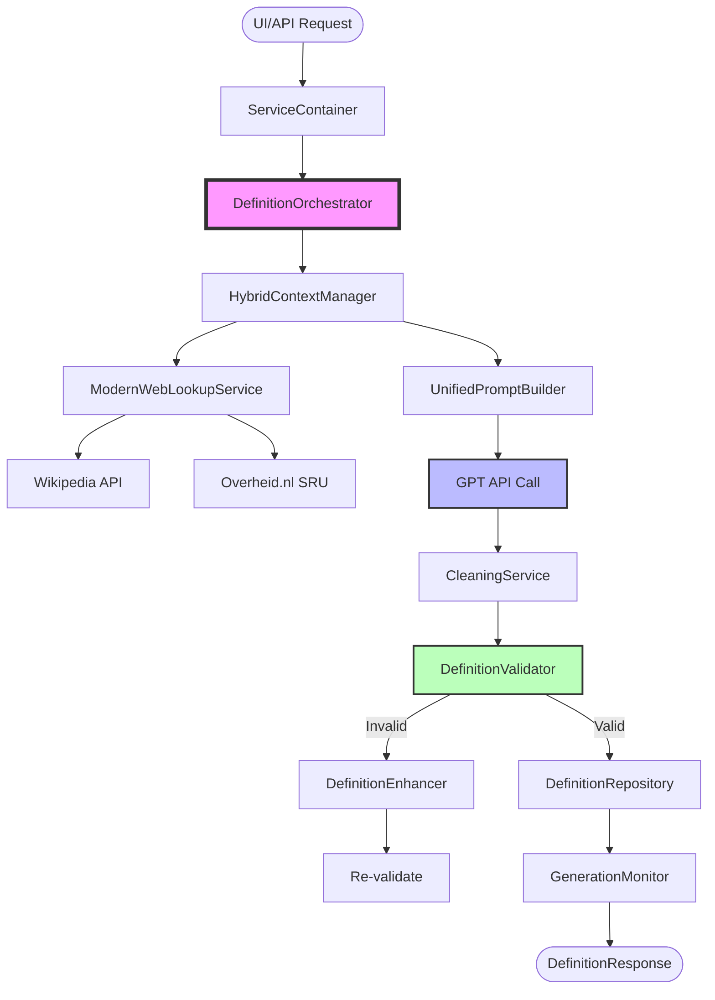
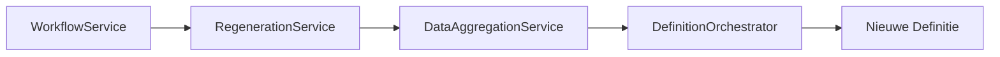
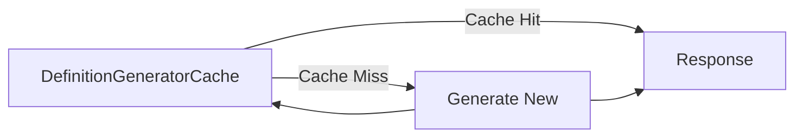

# Definitie Generatie Workflow - Overzicht

Dit document biedt een compleet overzicht van alle services betrokken bij het genereren van definities in de Definitie-app.

## 📋 Services Overzicht

### 🎯 Primaire Generatie Services

| Service | Bestand | Hoofdfunctie |
|---------|---------|--------------|
| **DefinitionOrchestrator** | `definition_orchestrator.py` | Centrale orchestrator die het complete generatie proces coördineert |
| **UnifiedPromptBuilder** | `definition_generator_prompts.py` | Bouwt intelligente prompts voor GPT API calls |
| **HybridContextManager** | `definition_generator_context.py` | Verrijkt context informatie voor betere definities |

### 🔧 Ondersteunende Services

| Service | Bestand | Hoofdfunctie |
|---------|---------|--------------|
| **DefinitionEnhancer** | `definition_generator_enhancement.py` | Verbetert gegenereerde definities (clarity, completeness) |
| **RegenerationService** | `regeneration_service.py` | Regenereert definities bij categorie wijzigingen |
| **ModernWebLookupService** | `modern_web_lookup_service.py` | Haalt externe informatie op (Wikipedia, Overheid.nl) |

### ✅ Validatie & Kwaliteit

| Service | Bestand | Hoofdfunctie |
|---------|---------|--------------|
| **DefinitionValidator** | `definition_validator.py` | Valideert volgens Nederlandse overheid standaarden |
| **CleaningService** | `cleaning_service.py` | Schoont AI-gegenereerde tekst op |
| **DuplicateDetectionService** | `duplicate_detection_service.py` | Detecteert duplicate definities |

### 🏗️ Infrastructuur

| Service | Bestand | Hoofdfunctie |
|---------|---------|--------------|
| **GenerationMonitor** | `definition_generator_monitoring.py` | Monitort performance en kwaliteit metrics |
| **UnifiedGeneratorConfig** | `definition_generator_config.py` | Centrale configuratie voor alle componenten |
| **DefinitionGeneratorCache** | `definition_generator_cache.py` | Cache systeem voor performance |
| **WorkflowService** | `workflow_service.py` | Beheert status transities en workflows |

## 🔄 Generatie Workflow



## 📊 Gedetailleerde Service Rollen

### 1. **DefinitionOrchestrator** - De Dirigent 🎼
```python
# Hoofdmethode die alles coördineert
async def create_definition(request: GenerationRequest) -> DefinitionResponse:
    # 1. Generatie
    definition = await self._generate_definition(request)

    # 2. Validatie
    validation_result = self._validate_definition(definition)

    # 3. Verrijking (parallel)
    if self.config.enable_enrichment:
        await self._enrich_definition(definition)

    # 4. Opslag
    if validation_result.is_valid:
        definition_id = self.repository.save(definition)
```

### 2. **HybridContextManager** - De Context Expert 🧠
- **Bronnen**: Basis context, web lookup resultaten, document context
- **Output**: Verrijkte context voor betere prompts
- **Strategieën**: Basic, WebEnhanced, Hybrid, Advanced

### 3. **UnifiedPromptBuilder** - De Prompt Architect 📝
- **Strategieën**: Legacy, Basic, ContextAware
- **Features**: Template systeem, context integratie, role prompts
- **Output**: Geoptimaliseerde GPT prompts

### 4. **DefinitionEnhancer** - De Kwaliteitsverbeteraar ✨
Enhancement types:
- **ClarityEnhancer**: Verbetert helderheid en leesbaarheid
- **ContextIntegrationEnhancer**: Integreert context natuurlijker
- **CompletenessEnhancer**: Voegt ontbrekende elementen toe
- **LinguisticEnhancer**: Verbetert grammatica en stijl

### 5. **CleaningService** - De Opschoner 🧹
- Verwijdert GPT metadata ("Als AI assistent...")
- Corrigeert formatting issues
- Verwijdert verboden woorden
- Normaliseert whitespace

### 6. **DefinitionValidator** - De Kwaliteitsbewaker 👮
Validatie categorieën:
- **CON**: Consistentie checks
- **ESS**: Essentiële elementen
- **INT**: Integriteit
- **SAM**: Samenhang
- **STR**: Structuur
- **VER**: Volledigheid
- **ARAI**: AI-specifieke checks

## 🚀 Speciale Workflows

### Categorie Wijziging Flow


### Performance Optimalisatie


## 📈 Monitoring & Metrics

**GenerationMonitor** tracks:
- Generation duration
- Success/failure rates
- Cache hit rates
- Quality scores
- Enhancement frequencies
- Validation violations

## 🔧 Configuratie

Alle services worden geconfigureerd via **UnifiedGeneratorConfig**:
- GPT model settings
- Cache configuratie
- Context verrijking opties
- Kwaliteitsdrempels
- Feature flags

## 💡 Best Practices

1. **Gebruik ServiceContainer** voor dependency injection
2. **Feature flags** voor geleidelijke rollout
3. **Async operations** voor performance
4. **Monitoring** voor observability
5. **Caching** voor herhaalde requests
6. **Interfaces** voor testbaarheid

## 🎯 Toekomstige Verbeteringen

1. Event-driven architecture implementeren
2. Meer enhancement strategieën toevoegen
3. Machine learning voor quality scoring
4. Real-time feedback loop
5. A/B testing voor prompt optimalisatie
