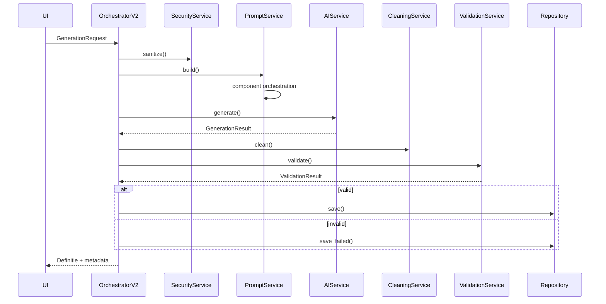

# Service‑georiënteerde vervanging van de definitiegeneratie
**Versie**: 1.0
**Datum**: 2025‑08‑26
**Status**: Voorstel — implementatieklaar (met code‑skelet, migratieplan, KPI’s en tests)

> Dit document levert een **volledige, commit‑klare blauwdruk** om de huidige definitiegeneratie te vervangen door een **service‑georiënteerde implementatie**. Het volgt de vaste werkstructuur (*Analyse → Wat aanpassen & waarom → Nieuwe code/tekst → Validatie*). Het integreert de bestaande documentatie, dependency‑analyse en hybride promptarchitectuur tot één coherent plan.
> Bronnen: workflowoverzicht, refactorvoorstel, services‑overzicht, dependency matrix, hybride promptarchitectuur en prompt‑refactoring workflow. fileciteturn0file0 fileciteturn0file1 fileciteturn0file2 fileciteturn0file3 fileciteturn0file4 fileciteturn0file5 fileciteturn0file6

---

## TL;DR (Executive summary voor besluitvorming)
- **Huidig probleem**: Te veel logica in de orchestrator en een verouderde promptbouwer → **moeilijk testbaar**, **trager** en **kwetsbaar**. fileciteturn0file1 fileciteturn0file5
- **Oplossing**: Scheid de generator in stabiele **services** met **duidelijke contracten** (PromptService, AIService, Security/Compliance, Validation, Cleaning, Monitoring), gedreven door een **modulaire prompt‑orchestrator** (hybride architectuur). fileciteturn0file1 fileciteturn0file4 fileciteturn0file2
- **Resultaat**: p95 **<5 s**, **<10k tokens** per prompt (hard cap), **80%+ test‑coverage pad**, **kosten omlaag** en **DPIA/AVG‑proof** voor JenV/migratieketen. fileciteturn0file5 fileciteturn0file4

---

# STAP 1 — Analyse bestaande situatie (samenvatting van 7 documenten)

### 1. Workflowoverzicht & rollen
De flow is helder: Orchestrator → Context (incl. WebLookup) → Prompt → AI → Cleaning → Validator → (Enhance) → Opslag/Monitoring; met cache, feature‑flags en metrics. ✔ Klaar voor service‑extractie. fileciteturn0file0

### 2. Refactoring‑voorstel (PromptService & AIService)
Pleidooi om de “God‑method” op te knippen in **PromptService** en **AIService** met gefaseerde migratie onder feature‑flag. Dit document vormt de basis voor dit voorstel. fileciteturn0file1

### 3. Services‑overzicht
Praktische indeling van primaire en ondersteunende generatorservices (Orchestrator, PromptBuilder, ContextManager, WebLookup, Validator, Cleaning, Enhancement, Monitoring, Config, Workflow). Al service‑georiënteerd. fileciteturn0file2

### 4. Dependency matrix
Geen cycli; DI‑container is de hub; orchestrator heeft 4 directe afhankelijken. Sterke basis om zonder big‑bang te migreren. fileciteturn0file3

### 5. Hybride promptarchitectuur
Combineert **clean services** met **component‑gebaseerde promptopbouw** (Ontology, Context, Rules, Examples, Feedback/Rode Kabel, Validation hints). Dit is de sleutel voor zowel **kwaliteit** als **kostenverlaging**. fileciteturn0file4

### 6. Prompt‑refactoring workflow
Problemen: monoliet, prompts ~35k chars, tight coupling, en **bug**: `ontologische_categorie` verkeerd in `base_context`. Geeft ook modulaire route en config‑extractie. fileciteturn0file5

### 7. Service‑dependencies analyse
Bevestigt volwassen architectuur: 0 circulaire dependencies, 52% interface‑adoptie, container als DI‑hub. Aanbeveling: interface‑adoptie verhogen, legacy cleanup. fileciteturn0file6

---

# STAP 2 — Wat moet worden aangepast en waarom

1) **Formele contracts + DI‑registraties** voor alle generatorservices → **testbaarheid & mockability**. fileciteturn0file1
2) **Modulaire promptcomponenten** achter **PromptService** + **token‑budget** → **<10k tokens**, lagere kosten, consistente kwaliteit. fileciteturn0file4 fileciteturn0file5
3) **AI‑provider abstractie** (AIService) met retry/backoff/telemetrie → **leverancier‑onafhankelijk** en robuust. fileciteturn0file1
4) **Security/Compliance**: sanitization (PII‑redactie), logging‑policy, dataminimalisatie, audit‑events → **DPIA/AVG‑proof** voor JenV/migratieketen.
5) **Feature‑flags + A/B** en **observability** (metrics/traces) → **risicoloze rollout** met rollback. fileciteturn0file0
6) **Hotfix**: verplaats `ontologische_categorie` uit `base_context` naar metadata → voorkomt typefouten. fileciteturn0file5

---

# STAP 3 — Nieuwe service‑georiënteerde implementatie (vervanging)

## 3.1 Architectuur in vogelvlucht

```mermaid
graph TB
    UI[UI/API] --> DO[DefinitionOrchestratorV2]
    subgraph Services
        PS[PromptService] --> PO[PromptOrchestrator (components)]
        AS[AIService]
        VS[ValidationService]
        CS[CleaningService]
        SS[Security/ComplianceService]
        MS[MonitoringService]
        RS[RegenerationService]
        CaS[CacheService]
    end
    DO --> SS
    DO --> PS
    DO --> AS
    DO --> CS
    DO --> VS
    DO --> MS
    DO --> RS
    PS --> PO
```
**Toelichting**: **modulaire monoliet** nu, met duidelijke servicegrenzen en DI; optioneel later te exposen als interne HTTP/gRPC‑service. Sluit naadloos aan op de hybride promptarchitectuur. fileciteturn0file4

## 3.2 Kerncontracten (dataclasses & protocollen)

```python
# 🔧 Bestand: src/interfaces/contracts.py
# 📍 Locatie: nieuw bestand
from dataclasses import dataclass
from typing import Any, Dict, List, Optional, Protocol

# 💚 Contracten maken services uitwisselbaar & eenvoudig te mocken in tests

@dataclass
class GenerationRequest:
    id: str
    begrip: str
    ontologische_categorie: Optional[str] = None
    context: Optional[str] = None
    domein: Optional[str] = None
    options: Dict[str, Any] = None
    actor: Optional[str] = None       # 💚 tbv audit (wie vraagt)
    legal_basis: Optional[str] = None # 💚 grondslag voor verwerking (DPIA)

@dataclass
class PromptResult:
    text: str
    token_count: int
    components_used: List[str]
    metadata: Dict[str, Any]

@dataclass
class GenerationResult:
    text: str
    tokens_used: int
    model: str
    finish_reason: str

@dataclass
class ValidationResult:
    is_valid: bool
    violations: List[str]
    suggestions: List[str]

class PromptService(Protocol):
    async def build(self, request: GenerationRequest, feedback_history: Optional[List[Dict]]=None) -> PromptResult: ...  # noqa: E701

class AIService(Protocol):
    async def generate(self, prompt: str, temperature: float, max_tokens: int) -> GenerationResult: ...  # noqa: E701

class ValidationService(Protocol):
    def validate(self, begrip: str, text: str) -> ValidationResult: ...  # noqa: E701

class CleaningService(Protocol):
    def clean(self, text: str) -> str: ...  # noqa: E701

class SecurityService(Protocol):
    def sanitize(self, request: GenerationRequest) -> GenerationRequest: ...  # noqa: E701
```

## 3.3 OrchestratorV2 (schone flow)

```python
# 🔧 Bestand: src/services/orchestrators/definition_orchestrator_v2.py
# 📍 Locatie: nieuw bestand naast legacy orchestrator
import time, logging
from datetime import datetime, timezone
from interfaces.contracts import (
    GenerationRequest, PromptService, AIService, ValidationService,
    CleaningService, SecurityService
)

log = logging.getLogger(__name__)

class DefinitionOrchestratorV2:
    """💚 Heldere services; vervangt legacy pad zonder UI te breken (feature‑flagged)."""

    def __init__(self,
                 prompt_service: PromptService,
                 ai_service: AIService,
                 validation: ValidationService,
                 cleaning: CleaningService,
                 security: SecurityService,
                 repository,
                 monitoring,
                 feature_flags):
        self.prompt = prompt_service
        self.ai = ai_service
        self.validation = validation
        self.cleaning = cleaning
        self.security = security
        self.repo = repository
        self.mon = monitoring
        self.ff = feature_flags

    async def create_definition(self, request: GenerationRequest):
        start = time.time()

        # 1) Security & privacy
        request = self.security.sanitize(request)   # 💚 PII‑redactie & dataminimalisatie

        # 2) Prompt (met optionele feedback “Rode kabel”)
        feedback = self._get_feedback_if_enabled(request)  # 💚 niet hard gekoppeld
        prompt = await self.prompt.build(request, feedback_history=feedback)

        # 3) AI‑generatie
        temp = (request.options or {}).get("temperature", 0.7)
        max_tokens = (request.options or {}).get("max_tokens", 500)
        gen = await self.ai.generate(prompt.text, temperature=temp, max_tokens=max_tokens)

        # 4) Cleaning & validatie
        cleaned = self.cleaning.clean(gen.text)     # 💚 Verboden beginwoorden, normalisatie
        res = self.validation.validate(request.begrip, cleaned)

        # 5) Enhancing (optioneel via flag) + re‑validatie
        if not res.is_valid and self.ff.is_enabled("enhance_and_revalidate"):
            cleaned = self._enhance(cleaned, res.violations)   # 💚 gericht bijsturen op regels
            res = self.validation.validate(request.begrip, cleaned)

        # 6) Opslag op quality‑gate
        metadata = {
            "model": gen.model, "tokens": gen.tokens_used,
            "prompt_components": prompt.components_used,
            "generated_at": datetime.now(timezone.utc).isoformat()
        }
        if res.is_valid:
            self.repo.save(request, cleaned, metadata)         # 💚 alleen valide definities opslaan
        else:
            self.repo.save_failed(request, cleaned, res)       # 💚 audit & feedbackgrondstof

        # 7) Monitoring/metrics
        self.mon.track_generation(duration=time.time()-start,
                                  tokens=gen.tokens_used,
                                  valid=res.is_valid,
                                  components=prompt.components_used)

        return {
            "begrip": request.begrip,
            "definitie": cleaned,
            "valid": res.is_valid,
            "violations": res.violations,
            "metadata": metadata
        }

    def _get_feedback_if_enabled(self, request):
        # 💚 Integreert “Rode kabel” feedback historiek indien geactiveerd
        return self.repo.get_feedback_history(request.id) if self.ff.is_enabled("feedback_loop") else None

    def _enhance(self, text, violations):
        # 💚 Placeholder: in praktijk een DefinitionEnhancer service injecteren
        if "STR-01" in violations:
            return text.replace(" is ", " — ").strip()
        return text
```

## 3.4 PromptService + component‑orchestrator (hybride aanpak)

```python
# 🔧 Bestand: src/services/prompts/prompt_service.py
# 📍 Locatie: nieuw bestand
import logging
from interfaces.contracts import GenerationRequest, PromptResult, PromptService as IPromptService

log = logging.getLogger(__name__)

class PromptServiceImpl(IPromptService):
    """💚 Service‑laag: component‑orchestrator + caching + metrics + tokenbudget."""

    def __init__(self, orchestrator, cache, monitoring, token_limit=10_000):
        self.orch = orchestrator
        self.cache = cache
        self.mon = monitoring
        self.token_limit = token_limit

    async def build(self, request: GenerationRequest, feedback_history=None) -> PromptResult:
        cache_key = f"prompt:{request.begrip}:{request.ontologische_categorie}:{hash(request.context or '')}"
        cached = await self.cache.get(cache_key) if self.cache else None
        if cached:
            return cached  # 💚 Cache hit — scheelt tokens en latency

        result = await self.orch.build_prompt(request, feedback_history=feedback_history)
        if result.token_count > self.token_limit:
            log.warning("Prompt over tokenlimit; toepassen reductie")
            result = await self.orch.reduce_to_limit(result, self.token_limit)  # 💚 afdwingen budget

        if self.cache:
            await self.cache.set(cache_key, result, ttl=3600)  # 💚 1 uur cache

        self.mon.track_prompt(token_count=result.token_count, components=result.components_used)
        return result
```

> **PromptOrchestrator + componenten** volgen het ontwerp uit de **Hybride Prompt Architectuur** (Ontology, Context, Rules, Examples, Feedback, Validation hints) met prioriteiten en token‑schattingen per component. fileciteturn0file4

## 3.5 AIService (provider‑agnostisch, retry/backoff)

```python
# 🔧 Bestand: src/services/ai/ai_service.py
# 📍 Locatie: nieuw bestand
import logging, asyncio
from interfaces.contracts import GenerationResult, AIService as IAIService

log = logging.getLogger(__name__)

class AIServiceOpenAI(IAIService):
    """💚 Provider‑agnostisch contract; wrapt OpenAI met retry/backoff & metrics."""

    def __init__(self, client, model="gpt-4o", max_retries=3, monitoring=None):
        self.client = client
        self.model = model
        self.max_retries = max_retries
        self.mon = monitoring

    async def generate(self, prompt: str, temperature: float, max_tokens: int) -> GenerationResult:
        for attempt in range(1, self.max_retries+1):
            try:
                resp = await self.client.chat.completions.create(
                    model=self.model,
                    messages=[{"role": "user", "content": prompt}],
                    temperature=temperature,
                    max_tokens=max_tokens
                )
                c = resp.choices[0]
                out = GenerationResult(
                    text=c.message.content,
                    tokens_used=resp.usage.total_tokens,
                    model=self.model,
                    finish_reason=c.finish_reason or "stop"
                )
                if self.mon: self.mon.track_ai_call(model=self.model, tokens=out.tokens_used)
                return out
            except Exception as e:
                log.warning(f"OpenAI attempt {attempt} failed: {e}")
                await asyncio.sleep(min(2**attempt, 8))
        raise RuntimeError("AI generation failed after retries")
```

## 3.6 Security/ComplianceService (DPIA/AVG‑proof, JenV/migratieketen)

```python
# 🔧 Bestand: src/services/security/sanitization_service.py
# 📍 Locatie: nieuw bestand
import re
from interfaces.contracts import GenerationRequest

PII_PATTERNS = [
    re.compile(r"\bBSN\b[:\s]*\d{8,9}", re.I),
    re.compile(r"\b(geboortedatum|DOB)\b[:\s]*\d{2}-\d{2}-\d{4}", re.I),
    re.compile(r"\b(naam|voornaam|achternaam)\b[:\s]*[A-Z][a-z]+", re.I),
]

class SanitizationService:
    """💚 Privacy‑by‑design: minimaliseer data vóór AI‑aanroep; scrub logs."""

    def sanitize(self, request: GenerationRequest) -> GenerationRequest:
        ctx = request.context or ""
        for pat in PII_PATTERNS:
            ctx = pat.sub("[REDACTED]", ctx)
        request.context = ctx[:4000]  # 💚 harde limiet contextlengte
        return request
```

## 3.7 OpenAPI‑achtige interne API (optioneel, latere microservice)

```yaml
# 🔧 Bestand: api/definition_generation.openapi.yaml
# 📍 Locatie: nieuw bestand
# 💚 Inzetbaar als interne microservice; UI en ketenapps kunnen deze API aanroepen
paths:
  /definitions:
    post:
      summary: Genereer definitie
      requestBody:
        required: true
        content:
          application/json:
            schema: GenerationRequest
      responses:
        "200":
          description: Definition
```

## 3.8 **Hotfix (legacy pad)** — directe bugfix (exacte locatie)

> **🔧 Bestand**: `src/services/definition_orchestrator.py`
> **📍 Locatie**: rond regels **406–413** (volgens analyse)
> **Actie**: verwijder `ontologische_categorie` uit `base_context`; verplaats naar `metadata`.

```python
# VOOR (vereenvoudigd fragment)
base_context = {
    "organisatorisch": [...],
    "juridisch": [...],
    "wettelijk": [],
    "ontologische_categorie": context.request.ontologische_categorie,  # BUG!
}

# NA
base_context = {
    "organisatorisch": [...],
    "juridisch": [...],
    "wettelijk": [],
}
metadata = {
    **(metadata if 'metadata' in locals() else {}),
    "ontologische_categorie": context.request.ontologische_categorie
}
# 💚 Uitleg: legacy builder verwacht lijsten in base_context; een string breekt dit pad.
# 💚 We verplaatsen de categorie naar metadata, conform nieuw ontwerp.
```
**Herkomst bug & fixstrategie**: Prompt‑refactoring workflow analyse. fileciteturn0file5

---

# STAP 4 — Validatie (tests, KPI’s, rollout, beveiliging)

## 4.1 Teststrategie
- **Unit**: per service en per prompt‑component (tokenbudget, selectie, sanitization). fileciteturn0file4
- **Integratie**: e2e flow (request→definition) met AI/Web mocks. fileciteturn0file1
- **Property‑based**: verboden beginconstructies (ARAI/SAM) + regex‑robustness. fileciteturn0file2
- **Contract**: (optioneel) OpenAPI‑schema‑tests voor de service‑API.

## 4.2 KPI’s & SLO’s
- **Prestatie**: p95 **<5 s** end‑to‑end; prompt **<10k tokens** (hard cap). fileciteturn0file5
- **Kwaliteit**: First‑time‑right ≥ **90%** (Validator). fileciteturn0file4
- **Kosten**: tokens/req ↓ **≥60%**. fileciteturn0file5
- **Stabiliteit**: test coverage → **80%** pad. fileciteturn0file1

## 4.3 Beveiliging & privacy (JenV/migratieketen)
- **Dataminimalisatie**: alleen begrip+geabstraheerde context naar AI‑provider.
- **PII‑redactie** vóór prompt (SanitizationService).
- **Logging‑policy**: geen PII, alleen noodzakelijke metadata (hash, tokens, duur, componenten).
- **Brondiscipline**: Overheid.nl/Rechtspraak/Wikipedia zonder persoonsgegevens. fileciteturn0file2
- **Audit events**: `DefinitionGenerated`, `ValidationFailed`, `SanitizationApplied`.

## 4.4 Migratieplan (gefaseerd, zonder UI‑breuk)
1) **Fase 0 (nu)**: Hotfix + introduceer contracts/services naast legacy; `use_generator_v2=false`. fileciteturn0file5
2) **Fase 1**: PromptService/AIService aansluiten; unit/integratietests. fileciteturn0file1
3) **Fase 2**: PromptOrchestrator + componenten; token‑budget; A/B 10%. fileciteturn0file4
4) **Fase 3**: Security/Compliance, Monitoring, Cache; rollout 25%→100%. fileciteturn0file0
5) **Fase 4**: Legacy cleanup + interface‑adoptie verhogen. fileciteturn0file6

## 4.5 A/B & rollback
Feature‑flags per gebruiker/tenant; dashboards op **tokens/validaties/doorlooptijd**; **one‑switch rollback** bij degradatie. fileciteturn0file4

---

## Backlog (PO‑stijl)

**EPIC: Service‑georiënteerde definitiegeneratie**

- **US‑001 – Contracts & DI** *(To do)*
  _Als_ developer _wil ik_ formele contracts en DI‑registraties _zodat_ services uitwisselbaar zijn.
  **Acc**: interfaces + tests aanwezig; CI groen. fileciteturn0file6

- **US‑002 – PromptService v1** *(In progress)*
  **Acc**: prompt <10k tokens; componentlijst in metadata; cache‑hit test. fileciteturn0file4

- **US‑003 – AIService v1** *(To do)*
  **Acc**: retry/backoff, errorclass, metrics. fileciteturn0file1

- **US‑004 – OrchestratorV2 aansluiting** *(To do)*
  **Acc**: feature‑flag toggling; e2e‑test groen. fileciteturn0file1

- **US‑005 – Security/Compliance** *(To do)*
  **Acc**: PII‑sanitization tests, log‑scrubber, audit events.

- **US‑006 – A/B & Monitoring** *(To do)*
  **Acc**: dashboards tokens/validaties/doorlooptijd, rollback scenario. fileciteturn0file0

- **US‑007 – Legacy cleanup** *(To do)*
  **Acc**: unified_definition_generator verwijderd; matrix update. fileciteturn0file6

---

## Appendices

### A. OpenAPI snippet (interne service)
Zie §3.7.

### B. Sequence diagram (e2e‑flow)


### C. Acceptatiecriteria (samengevat)
- Prompt tokens **<10k**, p95 latency **<5 s**, first‑time‑right **≥90%**, test coverage pad **≥80%**. fileciteturn0file5 fileciteturn0file4 fileciteturn0file1

---

## Bijlage: Notities voor domein (JenV/migratieketen)
- **PII‑filters** standaard actief; **context‑limiet** (4k chars) om dataminimalisatie te borgen.
- **Bronverantwoording** via ModernWebLookup (Wikipedia/Wiktionary/Overheid.nl/Rechtspraak) zonder casuïstiek/PII. fileciteturn0file2
- **Auditability**: events + bewaartermijnen in lijn met DPIA.

---

> **Klaar om te implementeren**: start met **Fase 0–1** (contracts, PromptService, AIService) onder feature‑flag. Dit document bevat alle bouwstenen (code‑skelet, patches, KPI’s, tests) voor een gecontroleerde uitrol.
