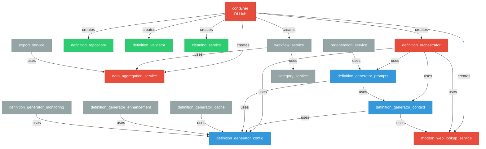

# Service Dependencies Analyse Rapport

## Executive Summary

Dit rapport analyseert de dependencies tussen services in de `/src/services/` directory van de Definitie-app. De analyse identificeert kern services, dependency flows, externe afhankelijkheden en potentiële architectuur verbeteringen.

### Belangrijkste Bevindingen

1. **Geen circulaire dependencies gevonden** - De architectuur heeft een goede gelaagde structuur
2. **5 kern services** geïdentificeerd die veel gebruikt worden door andere services
3. **14 van de 27 services** gebruiken de interfaces voor clean architecture
4. **Container service** fungeert als centrale dependency injection hub

## 1. KERN SERVICES (Top 5 meest geïmporteerde)

Deze services vormen de backbone van de applicatie:

### 1.1 definition_generator_config (7x geïmporteerd)
- **Rol**: Centrale configuratie voor alle generator-gerelateerde functionaliteit
- **Gebruikt door**:
  - container
  - definition_generator_cache
  - definition_generator_context
  - definition_generator_enhancement
  - definition_generator_monitoring
  - definition_generator_prompts
  - definition_orchestrator
- **Type**: Configuration/Settings service

### 1.2 modern_web_lookup_service (3x geïmporteerd)
- **Rol**: Moderne implementatie voor web lookups (Wikipedia, juridische bronnen)
- **Gebruikt door**:
  - container
  - definition_generator_context
  - definition_orchestrator
- **Type**: External data integration service

### 1.3 data_aggregation_service (3x geïmporteerd)
- **Rol**: Aggregatie en analyse van definitie data
- **Gebruikt door**:
  - container
  - export_service
  - workflow_service
- **Type**: Data processing service

### 1.4 definition_generator_context (2x geïmporteerd)
- **Rol**: Context management voor definitie generatie
- **Gebruikt door**:
  - definition_generator_prompts
  - definition_orchestrator
- **Type**: Context/State management

### 1.5 definition_generator_prompts (2x geïmporteerd)
- **Rol**: Prompt building voor AI generatie
- **Gebruikt door**:
  - definition_orchestrator
  - regeneration_service
- **Type**: AI/Prompt management

## 2. DEPENDENCY FLOW

De dependency structuur toont een duidelijke hiërarchie:

### 2.1 Container als Centrale Hub
```
container -> 12 services:
  - cleaning_service
  - data_aggregation_service
  - definition_generator_config
  - definition_orchestrator
  - definition_repository
  - definition_validator
  - duplicate_detection_service
  - export_service
  - modern_web_lookup_service
  - null_repository
  - unified_definition_generator
  - workflow_service
```

### 2.2 Orchestrator Dependencies
```
definition_orchestrator -> 4 services:
  - definition_generator_config
  - definition_generator_context
  - definition_generator_prompts
  - modern_web_lookup_service
```

### 2.3 Workflow Dependencies
```
workflow_service -> 2 services:
  - category_service
  - data_aggregation_service
```

## 3. INTERFACE GEBRUIKERS

14 van de 27 services (52%) gebruiken de interfaces voor clean architecture:

### Services met Interface Support:
1. **Core Services**: definition_orchestrator, definition_repository, definition_validator
2. **Data Services**: cleaning_service, duplicate_detection_service
3. **Web Services**: modern_web_lookup_service, ab_testing_framework
4. **Support Services**: null_repository, service_factory
5. **Generator Services**: definition_generator_cache, definition_generator_context, definition_generator_enhancement, definition_generator_monitoring
6. **Container**: container

Dit toont een goede adoptie van clean architecture principes.

## 4. EXTERNE DEPENDENCIES

### Top 10 Externe Packages:
1. **logging** (22x) - Standaard Python logging
2. **dataclasses** (17x) - Data structures
3. **typing** (17x) - Type hints
4. **enum** (10x) - Enumerations
5. **datetime** (8x) - Date/time handling
6. **asyncio** (6x) - Async programming
7. **abc** (4x) - Abstract base classes
8. **os** (4x) - OS operations
9. **time** (3x) - Time operations
10. **prompt_builder** (2x) - Custom prompt building

### Observaties:
- Minimale externe dependencies
- Vooral standaard library gebruik
- Asyncio gebruik suggereert moderne async patterns
- Geen zware frameworks (behalve aiohttp voor web requests)

## 5. ARCHITECTUUR PATRONEN

### 5.1 Gevonden Patronen:
1. **Dependency Injection**: Via container service
2. **Repository Pattern**: definition_repository met interface
3. **Service Layer**: Duidelijke service laag architectuur
4. **Configuration Management**: Gecentraliseerd via config services
5. **Interface Segregation**: Clean interfaces in interfaces.py
6. **Null Object Pattern**: null_repository implementatie

### 5.2 Sterke Punten:
- Geen circulaire dependencies
- Duidelijke scheiding van verantwoordelijkheden
- Goede interface adoptie
- Centrale configuratie management

### 5.3 Verbeterpunten:
1. **Service Factory** importeert nog `unified_definition_generator` (legacy?)
2. Niet alle services gebruiken interfaces (48% zonder)
3. **category_service** wordt alleen door workflow_service gebruikt (mogelijk te specifiek)

## 6. SERVICES CATEGORISATIE

### 6.1 Core Services (Veel Dependencies)
- definition_generator_config
- modern_web_lookup_service
- data_aggregation_service
- container

### 6.2 Orchestration Services
- definition_orchestrator
- workflow_service

### 6.3 Data Services
- definition_repository
- null_repository
- duplicate_detection_service

### 6.4 Processing Services
- cleaning_service
- definition_validator
- export_service

### 6.5 Generator Support Services
- definition_generator_context
- definition_generator_prompts
- definition_generator_enhancement
- definition_generator_monitoring
- definition_generator_cache

### 6.6 Specialized Services
- category_service
- category_state_manager
- regeneration_service
- ab_testing_framework

### 6.7 Web Lookup Sub-services
- web_lookup/wikipedia_service
- web_lookup/sru_service

## 7. AANBEVELINGEN

### 7.1 Architectuur Verbetering
1. **Verhoog Interface Adoptie**: Overweeg interfaces voor services die ze nog niet gebruiken
2. **Legacy Code**: Verwijder references naar `unified_definition_generator` als deze deprecated is
3. **Service Granulariteit**: Evalueer of zeer specifieke services (zoals category_service) apart moeten blijven

### 7.2 Dependency Management
1. **Reduceer Container Dependencies**: Overweeg facade pattern voor groepen gerelateerde services
2. **Config Consolidatie**: Mogelijk kunnen sommige config classes samengevoegd worden

### 7.3 Testing & Maintainability
1. **Mock Interfaces**: Met 52% interface coverage is mocking relatief eenvoudig
2. **Dependency Isolation**: De afwezigheid van circulaire dependencies maakt unit testing eenvoudiger

### 7.4 Performance
1. **Lazy Loading**: Container kan lazy loading implementeren voor services
2. **Async Patterns**: Met asyncio al in gebruik, overweeg meer async services

## 8. VISUALISATIE

Een interactieve visualisatie is beschikbaar in `service_dependencies_visualization.html`. Deze toont:
- Service nodes gekleurd op type (core, config, interface user, normal)
- Import relaties met pijlen
- Node grootte gebaseerd op aantal imports
- Interactieve details bij klikken op nodes

## 9. ARCHITECTUUR DIAGRAM



## Conclusie

De service architectuur van de Definitie-app toont een volwassen, goed gestructureerde opzet met:
- Duidelijke separation of concerns
- Goede interface adoptie (52%)
- Geen circulaire dependencies
- Minimale externe dependencies
- Centrale dependency injection via container

De architectuur is klaar voor verdere schaling met enkele kleine verbeteringen mogelijk in interface adoptie en legacy code cleanup.
