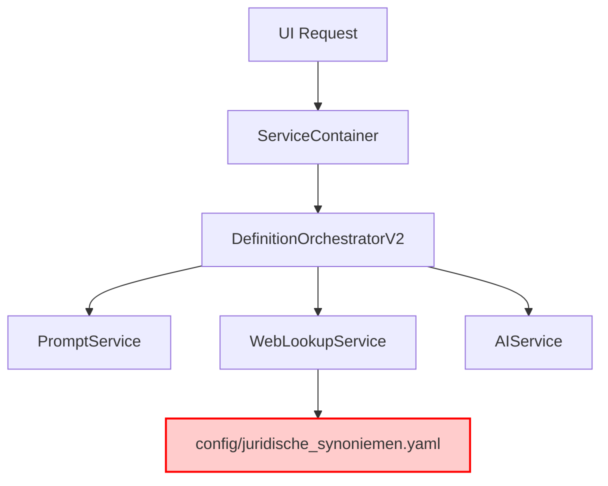
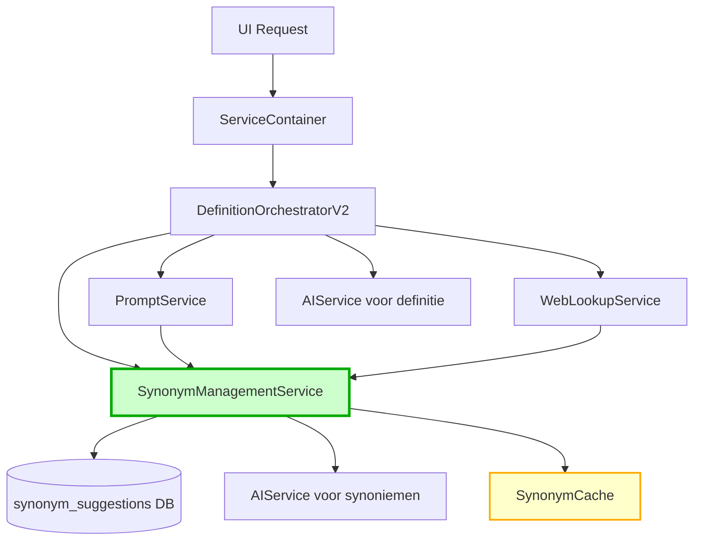
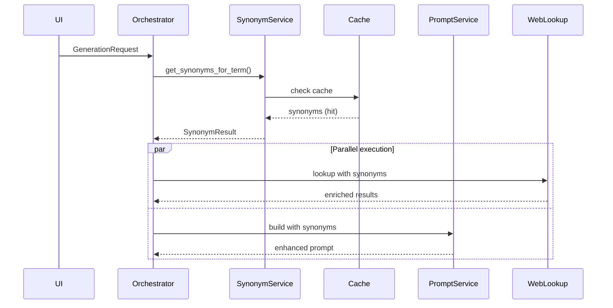
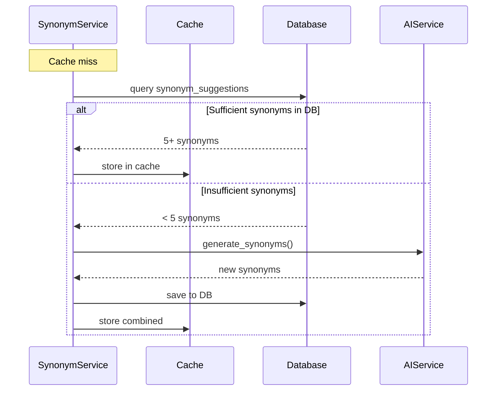

# Synonym Management Architecture Design
**DefinitieAgent Applicatie**

## Executive Summary

Dit document presenteert een architectuurontwerp voor een geïntegreerd synonym management systeem in de DefinitieAgent applicatie. Het ontwerp integreert naadloos met bestaande services zonder de huidige definitie generatie flow te verstoren, terwijl het synoniemen vroeg in de flow beschikbaar maakt voor zowel web lookup als definitie generatie.

## 1. Architecturaal Overzicht

### 1.1 Huidige Situatie



**Problemen:**
- Synoniemen hardcoded in YAML file
- Geen dynamische synonym generatie
- Database tabel `synonym_suggestions` bestaat maar wordt niet gebruikt
- Web lookup gebruikt alleen statische synoniemen

### 1.2 Voorgestelde Architectuur



## 2. Component Design

### 2.1 SynonymManagementService

**Locatie:** `src/services/synonym_management_service.py`

```python
class SynonymManagementService:
    """
    Centrale service voor synonym management.
    Integreert DB, AI generatie, en caching.
    """

    def __init__(
        self,
        repository: SynonymRepository,
        ai_service: AIServiceV2,
        cache_ttl: int = 3600
    ):
        self.repository = repository
        self.ai_service = ai_service
        self.cache = TTLCache(maxsize=1000, ttl=cache_ttl)

    async def get_synonyms_for_term(
        self,
        term: str,
        context: Optional[SynonymContext] = None,
        max_count: int = 5,
        include_generated: bool = True
    ) -> SynonymResult:
        """
        Hoofdinterface voor synonym retrieval.
        Implementeert de vereiste flow logica.
        """
```

### 2.2 Database Schema Uitbreidingen

**Bestaande tabel:** `synonym_suggestions`

**Nieuwe indexen voor performance:**
```sql
-- Composite index voor snelle voorkeursterm lookup
CREATE INDEX idx_synonym_voorkeursterm
ON synonym_suggestions(hoofdterm, is_voorkeursterm, confidence DESC);

-- Index voor context-based filtering
CREATE INDEX idx_synonym_context
ON synonym_suggestions(hoofdterm, status, context_type);
```

**Nieuwe kolom toevoegen:**
```sql
ALTER TABLE synonym_suggestions
ADD COLUMN is_voorkeursterm BOOLEAN DEFAULT FALSE;

ALTER TABLE synonym_suggestions
ADD COLUMN context_type VARCHAR(50)
CHECK (context_type IN ('juridisch', 'organisatorisch', 'algemeen'));

ALTER TABLE synonym_suggestions
ADD COLUMN source VARCHAR(50) DEFAULT 'manual'
CHECK (source IN ('manual', 'ai_generated', 'imported', 'validated'));
```

## 3. Integration Points

### 3.1 Integratie in DefinitionOrchestratorV2

**Locatie:** Fase 2.3 (tussen Feedback Integration en Web Lookup)

```python
# PHASE 2.3: Synonym Enrichment (NEW)
# =====================================
synonyms = None
synonym_status = "not_available"

if self.synonym_service:  # Injected via ServiceContainer
    try:
        synonym_context = SynonymContext(
            organisatorisch=sanitized_request.organisatorische_context,
            juridisch=sanitized_request.juridische_context,
            wettelijk=sanitized_request.wettelijke_basis
        )

        synonym_result = await self.synonym_service.get_synonyms_for_term(
            term=sanitized_request.begrip,
            context=synonym_context,
            max_count=5,
            include_generated=True
        )

        synonyms = synonym_result.synonyms
        synonym_status = "success"

        # Attach to context for downstream services
        context = context or {}
        context["synonyms"] = {
            "terms": synonyms,
            "voorkeursterm": synonym_result.voorkeursterm,
            "source": synonym_result.source
        }

    except Exception as e:
        logger.warning(f"Synonym enrichment failed: {e}")
        synonym_status = "error"
```

### 3.2 Integratie in ModernWebLookupService

**Aanpassing in `_lookup_mediawiki` methode:**

```python
# Gebruik synoniemen uit context voor uitgebreide search
synonym_context = context.get("synonyms", {}) if context else {}
synonym_terms = synonym_context.get("terms", [])

# Voeg synoniemen toe aan fallback lijst
if synonym_terms and not result:
    for synonym in synonym_terms[:3]:  # Top 3 synoniemen
        try:
            syn_result = await wikipedia_lookup(synonym)
            if syn_result and syn_result.success:
                result = syn_result
                break
        except Exception:
            continue
```

### 3.3 Integratie in PromptServiceV2

```python
# In build_generation_prompt method
synonyms = context.get("synonyms", {}) if context else {}
if synonyms and synonyms.get("terms"):
    prompt_parts.append(
        f"\n### Synoniemen:\n"
        f"Voorkeursterm: {synonyms.get('voorkeursterm', request.begrip)}\n"
        f"Gerelateerde termen: {', '.join(synonyms.get('terms', []))}\n"
    )
```

## 4. Data Flow

### 4.1 Primaire Flow (Cache Hit)



### 4.2 Secundaire Flow (Cache Miss, DB Hit)



## 5. Caching Strategie

### 5.1 Multi-Level Caching

```python
class SynonymCache:
    """
    Multi-level cache voor optimale performance.
    """

    def __init__(self):
        # L1: In-memory voor hot terms (TTL: 1 hour)
        self.l1_cache = TTLCache(maxsize=100, ttl=3600)

        # L2: Redis voor distributed cache (TTL: 24 hours)
        self.l2_cache = RedisCache(ttl=86400)

        # L3: Database (persistent)
```

### 5.2 Cache Invalidation

- **Trigger points:**
  - Nieuwe synonym approval/rejection
  - Bulk import van synoniemen
  - Voorkeursterm wijziging
  - Context update

## 6. API Design voor AI Synonym Generation

### 6.1 Prompt Template

```python
SYNONYM_GENERATION_PROMPT = """
Genereer 5 synoniemen voor het juridische begrip: {term}

Context:
- Organisatorisch: {org_context}
- Juridisch: {jur_context}
- Wettelijk: {wet_context}

Vereisten:
1. Synoniemen moeten juridisch correct zijn
2. Vermijd informele termen
3. Rangschik op relevantie (meest relevant eerst)
4. Geef per synoniem een confidence score (0.0-1.0)

Output format (JSON):
{{
  "synoniemen": [
    {{"term": "...", "confidence": 0.95, "rationale": "..."}},
    ...
  ]
}}
"""
```

### 6.2 Temperature Settings

- **Synonym generation:** 0.3 (consistent, betrouwbare output)
- **Fallback generation:** 0.5 (meer variatie bij retry)

## 7. Performance Optimalisaties

### 7.1 Async/Await Pattern

```python
async def enrich_with_synonyms(self, terms: List[str]) -> Dict[str, List[str]]:
    """
    Parallel synonym enrichment voor multiple terms.
    """
    tasks = [
        self.get_synonyms_for_term(term)
        for term in terms
    ]
    results = await asyncio.gather(*tasks, return_exceptions=True)

    return {
        term: result.synonyms if not isinstance(result, Exception) else []
        for term, result in zip(terms, results)
    }
```

### 7.2 Batch Processing

```python
async def bulk_generate_synonyms(self, terms: List[str]) -> None:
    """
    Batch generation voor efficiency.
    """
    # Process in chunks van 10
    for chunk in chunks(terms, 10):
        await self._process_synonym_chunk(chunk)
```

## 8. Error Handling & Fallbacks

### 8.1 Graceful Degradation

```python
class SynonymFallbackChain:
    """
    Fallback chain voor robuustheid.
    """

    async def get_synonyms(self, term: str) -> List[str]:
        strategies = [
            self._from_cache,
            self._from_database,
            self._from_ai_service,
            self._from_static_config,
            self._empty_list
        ]

        for strategy in strategies:
            try:
                result = await strategy(term)
                if result:
                    return result
            except Exception as e:
                logger.warning(f"Strategy {strategy.__name__} failed: {e}")
                continue

        return []
```

### 8.2 Circuit Breaker Pattern

```python
class AIServiceCircuitBreaker:
    """
    Circuit breaker voor AI service calls.
    """

    def __init__(self, failure_threshold: int = 5, timeout: int = 60):
        self.failure_count = 0
        self.failure_threshold = failure_threshold
        self.timeout = timeout
        self.last_failure_time = None
        self.state = "CLOSED"  # CLOSED, OPEN, HALF_OPEN
```

## 9. Monitoring & Observability

### 9.1 Metrics

```python
SYNONYM_METRICS = {
    "cache_hit_rate": Gauge("synonym_cache_hits_total"),
    "ai_generation_latency": Histogram("synonym_ai_generation_seconds"),
    "db_query_latency": Histogram("synonym_db_query_seconds"),
    "terms_without_synonyms": Counter("terms_without_synonyms_total"),
}
```

### 9.2 Logging

```python
# Structured logging voor analysis
logger.info(
    "Synonym enrichment completed",
    extra={
        "term": term,
        "source": source,
        "synonym_count": len(synonyms),
        "cache_hit": cache_hit,
        "latency_ms": latency,
        "context_type": context_type
    }
)
```

## 10. Migration Strategy

### 10.1 Phased Rollout

**Fase 1: Infrastructure (Week 1)**
- Database schema updates
- SynonymManagementService implementation
- Unit tests

**Fase 2: Integration (Week 2)**
- ServiceContainer integration
- Orchestrator integration points
- Integration tests

**Fase 3: Migration (Week 3)**
- Import existing YAML synoniemen naar DB
- Parallel run (beide systemen actief)
- Performance monitoring

**Fase 4: Cutover (Week 4)**
- Deactiveer YAML-based system
- Full production rollout
- Deprecate oude code

### 10.2 Rollback Plan

```python
# Feature flag voor safe rollback
SYNONYM_SERVICE_ENABLED = os.getenv("SYNONYM_SERVICE_ENABLED", "false") == "true"

if SYNONYM_SERVICE_ENABLED:
    synonyms = await self.synonym_service.get_synonyms()
else:
    synonyms = self._load_from_yaml()  # Legacy fallback
```

## 11. Security & Privacy

### 11.1 Data Sanitization

```python
def sanitize_synonym_input(self, term: str) -> str:
    """
    Sanitize input voor SQL injection preventie.
    """
    # Remove special characters
    sanitized = re.sub(r'[^\w\s-]', '', term)
    # Limit length
    return sanitized[:255]
```

### 11.2 Access Control

```python
class SynonymAccessControl:
    """
    Role-based access voor synonym management.
    """

    PERMISSIONS = {
        "view": ["user", "admin"],
        "suggest": ["user", "admin"],
        "approve": ["admin"],
        "delete": ["admin"]
    }
```

## 12. Testing Strategy

### 12.1 Unit Tests

```python
# tests/services/test_synonym_management_service.py
class TestSynonymManagementService:
    async def test_get_synonyms_cache_hit(self):
        """Test cache hit scenario"""

    async def test_get_synonyms_db_fallback(self):
        """Test database fallback"""

    async def test_ai_generation_trigger(self):
        """Test AI generation when < 5 synonyms"""

    async def test_voorkeursterm_priority(self):
        """Test voorkeursterm gets highest priority"""
```

### 12.2 Integration Tests

```python
# tests/integration/test_synonym_flow_e2e.py
class TestSynonymFlowE2E:
    async def test_full_generation_with_synonyms(self):
        """Test complete flow from request to definition"""

    async def test_web_lookup_with_synonyms(self):
        """Test web lookup uses generated synonyms"""
```

## 13. Configuration

### 13.1 Environment Variables

```yaml
# config/synonym_service.yaml
synonym_service:
  enabled: true
  cache:
    ttl_seconds: 3600
    max_size: 1000
  ai:
    model: "gpt-4"
    temperature: 0.3
    max_retries: 3
    timeout_seconds: 10
  database:
    batch_size: 100
    query_timeout: 5
  features:
    auto_generate: true
    use_voorkeursterm: true
    context_aware: true
```

## 14. Conclusie & Aanbevelingen

### Voordelen van deze Architectuur

1. **Minimale Disruption:** Integreert naadloos zonder bestaande flows te breken
2. **Performance:** Multi-level caching voorkomt onnodige API calls
3. **Flexibiliteit:** Ondersteunt zowel statische als dynamische synoniemen
4. **Schaalbaarheid:** Async design met batch processing capabilities
5. **Robuustheid:** Fallback chains en circuit breakers

### Aanbevolen Volgende Stappen

1. **Review & Goedkeuring:** Architectuur review met team
2. **Proof of Concept:** Implementeer SynonymManagementService core
3. **Performance Testing:** Benchmark cache hit rates en latency
4. **Gradual Migration:** Start met read-only mode, dan write capabilities
5. **Monitoring Setup:** Implementeer metrics en dashboards

### Risico's & Mitigaties

| Risico | Impact | Waarschijnlijkheid | Mitigatie |
|--------|--------|-------------------|-----------|
| AI Service Overload | Hoog | Middel | Circuit breaker, rate limiting |
| Cache Invalidation Issues | Middel | Laag | TTL-based expiry, manual refresh |
| Database Performance | Middel | Middel | Proper indexing, query optimization |
| Migration Failures | Hoog | Laag | Feature flags, rollback plan |

## Appendix A: Service Interface Definitions

```python
from dataclasses import dataclass
from typing import List, Optional, Dict, Any
from enum import Enum

class SynonymSource(Enum):
    CACHE = "cache"
    DATABASE = "database"
    AI_GENERATED = "ai_generated"
    STATIC_CONFIG = "static_config"

@dataclass
class SynonymContext:
    organisatorisch: List[str]
    juridisch: List[str]
    wettelijk: List[str]

@dataclass
class Synonym:
    term: str
    confidence: float
    rationale: str
    source: SynonymSource
    is_voorkeursterm: bool = False

@dataclass
class SynonymResult:
    synonyms: List[str]
    voorkeursterm: Optional[str]
    source: SynonymSource
    metadata: Dict[str, Any]
```

## Appendix B: Database Migration Script

```sql
-- Migration script voor synonym_suggestions uitbreiding
BEGIN TRANSACTION;

-- Add new columns
ALTER TABLE synonym_suggestions
ADD COLUMN is_voorkeursterm BOOLEAN DEFAULT FALSE;

ALTER TABLE synonym_suggestions
ADD COLUMN context_type VARCHAR(50);

ALTER TABLE synonym_suggestions
ADD COLUMN source VARCHAR(50) DEFAULT 'manual';

-- Update existing data
UPDATE synonym_suggestions
SET context_type = 'algemeen'
WHERE context_type IS NULL;

-- Add new indexes
CREATE INDEX idx_synonym_voorkeursterm
ON synonym_suggestions(hoofdterm, is_voorkeursterm, confidence DESC);

CREATE INDEX idx_synonym_context
ON synonym_suggestions(hoofdterm, status, context_type);

-- Add check constraints
ALTER TABLE synonym_suggestions
ADD CONSTRAINT check_context_type
CHECK (context_type IN ('juridisch', 'organisatorisch', 'algemeen'));

ALTER TABLE synonym_suggestions
ADD CONSTRAINT check_source
CHECK (source IN ('manual', 'ai_generated', 'imported', 'validated'));

COMMIT;
```

---

*Document Versie: 1.0*
*Datum: 2025-10-09*
*Auteur: Architecture Team*
*Status: DRAFT - For Review*