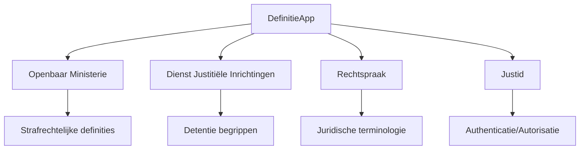
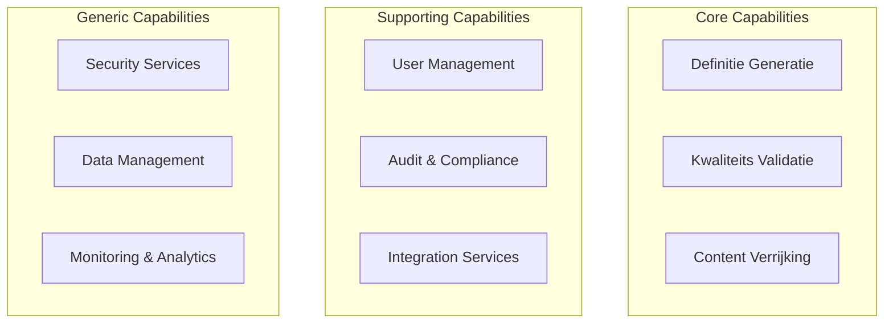
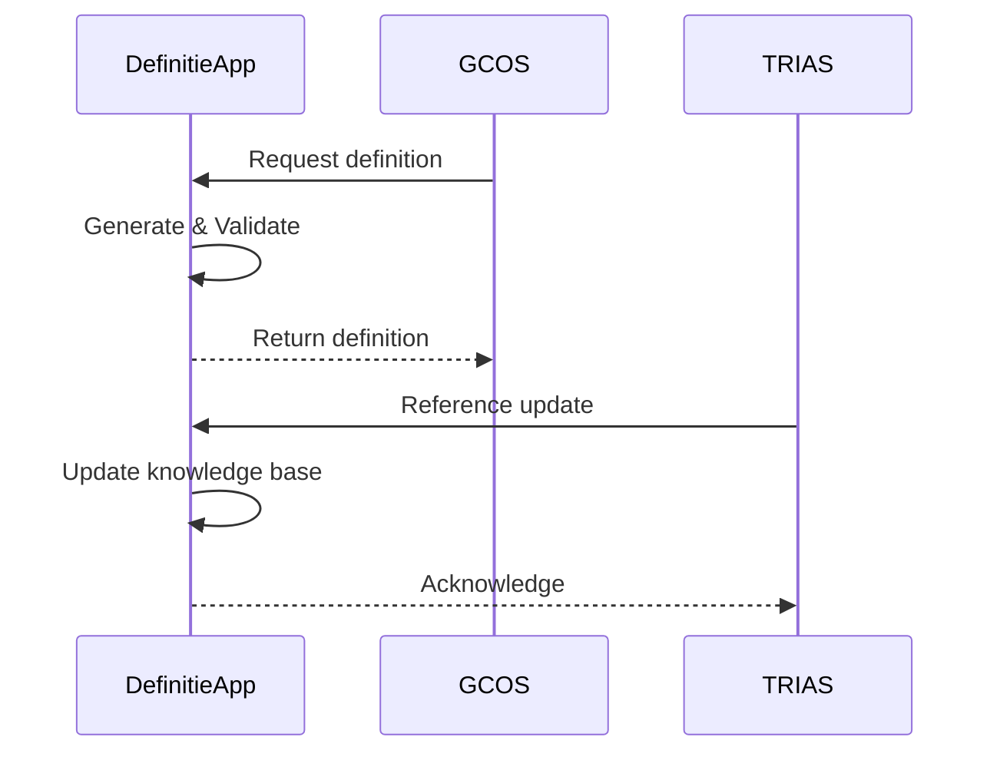
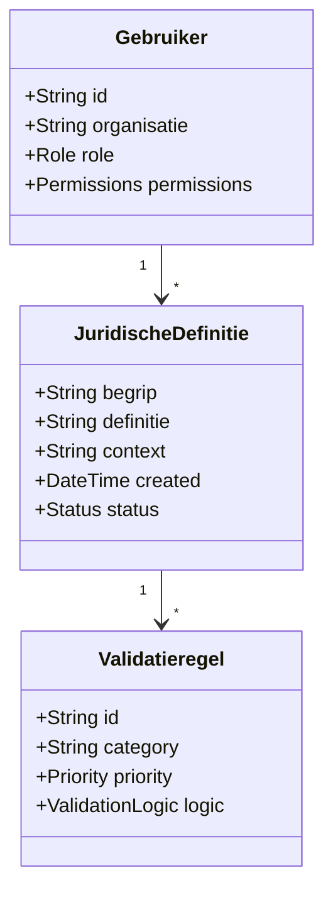
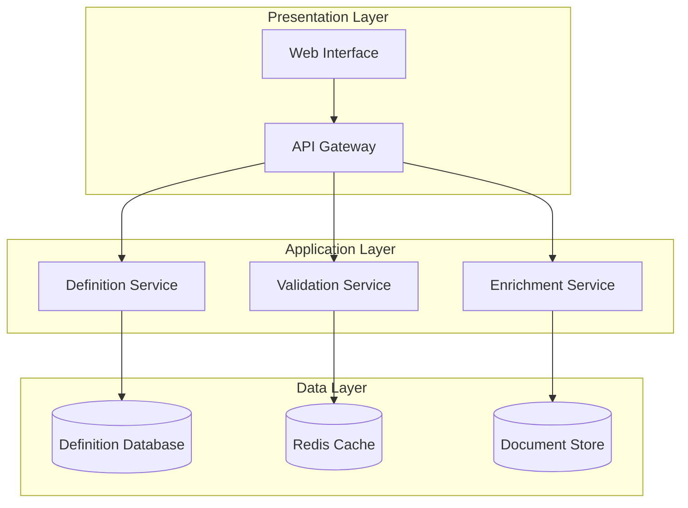
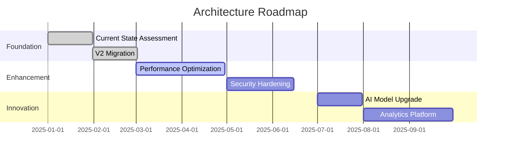

# ENTERPRISE ARCHITECTURE - DEFINITIEAPP

## 1. Executive Summary

### 1.1 Management Samenvatting

**[TEMPLATE GUIDANCE: Provide Dutch executive summary for management]**

De DefinitieApp is een AI-gedreven systeem voor het genereren en valideren van juridische definities binnen de Nederlandse justitieketen. Dit document beschrijft de enterprise architectuur, inclusief business capabilities, stakeholder belangen, en compliance requirements.

**Kernpunten:**
- [Business value proposition]
- [Strategic alignment with justice chain]
- [Key architectural decisions]
- [Compliance status overview]

### 1.2 Key Decisions

**[TEMPLATE GUIDANCE: List top 5 architectural decisions with business impact]**

| Decision | Rationale | Business Impact | Status |
|----------|-----------|-----------------|---------|
| Single Source of Truth voor validatieregels | Consistentie en onderhoudbaarheid | Verminderde fouten, snellere updates | ✅ Implemented |
| AI-gedreven definitie generatie | Efficiency en kwaliteit | 80% tijdsbesparing | ✅ Active |
| [Decision 3] | [Rationale] | [Impact] | [Status] |

### 1.3 Compliance Status

**[TEMPLATE GUIDANCE: High-level compliance dashboard]**

| Framework | Compliance Level | Certification | Next Audit |
|-----------|-----------------|---------------|------------|
| ASTRA | ✅ 100% | Valid | Q1 2026 |
| NORA | ✅ 95% | In Progress | Q2 2026 |
| BIO | ⚠️ 70% | Required | Q3 2025 |
| GEMMA | ✅ 100% | Valid | Q4 2025 |

## 2. Business Context

### 2.1 Organisational Context

**[TEMPLATE GUIDANCE: Describe organizational positioning and relationships]**

#### 2.1.1 Organisatie Positionering

De DefinitieApp opereert binnen de Nederlandse justitieketen onder verantwoordelijkheid van:
- **Primaire eigenaar**: [Organization name]
- **Gebruikersorganisaties**: OM, DJI, Rechtspraak, Justid
- **Governance**: [Governance body]

#### 2.1.2 Organisatorische Relaties

### 2.2 Stakeholder Analysis

**[TEMPLATE GUIDANCE: Complete stakeholder mapping with concerns]**

| Stakeholder Group | Primary Concerns | Influence | Engagement Strategy |
|-------------------|------------------|-----------|-------------------|
| Legal Professionals | Accuracy, Compliance | High | Regular feedback sessions |
| IT Department | Maintainability, Security | High | Technical reviews |
| Management | Cost, Efficiency | High | Quarterly reports |
| End Users | Usability, Performance | Medium | User groups |
| [Stakeholder] | [Concerns] | [Level] | [Strategy] |

### 2.3 Business Capabilities

**[TEMPLATE GUIDANCE: Map business capabilities to system features]**

#### 2.3.1 Capability Model

#### 2.3.2 Capability Descriptions

**Definitie Generatie**
- **Description**: AI-powered generation of legal definitions
- **Business Value**: [Value statement]
- **Maturity Level**: [Initial|Developing|Defined|Managed|Optimizing]

**[TEMPLATE: Repeat for each capability]**

## 3. Strategic Alignment

### 3.1 ASTRA Principles

**[TEMPLATE GUIDANCE: Map to ASTRA architectural principles]**

| ASTRA Principle | Implementation | Evidence | Compliance |
|-----------------|----------------|----------|------------|
| ASTRA-01: Traceability | All decisions tracked in ADRs | [ADR references] | ✅ Compliant |
| ASTRA-02: Interoperability | Standard APIs, OpenAPI specs | [API docs] | ✅ Compliant |
| ASTRA-03: Security by Design | Security architecture embedded | [Security docs] | ✅ Compliant |
| [Principle] | [Implementation] | [Evidence] | [Status] |

### 3.2 NORA Requirements

**[TEMPLATE GUIDANCE: Address NORA principles]**

#### Proactive Service Delivery (AP03)
- **Implementation**: [How the system is proactive]
- **Examples**: [Specific examples]
- **Metrics**: [Measurement approach]

#### Transparency (AP04)
- **Implementation**: [Transparency measures]
- **Documentation**: [Public documentation]
- **Audit Trail**: [Audit capabilities]

**[TEMPLATE: Continue for relevant NORA principles]**

### 3.3 Justice Chain Integration

**[TEMPLATE GUIDANCE: Describe integration with justice ecosystem]**

#### 3.3.1 Integration Points

| System | Integration Type | Data Exchange | Protocol | Status |
|--------|-----------------|---------------|----------|---------|
| GCOS | Real-time | Case data | REST API | Active |
| TRIAS | Batch | Reference data | SFTP | Active |
| [System] | [Type] | [Data] | [Protocol] | [Status] |

#### 3.3.2 Information Exchange

## 4. Information Architecture

### 4.1 Domain Model

**[TEMPLATE GUIDANCE: High-level conceptual domain model]**

### 4.2 Information Flows

**[TEMPLATE GUIDANCE: Major information flows through the system]**

#### 4.2.1 Definition Generation Flow
1. User inputs term and context
2. System enriches with external sources
3. AI generates definition
4. Validation rules applied
5. Definition stored and returned

#### 4.2.2 Quality Assurance Flow
[Describe validation and quality flow]

### 4.3 Data Governance

**[TEMPLATE GUIDANCE: Data ownership, quality, privacy]**

| Data Category | Owner | Classification | Retention | Privacy Impact |
|---------------|-------|----------------|-----------|----------------|
| Legal Definitions | Business | Public | 7 years | Low |
| User Data | IT Security | Confidential | 2 years | High |
| Audit Logs | Compliance | Internal | 10 years | Medium |
| [Category] | [Owner] | [Class] | [Retention] | [Impact] |

## 5. Application Architecture

### 5.1 Application Landscape

**[TEMPLATE GUIDANCE: High-level application components]**

### 5.2 Integration Points

**[TEMPLATE GUIDANCE: External system integrations]**

| External System | Purpose | Integration Pattern | SLA | Owner |
|-----------------|---------|-------------------|-----|--------|
| OpenAI GPT-4 | AI Generation | REST API | 99.9% | External |
| Wikipedia | Content Enrichment | REST API | 95% | External |
| SRU | Legal References | SOAP/REST | 99% | Justice |
| [System] | [Purpose] | [Pattern] | [SLA] | [Owner] |

### 5.3 Service Portfolio

**[TEMPLATE GUIDANCE: List of services with business purpose]**

| Service | Business Purpose | Criticality | Recovery Time |
|---------|-----------------|-------------|---------------|
| Definition Generation | Core business function | Critical | < 1 hour |
| Validation Engine | Quality assurance | Critical | < 2 hours |
| User Management | Access control | High | < 4 hours |
| [Service] | [Purpose] | [Level] | [RTO] |

## 6. Governance & Compliance

### 6.1 Architecture Governance

**[TEMPLATE GUIDANCE: How architecture decisions are made and enforced]**

#### 6.1.1 Governance Structure
- **Architecture Board**: [Meeting frequency, members]
- **Decision Process**: [ADR process, approval levels]
- **Review Cycle**: [Quarterly/Annual reviews]

#### 6.1.2 Architecture Principles
1. **Principle**: [Statement]
   - **Rationale**: [Why]
   - **Implications**: [What it means]

### 6.2 Compliance Matrix

**[TEMPLATE GUIDANCE: Detailed compliance tracking]**

| Standard | Requirement | Status | Evidence | Reference | Action |
|----------|------------|--------|----------|-----------|---------|
| ASTRA-01 | Traceability | ✅ COMPLIANT | ADR log maintained | [ADR-001] | None |
| NORA-AP03 | Proactief | ✅ COMPLIANT | Validation prevents errors | [SA § 4.3] | None |
| BIO-14.2.1 | Logging | ⚠️ PARTIAL | Basic logging implemented | [TA § 7.1] | Enhance by Q3 |
| GEMMA-2.0 | Services | ❌ TODO | Service registry missing | [Roadmap] | Implement Q4 |
| [Standard] | [Requirement] | [Status] | [Evidence] | [Ref] | [Action] |

### 6.3 Risk Management

**[TEMPLATE GUIDANCE: Architectural risks and mitigations]**

| Risk | Impact | Probability | Mitigation | Owner | Status |
|------|---------|------------|------------|--------|---------|
| AI Model Unavailability | High | Low | Fallback to cached responses | Tech Lead | Mitigated |
| Data Privacy Breach | Critical | Low | Encryption, access controls | Security | Monitoring |
| [Risk] | [Impact] | [Probability] | [Mitigation] | [Owner] | [Status] |

## 7. Roadmap & Evolution

### 7.1 Current State

**[TEMPLATE GUIDANCE: Where we are now]**

#### 7.1.1 Current Capabilities
- ✅ Basic definition generation
- ✅ 45 validation rules active
- ✅ Web lookup integration
- ⚠️ Limited user management
- ❌ Advanced analytics

#### 7.1.2 Technical Debt
| Item | Impact | Priority | Target Resolution |
|------|---------|----------|-------------------|
| V1 Orchestrator removal | Medium | High | Q3 2025 |
| [Debt item] | [Impact] | [Priority] | [When] |

### 7.2 Future State

**[TEMPLATE GUIDANCE: Target architecture vision]**

#### 7.2.1 Target Capabilities (12 months)
- Advanced AI models integration
- Multi-language support
- Real-time collaboration
- Advanced analytics dashboard
- [Future capability]

#### 7.2.2 Architecture Evolution

### 7.3 Migration Strategy

**[TEMPLATE GUIDANCE: How to get from current to future state]**

#### Phase 1: Foundation (Q1-Q2 2025)
- [x] Complete V2 migration
- [x] Establish monitoring
- [ ] Security audit

#### Phase 2: Enhancement (Q3-Q4 2025)
- [ ] Performance optimization
- [ ] User experience improvements
- [ ] Integration expansion

#### Phase 3: Innovation (2026)
- [ ] Next-gen AI integration
- [ ] Advanced analytics
- [ ] Predictive capabilities

## 8. References

### Internal Documentation
- [Solution Architecture](../SOLUTION_ARCHITECTURE.md) - Detailed solution design
- [Technical Architecture](../TECHNICAL_ARCHITECTURE.md) - Implementation details
- [User Stories](../../stories/MASTER-EPICS-USER-STORIES.md) - Functional requirements
- Test Strategy - Quality assurance approach (document in planning)

### External Standards
- [ASTRA Framework](https://astra.justice.nl) - Justice architecture standards
- [NORA Principles](https://www.noraonline.nl) - Dutch government architecture
- [BIO Standards](https://bio-overheid.nl) - Government information security
- [GEMMA](https://gemmaonline.nl) - Municipal reference architecture

### Architecture Decisions
<!-- ADRs zijn geïntegreerd in de canonical architecture documenten -->
<!-- Zie sectie 5 van het ENTERPRISE_ARCHITECTURE.md hoofddocument voor strategische beslissingen -->

### Glossary
| Term | Dutch | Definition |
|------|-------|------------|
| Validation Rule | Toetsregel | Business rule for quality validation |
| Legal Definition | Juridische Definitie | Formal definition of legal term |
| [Term] | [Dutch] | [Definition] |

---

## Document Control

**Last Review**: [Date]
**Next Review**: [Date]
**Change Log**:
| Date | Version | Change | Author |
|------|---------|--------|---------|
| 2025-09-XX | 2.0.0 | Initial consolidated version | Architecture Team |
| [Date] | [Version] | [Change] | [Author] |

## Approval

| Role | Name | Signature | Date |
|------|------|-----------|------|
| Chief Architect | [Name] | [Digital signature] | [Date] |
| Product Owner | [Name] | [Digital signature] | [Date] |
| Security Officer | [Name] | [Digital signature] | [Date] |

---

*This document is maintained by the Architecture Team and reviewed quarterly.*
*For questions or updates, contact: architecture-team@justice.nl*
