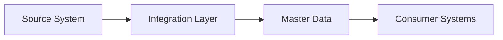

# [PROJECT NAAM] Enterprise Architecture

## Executive Summary

### Vision Statement
> [Beschrijf de strategische visie en hoe IT de business ondersteunt]

### Business Context
- **Organisatie**: [Naam en type organisatie]
- **Domein**: [Business domein/industrie]
- **Scope**: [Wat valt binnen/buiten scope]
- **Stakeholders**: [Key stakeholders en hun concerns]

### Key Business Drivers
1. [Driver 1 - bijv. Digital Transformation]
2. [Driver 2 - bijv. Operational Excellence]
3. [Driver 3 - bijv. Customer Experience]

---

## 1. Business Architecture

### 1.1 Business Capability Model
```
[Organisatie Naam] Capabilities
├── Core Capabilities
│   ├── [Capability 1]
│   ├── [Capability 2]
│   └── [Capability 3]
├── Supporting Capabilities
│   ├── [Capability 4]
│   └── [Capability 5]
└── Generic Capabilities
    ├── [Capability 6]
    └── [Capability 7]
```

### 1.2 Value Streams
| Value Stream | Description | Key Processes | Business Value |
|--------------|-------------|---------------|----------------|
| [Stream 1] | [Beschrijving] | [Process lijst] | [Value metrics] |
| [Stream 2] | [Beschrijving] | [Process lijst] | [Value metrics] |

### 1.3 Business Services
- **[Service Naam]**: [Beschrijving en business value]
- **[Service Naam]**: [Beschrijving en business value]

### 1.4 Business KPIs
| KPI | Current | Target | Timeline |
|-----|---------|--------|----------|
| [KPI 1] | [Waarde] | [Waarde] | [Datum] |
| [KPI 2] | [Waarde] | [Waarde] | [Datum] |

---

## 2. Information Architecture

### 2.1 Enterprise Information Model
```yaml
Core Business Objects:
  - [Object 1]:
      description: [Beschrijving]
      owner: [Business unit]
      criticality: [High/Medium/Low]
  - [Object 2]:
      description: [Beschrijving]
      owner: [Business unit]
      criticality: [High/Medium/Low]
```

### 2.2 Data Governance
- **Data Ownership**: [Governance model]
- **Data Quality Standards**: [Standards]
- **Privacy & Compliance**: [Requirements]
- **Master Data Domains**: [MDM domains]

### 2.3 Information Flow


---

## 3. Application Architecture

### 3.1 Application Portfolio

#### Current State (AS-IS)
| Application | Type | Business Capability | Status | Health |
|-------------|------|-------------------|---------|---------|
| [App 1] | [Type] | [Capability] | [Production] | [Green/Amber/Red] |
| [App 2] | [Type] | [Capability] | [Legacy] | [Green/Amber/Red] |

#### Target State (TO-BE)
| Application | Type | Business Capability | Timeline | Investment |
|-------------|------|-------------------|----------|------------|
| [App 1] | [Type] | [Capability] | [Q1 2025] | [€XXXk] |
| [App 2] | [Type] | [Capability] | [Q2 2025] | [€XXXk] |

### 3.2 Application Principles
1. **Buy vs Build**: [Principe en rationale]
2. **API-First**: [Principe en rationale]
3. **Cloud-Native**: [Principe en rationale]

### 3.3 Integration Landscape
```yaml
Integration Patterns:
  - Synchronous: [REST APIs, GraphQL]
  - Asynchronous: [Events, Messaging]
  - Batch: [ETL, File Transfer]
```

---

## 4. Technology Architecture

### 4.1 Technology Standards

#### Approved Technologies
| Category | Standard | Version | Status |
|----------|----------|---------|---------|
| [Category] | [Technology] | [Version] | [Approved/Sunset] |

#### Technology Principles
1. **Cloud-First**: [Rationale]
2. **Security by Design**: [Rationale]
3. **Open Standards**: [Rationale]

### 4.2 Platform Strategy
- **Primary Platform**: [Platform naam en rationale]
- **Secondary Platforms**: [Platforms voor specifieke use cases]
- **Exit Strategy**: [Voor legacy platforms]

### 4.3 Innovation Roadmap
| Innovation | Business Impact | Timeline | Investment |
|------------|----------------|----------|------------|
| [AI/ML] | [Impact] | [Timeline] | [Budget] |
| [IoT] | [Impact] | [Timeline] | [Budget] |

---

## 5. Security & Risk Architecture

### 5.1 Security Framework
- **Framework**: [bijv. Zero Trust, Defense in Depth]
- **Compliance**: [ISO 27001, SOC2, etc.]
- **Risk Appetite**: [Risk tolerance levels]

### 5.2 Risk Register (Top 10)
| Risk | Impact | Probability | Mitigation |
|------|--------|-------------|------------|
| [Risk 1] | [H/M/L] | [H/M/L] | [Strategy] |

### 5.3 Security Principles
1. **Least Privilege**: [Implementation]
2. **Defense in Depth**: [Layers]
3. **Zero Trust**: [Approach]

---

## 6. Governance

### 6.1 Architecture Governance
- **Architecture Board**: [Composition and cadence]
- **Decision Process**: [ADR process]
- **Compliance Monitoring**: [Methods]

### 6.2 Principles
#### Business Principles
1. **[Principle Name]**: [Statement and rationale]

#### IT Principles
1. **[Principle Name]**: [Statement and rationale]

### 6.3 Standards & Guidelines
- **Coding Standards**: → [Link to SA]
- **Integration Standards**: → [Link to SA]
- **Security Standards**: [Enterprise standards]

---

## 7. Roadmap & Portfolio

### 7.1 Strategic Roadmap
```
2024 Q1-Q2: Foundation
├── [Initiative 1]
└── [Initiative 2]

2024 Q3-Q4: Transformation
├── [Initiative 3]
└── [Initiative 4]

2025: Optimization
├── [Initiative 5]
└── [Initiative 6]
```

### 7.2 Investment Portfolio
| Initiative | Business Value | Cost | ROI | Priority |
|------------|---------------|------|-----|----------|
| [Initiative] | [Value] | [€] | [%] | [1-5] |

### 7.3 Benefits Realization
- **Cost Savings**: [Projected savings]
- **Revenue Growth**: [Growth targets]
- **Risk Reduction**: [Risk improvements]

---

## 8. Cross-References

### Solution Architecture Documents
- **[System Name] Solution Architecture**: [Link] - Technical implementation details
- **Integration Patterns Catalog**: [Link] - Detailed integration specs
- **Security Implementation Guide**: [Link] - Security controls

### Related Documents
- **Architecture Decision Records**: [Link to ADR folder]
- **Business Glossary**: [Link]
- **Technology Radar**: [Link]

---

## Appendices

### A. Stakeholder Matrix
| Stakeholder | Role | Concerns | Influence |
|-------------|------|----------|-----------|
| [Name] | [Role] | [Concerns] | [H/M/L] |

### B. Compliance Matrix
| Requirement | Source | Implementation | Status |
|-------------|--------|----------------|---------|
| [Req] | [Law/Std] | [How] | [Status] |

### C. Document Control
- **Version**: [X.X]
- **Last Updated**: [Date]
- **Owner**: [Name/Role]
- **Review Cycle**: [Quarterly/Annually]
- **Distribution**: [List]
