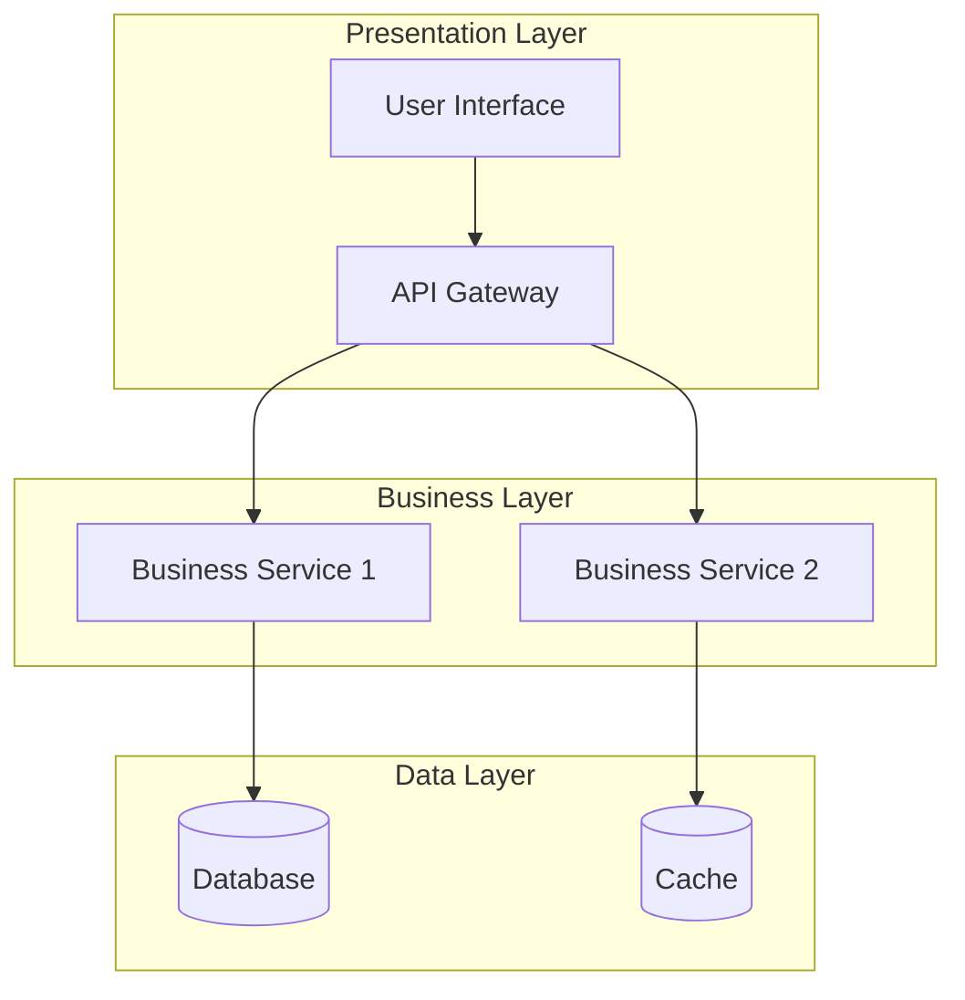
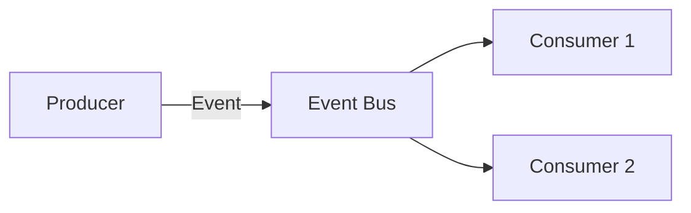
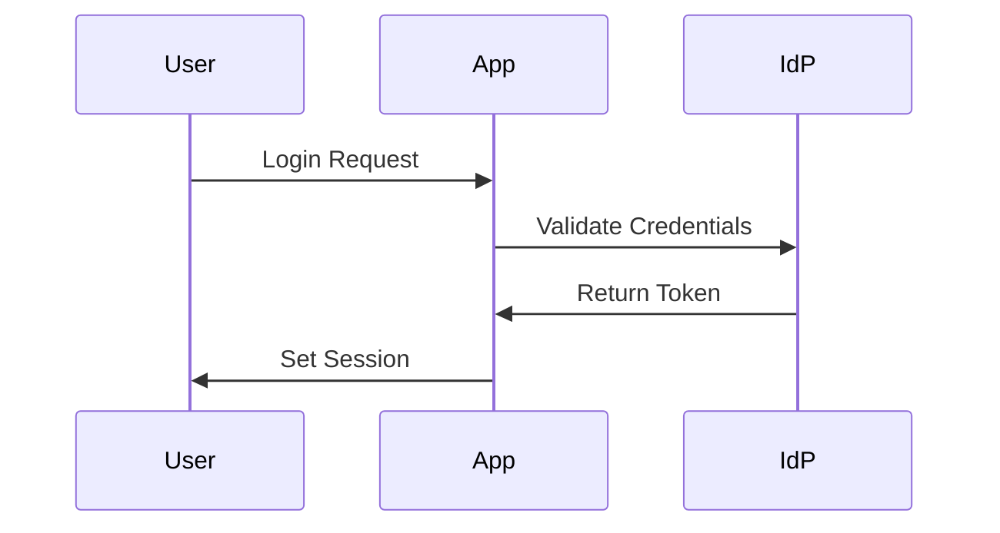
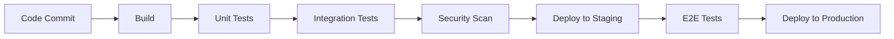

# [SYSTEM NAAM] Solution Architecture

## Executive Summary

### Solution Overview
> [Technische samenvatting van de oplossing en key design decisions]

### Technical Scope
- **System**: [Systeem naam en doel]
- **Components**: [Aantal en type componenten]
- **Integrations**: [Aantal externe systemen]
- **Users**: [Verwacht aantal gebruikers]

### Key Design Decisions
1. **[Decision 1]**: [Rationale]
2. **[Decision 2]**: [Rationale]
3. **[Decision 3]**: [Rationale]

### Reference to Enterprise Architecture
- **Business Capability**: → [Link to EA Section X.X]
- **Compliance Requirements**: → [Link to EA Section X.X]
- **Technology Standards**: → [Link to EA Section X.X]

---

## 1. System Architecture

### 1.1 Component Architecture

#### High-Level Components


#### Component Specifications
| Component | Technology | Purpose | Interfaces |
|-----------|------------|---------|------------|
| [Component] | [Tech Stack] | [Purpose] | [APIs/Events] |

### 1.2 Logical Architecture

#### Domain Model
```yaml
Aggregates:
  - [Aggregate 1]:
      entities: [Entity list]
      value_objects: [VO list]
      repository: [Repo name]
  - [Aggregate 2]:
      entities: [Entity list]
      value_objects: [VO list]
      repository: [Repo name]
```

#### Service Boundaries
- **[Service Name]**: [Responsibilities and boundaries]
- **[Service Name]**: [Responsibilities and boundaries]

### 1.3 Development Architecture

#### Code Organization
```
src/
├── api/              # API endpoints
├── application/      # Application services
├── domain/          # Domain logic
├── infrastructure/  # External integrations
└── tests/           # Test suites
```

#### Design Patterns Used
- **[Pattern Name]**: [Where and why used]
- **[Pattern Name]**: [Where and why used]

---

## 2. Technical Design

### 2.1 Technology Stack

#### Core Technologies
| Layer | Technology | Version | Justification |
|-------|------------|---------|---------------|
| Frontend | [Framework] | [Version] | [Why chosen] |
| Backend | [Framework] | [Version] | [Why chosen] |
| Database | [Database] | [Version] | [Why chosen] |
| Cache | [Cache] | [Version] | [Why chosen] |

#### Development Stack
- **Language**: [Primary language and version]
- **Framework**: [Primary framework]
- **Build Tools**: [Build and package tools]
- **Testing**: [Test frameworks]

### 2.2 API Design

#### REST API Specification
```yaml
/api/v1/[resource]:
  GET:
    description: [Description]
    parameters: [List]
    responses:
      200: [Success response]
      400: [Error response]
  POST:
    description: [Description]
    body: [Schema]
    responses:
      201: [Created response]
```

#### API Standards
- **Versioning**: [Strategy]
- **Authentication**: [Method]
- **Rate Limiting**: [Limits]
- **Documentation**: [OpenAPI/Swagger]

### 2.3 Data Architecture

#### Data Model
```sql
-- Core Tables
CREATE TABLE [table_name] (
    id UUID PRIMARY KEY,
    [columns]
);

-- Relationships
ALTER TABLE [table] ADD CONSTRAINT [constraint];
```

#### Data Management
- **Persistence**: [Strategy and patterns]
- **Caching**: [Strategy and TTLs]
- **Archival**: [Policy and implementation]
- **Backup**: [Strategy and RPO/RTO]

---

## 3. Integration Architecture

### 3.1 Internal Integrations

#### Service Communication
```yaml
Synchronous:
  protocol: REST/gRPC
  discovery: [Service discovery method]
  circuit_breaker: [Implementation]

Asynchronous:
  broker: [Message broker]
  patterns: [Pub/Sub, Queue]
  guarantees: [At-least-once, exactly-once]
```

#### Integration Patterns
- **[Pattern]**: [Use case and implementation]
- **[Pattern]**: [Use case and implementation]

### 3.2 External Integrations

#### Third-Party Systems
| System | Type | Protocol | Authentication | SLA |
|--------|------|----------|----------------|-----|
| [System] | [Type] | [Protocol] | [Method] | [SLA] |

#### Integration Security
- **API Keys**: [Management strategy]
- **Certificates**: [PKI approach]
- **Encryption**: [In-transit and at-rest]

### 3.3 Event Architecture

#### Event Catalog
| Event | Producer | Consumers | Schema |
|-------|----------|-----------|---------|
| [Event] | [Service] | [Services] | [Link] |

#### Event Flow


---

## 4. Security Implementation

### 4.1 Authentication & Authorization

#### Authentication Flow


#### Authorization Model
- **Type**: [RBAC/ABAC/etc]
- **Roles**: [Role definitions]
- **Permissions**: [Permission matrix]

### 4.2 Security Controls

#### Application Security
- **Input Validation**: [Approach]
- **Output Encoding**: [Strategy]
- **Session Management**: [Implementation]
- **Error Handling**: [Secure error responses]

#### Infrastructure Security
- **Network Security**: [Segmentation, firewalls]
- **Secrets Management**: [Vault/KMS usage]
- **Vulnerability Scanning**: [Tools and frequency]

### 4.3 Cryptography

#### Encryption Standards
| Data Type | At Rest | In Transit | Key Management |
|-----------|---------|------------|----------------|
| [Type] | [Algorithm] | [Protocol] | [Method] |

---

## 5. Performance Engineering

### 5.1 Performance Requirements

#### Response Time Targets
| Operation | Target | P95 | P99 |
|-----------|--------|-----|-----|
| [Operation] | [ms] | [ms] | [ms] |

#### Throughput Targets
- **Concurrent Users**: [Number]
- **Requests/Second**: [RPS]
- **Data Volume**: [GB/day]

### 5.2 Performance Optimizations

#### Caching Strategy
```yaml
Cache Layers:
  - CDN:
      content: [Static assets]
      ttl: [Duration]
  - Application:
      content: [Session data]
      ttl: [Duration]
  - Database:
      content: [Query results]
      ttl: [Duration]
```

#### Database Optimizations
- **Indexing**: [Strategy and key indexes]
- **Partitioning**: [Partitioning scheme]
- **Query Optimization**: [Approach]

### 5.3 Scalability Design

#### Horizontal Scaling
- **Stateless Design**: [Implementation]
- **Load Balancing**: [Algorithm]
- **Auto-scaling**: [Triggers and limits]

#### Vertical Scaling
- **Resource Limits**: [CPU/Memory limits]
- **Optimization Points**: [Where to scale up]

---

## 6. Deployment & Operations

### 6.1 Deployment Architecture

#### Container Strategy
```yaml
Containers:
  - service_name:
      image: [Registry/image:tag]
      replicas: [Min-Max]
      resources:
        cpu: [Limits]
        memory: [Limits]
      health_check: [Endpoint]
```

#### Kubernetes Configuration
```yaml
apiVersion: apps/v1
kind: Deployment
metadata:
  name: [service-name]
spec:
  replicas: [count]
  selector:
    matchLabels:
      app: [service-name]
```

### 6.2 CI/CD Pipeline

#### Pipeline Stages


#### Quality Gates
| Stage | Criteria | Tools |
|-------|----------|-------|
| [Stage] | [Pass criteria] | [Tools used] |

### 6.3 Monitoring & Observability

#### Metrics Collection
```yaml
Application Metrics:
  - response_time_ms
  - error_rate
  - throughput_rps

Infrastructure Metrics:
  - cpu_usage_percent
  - memory_usage_percent
  - disk_io_ops
```

#### Logging Strategy
- **Log Levels**: [Strategy for each level]
- **Log Format**: [Structured logging format]
- **Retention**: [Policy per environment]

#### Distributed Tracing
- **Tool**: [Jaeger/Zipkin/etc]
- **Sampling**: [Rate and strategy]
- **Correlation**: [Trace ID propagation]

---

## 7. Migration Strategy

### 7.1 Migration Approach

#### Phased Migration
```
Phase 1: Foundation (Week 1-2)
├── Setup infrastructure
├── Create CI/CD pipeline
└── Deploy hello-world

Phase 2: Core Features (Week 3-6)
├── Migrate user management
├── Migrate core business logic
└── Setup monitoring

Phase 3: Complete Migration (Week 7-8)
├── Migrate remaining features
├── Data migration
└── Cutover planning
```

### 7.2 Data Migration

#### Migration Strategy
- **Approach**: [Big bang/Trickle/Parallel run]
- **Tools**: [ETL tools used]
- **Validation**: [Data quality checks]

#### Rollback Plan
1. **Checkpoint Creation**: [When and how]
2. **Rollback Procedure**: [Step by step]
3. **Data Restoration**: [Recovery process]

### 7.3 Cutover Planning

#### Cutover Checklist
- [ ] Infrastructure ready
- [ ] Data migrated and validated
- [ ] Security controls active
- [ ] Monitoring configured
- [ ] Runbooks prepared
- [ ] Team trained

---

## 8. Operational Considerations

### 8.1 Runbooks

#### Standard Operating Procedures
- **Deployment**: [Link to procedure]
- **Rollback**: [Link to procedure]
- **Incident Response**: [Link to procedure]
- **Disaster Recovery**: [Link to procedure]

### 8.2 Maintenance Windows
- **Schedule**: [Day/Time]
- **Duration**: [Typical duration]
- **Communication**: [Process]

### 8.3 Support Model
- **L1 Support**: [Scope and handoff]
- **L2 Support**: [Scope and escalation]
- **L3 Support**: [Development team engagement]

---

## 9. Testing Strategy

### 9.1 Test Pyramid
```
         /\
        /E2E\
       /------\
      / Integr \
     /----------\
    /   Unit     \
   /--------------\
```

### 9.2 Test Coverage
| Type | Target | Current | Tools |
|------|--------|---------|-------|
| Unit | 80% | [%] | [Framework] |
| Integration | 70% | [%] | [Framework] |
| E2E | Key flows | [Status] | [Framework] |

### 9.3 Performance Testing
- **Load Testing**: [Tools and scenarios]
- **Stress Testing**: [Breaking points]
- **Soak Testing**: [Duration and monitoring]

---

## 10. Cost Optimization

### 10.1 Resource Optimization
| Resource | Current | Optimized | Savings |
|----------|---------|-----------|---------|
| [Compute] | [Usage] | [Target] | [%] |
| [Storage] | [Usage] | [Target] | [%] |
| [Network] | [Usage] | [Target] | [%] |

### 10.2 License Optimization
- **Current Licenses**: [List and cost]
- **Optimization**: [Consolidation opportunities]
- **Open Source**: [Replacement options]

---

## 11. Architecture Decision Records

### ADR-001: [Decision Title]
- **Status**: [Accepted/Rejected/Deprecated]
- **Context**: [Why needed]
- **Decision**: [What decided]
- **Consequences**: [Impact]

### ADR-002: [Decision Title]
- **Status**: [Accepted/Rejected/Deprecated]
- **Context**: [Why needed]
- **Decision**: [What decided]
- **Consequences**: [Impact]

---

## 12. References

### Internal References
- **Enterprise Architecture**: → [Link to EA]
- **API Documentation**: [Link to Swagger]
- **Runbooks**: [Link to runbooks]

### External References
- **Vendor Documentation**: [Links]
- **Standards**: [Links to standards used]
- **Best Practices**: [Links to guides]

---

## Appendices

### A. Glossary
| Term | Definition |
|------|------------|
| [Term] | [Definition] |

### B. Contact Information
| Role | Name | Contact |
|------|------|---------|
| Solution Architect | [Name] | [Email] |
| Tech Lead | [Name] | [Email] |
| Product Owner | [Name] | [Email] |

### C. Document Control
- **Version**: [X.X]
- **Last Updated**: [Date]
- **Owner**: [Name/Role]
- **Review Cycle**: [Monthly/Quarterly]
- **Repository**: [Link to source]
