# SOLUTION ARCHITECTURE - DEFINITIEAPP

## 1. Executive Summary

### 1.1 Solution Overview

**[TEMPLATE GUIDANCE: Technical solution summary for architects and developers]**

The DefinitieApp is a microservices-based solution leveraging AI for automated legal definition generation and validation. The architecture implements a service-oriented design with clear separation of concerns, enabling scalability, maintainability, and compliance with justice chain requirements.

**Key Architectural Characteristics:**
- Service-oriented architecture with dependency injection
- Event-driven validation orchestration
- Context-aware prompt management
- Modular validation rule system (45+ rules)
- Cache-optimized for performance

### 1.2 Key Design Decisions

**[TEMPLATE GUIDANCE: Top technical design decisions]**

| Decision | Pattern/Technology | Rationale | Trade-offs |
|----------|-------------------|-----------|------------|
| Service Container Pattern | Dependency Injection | Testability, loose coupling | Initial complexity |
| Async Processing | Python AsyncIO | Performance, scalability | Debugging complexity |
| Modular Validation | Plugin Architecture | Extensibility, maintainability | More files to manage |
| Context Flow Service | Mediator Pattern | Complete context preservation | Additional layer |
| [Decision] | [Pattern] | [Rationale] | [Trade-offs] |

### 1.3 Integration Strategy

**[TEMPLATE GUIDANCE: High-level integration approach]**

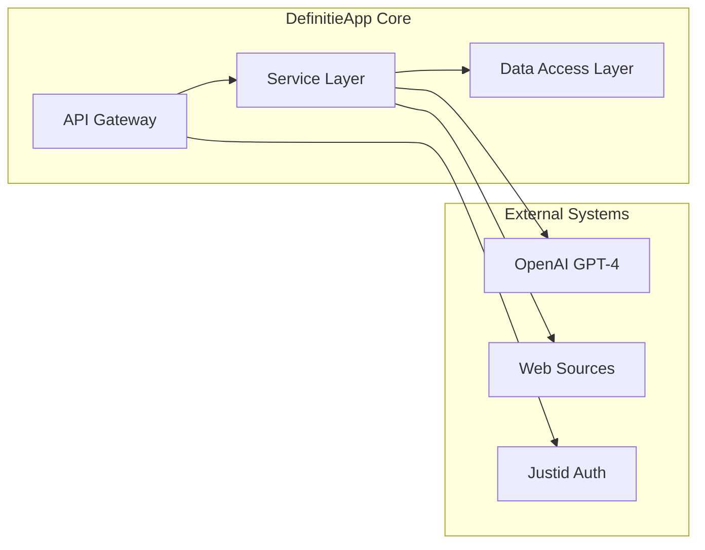

## 2. Solution Context

### 2.1 Problem Statement

**[TEMPLATE GUIDANCE: Technical problems being solved]**

#### 2.1.1 Current Challenges
- **Token Inefficiency**: All 45 validation rules hardcoded in prompts (7,250 tokens)
- **Context Loss**: Only organizational context correctly passed to prompts
- **Service Duplication**: V1 and V2 orchestrators running simultaneously
- **Performance Issues**: 6x service initialization on Streamlit reruns

#### 2.1.2 Solution Approach
- Implement context-aware prompt composition
- Single source of truth for validation rules
- Complete V2 migration with V1 elimination
- Service caching with proper lifecycle management

### 2.2 Solution Scope

**[TEMPLATE GUIDANCE: What's in and out of scope]**

#### In Scope
- ✅ AI-powered definition generation
- ✅ 45+ validation rules implementation
- ✅ Web content enrichment
- ✅ User interface (Streamlit)
- ✅ Export functionality (JSON, PDF)
- ✅ Caching and performance optimization

#### Out of Scope
- ❌ User authentication (delegated to Justid)
- ❌ Training custom AI models
- ❌ Real-time collaboration features
- ❌ Mobile application

### 2.3 Constraints & Assumptions

**[TEMPLATE GUIDANCE: Technical limitations and assumptions]**

#### Constraints
| Type | Constraint | Impact | Mitigation |
|------|------------|---------|------------|
| Technical | Python 3.11+ required | Limits deployment options | Container-based deployment |
| Performance | < 5s response time | Architecture decisions | Caching, async processing |
| Security | No data persistence of PII | Storage design | Tokenization, encryption |
| Integration | OpenAI API dependency | Availability risk | Fallback mechanisms |

#### Assumptions
- Stable internet connectivity for API calls
- OpenAI API availability > 99%
- Users have modern browsers (Chrome 90+, Firefox 88+)
- [Additional assumptions]

## 3. Functional Architecture

### 3.1 Functional Decomposition

**[TEMPLATE GUIDANCE: Break down system into functional components]**

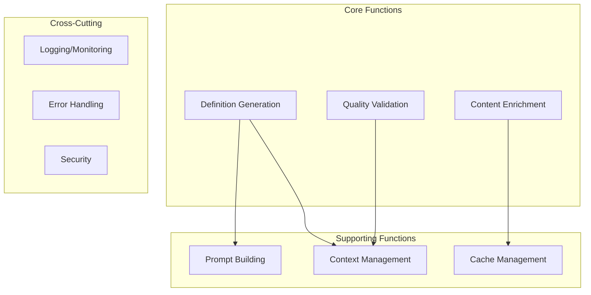

#### 3.1.1 Function Descriptions

**Definition Generation (F1)**
- **Purpose**: Generate legal definitions using AI
- **Inputs**: Term, context, parameters
- **Outputs**: Generated definition text
- **Dependencies**: AI Service, Prompt Service

**[TEMPLATE: Continue for each function]**

### 3.2 Service Design

**[TEMPLATE GUIDANCE: Service architecture and contracts]**

#### 3.2.1 Service Catalog

| Service | Responsibility | Interface | SLA |
|---------|----------------|-----------|-----|
| ValidationOrchestratorV2 | Coordinate validation flow | Async Python | < 1s |
| AIServiceV2 | GPT-4 integration | REST/Async | < 3s |
| PromptServiceV2 | Dynamic prompt building | Python API | < 100ms |
| WebLookupService | External content fetch | HTTP/Async | < 2s |
| ContextFlowService | Context preservation | Python API | < 50ms |

#### 3.2.2 Service Interaction Pattern

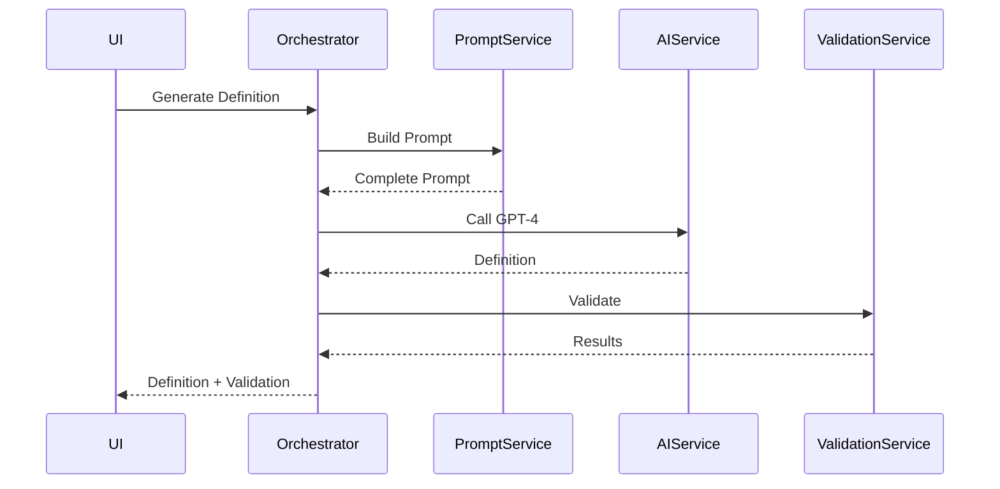

### 3.3 Process Flows

**[TEMPLATE GUIDANCE: Key business processes]**

#### 3.3.1 Definition Generation Flow

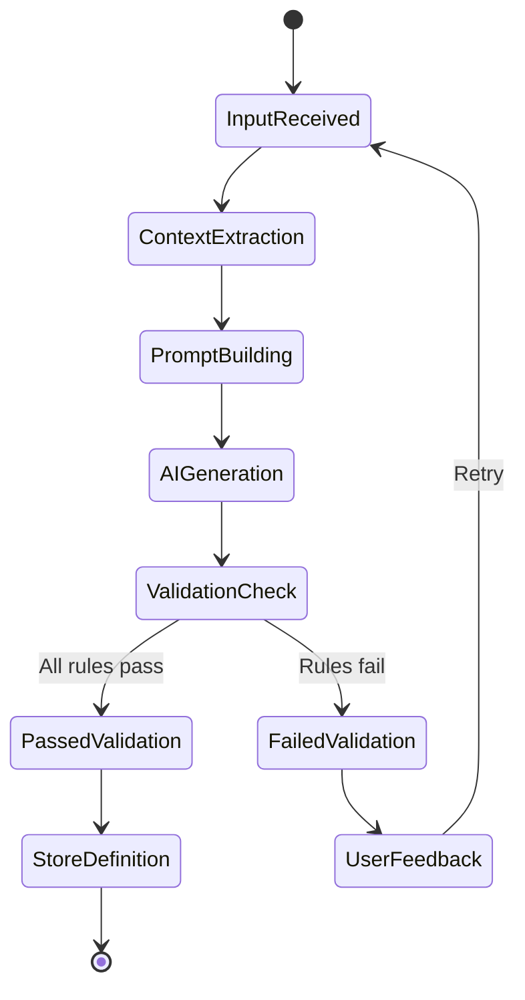

## 4. Data Architecture

### 4.1 Data Model

**[TEMPLATE GUIDANCE: Logical data model]**

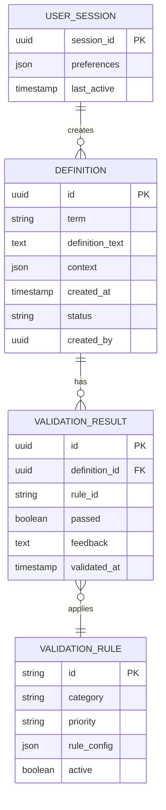

### 4.2 Data Flow Design

**[TEMPLATE GUIDANCE: How data moves through the system]**

#### 4.2.1 Data Flow Diagram

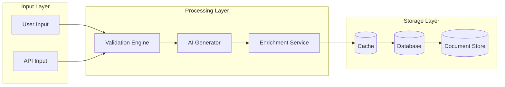

#### 4.2.2 Data Lifecycle

| Stage | Action | Retention | Privacy Controls |
|-------|---------|-----------|------------------|
| Input | Validate & Sanitize | Session only | Input filtering |
| Processing | Transform & Enrich | 24 hours (cache) | In-memory only |
| Storage | Persist if approved | 7 years | Encrypted at rest |
| Archive | Move to cold storage | 10 years | Compliance audit |
| Deletion | Permanent removal | N/A | Secure wipe |

### 4.3 Data Quality & Validation

**[TEMPLATE GUIDANCE: Data quality measures]**

#### 4.3.1 Validation Rules Categories

| Category | Code | Rules | Priority | Description |
|----------|------|-------|----------|-------------|
| Essential | ESS | 8 | Critical | Must-have quality checks |
| Structural | STR | 7 | High | Format and structure |
| Semantic | SEM | 6 | High | Meaning and context |
| Consistency | CON | 5 | Medium | Internal consistency |
| Integration | INT | 4 | Medium | External alignment |
| AI-Readiness | ARAI | 15 | High | AI model compatibility |

#### 4.3.2 Data Quality Metrics

```python
@dataclass
class DataQualityMetrics:
    completeness: float  # % of required fields populated
    accuracy: float      # % passing validation rules
    consistency: float   # % internally consistent
    timeliness: float   # % updated within SLA
    uniqueness: float   # % deduplicated
```

## 5. Integration Architecture

### 5.1 Integration Patterns

**[TEMPLATE GUIDANCE: How systems integrate]**

| Pattern | Use Case | Implementation | Example |
|---------|----------|----------------|---------|
| Request-Response | Synchronous operations | REST API | Definition generation |
| Publish-Subscribe | Event notifications | Redis PubSub | Validation complete |
| Batch Processing | Bulk operations | Scheduled jobs | Export definitions |
| Circuit Breaker | Fault tolerance | Resilience lib | External API calls |
| Retry with Backoff | Transient failures | Exponential delay | OpenAI requests |

### 5.2 API Contracts

**[TEMPLATE GUIDANCE: API specifications]**

#### 5.2.1 REST API Endpoints

```yaml
openapi: 3.0.0
paths:
  /api/v2/definitions:
    post:
      summary: Generate new definition
      requestBody:
        content:
          application/json:
            schema:
              type: object
              required: [term, context]
              properties:
                term:
                  type: string
                context:
                  type: object
                  properties:
                    organizational: array
                    juridical: array
                    legal_basis: array
      responses:
        200:
          description: Definition generated successfully
          content:
            application/json:
              schema:
                $ref: '#/components/schemas/Definition'
```

#### 5.2.2 Internal Service Contracts

```python
class ValidationContract(Protocol):
    """Contract for validation services"""

    async def validate(
        self,
        text: str,
        context: Dict[str, Any]
    ) -> ValidationResult:
        """Validate text against rules"""
        ...

    def get_rules(self) -> List[ValidationRule]:
        """Get active validation rules"""
        ...
```

### 5.3 Event Architecture

**[TEMPLATE GUIDANCE: Event-driven design]**

#### 5.3.1 Event Catalog

| Event | Producer | Consumers | Payload | Frequency |
|-------|----------|-----------|---------|-----------|
| DefinitionCreated | DefinitionService | ValidationService, AuditService | Definition object | ~100/day |
| ValidationCompleted | ValidationService | UIService, NotificationService | Validation results | ~100/day |
| CacheInvalidated | CacheService | All services | Cache keys | ~10/hour |
| [Event] | [Producer] | [Consumers] | [Payload] | [Frequency] |

#### 5.3.2 Event Flow

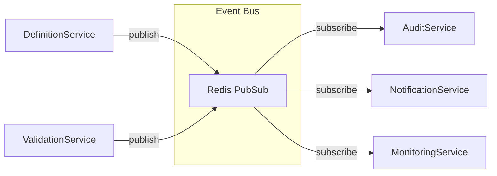

## 6. Security Architecture

### 6.1 Security Zones

**[TEMPLATE GUIDANCE: Security boundaries and zones]**

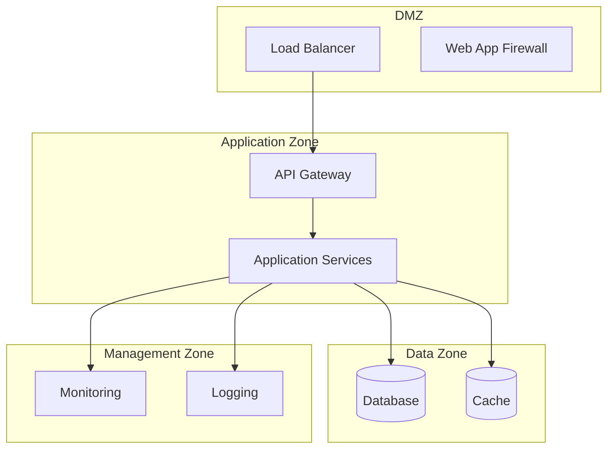

### 6.2 Authentication & Authorization

**[TEMPLATE GUIDANCE: Access control design]**

#### 6.2.1 Authentication Flow

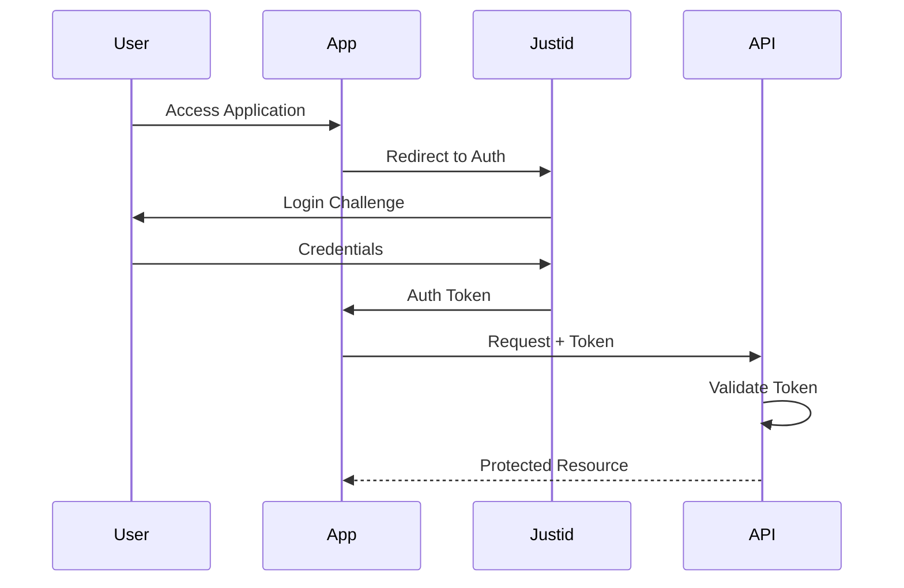

#### 6.2.2 Authorization Matrix

| Role | Generate | Validate | Export | Admin | Audit |
|------|----------|----------|---------|--------|-------|
| Guest | ❌ | ❌ | ❌ | ❌ | ❌ |
| User | ✅ | ✅ | ✅ | ❌ | ❌ |
| Power User | ✅ | ✅ | ✅ | ⚠️ | ✅ |
| Admin | ✅ | ✅ | ✅ | ✅ | ✅ |

### 6.3 Data Protection

**[TEMPLATE GUIDANCE: Data security measures]**

#### 6.3.1 Encryption Standards

| Data State | Method | Algorithm | Key Management |
|------------|---------|-----------|----------------|
| At Rest | Database Encryption | AES-256-GCM | Azure Key Vault |
| In Transit | TLS | TLS 1.3 | Certificate Manager |
| In Memory | Process Isolation | OS-level | N/A |
| Backups | Encrypted Archives | AES-256 | HSM |

#### 6.3.2 Data Classification

| Classification | Examples | Controls | Retention |
|----------------|----------|----------|-----------|
| Public | Published definitions | None | 10 years |
| Internal | Draft definitions | Access control | 7 years |
| Confidential | User data | Encryption + Access | 2 years |
| Secret | API keys | Vault storage | Rotation |

## 7. Quality Attributes

### 7.1 Performance Requirements

**[TEMPLATE GUIDANCE: Performance targets and design]**

#### 7.1.1 Performance Targets

| Operation | Target | Current | Design Approach |
|-----------|---------|---------|-----------------|
| Definition Generation | < 5s | 4.2s | Async processing, caching |
| Validation Execution | < 1s | 0.8s | Parallel validation |
| UI Response | < 200ms | 180ms | Client-side caching |
| Export Generation | < 2s | 1.5s | Background processing |
| API Response | < 500ms | 450ms | Connection pooling |

#### 7.1.2 Performance Design Patterns

```python
# Caching Strategy
@cache_resource(ttl=3600)
async def get_enrichment_data(term: str) -> EnrichmentData:
    """Cache external lookups for 1 hour"""
    return await web_lookup_service.fetch(term)

# Connection Pooling
class DatabasePool:
    def __init__(self):
        self.pool = asyncpg.create_pool(
            min_size=10,
            max_size=100,
            command_timeout=60
        )
```

### 7.2 Scalability Design

**[TEMPLATE GUIDANCE: How system scales]**

#### 7.2.1 Scaling Dimensions

| Dimension | Current | Target | Strategy |
|-----------|---------|---------|----------|
| Concurrent Users | 100 | 1000 | Horizontal scaling |
| Definitions/Day | 500 | 5000 | Async processing |
| Validation Rules | 45 | 100+ | Plugin architecture |
| Data Volume | 1GB | 100GB | Partitioning |

#### 7.2.2 Scaling Architecture

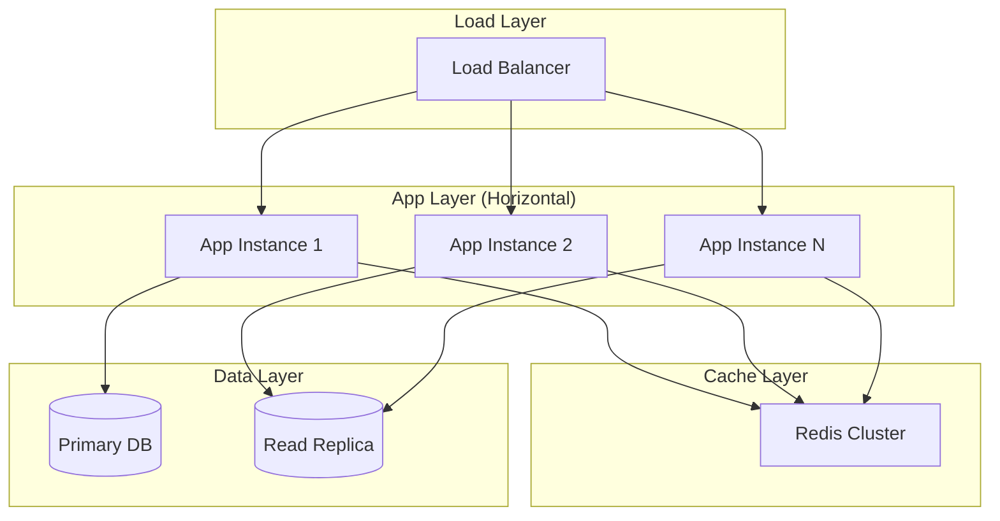

### 7.3 Reliability Patterns

**[TEMPLATE GUIDANCE: Fault tolerance and recovery]**

#### 7.3.1 Reliability Measures

| Pattern | Implementation | Recovery Time | Data Loss |
|---------|----------------|---------------|-----------|
| Circuit Breaker | External API calls | < 30s | None |
| Retry Logic | Transient failures | < 5s | None |
| Fallback | Cache responses | Immediate | None |
| Health Checks | Kubernetes probes | < 10s | None |
| Backup/Restore | Daily snapshots | < 4 hours | < 24 hours |

#### 7.3.2 Failure Scenarios

```python
class ResilientAIService:
    @circuit_breaker(failure_threshold=5, recovery_timeout=30)
    @retry(max_attempts=3, backoff=exponential)
    async def generate(self, prompt: str) -> str:
        try:
            return await self.openai_client.complete(prompt)
        except OpenAIError as e:
            # Fallback to cached response
            return await self.cache.get_similar(prompt)
```

## 8. Deployment Architecture

### 8.1 Deployment Model

**[TEMPLATE GUIDANCE: How solution is deployed]**

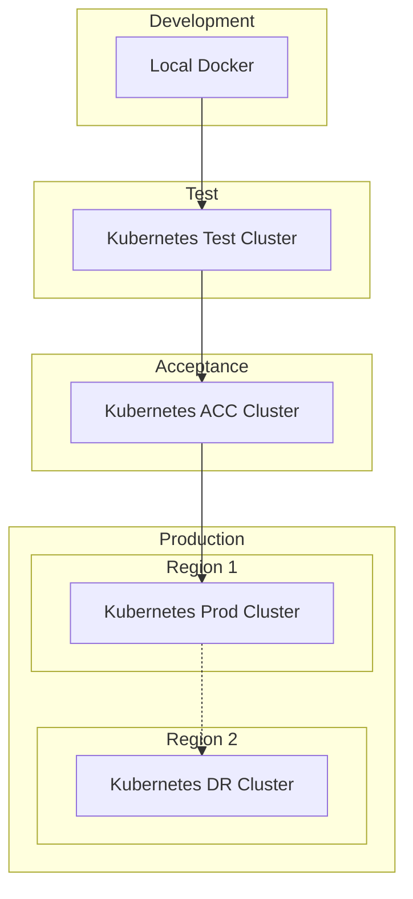

### 8.2 Environment Strategy

**[TEMPLATE GUIDANCE: Environment configuration]**

| Environment | Purpose | Scale | Data | Access |
|-------------|---------|-------|------|---------|
| Development | Feature development | 1 instance | Synthetic | Developers |
| Test | Integration testing | 2 instances | Test data | Dev + Test |
| Acceptance | User acceptance | 4 instances | Production-like | Business |
| Production | Live system | 8+ instances | Real data | All users |
| DR | Disaster recovery | 4 instances | Replicated | Emergency |

### 8.3 Release Management

**[TEMPLATE GUIDANCE: Deployment and release process]**

#### 8.3.1 Release Pipeline

```mermaid
graph LR
    CODE[Code Commit] --> BUILD[Build & Test]
    BUILD --> SCAN[Security Scan]
    SCAN --> PACKAGE[Container Build]
    PACKAGE --> DEPLOY_TEST[Deploy to Test]
    DEPLOY_TEST --> TEST[Run Tests]
    TEST --> DEPLOY_ACC[Deploy to ACC]
    DEPLOY_ACC --> UAT[User Acceptance]
    UAT --> DEPLOY_PROD[Deploy to Prod]
    DEPLOY_PROD --> VERIFY[Smoke Tests]
```

#### 8.3.2 Deployment Configuration

```yaml
# Kubernetes Deployment Spec
apiVersion: apps/v1
kind: Deployment
metadata:
  name: definitie-app
spec:
  replicas: 3
  strategy:
    type: RollingUpdate
    rollingUpdate:
      maxSurge: 1
      maxUnavailable: 0
  template:
    spec:
      containers:
      - name: app
        image: definitie-app:v2.0.0
        resources:
          requests:
            memory: "512Mi"
            cpu: "500m"
          limits:
            memory: "1Gi"
            cpu: "1000m"
        livenessProbe:
          httpGet:
            path: /health
            port: 8080
          initialDelaySeconds: 30
          periodSeconds: 10
```

## 9. References

### Internal Documentation
- [Enterprise Architecture](ENTERPRISE_ARCHITECTURE.md) - Business context and capabilities
- [Technical Architecture](TECHNICAL_ARCHITECTURE.md) - Implementation details
- [Test Strategy](../testing/TEST_STRATEGY.md) - Testing approach
- [API Documentation](../technische-referentie/api/) - Detailed API specs

### Architecture Decisions
<!-- ADRs zijn geïntegreerd in de canonical architecture documenten -->
<!-- Zie sectie 7 van het SOLUTION_ARCHITECTURE.md hoofddocument voor solution beslissingen -->

### External References
- [ASTRA Framework](https://astra.justice.nl) - Architecture standards
- [OpenAPI Specification](https://swagger.io/specification/) - API standards
- [Kubernetes Documentation](https://kubernetes.io/docs/) - Container orchestration
- [Python AsyncIO](https://docs.python.org/3/library/asyncio.html) - Async programming

### Technical Standards
- [ISO/IEC 25010](https://iso25000.com/index.php/en/iso-25000-standards/iso-25010) - Quality attributes
- [OWASP Top 10](https://owasp.org/www-project-top-ten/) - Security guidelines
- [REST API Guidelines](https://restfulapi.net/) - API best practices

---

## Document Control

**Last Review**: [Date]
**Next Review**: [Date]
**Change Log**:
| Date | Version | Change | Author |
|------|---------|--------|---------|
| 2025-09-XX | 2.0.0 | Initial consolidated version | Architecture Team |
| [Date] | [Version] | [Change] | [Author] |

## Approval

| Role | Name | Signature | Date |
|------|------|-----------|------|
| Solution Architect | [Name] | [Digital signature] | [Date] |
| Technical Lead | [Name] | [Digital signature] | [Date] |
| Security Architect | [Name] | [Digital signature] | [Date] |

---

*This document is maintained by the Solution Architecture Team and reviewed quarterly.*
*For questions or updates, contact: solution-architects@justice.nl*
