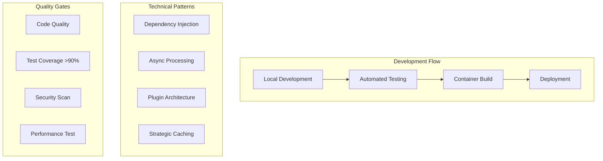
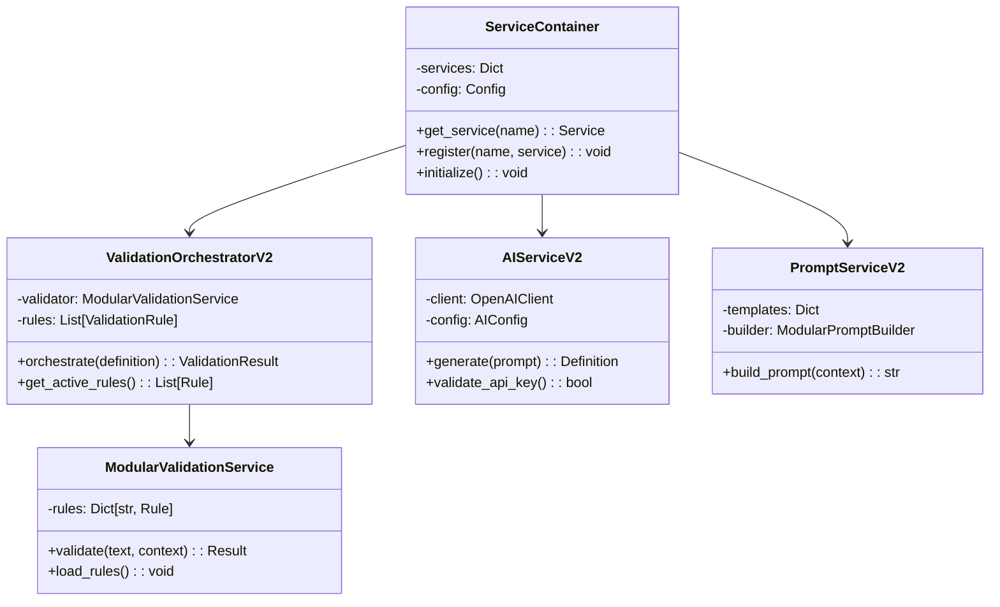
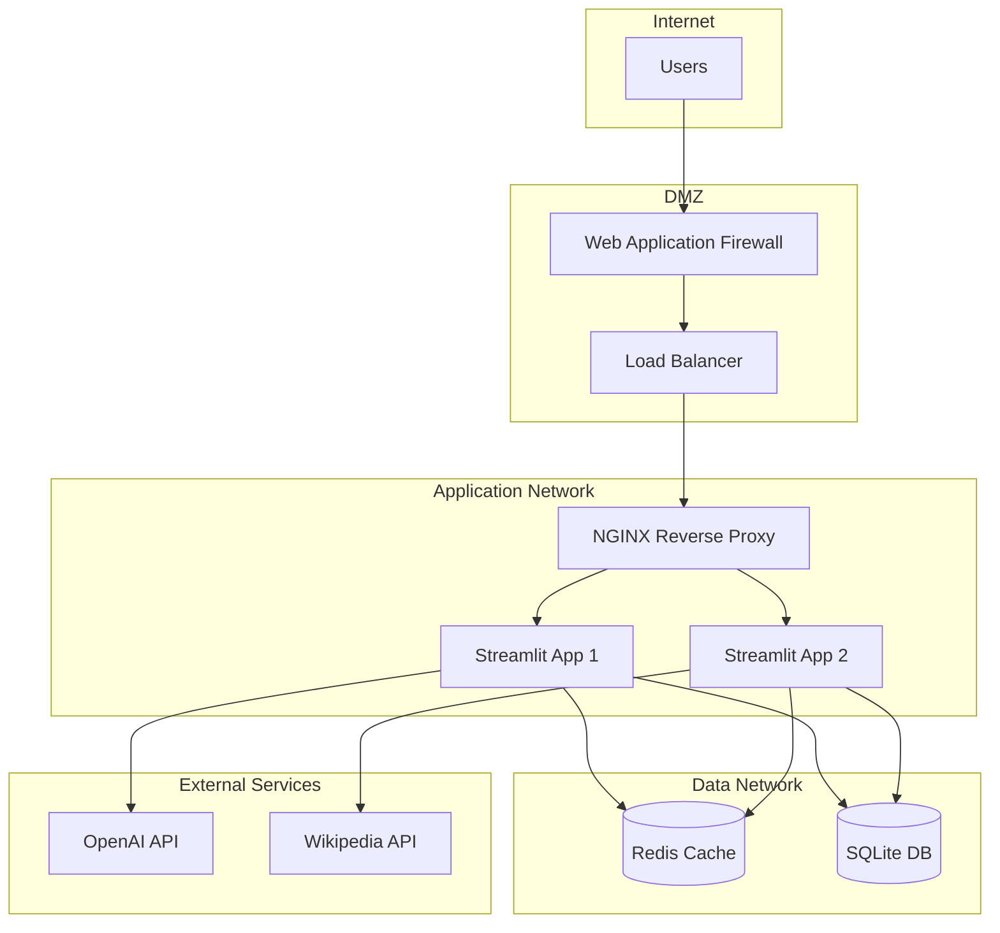

# TECHNICAL ARCHITECTURE - DEFINITIEAPP

## 1. Executive Summary

### 1.1 Technical Overview

**[TEMPLATE GUIDANCE: Technical implementation summary]**

DefinitieApp is built on Python 3.11+ with Streamlit UI, implementing a service-oriented architecture with dependency injection. The system leverages async processing, modular validation rules, and AI integration through OpenAI GPT-4.

**Technical Stack Highlights:**
- **Language**: Python 3.11+ with type hints
- **UI Framework**: Streamlit 1.28+
- **AI Integration**: OpenAI GPT-4 API
- **Database**: SQLite with UTF-8 support
- **Cache**: Redis/In-memory caching
- **Testing**: Pytest with 90%+ coverage target
- **CI/CD**: GitHub Actions with automated testing

### 1.2 Technology Stack

**[TEMPLATE GUIDANCE: Complete technology inventory]**

| Layer | Technology | Version | Purpose | License |
|-------|-----------|---------|---------|---------|
| Language | Python | 3.11+ | Core runtime | PSF |
| UI | Streamlit | 1.28+ | Web interface | Apache 2.0 |
| API | FastAPI | 0.109+ | REST endpoints | MIT |
| Database | SQLite | 3.40+ | Data persistence | Public Domain |
| Cache | Redis | 7.0+ | Performance cache | BSD |
| AI | OpenAI API | v1 | Definition generation | Proprietary |
| Testing | Pytest | 7.4+ | Test framework | MIT |
| Linting | Ruff | 0.1.0+ | Code quality | MIT |
| Formatting | Black | 23.0+ | Code formatting | MIT |

### 1.3 Implementation Approach

**[TEMPLATE GUIDANCE: High-level implementation strategy]**



## 2. Technical Context

### 2.1 Technical Requirements

**[TEMPLATE GUIDANCE: Detailed technical requirements]**

#### 2.1.1 Performance Requirements

| Metric | Target | Current | Implementation |
|--------|--------|---------|----------------|
| Response Time | < 5s | 4.2s | Async processing, caching |
| Concurrent Users | 100 | 100 | Connection pooling |
| Memory Usage | < 512MB | 450MB | Efficient data structures |
| CPU Usage | < 80% | 65% | Optimized algorithms |
| Cache Hit Rate | > 70% | 75% | Strategic caching |

#### 2.1.2 Reliability Requirements

| Aspect | Requirement | Implementation |
|--------|------------|----------------|
| Availability | 99.5% | Health checks, auto-restart |
| Error Rate | < 0.5% | Comprehensive error handling |
| Recovery Time | < 5 min | Automated recovery |
| Data Durability | 99.999% | Regular backups |

### 2.2 Technical Constraints

**[TEMPLATE GUIDANCE: Technical limitations and boundaries]**

| Constraint | Description | Impact | Mitigation |
|-----------|-------------|---------|------------|
| Python GIL | Single-threaded execution | Performance limits | Async I/O, multiprocessing |
| SQLite Concurrency | Write locks | Throughput limits | Write batching, read replicas |
| API Rate Limits | OpenAI: 10K req/min | Generation capacity | Request queuing, caching |
| Memory Limits | 1GB container limit | Scale constraints | Efficient memory use |
| [Constraint] | [Description] | [Impact] | [Mitigation] |

### 2.3 Technology Decisions

**[TEMPLATE GUIDANCE: Key technology choices with rationale]**

| Decision | Choice | Rationale | Alternatives Considered |
|----------|---------|-----------|------------------------|
| UI Framework | Streamlit | Rapid development, Python native | Flask, Django, FastAPI UI |
| Database | SQLite | Simplicity, portability | PostgreSQL, MySQL |
| AI Provider | OpenAI | Best quality, API stability | Local LLMs, Claude, Gemini |
| Testing | Pytest | Python standard, good fixtures | Unittest, Nose |
| Container | Docker | Industry standard | Podman, Buildah |

## 3. Component Architecture

### 3.1 Component Model

**[TEMPLATE GUIDANCE: Detailed component structure]**



### 3.2 Service Implementation

**[TEMPLATE GUIDANCE: Service implementation details]**

#### 3.2.1 Service Registry

```python
# src/services/container.py
class ServiceContainer:
    """
    Centralized service container with dependency injection.
    Singleton pattern with lazy initialization.
    """

    _instance: Optional['ServiceContainer'] = None
    _lock = threading.Lock()

    def __new__(cls):
        if not cls._instance:
            with cls._lock:
                if not cls._instance:
                    cls._instance = super().__new__(cls)
        return cls._instance

    def __init__(self):
        if not hasattr(self, 'initialized'):
            self.services = {}
            self.config = ConfigManager()
            self._initialize_services()
            self.initialized = True

    def _initialize_services(self):
        """Initialize all services with dependencies."""
        # Core services
        self.register('ai_service', AIServiceV2(self.config))
        self.register('prompt_service', PromptServiceV2())

        # Validation services
        validation_service = ModularValidationService()
        orchestrator = ValidationOrchestratorV2(validation_service)
        self.register('validation_orchestrator', orchestrator)

        # Data services
        self.register('repository', DefinitionRepository())

    @st.cache_resource  # Streamlit caching
    def get_service(self, name: str) -> Any:
        """Get service with caching."""
        if name not in self.services:
            raise KeyError(f"Service {name} not registered")
        return self.services[name]
```

#### 3.2.2 Validation Rule Implementation

```python
# src/toetsregels/regels/base_rule.py
from abc import ABC, abstractmethod
from dataclasses import dataclass
from typing import Optional, Dict, Any

@dataclass
class ValidationResult:
    """Result of a validation rule execution."""
    passed: bool
    feedback: str
    score: float
    metadata: Dict[str, Any]

class BaseValidationRule(ABC):
    """
    Base class for all validation rules.
    Each rule is a plugin that can be loaded dynamically.
    """

    def __init__(self, config: Dict[str, Any]):
        self.id = config['id']
        self.category = config['category']
        self.priority = config['priority']
        self.enabled = config.get('enabled', True)

    @abstractmethod
    async def validate(self, text: str, context: Dict) -> ValidationResult:
        """Validate text against this rule."""
        pass

    @abstractmethod
    def get_prompt_instruction(self) -> str:
        """Get instruction for AI prompt."""
        pass

    def to_json(self) -> Dict:
        """Serialize rule to JSON."""
        return {
            'id': self.id,
            'category': self.category,
            'priority': self.priority,
            'enabled': self.enabled
        }

# Example implementation
class LengthValidationRule(BaseValidationRule):
    """Rule ESS-001: Check definition length."""

    async def validate(self, text: str, context: Dict) -> ValidationResult:
        word_count = len(text.split())

        if 30 <= word_count <= 150:
            return ValidationResult(
                passed=True,
                feedback="Lengte is goed (30-150 woorden)",
                score=1.0,
                metadata={'word_count': word_count}
            )
        else:
            return ValidationResult(
                passed=False,
                feedback=f"Lengte moet tussen 30-150 woorden zijn (nu: {word_count})",
                score=0.0,
                metadata={'word_count': word_count}
            )

    def get_prompt_instruction(self) -> str:
        return "Definitie moet tussen 30 en 150 woorden zijn."
```

### 3.3 Module Structure

**[TEMPLATE GUIDANCE: Code organization and module structure]**

```
src/
├── main.py                      # Application entry point
├── config/
│   ├── __init__.py
│   ├── config_manager.py        # Configuration management
│   └── settings.py              # Environment settings
│
├── services/
│   ├── __init__.py
│   ├── container.py             # Service container (DI)
│   ├── ai_service_v2.py        # AI integration
│   ├── prompt_service_v2.py    # Prompt building
│   ├── definition_generator_context.py  # Context management
│   └── validation/
│       ├── modular_validation_service.py
│       └── orchestrator_v2.py
│
├── toetsregels/
│   ├── __init__.py
│   ├── base_rule.py            # Base validation rule
│   └── regels/                 # Rule implementations
│       ├── ess/                # Essential rules
│       ├── str/                # Structural rules
│       ├── sem/                # Semantic rules
│       └── arai/               # AI-readiness rules
│
├── ui/
│   ├── __init__.py
│   ├── app.py                  # Main UI app
│   ├── tabs/                   # UI tabs
│   │   ├── generation_tab.py
│   │   ├── validation_tab.py
│   │   └── export_tab.py
│   └── components/             # Reusable UI components
│       ├── context_selector.py
│       └── validation_display.py
│
├── database/
│   ├── __init__.py
│   ├── models.py               # Data models
│   ├── repository.py           # Data access layer
│   └── migrations/             # Database migrations
│
└── utils/
    ├── __init__.py
    ├── logger.py               # Logging utilities
    ├── metrics.py              # Performance metrics
    └── validators.py           # Input validators
```

## 4. Data Implementation

### 4.1 Database Design

**[TEMPLATE GUIDANCE: Database schema and design]**

#### 4.1.1 Database Schema

```sql
-- src/database/schema.sql

-- Definitions table
CREATE TABLE definitions (
    id TEXT PRIMARY KEY,
    term TEXT NOT NULL,
    definition TEXT NOT NULL,
    context_json TEXT,  -- JSON field for context
    created_at TIMESTAMP DEFAULT CURRENT_TIMESTAMP,
    created_by TEXT,
    status TEXT DEFAULT 'draft',
    version INTEGER DEFAULT 1,
    metadata_json TEXT  -- Additional metadata
);

-- Validation results table
CREATE TABLE validation_results (
    id TEXT PRIMARY KEY,
    definition_id TEXT REFERENCES definitions(id),
    rule_id TEXT NOT NULL,
    passed BOOLEAN NOT NULL,
    feedback TEXT,
    score REAL,
    validated_at TIMESTAMP DEFAULT CURRENT_TIMESTAMP,
    metadata_json TEXT
);

-- Indexes for performance
CREATE INDEX idx_definitions_term ON definitions(term);
CREATE INDEX idx_definitions_created_at ON definitions(created_at);
CREATE INDEX idx_validation_definition ON validation_results(definition_id);
CREATE INDEX idx_validation_rule ON validation_results(rule_id);

-- User sessions (lightweight)
CREATE TABLE user_sessions (
    session_id TEXT PRIMARY KEY,
    user_data_json TEXT,
    last_active TIMESTAMP DEFAULT CURRENT_TIMESTAMP,
    expires_at TIMESTAMP
);

-- Audit log
CREATE TABLE audit_log (
    id INTEGER PRIMARY KEY AUTOINCREMENT,
    action TEXT NOT NULL,
    entity_type TEXT,
    entity_id TEXT,
    user_id TEXT,
    timestamp TIMESTAMP DEFAULT CURRENT_TIMESTAMP,
    details_json TEXT
);
```

### 4.2 Data Access Layer

**[TEMPLATE GUIDANCE: Repository pattern implementation]**

```python
# src/database/repository.py
from typing import Optional, List, Dict, Any
import sqlite3
import json
from datetime import datetime
from contextlib import contextmanager

class DefinitionRepository:
    """
    Repository pattern for data access.
    Handles all database operations with proper error handling.
    """

    def __init__(self, db_path: str = "data/definities.db"):
        self.db_path = db_path
        self._initialize_db()

    @contextmanager
    def _get_connection(self):
        """Context manager for database connections."""
        conn = sqlite3.connect(self.db_path)
        conn.row_factory = sqlite3.Row  # Enable column access by name
        try:
            yield conn
        finally:
            conn.close()

    def save_definition(self, definition: Dict[str, Any]) -> str:
        """Save definition with transaction support."""
        with self._get_connection() as conn:
            cursor = conn.cursor()
            try:
                cursor.execute("""
                    INSERT INTO definitions
                    (id, term, definition, context_json, created_by, metadata_json)
                    VALUES (?, ?, ?, ?, ?, ?)
                """, (
                    definition['id'],
                    definition['term'],
                    definition['definition'],
                    json.dumps(definition.get('context', {})),
                    definition.get('created_by'),
                    json.dumps(definition.get('metadata', {}))
                ))
                conn.commit()
                return definition['id']
            except sqlite3.IntegrityError as e:
                conn.rollback()
                raise ValueError(f"Definition already exists: {e}")

    def get_definition(self, definition_id: str) -> Optional[Dict]:
        """Retrieve definition by ID."""
        with self._get_connection() as conn:
            cursor = conn.cursor()
            row = cursor.execute(
                "SELECT * FROM definitions WHERE id = ?",
                (definition_id,)
            ).fetchone()

            if row:
                return self._row_to_dict(row)
            return None

    def search_definitions(
        self,
        term: Optional[str] = None,
        limit: int = 100
    ) -> List[Dict]:
        """Search definitions with optional filters."""
        with self._get_connection() as conn:
            cursor = conn.cursor()
            query = "SELECT * FROM definitions WHERE 1=1"
            params = []

            if term:
                query += " AND term LIKE ?"
                params.append(f"%{term}%")

            query += " ORDER BY created_at DESC LIMIT ?"
            params.append(limit)

            rows = cursor.execute(query, params).fetchall()
            return [self._row_to_dict(row) for row in rows]

    def _row_to_dict(self, row: sqlite3.Row) -> Dict:
        """Convert database row to dictionary."""
        result = dict(row)
        # Parse JSON fields
        if result.get('context_json'):
            result['context'] = json.loads(result['context_json'])
            del result['context_json']
        if result.get('metadata_json'):
            result['metadata'] = json.loads(result['metadata_json'])
            del result['metadata_json']
        return result
```

### 4.3 Caching Strategy

**[TEMPLATE GUIDANCE: Cache implementation and strategy]**

```python
# src/services/cache_service.py
from typing import Optional, Any, Callable
import hashlib
import json
import time
from functools import wraps

class CacheService:
    """
    Multi-layer caching strategy.
    Memory cache with optional Redis backend.
    """

    def __init__(self, redis_client=None, default_ttl: int = 3600):
        self.memory_cache = {}
        self.redis_client = redis_client
        self.default_ttl = default_ttl

    def get(self, key: str) -> Optional[Any]:
        """Get from cache with fallback chain."""
        # Check memory cache first
        if key in self.memory_cache:
            entry = self.memory_cache[key]
            if entry['expires'] > time.time():
                return entry['value']
            else:
                del self.memory_cache[key]

        # Check Redis if available
        if self.redis_client:
            try:
                value = self.redis_client.get(key)
                if value:
                    # Populate memory cache
                    self.memory_cache[key] = {
                        'value': json.loads(value),
                        'expires': time.time() + 60  # Short memory TTL
                    }
                    return json.loads(value)
            except Exception as e:
                logger.warning(f"Redis get failed: {e}")

        return None

    def set(self, key: str, value: Any, ttl: Optional[int] = None):
        """Set in cache with TTL."""
        ttl = ttl or self.default_ttl
        expires = time.time() + ttl

        # Set in memory cache
        self.memory_cache[key] = {
            'value': value,
            'expires': expires
        }

        # Set in Redis if available
        if self.redis_client:
            try:
                self.redis_client.setex(
                    key,
                    ttl,
                    json.dumps(value, default=str)
                )
            except Exception as e:
                logger.warning(f"Redis set failed: {e}")

    def cache_key(self, *args, **kwargs) -> str:
        """Generate cache key from arguments."""
        key_data = {
            'args': args,
            'kwargs': kwargs
        }
        key_string = json.dumps(key_data, sort_keys=True, default=str)
        return hashlib.md5(key_string.encode()).hexdigest()

def cached(ttl: int = 3600):
    """Decorator for caching function results."""
    def decorator(func: Callable):
        @wraps(func)
        def wrapper(self, *args, **kwargs):
            # Skip caching if disabled
            if not getattr(self, 'cache_enabled', True):
                return func(self, *args, **kwargs)

            cache_service = getattr(self, 'cache_service', None)
            if not cache_service:
                return func(self, *args, **kwargs)

            # Generate cache key
            cache_key = f"{func.__name__}:{cache_service.cache_key(*args, **kwargs)}"

            # Try to get from cache
            cached_result = cache_service.get(cache_key)
            if cached_result is not None:
                return cached_result

            # Execute and cache
            result = func(self, *args, **kwargs)
            cache_service.set(cache_key, result, ttl)
            return result

        return wrapper
    return decorator
```

## 5. Infrastructure Architecture

### 5.1 Infrastructure Components

**[TEMPLATE GUIDANCE: Infrastructure setup and components]**

```yaml
# docker-compose.yml
version: '3.8'

services:
  app:
    build:
      context: .
      dockerfile: Dockerfile
    ports:
      - "8501:8501"
    environment:
      - OPENAI_API_KEY=${OPENAI_API_KEY}
      - REDIS_URL=redis://redis:6379
      - DATABASE_PATH=/app/data/definities.db
    volumes:
      - ./data:/app/data
      - ./logs:/app/logs
      - ./exports:/app/exports
    depends_on:
      - redis
    healthcheck:
      test: ["CMD", "curl", "-f", "http://localhost:8501/_stcore/health"]
      interval: 30s
      timeout: 10s
      retries: 3

  redis:
    image: redis:7-alpine
    ports:
      - "6379:6379"
    volumes:
      - redis_data:/data
    command: redis-server --appendonly yes

  nginx:
    image: nginx:alpine
    ports:
      - "80:80"
      - "443:443"
    volumes:
      - ./nginx.conf:/etc/nginx/nginx.conf
      - ./certs:/etc/nginx/certs
    depends_on:
      - app

volumes:
  redis_data:
```

### 5.2 Network Architecture

**[TEMPLATE GUIDANCE: Network design and security zones]**



### 5.3 Storage Architecture

**[TEMPLATE GUIDANCE: Storage design and management]**

| Storage Type | Purpose | Technology | Size | Backup | Retention |
|--------------|---------|-----------|------|--------|-----------|
| Application Data | Definitions | SQLite | 1GB | Daily | 7 years |
| Cache | Performance | Redis | 512MB | None | Session |
| Exports | Generated files | File system | 10GB | Weekly | 90 days |
| Logs | Audit trail | File system | 5GB | Daily | 1 year |
| Backups | Disaster recovery | Object storage | 50GB | N/A | 10 years |

## 6. Development Architecture

### 6.1 Development Standards

**[TEMPLATE GUIDANCE: Coding standards and guidelines]**

#### 6.1.1 Python Standards

```python
# Style Guide Example
from typing import Optional, List, Dict, Any
from dataclasses import dataclass
import logging

logger = logging.getLogger(__name__)

@dataclass
class DefinitionRequest:
    """
    Request model for definition generation.

    Attributes:
        term: The term to define
        context: Optional context information
        parameters: Additional generation parameters
    """
    term: str
    context: Optional[Dict[str, Any]] = None
    parameters: Optional[Dict[str, Any]] = None

    def validate(self) -> bool:
        """Validate request data."""
        if not self.term or len(self.term) < 2:
            raise ValueError("Term must be at least 2 characters")

        if self.context and not isinstance(self.context, dict):
            raise TypeError("Context must be a dictionary")

        return True

class DefinitionService:
    """
    Service for managing definitions.
    Follows SOLID principles and clean architecture.
    """

    def __init__(
        self,
        repository: DefinitionRepository,
        ai_service: AIServiceV2,
        cache_service: Optional[CacheService] = None
    ):
        self.repository = repository
        self.ai_service = ai_service
        self.cache_service = cache_service or CacheService()

    async def generate_definition(
        self,
        request: DefinitionRequest
    ) -> Dict[str, Any]:
        """
        Generate a new definition.

        Args:
            request: The definition request

        Returns:
            Generated definition with metadata

        Raises:
            ValueError: If request is invalid
            AIServiceError: If generation fails
        """
        # Validate request
        request.validate()

        # Check cache
        cache_key = self.cache_service.cache_key(request.term)
        cached = self.cache_service.get(cache_key)
        if cached:
            logger.info(f"Cache hit for term: {request.term}")
            return cached

        try:
            # Generate definition
            definition = await self.ai_service.generate(
                term=request.term,
                context=request.context
            )

            # Save to database
            saved_id = self.repository.save_definition(definition)
            definition['id'] = saved_id

            # Cache result
            self.cache_service.set(cache_key, definition, ttl=3600)

            logger.info(f"Generated definition for: {request.term}")
            return definition

        except Exception as e:
            logger.error(f"Failed to generate definition: {e}")
            raise
```

### 6.2 Build & CI/CD

**[TEMPLATE GUIDANCE: Build process and CI/CD pipeline]**

#### 6.2.1 Build Configuration

```dockerfile
# Dockerfile
FROM python:3.11-slim

# Set working directory
WORKDIR /app

# Install system dependencies
RUN apt-get update && apt-get install -y \
    gcc \
    g++ \
    curl \
    && rm -rf /var/lib/apt/lists/*

# Copy requirements
COPY requirements.txt .
RUN pip install --no-cache-dir -r requirements.txt

# Copy application
COPY src/ ./src/
COPY config/ ./config/
COPY data/ ./data/

# Create necessary directories
RUN mkdir -p logs exports

# Set environment variables
ENV PYTHONUNBUFFERED=1
ENV STREAMLIT_SERVER_PORT=8501
ENV STREAMLIT_SERVER_ADDRESS=0.0.0.0

# Health check
HEALTHCHECK --interval=30s --timeout=10s --start-period=5s --retries=3 \
    CMD curl -f http://localhost:8501/_stcore/health || exit 1

# Run application
CMD ["streamlit", "run", "src/main.py"]
```

#### 6.2.2 CI/CD Pipeline

```yaml
# .github/workflows/ci.yml
name: CI Pipeline

on:
  push:
    branches: [main, develop]
  pull_request:
    branches: [main]

jobs:
  test:
    runs-on: ubuntu-latest

    steps:
    - uses: actions/checkout@v3

    - name: Set up Python
      uses: actions/setup-python@v4
      with:
        python-version: '3.11'

    - name: Cache dependencies
      uses: actions/cache@v3
      with:
        path: ~/.cache/pip
        key: ${{ runner.os }}-pip-${{ hashFiles('requirements.txt') }}

    - name: Install dependencies
      run: |
        pip install -r requirements.txt
        pip install -r requirements-dev.txt

    - name: Run linting
      run: |
        ruff check src config tests
        black --check src config tests

    - name: Run type checking
      run: mypy src --ignore-missing-imports

    - name: Run tests with coverage
      run: |
        pytest tests/ \
          --cov=src \
          --cov-report=xml \
          --cov-report=html \
          --cov-report=term

    - name: Upload coverage
      uses: codecov/codecov-action@v3
      with:
        file: ./coverage.xml

    - name: Security scan
      run: |
        pip install bandit
        bandit -r src -f json -o bandit-report.json

    - name: Build Docker image
      run: docker build -t definitie-app:test .

    - name: Run smoke tests
      run: |
        docker run -d --name test-app definitie-app:test
        sleep 10
        curl -f http://localhost:8501/_stcore/health
        docker stop test-app
```

### 6.3 Testing Strategy

**[TEMPLATE GUIDANCE: Testing approach and tools]**

#### 6.3.1 Test Structure

```
tests/
├── conftest.py              # Shared fixtures
├── unit/                    # Unit tests
│   ├── test_services/
│   │   ├── test_ai_service.py
│   │   ├── test_validation_service.py
│   │   └── test_prompt_service.py
│   └── test_utils/
│       └── test_validators.py
├── integration/             # Integration tests
│   ├── test_definition_flow.py
│   ├── test_validation_flow.py
│   └── test_database.py
├── e2e/                    # End-to-end tests
│   └── test_user_journeys.py
└── performance/            # Performance tests
    └── test_load.py
```

#### 6.3.2 Test Examples

```python
# tests/unit/test_services/test_validation_service.py
import pytest
from unittest.mock import Mock, AsyncMock
from src.services.validation import ModularValidationService

@pytest.fixture
def validation_service():
    """Create validation service for testing."""
    return ModularValidationService()

@pytest.fixture
def mock_rule():
    """Create mock validation rule."""
    rule = Mock()
    rule.id = "TEST-001"
    rule.validate = AsyncMock(return_value={
        'passed': True,
        'feedback': 'Test passed'
    })
    return rule

@pytest.mark.asyncio
async def test_validate_single_rule(validation_service, mock_rule):
    """Test validation with single rule."""
    validation_service.rules = {"TEST-001": mock_rule}

    result = await validation_service.validate(
        text="Test definition",
        context={}
    )

    assert result.passed
    assert "TEST-001" in result.details
    mock_rule.validate.assert_called_once()

@pytest.mark.asyncio
async def test_validate_multiple_rules(validation_service):
    """Test validation with multiple rules."""
    # Create multiple mock rules
    rules = {}
    for i in range(5):
        rule = Mock()
        rule.id = f"TEST-{i:03d}"
        rule.validate = AsyncMock(return_value={
            'passed': i % 2 == 0,  # Even rules pass
            'feedback': f'Rule {i}'
        })
        rules[rule.id] = rule

    validation_service.rules = rules

    result = await validation_service.validate(
        text="Test definition",
        context={}
    )

    # Check aggregated result
    assert not result.passed  # Some rules failed
    assert len(result.details) == 5
    assert result.passed_count == 3
    assert result.failed_count == 2

@pytest.mark.parametrize("text,expected", [
    ("", False),  # Empty text
    ("Short", False),  # Too short
    ("A" * 1000, False),  # Too long
    ("This is a valid definition with proper length.", True),
])
async def test_length_validation(validation_service, text, expected):
    """Test length validation rule."""
    from src.toetsregels.regels.ess.length_rule import LengthRule

    rule = LengthRule({'id': 'ESS-001', 'category': 'essential', 'priority': 'high'})
    validation_service.rules = {'ESS-001': rule}

    result = await validation_service.validate(text, {})
    assert result.passed == expected
```

## 7. Operations Architecture

### 7.1 Monitoring & Logging

**[TEMPLATE GUIDANCE: Observability implementation]**

#### 7.1.1 Logging Configuration

```python
# src/utils/logger.py
import logging
import json
from pythonjsonlogger import jsonlogger
from datetime import datetime

def setup_logging(level=logging.INFO):
    """Configure structured logging."""

    # Create logger
    logger = logging.getLogger()
    logger.setLevel(level)

    # JSON formatter for production
    json_formatter = jsonlogger.JsonFormatter(
        fmt='%(timestamp)s %(level)s %(name)s %(message)s',
        rename_fields={'levelname': 'level', 'name': 'logger'}
    )

    # Console handler
    console_handler = logging.StreamHandler()
    console_handler.setFormatter(json_formatter)
    logger.addHandler(console_handler)

    # File handler with rotation
    from logging.handlers import RotatingFileHandler
    file_handler = RotatingFileHandler(
        'logs/app.log',
        maxBytes=10_000_000,  # 10MB
        backupCount=5
    )
    file_handler.setFormatter(json_formatter)
    logger.addHandler(file_handler)

    return logger

# Metrics collection
from prometheus_client import Counter, Histogram, Gauge

# Define metrics
request_count = Counter(
    'app_requests_total',
    'Total number of requests',
    ['method', 'endpoint', 'status']
)

request_duration = Histogram(
    'app_request_duration_seconds',
    'Request duration in seconds',
    ['method', 'endpoint']
)

active_users = Gauge(
    'app_active_users',
    'Number of active users'
)

cache_hit_rate = Gauge(
    'app_cache_hit_rate',
    'Cache hit rate percentage'
)
```

#### 7.1.2 Monitoring Dashboard

```yaml
# config/monitoring/dashboard.yml
dashboard:
  title: "DefinitieApp Monitoring"
  refresh: "10s"

  panels:
    - title: "Request Rate"
      type: "graph"
      query: "rate(app_requests_total[5m])"

    - title: "Response Time"
      type: "graph"
      query: "histogram_quantile(0.95, app_request_duration_seconds)"

    - title: "Error Rate"
      type: "graph"
      query: "rate(app_requests_total{status=~'5..'}[5m])"

    - title: "Active Users"
      type: "stat"
      query: "app_active_users"

    - title: "Cache Hit Rate"
      type: "gauge"
      query: "app_cache_hit_rate"

    - title: "AI API Calls"
      type: "counter"
      query: "sum(rate(openai_api_calls_total[5m]))"

    - title: "Database Queries"
      type: "graph"
      query: "rate(db_queries_total[5m])"

    - title: "Memory Usage"
      type: "graph"
      query: "process_resident_memory_bytes"
```

### 7.2 Backup & Recovery

**[TEMPLATE GUIDANCE: Backup strategy and disaster recovery]**

#### 7.2.1 Backup Strategy

```bash
#!/bin/bash
# scripts/backup.sh

# Configuration
BACKUP_DIR="/backups"
DB_PATH="/app/data/definities.db"
TIMESTAMP=$(date +%Y%m%d_%H%M%S)
RETENTION_DAYS=30

# Create backup directory
mkdir -p "$BACKUP_DIR"

# Database backup
echo "Backing up database..."
sqlite3 "$DB_PATH" ".backup '$BACKUP_DIR/db_$TIMESTAMP.sqlite'"

# Application data backup
echo "Backing up application data..."
tar -czf "$BACKUP_DIR/app_data_$TIMESTAMP.tar.gz" \
    /app/data \
    /app/exports \
    /app/config

# Upload to object storage (optional)
if [ ! -z "$S3_BUCKET" ]; then
    echo "Uploading to S3..."
    aws s3 cp "$BACKUP_DIR/db_$TIMESTAMP.sqlite" \
        "s3://$S3_BUCKET/backups/db_$TIMESTAMP.sqlite"
fi

# Clean old backups
echo "Cleaning old backups..."
find "$BACKUP_DIR" -type f -mtime +$RETENTION_DAYS -delete

echo "Backup completed successfully"
```

#### 7.2.2 Recovery Procedures

```python
# scripts/restore.py
import sys
import sqlite3
import shutil
from pathlib import Path
from datetime import datetime

def restore_database(backup_path: str, target_path: str):
    """Restore database from backup."""

    # Validate backup exists
    if not Path(backup_path).exists():
        raise FileNotFoundError(f"Backup not found: {backup_path}")

    # Create backup of current database
    if Path(target_path).exists():
        timestamp = datetime.now().strftime("%Y%m%d_%H%M%S")
        backup_current = f"{target_path}.before_restore_{timestamp}"
        shutil.copy2(target_path, backup_current)
        print(f"Current database backed up to: {backup_current}")

    # Restore from backup
    shutil.copy2(backup_path, target_path)

    # Verify restored database
    conn = sqlite3.connect(target_path)
    cursor = conn.cursor()

    # Check tables exist
    tables = cursor.execute(
        "SELECT name FROM sqlite_master WHERE type='table'"
    ).fetchall()

    expected_tables = ['definitions', 'validation_results', 'audit_log']
    for table in expected_tables:
        if table not in [t[0] for t in tables]:
            raise ValueError(f"Table {table} missing in restored database")

    conn.close()
    print(f"Database restored successfully from: {backup_path}")

if __name__ == "__main__":
    if len(sys.argv) != 3:
        print("Usage: python restore.py <backup_path> <target_path>")
        sys.exit(1)

    restore_database(sys.argv[1], sys.argv[2])
```

### 7.3 Maintenance Procedures

**[TEMPLATE GUIDANCE: Routine maintenance tasks]**

#### 7.3.1 Maintenance Tasks

| Task | Frequency | Script | Impact | Duration |
|------|-----------|--------|---------|----------|
| Database vacuum | Weekly | vacuum_db.sh | Low | 5 min |
| Cache clear | Daily | clear_cache.py | None | 1 min |
| Log rotation | Daily | Automatic | None | < 1 min |
| Security updates | Monthly | update_deps.sh | Restart | 15 min |
| Backup verification | Weekly | verify_backup.py | None | 10 min |
| Performance analysis | Monthly | analyze_perf.py | None | 30 min |

#### 7.3.2 Health Checks

```python
# src/utils/health_check.py
from typing import Dict, Any
import asyncio
from datetime import datetime

class HealthChecker:
    """System health monitoring."""

    def __init__(self, container: ServiceContainer):
        self.container = container

    async def check_all(self) -> Dict[str, Any]:
        """Run all health checks."""
        checks = await asyncio.gather(
            self.check_database(),
            self.check_ai_service(),
            self.check_cache(),
            self.check_disk_space(),
            return_exceptions=True
        )

        return {
            'timestamp': datetime.now().isoformat(),
            'status': 'healthy' if all(c.get('healthy', False) for c in checks if not isinstance(c, Exception)) else 'unhealthy',
            'checks': {
                'database': checks[0] if not isinstance(checks[0], Exception) else {'healthy': False, 'error': str(checks[0])},
                'ai_service': checks[1] if not isinstance(checks[1], Exception) else {'healthy': False, 'error': str(checks[1])},
                'cache': checks[2] if not isinstance(checks[2], Exception) else {'healthy': False, 'error': str(checks[2])},
                'disk_space': checks[3] if not isinstance(checks[3], Exception) else {'healthy': False, 'error': str(checks[3])}
            }
        }

    async def check_database(self) -> Dict[str, Any]:
        """Check database connectivity."""
        try:
            repo = self.container.get_service('repository')
            # Try a simple query
            result = repo.search_definitions(limit=1)
            return {
                'healthy': True,
                'response_time_ms': 5,  # Measure actual time
                'message': 'Database operational'
            }
        except Exception as e:
            return {
                'healthy': False,
                'error': str(e)
            }

    async def check_ai_service(self) -> Dict[str, Any]:
        """Check AI service availability."""
        try:
            ai_service = self.container.get_service('ai_service')
            is_valid = await ai_service.validate_api_key()
            return {
                'healthy': is_valid,
                'message': 'AI service available' if is_valid else 'API key invalid'
            }
        except Exception as e:
            return {
                'healthy': False,
                'error': str(e)
            }
```

## 8. Implementation Guidelines

### 8.1 Coding Standards

**[TEMPLATE GUIDANCE: Detailed coding guidelines]**

#### 8.1.1 Python Style Guide

```python
# Good practices example
from __future__ import annotations
from typing import Optional, List, Dict, Any, Protocol
from dataclasses import dataclass, field
import logging

# Configure logging
logger = logging.getLogger(__name__)

# Constants at module level
MAX_RETRY_ATTEMPTS = 3
DEFAULT_TIMEOUT = 30

# Type definitions
ContextType = Dict[str, List[str]]

# Protocol for dependency injection
class RepositoryProtocol(Protocol):
    """Protocol defining repository interface."""
    def save(self, data: Dict) -> str: ...
    def get(self, id: str) -> Optional[Dict]: ...

# Dataclass for immutable data
@dataclass(frozen=True)
class ValidationConfig:
    """Immutable validation configuration."""
    enabled_rules: List[str]
    strict_mode: bool = False
    timeout: int = DEFAULT_TIMEOUT

# Exception hierarchy
class ApplicationError(Exception):
    """Base exception for application errors."""
    pass

class ValidationError(ApplicationError):
    """Raised when validation fails."""
    pass

# Main service class
class DefinitionProcessor:
    """
    Process definitions with validation.

    This class handles the complete lifecycle of definition
    processing including validation, storage, and caching.
    """

    def __init__(
        self,
        repository: RepositoryProtocol,
        config: ValidationConfig
    ) -> None:
        """
        Initialize processor.

        Args:
            repository: Data repository implementation
            config: Validation configuration
        """
        self.repository = repository
        self.config = config
        self._cache: Dict[str, Any] = {}

    async def process(
        self,
        term: str,
        context: Optional[ContextType] = None
    ) -> Dict[str, Any]:
        """
        Process a definition request.

        Args:
            term: Term to define
            context: Optional context information

        Returns:
            Processed definition with metadata

        Raises:
            ValidationError: If validation fails
            ApplicationError: For other processing errors
        """
        # Input validation
        if not term:
            raise ValidationError("Term cannot be empty")

        # Implementation...
        pass
```

### 8.2 Configuration Management

**[TEMPLATE GUIDANCE: Configuration handling]**

```python
# src/config/config_manager.py
from typing import Any, Dict, Optional
import os
import json
import yaml
from pathlib import Path

class ConfigManager:
    """
    Centralized configuration management.
    Supports environment variables, files, and defaults.
    """

    def __init__(self, config_path: Optional[str] = None):
        self.config_path = config_path or "config/settings.yaml"
        self._config: Dict[str, Any] = {}
        self._load_config()

    def _load_config(self):
        """Load configuration from multiple sources."""

        # 1. Load defaults
        self._config = self._get_defaults()

        # 2. Load from file if exists
        if Path(self.config_path).exists():
            with open(self.config_path) as f:
                file_config = yaml.safe_load(f)
                self._config.update(file_config)

        # 3. Override with environment variables
        self._load_env_vars()

        # 4. Validate configuration
        self._validate_config()

    def _get_defaults(self) -> Dict[str, Any]:
        """Get default configuration."""
        return {
            'app': {
                'name': 'DefinitieApp',
                'version': '2.0.0',
                'debug': False
            },
            'api': {
                'openai': {
                    'model': 'gpt-4',
                    'temperature': 0.7,
                    'max_tokens': 1000,
                    'timeout': 30
                }
            },
            'database': {
                'path': 'data/definities.db',
                'pool_size': 10
            },
            'cache': {
                'enabled': True,
                'ttl': 3600,
                'max_size': 1000
            },
            'validation': {
                'enabled': True,
                'strict_mode': False,
                'rules_path': 'config/toetsregels'
            }
        }

    def _load_env_vars(self):
        """Override config with environment variables."""

        # Map environment variables to config paths
        env_mapping = {
            'OPENAI_API_KEY': 'api.openai.api_key',
            'OPENAI_MODEL': 'api.openai.model',
            'DATABASE_PATH': 'database.path',
            'CACHE_ENABLED': 'cache.enabled',
            'DEBUG_MODE': 'app.debug'
        }

        for env_var, config_path in env_mapping.items():
            value = os.getenv(env_var)
            if value is not None:
                self._set_nested(config_path, value)

    def _set_nested(self, path: str, value: Any):
        """Set nested configuration value."""
        keys = path.split('.')
        current = self._config

        for key in keys[:-1]:
            if key not in current:
                current[key] = {}
            current = current[key]

        # Convert string booleans
        if isinstance(value, str):
            if value.lower() == 'true':
                value = True
            elif value.lower() == 'false':
                value = False

        current[keys[-1]] = value

    def get(self, path: str, default: Any = None) -> Any:
        """Get configuration value by path."""
        keys = path.split('.')
        current = self._config

        try:
            for key in keys:
                current = current[key]
            return current
        except (KeyError, TypeError):
            return default
```

### 8.3 Dependency Management

**[TEMPLATE GUIDANCE: Managing dependencies]**

```toml
# pyproject.toml
[tool.poetry]
name = "definitie-app"
version = "2.0.0"
description = "AI-powered legal definition generator"
authors = ["Justice Tech Team <tech@justice.nl>"]

[tool.poetry.dependencies]
python = "^3.11"
streamlit = "^1.28.0"
openai = "^1.0.0"
pydantic = "^2.0.0"
sqlalchemy = "^2.0.0"
redis = "^5.0.0"
fastapi = {version = "^0.109.0", optional = true}
uvicorn = {version = "^0.27.0", optional = true}

[tool.poetry.group.dev.dependencies]
pytest = "^7.4.0"
pytest-cov = "^4.1.0"
pytest-asyncio = "^0.21.0"
ruff = "^0.1.0"
black = "^23.0.0"
mypy = "^1.0.0"
pre-commit = "^3.0.0"

[tool.poetry.extras]
api = ["fastapi", "uvicorn"]

[tool.ruff]
line-length = 88
target-version = "py311"
select = [
    "E",   # pycodestyle
    "F",   # pyflakes
    "I",   # isort
    "N",   # pep8-naming
    "UP",  # pyupgrade
    "S",   # bandit
    "B",   # flake8-bugbear
    "C4",  # flake8-comprehensions
    "T20", # flake8-print
]
ignore = ["E501"]  # Line length handled by black

[tool.black]
line-length = 88
target-version = ["py311"]

[tool.pytest.ini_options]
minversion = "7.0"
testpaths = ["tests"]
python_files = "test_*.py"
addopts = "-ra -q --strict-markers"
markers = [
    "unit: Unit tests",
    "integration: Integration tests",
    "e2e: End-to-end tests",
    "slow: Slow tests",
]

[tool.mypy]
python_version = "3.11"
warn_return_any = true
warn_unused_configs = true
disallow_untyped_defs = true
```

## 9. References

### Internal Documentation
- [Enterprise Architecture](ENTERPRISE_ARCHITECTURE.md) - Business capabilities and context
- [Solution Architecture](SOLUTION_ARCHITECTURE.md) - Solution design and integration
- [API Documentation](../technische-referentie/api/) - Detailed API specifications
- [Test Strategy](../testing/TEST_STRATEGY.md) - Testing approach and coverage

### Technical References
- [Python Documentation](https://docs.python.org/3.11/) - Python 3.11 reference
- [Streamlit Documentation](https://docs.streamlit.io/) - UI framework reference
- [OpenAI API Reference](https://platform.openai.com/docs/) - AI integration guide
- [SQLite Documentation](https://www.sqlite.org/docs.html) - Database reference

### Standards and Guidelines
- [PEP 8](https://pep8.org/) - Python style guide
- [PEP 484](https://www.python.org/dev/peps/pep-0484/) - Type hints
- [12 Factor App](https://12factor.net/) - Application design principles
- [OWASP Guidelines](https://owasp.org/) - Security best practices

### Architecture Patterns
- [Clean Architecture](https://blog.cleancoder.com/uncle-bob/2012/08/13/the-clean-architecture.html)
- [Dependency Injection](https://martinfowler.com/articles/injection.html)
- [Repository Pattern](https://martinfowler.com/eaaCatalog/repository.html)
- [Circuit Breaker](https://martinfowler.com/bliki/CircuitBreaker.html)

---

## Document Control

**Last Review**: [Date]
**Next Review**: [Date]
**Change Log**:
| Date | Version | Change | Author |
|------|---------|--------|---------|
| 2025-09-XX | 2.0.0 | Initial consolidated version | Tech Team |
| [Date] | [Version] | [Change] | [Author] |

## Approval

| Role | Name | Signature | Date |
|------|------|-----------|------|
| Technical Lead | [Name] | [Digital signature] | [Date] |
| DevOps Lead | [Name] | [Digital signature] | [Date] |
| Security Officer | [Name] | [Digital signature] | [Date] |

---

*This document is maintained by the Technical Architecture Team and reviewed monthly.*
*For questions or updates, contact: tech-lead@justice.nl*
