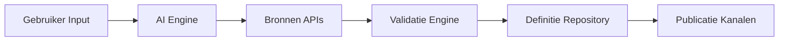

# DefinitieAgent Enterprise Architecture

## Executive Summary

### Vision Statement
> Transform the way government organizations create and manage official definitions through AI-powered assistance, ensuring consistency, quality, and compliance across all governmental communications.

### Business Context
- **Organisatie**: Nederlandse Overheid - Generieke Voorzieningen
- **Domein**: Government Digital Services / Legal Tech
- **Scope**: Definitie generatie voor overheidsbreed gebruik
- **Stakeholders**: Beleidsmakers, Juristen, Communicatieadviseurs, Burgers

### Key Business Drivers
1. **Digitale Transformatie Overheid** - Modernisering van definitie-creatie processen
2. **Kwaliteit & Consistentie** - Eenduidige definities across government
3. **Efficiency & Kostenbesparing** - Van dagen naar minuten voor definitie-creatie
4. **Compliance & Toegankelijkheid** - WCAG 2.1 AA, Taalniveau B1

---

## 1. Business Architecture

### 1.1 Business Capability Model
```
DefinitieAgent Capabilities
├── Core Capabilities
│   ├── Definitie Generatie
│   ├── Kwaliteitscontrole
│   └── Contextualisatie
├── Supporting Capabilities
│   ├── Bronnen Integratie
│   ├── Expert Review
│   └── Versiebeheer
└── Generic Capabilities
    ├── Gebruikersbeheer
    └── Audit & Compliance
```

### 1.2 Value Streams
| Value Stream | Description | Key Processes | Business Value |
|--------------|-------------|---------------|----------------|
| Definitie Creatie | Van vraag tot gevalideerde definitie | Intake → Generatie → Validatie → Publicatie | 90% tijdsbesparing |
| Kwaliteitsborging | Consistente, accurate definities | Review → Feedback → Verbetering | 95% first-time-right |
| Kennisdeling | Hergebruik van definities | Search → Select → Adapt | 70% hergebruik |

### 1.3 Business Services
- **Definitie Generatie Service**: AI-powered generatie met context-awareness
- **Validatie Service**: Multi-level quality checks en expert review
- **Integratie Service**: Koppeling met RijksWoordenboek, EUR-Lex, etc.
- **Audit Service**: Volledige traceerbaarheid van definitie lifecycle

### 1.4 Business KPIs
| KPI | Current | Target | Timeline |
|-----|---------|--------|----------|
| Definitie Creation Time | 2-3 dagen | <10 minuten | Q2 2025 |
| First-Time-Right Rate | 60% | 95% | Q3 2025 |
| User Adoption | 10 users | 500+ users | Q4 2025 |
| Cost per Definition | €250 | €25 | Q2 2025 |

---

## 2. Information Architecture

### 2.1 Enterprise Information Model
```yaml
Core Business Objects:
  - Definitie:
      description: Officiële begripsomschrijving
      owner: Content Management Team
      criticality: High
  - Context:
      description: Domein en gebruik informatie
      owner: Domain Experts
      criticality: High
  - Bron:
      description: Referentie materiaal
      owner: Knowledge Management
      criticality: Medium
  - Validatie:
      description: Quality check resultaten
      owner: QA Team
      criticality: High
```

### 2.2 Data Governance
- **Data Ownership**: Decentraal per ministerie met centrale standards
- **Data Quality Standards**: ISO 8000, Overheid Data Kwaliteit Framework
- **Privacy & Compliance**: AVG/GDPR compliant, geen persoonsgegevens
- **Master Data Domains**: Begrippen, Contexten, Bronnen

### 2.3 Information Flow


---

## 3. Application Architecture

### 3.1 Application Portfolio

#### Current State (AS-IS)
| Application | Type | Business Capability | Status | Health |
|-------------|------|-------------------|---------|---------|
| DefinitieAgent v1 | Monolith | Alle capabilities | Production | Amber |
| Legacy Word Tools | Desktop | Manual creation | Phasing out | Red |
| SharePoint Wiki | Web | Knowledge sharing | Active | Amber |

#### Target State (TO-BE)
| Application | Type | Business Capability | Timeline | Investment |
|-------------|------|-------------------|----------|------------|
| DefinitieAgent v2 | Microservices | Core + Supporting | Q2 2025 | €500k |
| API Platform | PaaS | Integration | Q3 2025 | €200k |
| Analytics Dashboard | SaaS | Monitoring | Q4 2025 | €50k |

### 3.2 Application Principles
1. **API-First**: Alle functionaliteit via APIs beschikbaar
2. **Cloud-Native**: Container-based, auto-scaling
3. **Buy vs Build**: Buy voor commodity, Build voor core differentiatie
4. **Open Standards**: Open source waar mogelijk, vendor lock-in vermijden

### 3.3 Integration Landscape
```yaml
Integration Patterns:
  - Synchronous: [REST APIs voor UI, GraphQL voor mobile]
  - Asynchronous: [Events voor notificaties, bulk updates]
  - Batch: [Nightly syncs met externe bronnen]
```

---

## 4. Technology Architecture

### 4.1 Technology Standards

#### Approved Technologies
| Category | Standard | Version | Status |
|----------|----------|---------|---------|
| Runtime | Python | 3.11+ | Approved |
| Frontend | React | 18+ | Approved |
| API | FastAPI | 0.100+ | Approved |
| Database | PostgreSQL | 14+ | Approved |
| Container | Docker | 20+ | Approved |
| Orchestration | Kubernetes | 1.25+ | Approved |

#### Technology Principles
1. **Cloud-First**: Azure Government Cloud preferred
2. **Security by Design**: Zero Trust, encryption everywhere
3. **Open Standards**: OpenAPI, OAuth 2.0, OIDC

### 4.2 Platform Strategy
- **Primary Platform**: Azure Government Cloud
- **Secondary Platforms**: On-premise voor classified data
- **Exit Strategy**: Container-based voor portability

### 4.3 Innovation Roadmap
| Innovation | Business Impact | Timeline | Investment |
|------------|----------------|----------|------------|
| Advanced AI (GPT-4) | 50% better quality | Q1 2025 | €100k |
| Voice Interface | Accessibility | Q3 2025 | €75k |
| Real-time Collaboration | Team efficiency | Q4 2025 | €150k |

---

## 5. Security & Risk Architecture

### 5.1 Security Framework
- **Framework**: Zero Trust Architecture
- **Compliance**: ISO 27001, BIO (Baseline Informatiebeveiliging Overheid)
- **Risk Appetite**: Low for data breaches, Medium for availability

### 5.2 Risk Register (Top 10)
| Risk | Impact | Probability | Mitigation |
|------|--------|-------------|------------|
| AI Hallucination | High | Medium | Multi-layer validation |
| Data Breach | High | Low | Encryption, access control |
| Vendor Lock-in | Medium | Medium | Open standards, portability |
| Performance Issues | Medium | Low | Auto-scaling, caching |

### 5.3 Security Principles
1. **Least Privilege**: Role-based access per ministerie
2. **Defense in Depth**: Network, app, data layers
3. **Zero Trust**: Verify every request

---

## 6. Governance

### 6.1 Architecture Governance
- **Architecture Board**: Monthly review with CTO council
- **Decision Process**: ADR proces met peer review
- **Compliance Monitoring**: Automated security scans, quarterly audits

### 6.2 Principles
#### Business Principles
1. **Gebruiker Centraal**: User experience drives design
2. **Transparantie**: Alle definities openly traceerbaar
3. **Kwaliteit boven Kwantiteit**: Better fewer but excellent

#### IT Principles
1. **Loosely Coupled**: Services kunnen onafhankelijk evolueren
2. **Data-Driven**: Beslissingen op basis van metrics
3. **Continuous Improvement**: Iteratief verbeteren

### 6.3 Standards & Guidelines
- **Coding Standards**: → [Link to SA Section 2.1]
- **Integration Standards**: → [Link to SA Section 3]
- **Security Standards**: BIO, ISO 27001/2

---

## 7. Roadmap & Portfolio

### 7.1 Strategic Roadmap
```
2024 Q4: Foundation
├── Architecture Design
└── Prototype Development

2025 Q1-Q2: MVP & Pilot
├── Core Features
├── 3 Ministerie Pilots
└── Feedback Integration

2025 Q3-Q4: Scaling
├── Full Feature Set
├── Government-wide Rollout
└── Advanced AI Features

2026: Excellence
├── Voice & Mobile
├── EU Integration
└── AI Autonomy
```

### 7.2 Investment Portfolio
| Initiative | Business Value | Cost | ROI | Priority |
|------------|---------------|------|-----|----------|
| Core Platform | €2M savings/year | €500k | 300% | 1 |
| AI Enhancement | Quality +50% | €200k | 200% | 2 |
| Mobile Apps | Reach +200% | €150k | 150% | 3 |
| Analytics | Insights | €100k | 100% | 4 |

### 7.3 Benefits Realization
- **Cost Savings**: €2M/year from efficiency gains
- **Quality Improvement**: 95% first-time-right
- **Time Savings**: 500 FTE hours/month
- **Risk Reduction**: 80% fewer inconsistencies

---

## 8. Cross-References

### Solution Architecture Documents
- **DefinitieAgent Solution Architecture**: [Link] - Technical implementation
- **API Design Specifications**: [Link] - Detailed API docs
- **Security Implementation Guide**: [Link] - Security controls

### Related Documents
- **Architecture Decision Records**: `/docs/architectuur/beslissingen/`
- **Business Glossary**: `/docs/begrippen.md`
- **Technology Radar**: Quarterly updates

---

## Appendices

### A. Stakeholder Matrix
| Stakeholder | Role | Concerns | Influence |
|-------------|------|----------|-----------|
| DG Digitalisering | Sponsor | ROI, Adoption | High |
| Ministerie Leads | Users | Usability, Integration | High |
| IT Management | Operations | Security, Costs | Medium |
| Burgers | End Users | Clarity, Accessibility | Low |

### B. Compliance Matrix
| Requirement | Source | Implementation | Status |
|-------------|--------|----------------|---------|
| WCAG 2.1 AA | EU/NL Law | UI Accessibility | In Progress |
| AVG/GDPR | EU Law | Privacy by Design | Compliant |
| BIO | NL Standard | Security Controls | In Progress |
| DigiD/eHerkenning | NL Requirement | Auth Integration | Planned |

### C. Document Control
- **Version**: 2.0
- **Last Updated**: 2024-08-19
- **Owner**: Enterprise Architecture Team
- **Review Cycle**: Quarterly
- **Distribution**: CTO Council, Architecture Board
