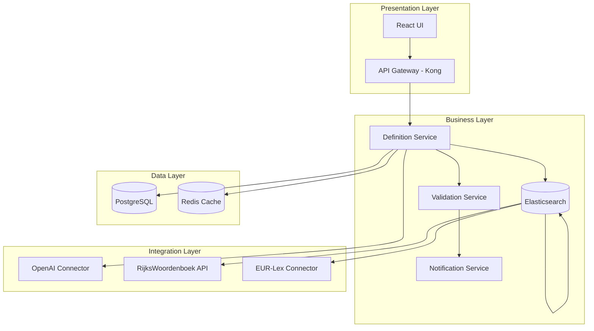
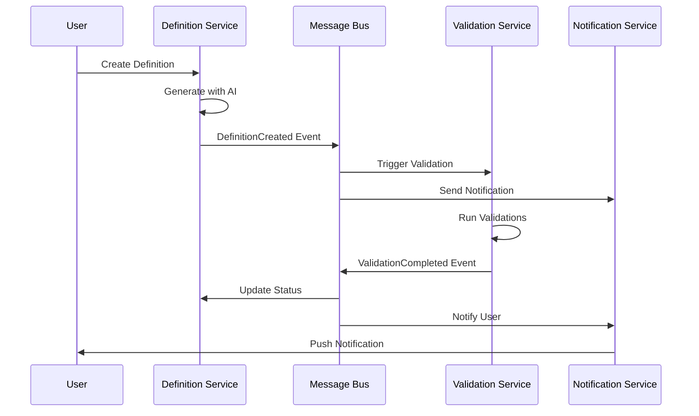
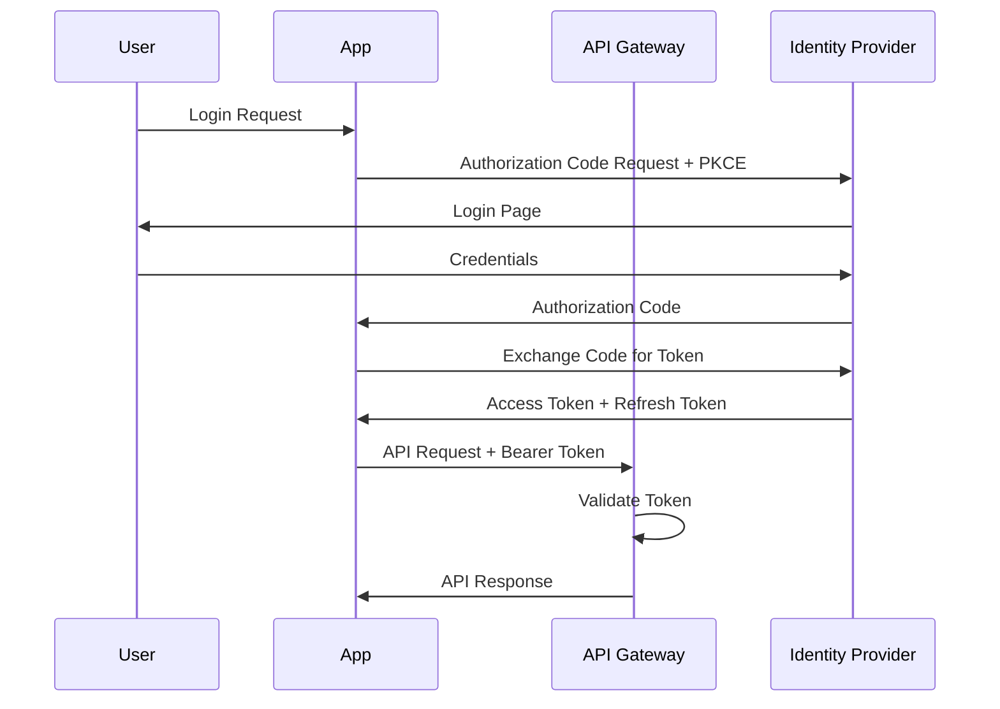

# DefinitieAgent Solution Architecture

## Executive Summary

### Solution Overview
> DefinitieAgent is an AI-powered definition generation system built on a microservices architecture, utilizing GPT-4 for intelligent content generation with multi-layer validation to ensure high-quality, compliant governmental definitions.

### Technical Scope
- **System**: DefinitieAgent v2.0
- **Components**: 12 microservices, 3 databases, 5 external integrations
- **Integrations**: OpenAI, RijksWoordenboek, EUR-Lex, Wetten.nl, Elasticsearch
- **Users**: 500+ concurrent users across government

### Key Design Decisions
1. **Microservices over Monolith**: Scalability and independent deployment
2. **Event-Driven Architecture**: Loose coupling and real-time processing
3. **GVI Pattern**: Generation-Validation-Integration for quality assurance
4. **PostgreSQL + Redis**: Relational data with high-performance caching

### Reference to Enterprise Architecture
- **Business Capability**: → [EA Section 1.1: Business Capability Model]
- **Compliance Requirements**: → [EA Section 5: Security & Risk Architecture]
- **Technology Standards**: → [EA Section 4.1: Technology Standards]

---

## 1. System Architecture

### 1.1 Component Architecture

#### High-Level Components


#### Component Specifications
| Component | Technology | Purpose | Interfaces |
|-----------|------------|---------|------------|
| API Gateway | Kong 3.4 | Request routing, auth, rate limiting | REST, GraphQL |
| Definition Service | FastAPI 0.104 | Core generation logic | REST, gRPC |
| Validation Service | FastAPI 0.104 | Multi-layer validation | gRPC, Events |
| Enrichment Service | FastAPI 0.104 | External data integration | REST, Events |
| Notification Service | FastAPI 0.104 | Alert & notification handling | WebSocket, Events |
| UI Application | React 18.2 | User interface | REST, WebSocket |

### 1.2 Logical Architecture

#### Domain Model
```yaml
Aggregates:
  - Definition:
      entities: [Definition, Version, Metadata]
      value_objects: [DefinitionText, Context, Status]
      repository: DefinitionRepository

  - Validation:
      entities: [ValidationRun, ValidationRule]
      value_objects: [Score, Feedback, Criterion]
      repository: ValidationRepository

  - Source:
      entities: [Source, Reference]
      value_objects: [SourceType, Citation]
      repository: SourceRepository
```

#### Service Boundaries
- **Definition Service**: Owns definition lifecycle, generation, versioning
- **Validation Service**: Owns quality rules, scoring, feedback generation
- **Enrichment Service**: Owns external data fetching, source integration
- **Notification Service**: Owns user alerts, system notifications

### 1.3 Development Architecture

#### Code Organization
```
src/
├── api/                 # API endpoints & GraphQL schemas
│   ├── rest/           # REST controllers
│   └── graphql/        # GraphQL resolvers
├── application/         # Application services
│   ├── commands/       # Command handlers
│   └── queries/        # Query handlers
├── domain/             # Domain logic
│   ├── models/         # Domain models
│   ├── services/       # Domain services
│   └── events/         # Domain events
├── infrastructure/     # External integrations
│   ├── openai/         # OpenAI client
│   ├── database/       # Repository implementations
│   └── messaging/      # Event bus
└── tests/              # Test suites
    ├── unit/          # Unit tests
    ├── integration/   # Integration tests
    └── e2e/           # End-to-end tests
```

#### Design Patterns Used
- **CQRS**: Separate read/write models for performance
- **Repository Pattern**: Abstract data access
- **Event Sourcing**: Audit trail for definitions
- **Circuit Breaker**: Resilient external service calls
- **Saga Pattern**: Distributed transaction management

---

## 2. Technical Design

### 2.1 Technology Stack

#### Core Technologies
| Layer | Technology | Version | Justification |
|-------|------------|---------|---------------|
| Frontend | React + TypeScript | 18.2 + 5.2 | Type safety, component ecosystem |
| Backend | Python + FastAPI | 3.11 + 0.104 | Async performance, OpenAPI support |
| Database | PostgreSQL | 15.4 | JSONB support, full-text search |
| Cache | Redis | 7.2 | Sub-ms latency, pub/sub |
| Search | Elasticsearch | 8.10 | Dutch language analysis |
| Message Queue | RabbitMQ | 3.12 | Reliability, routing flexibility |

#### Development Stack
- **Language**: Python 3.11.5 (backend), TypeScript 5.2 (frontend)
- **Framework**: FastAPI (backend), React (frontend)
- **Build Tools**: Poetry (Python), Vite (Frontend)
- **Testing**: Pytest, Jest, Playwright

### 2.2 API Design

#### REST API Specification
```yaml
/api/v1/definitions:
  GET:
    description: List definitions with filtering
    parameters:
      - context: string
      - status: enum[draft, validated, published]
      - limit: integer
    responses:
      200:
        schema: DefinitionList
  POST:
    description: Generate new definition
    body:
      term: string
      context: string
      examples: string[]
      style: enum[formal, informal]
    responses:
      201:
        schema: Definition

/api/v1/definitions/{id}/validate:
  POST:
    description: Trigger validation
    parameters:
      - level: enum[basic, expert, full]
    responses:
      200:
        schema: ValidationResult
```

#### GraphQL Schema
```graphql
type Definition {
  id: ID!
  term: String!
  text: String!
  context: Context!
  validations: [Validation!]!
  sources: [Source!]!
  versions: [Version!]!
}

type Query {
  definition(id: ID!): Definition
  definitions(filter: DefinitionFilter): [Definition!]!
}

type Mutation {
  generateDefinition(input: GenerateInput!): Definition!
  validateDefinition(id: ID!, level: ValidationLevel!): ValidationResult!
}
```

### 2.3 Data Architecture

#### Core Data Model
```sql
-- Definitions table
CREATE TABLE definitions (
    id UUID PRIMARY KEY DEFAULT gen_random_uuid(),
    term VARCHAR(255) NOT NULL,
    text TEXT NOT NULL,
    context_id UUID REFERENCES contexts(id),
    status VARCHAR(50) NOT NULL,
    metadata JSONB NOT NULL DEFAULT '{}',
    created_at TIMESTAMP WITH TIME ZONE DEFAULT NOW(),
    updated_at TIMESTAMP WITH TIME ZONE DEFAULT NOW(),
    created_by UUID REFERENCES users(id),

    -- Indexes for performance
    INDEX idx_definitions_term (term),
    INDEX idx_definitions_status (status),
    INDEX idx_definitions_context (context_id),
    INDEX idx_definitions_metadata (metadata) USING GIN
);

-- Validations table
CREATE TABLE validations (
    id UUID PRIMARY KEY DEFAULT gen_random_uuid(),
    definition_id UUID REFERENCES definitions(id),
    validation_type VARCHAR(50) NOT NULL,
    score DECIMAL(3,2) NOT NULL,
    feedback JSONB NOT NULL,
    validated_at TIMESTAMP WITH TIME ZONE DEFAULT NOW(),
    validated_by UUID REFERENCES users(id),

    INDEX idx_validations_definition (definition_id),
    INDEX idx_validations_type (validation_type)
);

-- Event sourcing table
CREATE TABLE definition_events (
    id UUID PRIMARY KEY DEFAULT gen_random_uuid(),
    definition_id UUID NOT NULL,
    event_type VARCHAR(50) NOT NULL,
    event_data JSONB NOT NULL,
    occurred_at TIMESTAMP WITH TIME ZONE DEFAULT NOW(),
    user_id UUID REFERENCES users(id),

    INDEX idx_events_definition (definition_id),
    INDEX idx_events_type (event_type),
    INDEX idx_events_time (occurred_at DESC)
);
```

#### Caching Strategy
```yaml
Cache Layers:
  - Browser Cache:
      content: Static assets
      ttl: 1 year (with versioning)

  - CDN (CloudFlare):
      content: API responses for published definitions
      ttl: 24 hours

  - Redis Application Cache:
      content:
        - Session data: 30 minutes
        - Definition drafts: 2 hours
        - Validation results: 1 hour
        - User preferences: 24 hours

  - Database Query Cache:
      content: Frequently accessed definitions
      ttl: 5 minutes
```

---

## 3. Integration Architecture

### 3.1 Internal Integrations

#### Service Communication
```yaml
Synchronous (REST/gRPC):
  - API Gateway → Services: REST for external, gRPC for internal
  - Service → Service: gRPC with Protobuf
  - Circuit Breaker: Hystrix pattern, 50% error threshold
  - Timeout: 5s default, 30s for AI calls

Asynchronous (Events):
  - Broker: RabbitMQ with topic exchange
  - Pattern: Event-driven with at-least-once delivery
  - Dead Letter Queue: After 3 retries
  - Event Schema: CloudEvents 1.0 specification
```

#### Event Catalog
| Event | Producer | Consumers | Purpose |
|-------|----------|-----------|---------|
| DefinitionCreated | Definition Service | Validation, Notification | Trigger validation flow |
| ValidationCompleted | Validation Service | Definition, Notification | Update status, notify |
| EnrichmentCompleted | Enrichment Service | Definition | Add source data |
| DefinitionPublished | Definition Service | Search, Analytics | Update search index |

### 3.2 External Integrations

#### Third-Party Systems
| System | Type | Protocol | Authentication | SLA |
|--------|------|----------|----------------|-----|
| OpenAI GPT-4 | AI Service | REST | API Key | 99.9% |
| RijksWoordenboek | Dictionary | REST | OAuth 2.0 | 99.5% |
| EUR-Lex | Legal DB | REST | API Key | 99.0% |
| Wetten.nl | Legal DB | OData | Open | 99.0% |
| Microsoft Graph | User Info | REST | OAuth 2.0 | 99.9% |

#### Integration Patterns
```python
# Circuit Breaker Implementation
class OpenAIClient:
    def __init__(self):
        self.circuit_breaker = CircuitBreaker(
            failure_threshold=5,
            recovery_timeout=60,
            expected_exception=OpenAIError
        )

    @circuit_breaker
    async def generate_definition(self, prompt: str) -> str:
        # Actual API call with retry logic
        return await self._call_api(prompt)
```

### 3.3 Event Architecture

#### Event Flow Example


---

## 4. Security Implementation

### 4.1 Authentication & Authorization

#### Authentication Flow (OAuth 2.0 + PKCE)


#### Authorization Model (RBAC + ABAC)
```yaml
Roles:
  - admin:
      permissions: [all]
  - validator:
      permissions: [read, validate, comment]
  - author:
      permissions: [read, create, update]
  - viewer:
      permissions: [read]

Attributes:
  - department: Restricts access to department data
  - clearance_level: For sensitive definitions
  - time_based: Temporary elevated permissions
```

### 4.2 Security Controls

#### Application Security
```python
# Input Validation Example
from pydantic import BaseModel, validator
from html import escape

class DefinitionInput(BaseModel):
    term: str
    context: str

    @validator('term', 'context')
    def sanitize_input(cls, v):
        # Remove potential XSS
        v = escape(v)
        # Limit length
        if len(v) > 1000:
            raise ValueError('Input too long')
        return v

# SQL Injection Prevention
async def get_definition(definition_id: UUID):
    # Using parameterized queries
    query = "SELECT * FROM definitions WHERE id = $1"
    return await db.fetch_one(query, definition_id)
```

#### API Security
- **Rate Limiting**: 100 req/min per user, 1000 req/min per API key
- **API Versioning**: URL path versioning (/api/v1/)
- **CORS Policy**: Whitelist government domains only
- **Request Signing**: HMAC-SHA256 for service-to-service

### 4.3 Data Security

#### Encryption
| Data Type | At Rest | In Transit | Key Management |
|-----------|---------|------------|----------------|
| User Data | AES-256-GCM | TLS 1.3 | Azure Key Vault |
| Definitions | AES-256-GCM | TLS 1.3 | Managed Keys |
| Audit Logs | AES-256-GCM | TLS 1.3 | HSM-backed |
| Backups | AES-256-GCM | TLS 1.3 | Offline Keys |

#### Data Privacy
- **PII Handling**: No PII in definitions
- **Audit Trail**: Immutable event log
- **Data Retention**: 7 years for compliance
- **Right to Erasure**: User content anonymization

---

## 5. Performance Engineering

### 5.1 Performance Requirements

#### Response Time Targets
| Operation | Target | P95 | P99 |
|-----------|--------|-----|-----|
| Definition List | 200ms | 300ms | 500ms |
| Generate Definition | 3s | 5s | 8s |
| Validate Definition | 500ms | 800ms | 1.2s |
| Search | 100ms | 150ms | 300ms |

#### Throughput Targets
- **Concurrent Users**: 500 active users
- **Requests/Second**: 1000 RPS peak
- **Daily Definitions**: 10,000 generated
- **Data Volume**: 1GB/day growth

### 5.2 Performance Optimizations

#### Database Optimizations
```sql
-- Composite indexes for common queries
CREATE INDEX idx_definitions_search
ON definitions(status, context_id, created_at DESC);

-- Partial index for active definitions
CREATE INDEX idx_active_definitions
ON definitions(term)
WHERE status = 'published';

-- Full-text search index
CREATE INDEX idx_definitions_fts
ON definitions USING GIN(to_tsvector('dutch', term || ' ' || text));

-- Table partitioning by date
CREATE TABLE definitions_2024 PARTITION OF definitions
FOR VALUES FROM ('2024-01-01') TO ('2025-01-01');
```

#### Caching Implementation
```python
# Multi-level caching with Redis
class DefinitionCache:
    def __init__(self):
        self.redis = Redis(decode_responses=True)
        self.local_cache = TTLCache(maxsize=1000, ttl=300)

    async def get_definition(self, definition_id: str):
        # L1: Local memory cache
        if definition_id in self.local_cache:
            return self.local_cache[definition_id]

        # L2: Redis cache
        cached = await self.redis.get(f"def:{definition_id}")
        if cached:
            definition = json.loads(cached)
            self.local_cache[definition_id] = definition
            return definition

        # L3: Database
        definition = await self.fetch_from_db(definition_id)

        # Cache for future requests
        await self.redis.setex(
            f"def:{definition_id}",
            3600,  # 1 hour TTL
            json.dumps(definition)
        )
        self.local_cache[definition_id] = definition
        return definition
```

### 5.3 Scalability Design

#### Horizontal Scaling Strategy
```yaml
Service Scaling:
  Definition Service:
    min_replicas: 3
    max_replicas: 20
    cpu_threshold: 70%
    memory_threshold: 80%
    scale_up_rate: 2x
    scale_down_rate: 1 pod/5min

  Validation Service:
    min_replicas: 2
    max_replicas: 10
    queue_length_threshold: 100

Database Scaling:
  PostgreSQL:
    read_replicas: 3
    connection_pooling: PgBouncer
    max_connections: 1000

  Redis:
    cluster_mode: enabled
    shards: 3
    replicas_per_shard: 2
```

---

## 6. Deployment & Operations

### 6.1 Deployment Architecture

#### Kubernetes Configuration
```yaml
apiVersion: apps/v1
kind: Deployment
metadata:
  name: definition-service
  namespace: definitieagent
spec:
  replicas: 3
  selector:
    matchLabels:
      app: definition-service
  template:
    metadata:
      labels:
        app: definition-service
    spec:
      containers:
      - name: definition-service
        image: definitieagent.azurecr.io/definition-service:1.2.3
        ports:
        - containerPort: 8000
        env:
        - name: DATABASE_URL
          valueFrom:
            secretKeyRef:
              name: db-secret
              key: connection-string
        resources:
          requests:
            memory: "512Mi"
            cpu: "500m"
          limits:
            memory: "1Gi"
            cpu: "1000m"
        livenessProbe:
          httpGet:
            path: /health
            port: 8000
          initialDelaySeconds: 30
          periodSeconds: 10
        readinessProbe:
          httpGet:
            path: /ready
            port: 8000
          initialDelaySeconds: 5
          periodSeconds: 5
```

#### Helm Chart Structure
```
definitieagent-chart/
├── Chart.yaml
├── values.yaml
├── values-prod.yaml
├── values-staging.yaml
├── templates/
│   ├── deployment.yaml
│   ├── service.yaml
│   ├── ingress.yaml
│   ├── configmap.yaml
│   └── secrets.yaml
```

### 6.2 CI/CD Pipeline

#### GitHub Actions Workflow
```yaml
name: Deploy to Production

on:
  push:
    tags:
      - 'v*'

jobs:
  test:
    runs-on: ubuntu-latest
    steps:
      - uses: actions/checkout@v3
      - name: Run Tests
        run: |
          poetry install
          poetry run pytest --cov=src --cov-report=xml
      - name: SonarQube Scan
        uses: sonarsource/sonarqube-scan-action@master

  build:
    needs: test
    runs-on: ubuntu-latest
    steps:
      - name: Build and Push Docker Image
        run: |
          docker build -t definitieagent.azurecr.io/definition-service:${{ github.ref_name }} .
          docker push definitieagent.azurecr.io/definition-service:${{ github.ref_name }}

  deploy:
    needs: build
    runs-on: ubuntu-latest
    steps:
      - name: Deploy to AKS
        run: |
          helm upgrade --install definition-service ./charts/definition-service \
            --namespace definitieagent \
            --values ./charts/definition-service/values-prod.yaml \
            --set image.tag=${{ github.ref_name }}
```

### 6.3 Monitoring & Observability

#### Metrics Stack
```yaml
Prometheus Metrics:
  - http_requests_total
  - http_request_duration_seconds
  - definition_generation_duration_seconds
  - validation_score_histogram
  - cache_hit_ratio
  - database_connection_pool_usage

Custom Business Metrics:
  - definitions_created_total
  - definitions_published_total
  - validation_success_rate
  - ai_api_cost_euros
  - user_satisfaction_score
```

#### Logging Configuration
```python
# Structured logging setup
import structlog

structlog.configure(
    processors=[
        structlog.stdlib.filter_by_level,
        structlog.stdlib.add_logger_name,
        structlog.stdlib.add_log_level,
        structlog.stdlib.PositionalArgumentsFormatter(),
        structlog.processors.TimeStamper(fmt="iso"),
        structlog.processors.StackInfoRenderer(),
        structlog.processors.format_exc_info,
        structlog.processors.UnicodeDecoder(),
        structlog.processors.dict_tracebacks,
        structlog.processors.JSONRenderer()
    ],
    context_class=dict,
    logger_factory=structlog.stdlib.LoggerFactory(),
    cache_logger_on_first_use=True,
)

# Usage example
logger = structlog.get_logger()
logger.info("definition_created",
    definition_id=definition.id,
    term=definition.term,
    context=definition.context,
    generation_time_ms=elapsed_time
)
```

#### Distributed Tracing
```python
# OpenTelemetry setup
from opentelemetry import trace
from opentelemetry.exporter.jaeger import JaegerExporter
from opentelemetry.sdk.trace import TracerProvider
from opentelemetry.sdk.trace.export import BatchSpanProcessor

# Configure tracer
trace.set_tracer_provider(TracerProvider())
tracer = trace.get_tracer(__name__)

# Configure Jaeger exporter
jaeger_exporter = JaegerExporter(
    agent_host_name="jaeger-agent",
    agent_port=6831,
)

# Add span processor
span_processor = BatchSpanProcessor(jaeger_exporter)
trace.get_tracer_provider().add_span_processor(span_processor)

# Usage in code
@tracer.start_as_current_span("generate_definition")
async def generate_definition(request: DefinitionRequest):
    span = trace.get_current_span()
    span.set_attribute("definition.term", request.term)
    span.set_attribute("definition.context", request.context)

    # Business logic here
    return definition
```

---

## 7. Migration Strategy

### 7.1 Migration Approach

#### Three-Phase Migration Plan
```
Phase 1: Foundation & Quick Wins (Week 1-4)
├── Setup AKS cluster & base infrastructure
├── Implement API Gateway
├── Create Definition Service (GVI pattern)
├── Migrate core generation logic
└── Deploy to staging environment

Phase 2: Service Extraction (Week 5-8)
├── Extract Validation Service
├── Extract Enrichment Service
├── Implement event bus (RabbitMQ)
├── Setup monitoring stack
└── Parallel run with legacy

Phase 3: Complete Migration (Week 9-12)
├── Extract remaining services
├── Implement caching layer
├── Complete data migration
├── Switch traffic to new system
└── Decommission legacy system
```

### 7.2 Data Migration

#### Zero-Downtime Migration Strategy
```python
# Blue-Green Database Migration
class DataMigrator:
    def __init__(self):
        self.source_db = PostgresDB(LEGACY_DB_URL)
        self.target_db = PostgresDB(NEW_DB_URL)
        self.redis_cache = Redis()

    async def migrate_with_dual_write(self):
        """Phase 1: Dual write to both databases"""
        # Enable triggers for dual write
        await self.enable_dual_write_triggers()

        # Migrate historical data in batches
        async for batch in self.get_batches():
            await self.migrate_batch(batch)
            await self.verify_batch(batch)

    async def migrate_batch(self, batch):
        """Migrate a batch of definitions"""
        transformed_data = self.transform_data(batch)
        await self.target_db.bulk_insert(transformed_data)

        # Invalidate cache for migrated items
        for item in batch:
            await self.redis_cache.delete(f"def:{item['id']}")
```

### 7.3 Rollback Strategy

#### Automated Rollback Triggers
```yaml
Rollback Conditions:
  - Error rate > 5% for 5 minutes
  - Response time P95 > 2x baseline
  - CPU usage > 90% for 10 minutes
  - Memory usage > 95%
  - Health check failures > 3

Rollback Procedure:
  1. Route traffic back to legacy (1 min)
  2. Stop dual-write mode
  3. Restore database from checkpoint
  4. Clear caches
  5. Alert on-call team
```

---

## 8. Testing Strategy

### 8.1 Test Coverage Requirements

| Test Type | Target Coverage | Current | Tools |
|-----------|----------------|---------|-------|
| Unit Tests | 80% | 75% | Pytest, Jest |
| Integration Tests | 70% | 65% | Pytest + TestContainers |
| E2E Tests | Critical paths | 100% | Playwright |
| Performance Tests | All APIs | 80% | Locust |
| Security Tests | OWASP Top 10 | 100% | OWASP ZAP |

### 8.2 Test Implementation

#### Unit Test Example
```python
# test_definition_service.py
import pytest
from unittest.mock import Mock, patch

class TestDefinitionService:
    @pytest.fixture
    def service(self):
        return DefinitionService()

    @pytest.mark.asyncio
    async def test_generate_definition_success(self, service):
        # Arrange
        request = DefinitionRequest(
            term="Digital Transformatie",
            context="Overheid IT strategie"
        )

        with patch('openai.ChatCompletion.acreate') as mock_ai:
            mock_ai.return_value = Mock(
                choices=[Mock(message=Mock(content="Test definition"))]
            )

            # Act
            result = await service.generate_definition(request)

            # Assert
            assert result.term == "Digital Transformatie"
            assert result.text == "Test definition"
            assert result.status == "draft"
```

#### Integration Test Example
```python
# test_integration_definition_flow.py
@pytest.mark.integration
class TestDefinitionFlow:
    @pytest.mark.asyncio
    async def test_complete_definition_flow(self, test_client, test_db):
        # Create definition
        response = await test_client.post("/api/v1/definitions", json={
            "term": "Test Term",
            "context": "Test Context"
        })
        assert response.status_code == 201
        definition_id = response.json()["id"]

        # Validate definition
        response = await test_client.post(
            f"/api/v1/definitions/{definition_id}/validate"
        )
        assert response.status_code == 200
        assert response.json()["score"] > 0.7

        # Check event was published
        events = await test_db.fetch(
            "SELECT * FROM definition_events WHERE definition_id = $1",
            definition_id
        )
        assert len(events) == 2  # Created + Validated
```

### 8.3 Performance Testing

#### Locust Test Script
```python
# locustfile.py
from locust import HttpUser, task, between

class DefinitionUser(HttpUser):
    wait_time = between(1, 3)

    def on_start(self):
        # Login and get token
        response = self.client.post("/auth/login", json={
            "username": "testuser",
            "password": "testpass"
        })
        self.token = response.json()["access_token"]
        self.client.headers = {"Authorization": f"Bearer {self.token}"}

    @task(3)
    def list_definitions(self):
        self.client.get("/api/v1/definitions?limit=20")

    @task(1)
    def create_definition(self):
        self.client.post("/api/v1/definitions", json={
            "term": f"Test Term {random.randint(1,1000)}",
            "context": "Performance Test"
        })

    @task(2)
    def search_definitions(self):
        self.client.get("/api/v1/search?q=test")
```

---

## 9. Operational Runbooks

### 9.1 Deployment Runbook

```bash
#!/bin/bash
# deploy-production.sh

# Pre-deployment checks
echo "Running pre-deployment checks..."
kubectl get nodes -o wide
kubectl top nodes

# Backup current state
echo "Creating backup..."
kubectl create backup production-$(date +%Y%m%d-%H%M%S)

# Deploy new version
echo "Deploying version $VERSION..."
helm upgrade definition-service ./charts/definition-service \
  --namespace definitieagent \
  --values values-prod.yaml \
  --set image.tag=$VERSION \
  --wait --timeout 10m

# Verify deployment
echo "Verifying deployment..."
kubectl rollout status deployment/definition-service -n definitieagent

# Run smoke tests
echo "Running smoke tests..."
pytest tests/smoke/ --environment=production

# Monitor for 5 minutes
echo "Monitoring deployment..."
kubectl logs -f deployment/definition-service -n definitieagent &
LOGS_PID=$!
sleep 300
kill $LOGS_PID

echo "Deployment completed successfully!"
```

### 9.2 Incident Response

#### P1 Incident Playbook
```yaml
Incident Detection:
  - Automated alerts from Prometheus/Grafana
  - User reports via service desk
  - Synthetic monitoring failures

Initial Response (< 5 min):
  1. Acknowledge incident in PagerDuty
  2. Join incident Slack channel
  3. Check dashboard for obvious issues
  4. Communicate status to stakeholders

Investigation (< 15 min):
  1. Check recent deployments
  2. Review error logs in Kibana
  3. Check distributed traces in Jaeger
  4. Verify external service status
  5. Check database performance

Mitigation Options:
  - Rollback to previous version
  - Scale up affected services
  - Enable circuit breakers
  - Redirect traffic to DR site
  - Enable read-only mode

Resolution:
  1. Implement fix or mitigation
  2. Verify system stability
  3. Update status page
  4. Document root cause
  5. Schedule post-mortem
```

---

## 10. Architecture Decision Records

### ADR-001: Microservices Architecture
- **Status**: Accepted
- **Context**: Need to scale independently and deploy frequently
- **Decision**: Adopt microservices with service mesh
- **Consequences**: Higher complexity but better scalability

### ADR-002: Event-Driven Architecture
- **Status**: Accepted
- **Context**: Services need loose coupling for resilience
- **Decision**: Use event-driven patterns with RabbitMQ
- **Consequences**: Eventual consistency, better fault tolerance

### ADR-003: GVI Pattern Implementation
- **Status**: Accepted
- **Context**: Quality is critical for government definitions
- **Decision**: Implement Generation-Validation-Integration pattern
- **Consequences**: Higher quality output, slightly longer processing

### ADR-004: PostgreSQL over NoSQL
- **Status**: Accepted
- **Context**: Need ACID compliance and complex queries
- **Decision**: Use PostgreSQL with JSONB for flexibility
- **Consequences**: Proven reliability, good JSON support

---

## References

### Internal References
- **Enterprise Architecture**: → [EA Document]
- **API Documentation**: https://api.definitieagent.nl/docs
- **Runbooks Repository**: https://github.com/definitieagent/runbooks

### External References
- **FastAPI Documentation**: https://fastapi.tiangolo.com
- **Kubernetes Best Practices**: https://kubernetes.io/docs/
- **OWASP Guidelines**: https://owasp.org/www-project-top-ten/

---

## Document Control
- **Version**: 2.0
- **Last Updated**: 2024-08-19
- **Owner**: Solutions Architecture Team
- **Review Cycle**: Monthly
- **Repository**: https://github.com/definitieagent/architecture
