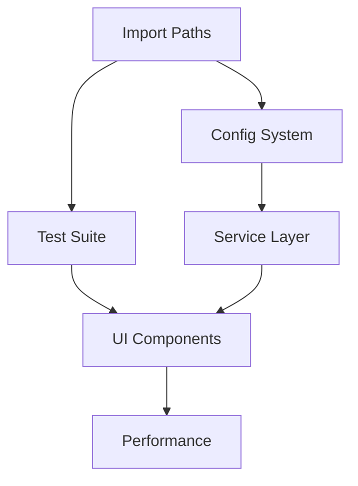

# DefinitieAgent Architecture

## Overview

DefinitieAgent is an AI-powered Nederlandse definitie generator voor juridische en overheidscontexten. Het systeem gebruikt GPT-4 met 46 kwaliteitsregels. De architectuur bevindt zich midden in een complexe transitie van legacy naar moderne structuur.

**Version:** 2.3.0  
**Last Updated:** 2025-01-18  
**Status:** ⚠️ Hybride architectuur met significante technische schuld

## System Architecture

### High-Level Components

```
┌─────────────────────────────────────────────────────────┐
│          Streamlit UI Layer (⚠️ Layering Issues)         │
│        (10 tabs - 30% functional, direct DB access)      │
├─────────────────────────────────────────────────────────┤
│         UnifiedDefinitionService (🔴 God Object)         │
│      (1000+ lines, mixing responsibilities, complex)     │
├─────────────────────────────────────────────────────────┤
│   AI Layer          │  Validation     │  Data Layer      │
│  - OpenAI GPT-4     │  - 46 Rules     │  - SQLAlchemy    │
│  - Prompt Builder   │  - JSON/Python  │  - SQLite DB     │
│  - Rate Limiter     │  - Toetsing     │  - No Abstraction │
└─────────────────────────────────────────────────────────┘
```

### Core Services

#### UnifiedDefinitionService (🔴 Problematisch)
- **Pattern**: Singleton met get_instance()
- **Status**: God Object anti-pattern (1000+ regels)
- **Problemen**:
  - Te veel verantwoordelijkheden (generatie, validatie, orchestratie, caching)
  - Mix van sync/async zonder duidelijke strategie
  - Complexe conditional imports
  - Legacy compatibility verhindert clean design
- **Refactoring Nodig**: Split in 3-4 focused services

#### Content Services (🚧 Mixed Status)
- **Definitie Generatie**: ✅ Werkend
- **AI Toetsing**: ✅ 46 validators
- **Content Enrichment**: ❌ Ontbreekt (synoniemen, antoniemen)
- **Web Lookup**: 🔴 KRITIEK - 5 versies waarvan 3 broken
  - `definitie_lookup_broken.py`
  - `definitie_lookup_encoding_issue.py`
  - `bron_lookup_encoding_issue.py`
  - Encoding problemen niet opgelost
  - Duplicaat code met "_broken" suffixes

### Technology Stack

| Component | Technology | Version | Status |
|-----------|------------|---------|---------|
| Runtime | Python | 3.8+ | ✅ |
| UI Framework | Streamlit | 1.29.0 | ✅ |
| AI/ML | OpenAI API | 1.12.0 | ✅ |
| Database | SQLite | Built-in | ✅ |
| ORM | SQLAlchemy | 2.0.25 | ✅ |
| HTTP Client | httpx | 0.26.0 | ✅ |
| Validation | Pydantic | 2.5.3 | ✅ |

## Data Architecture

### Database Schema

```sql
-- Core Tables
definitions
├── id (INTEGER PRIMARY KEY)
├── term (TEXT NOT NULL)
├── definition (TEXT NOT NULL)
├── context (TEXT)
├── metadata (JSON)
├── created_at (TIMESTAMP)
└── updated_at (TIMESTAMP)

validation_results
├── id (INTEGER PRIMARY KEY)
├── definition_id (FK)
├── rule_code (TEXT)
├── passed (BOOLEAN)
├── message (TEXT)
└── created_at (TIMESTAMP)

document_uploads
├── id (INTEGER PRIMARY KEY)
├── filename (TEXT)
├── content (TEXT)
├── metadata (JSON)
└── uploaded_at (TIMESTAMP)
```

### Data Flow

1. **User Input** → Streamlit UI
2. **Processing** → UnifiedDefinitionService
3. **AI Generation** → OpenAI GPT-4
4. **Validation** → 46 Toetsregels
5. **Storage** → SQLite via SQLAlchemy
6. **Response** → Streamlit Session State

## API Design

### Internal APIs

**Definition Generation**
```python
async def generate_definition(
    term: str,
    context: Optional[str] = None,
    mode: GenerationMode = GenerationMode.AUTO
) -> Definition
```

**Validation**
```python
def validate_definition(
    definition: Definition,
    rules: Optional[List[str]] = None
) -> ValidationResult
```

### External Integrations

- **OpenAI API**: GPT-4 for generation
- **Web Search**: Content enrichment (encoding issues)

## Security Architecture

### Current Implementation
- Input validation via Pydantic
- Rate limiting (smart_rate_limiter)
- Session management via Streamlit
- Environment-based secrets

### Security Gaps
- No authentication system
- Limited authorization
- Basic input sanitization
- No audit logging

## Performance Characteristics

### Current State
- **Response Time**: 8-12 seconds
- **Prompt Size**: ~35k characters
- **Concurrent Users**: Limited by SQLite
- **Cache Hit Rate**: Unknown

### Target State
- **Response Time**: <5 seconds
- **Prompt Size**: <10k characters
- **Concurrent Users**: 10+
- **Cache Hit Rate**: >80%

## Deployment Architecture

### Current Setup
- **Environment**: Local development
- **Deployment**: Manual via streamlit run
- **Database**: SQLite file-based
- **Monitoring**: None

### Infrastructure Requirements
- Python 3.8+ environment
- 2GB RAM minimum
- OpenAI API access
- Write access for SQLite

## Technical Debt

### Critical Issues
1. **UnifiedDefinitionService**: God Object anti-pattern (1000+ lines)
2. **Web Lookup Module**: 5 versies, 3 broken, encoding issues
3. **Layering Violations**: UI componenten met directe DB toegang
4. **Import Path Chaos**: 3 different import styles
5. **Config Fragmentation**: 4 separate config systems
6. **Test Suite**: 87% tests broken
7. **No Abstractions**: Tight coupling overal

### Architecturale Problemen
1. **Consolidatie Chaos**: UnifiedDefinitionService probeert te veel
2. **No Clean Boundaries**: Business logic vermengd met UI
3. **Inconsistente Patterns**: Mix sync/async, singleton vs factory
4. **Technische Schuld Files**: Backup files in productie

### Migration Path
1. **Sprint 1**: Fix web lookup, implement repository pattern
2. **Sprint 2**: Split UnifiedDefinitionService, remove UI-DB coupling
3. **Sprint 3**: Standardize imports, unify config
4. **Sprint 4**: Repair tests → 60% coverage
5. **Sprint 5**: Add abstractions, monitoring

## Development Guidelines

### Code Organization
```
src/
├── services/         # Business logic
├── ai_toetsing/      # Validation rules
├── tabs/             # UI components
├── models/           # Data models
├── repositories/     # Data access
└── utils/            # Helpers
```

### Key Patterns
- Singleton services via get_instance()
- Repository pattern for data access
- Session state for UI persistence
- Async/await for I/O operations

### Conventions
- Type hints required
- Dutch comments for business logic
- English variable names
- Black formatter compliance

## Legacy Integration Points

### Critical Legacy Components
1. **centrale_module_definitie_kwaliteit_legacy.py** (1,088 lines)
   - Contains all working UI implementations
   - Session state patterns to preserve
   - Export functionality templates

2. **core_legacy.py** (2,025 lines)
   - All 45+ validation rules implementation
   - Score calculation logic
   - Feedback generation patterns

### Legacy → Modern Mapping

| Legacy Component | Modern Location | Status |
|-----------------|-----------------|---------|
| Tab implementations | `ui/components/*.py` | 30% migrated |
| Validation rules | `ai_toetsing/validators/` | ✅ Migrated |
| Session state | `ui/session_state.py` | ⚠️ Partial |
| Export functions | `export/` | ❌ Not migrated |
| Prompt templates | Config files | ⚠️ Scattered |

## Technical Debt Prioritization

### Priority Matrix

| Debt Item | Impact | Effort | Priority | Target Sprint |
|-----------|---------|---------|----------|---------------|
| Import path standardization | High | Low | P1 | Sprint 1 |
| Widget key generator fix | High | Low | P1 | Sprint 1 |
| Config unification | Medium | Medium | P2 | Sprint 2 |
| Test suite repair | High | High | P2 | Sprint 3-4 |
| Performance optimization | Medium | High | P3 | Sprint 5-6 |

### Dependency Graph



## Brownfield Refactoring Strategy

### Phase 1: Stabilization (Week 1-2)
- Fix import paths → single pattern
- Fix widget key generator
- Unify configuration
- Create characterization tests

### Phase 2: Feature Parity (Week 3-4)
- Restore all UI tabs
- Implement content enrichment
- Fix web lookup encoding
- Complete export functionality

### Phase 3: Optimization (Week 5-6)
- Reduce prompt size (35k → 10k)
- Implement caching layer
- Add performance monitoring
- Parallel processing where possible

## Future Architecture

### Planned Enhancements
1. **Content Enrichment Service**
2. **Unified Configuration System**
3. **Performance Monitoring**
4. **Automated Testing Pipeline**
5. **Cloud Deployment Ready**

### Architecture Decisions
- **AD1**: Maintain monolithic structure (simplicity)
- **AD2**: Features First approach (user value)
- **AD3**: Legacy as specification (proven functionality)
- **AD4**: Incremental migration (risk reduction)

## Quick Reference

### Start Development
```bash
cd /path/to/definitie-app
cp .env.example .env
pip install -r requirements.txt
streamlit run src/app.py
```

### Key Files
- Entry: `src/app.py`
- Core Service: `src/services/unified_definition_service.py`
- Validation: `src/ai_toetsing/toetsing_service.py`
- UI Tabs: `src/tabs/*.py`

### Common Tasks
- Add validator: Create in `src/ai_toetsing/validators/`
- New UI tab: Add to `src/tabs/`
- Database change: Update models in `src/models/`

---
*For detailed implementation status and roadmap, see [roadmap.md](roadmap.md)*  
*For all work items, see [backlog.md](backlog.md)*