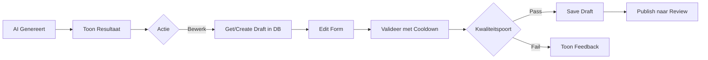

# US-064: Definition Edit Interface - Implementatieplan (Claude Versie)

**Status:** Ready for Implementation  
**Geschatte tijd:** 4-6 uur (uitgebreid met stateless architectuur)  
**Epic:** EPIC-004 - User Interface  
**Aangemaakt:** 2025-09-12  
**Bijgewerkt:** 2025-09-12 (verbeterd met Codex inzichten)  

## 📋 Overzicht

Stateless edit interface voor AI-gegenereerde definities met database-driven draft management, optimistic locking, kwaliteitspoorten en volledige audit trail.

## 🏗️ Architectuur Principes

### ✅ WEL Doen (Refactoring Richtlijnen)
- **Stateless services** - Geen Streamlit dependencies in services/orchestrators
- **Database als single source of truth** - Draft records in DB, niet in session state
- **Optimistic locking** - Voorkom concurrent edit conflicten
- **Explicit validation** - "Valideer" knop met cooldown (min. 2 seconden)
- **Audit trail** - Alle wijzigingen via DB triggers gelogd
- **Type hints** - Overal waar mogelijk
- **Async interfaces** - Voor orchestrator methoden

### ❌ NIET Doen (Verboden Patronen)
- Geen session state voor data opslag
- Geen real-time validatie bij elke keystroke
- Geen Streamlit imports in service layer
- Geen backwards compatibility code
- Geen "domein" veld (deprecated)
- Geen bare except blocks
- Geen asyncio.run in services

## 📐 Draft Invariant

### Belangrijke Regel
**Eén actieve draft per combinatie (begrip + context + categorie + status)**

```sql
-- Enforced via UNIQUE constraint
UNIQUE(begrip, organisatorische_context, juridische_context, categorie, status)
```

## 🔄 Workflow met Kwaliteitspoorten



## 🎯 Kwaliteitspoorten Specificatie

### Score Mapping
| Veld | Bron | Threshold | Gate Action |
|------|------|-----------|-------------|
| overall_score | `validation_result["overall_score"]` | ≥ 0.80 | Block indien lager |
| juridisch_score | `validation_result["detailed_scores"].get("juridisch", 0)` | ≥ 0.75 | Waarschuwing indien lager |
| structuur_score | `validation_result["detailed_scores"].get("structuur", 0)` | ≥ 0.75 | Waarschuwing indien lager |
| error_violations | `len([i for i in validation_result["violations"] if i.get("severity") == "error"])` | = 0 | Block indien > 0 |

### Gate Reasons
```python
gate_reasons = {
    "SCORE_TOO_LOW": "Overall score onder 80%",
    "ERRORS_PRESENT": "Validatie fouten (severity=error) aanwezig",
    "JURIDISCH_LOW": "Juridisch score onder 75%",
    "STRUCTUUR_LOW": "Structuur score onder 75%"
}
```

## 📝 Implementatie Details

### Fase 1: Database Draft Management

#### 1.1 Repository Uitbreidingen

**Bestand:** `src/services/definition_repository.py`  
**Nieuwe methoden:**

```python
def get_or_create_draft(self, begrip: str, context: dict) -> int:
    """
    Haal bestaande draft op of maak nieuwe.
    Garandeert één draft per combinatie.
    """
    # Transactie voor atomaire get-or-create
    # Normaliseer lege juridische context naar ""
    jur_ctx = context.get("juridische_context") or ""
    
    with self._transaction() as conn:
        # Probeer INSERT, bij UNIQUE conflict -> SELECT
        try:
            cursor = conn.execute(
                "INSERT INTO definities (begrip, organisatorische_context, "
                "juridische_context, categorie, status) VALUES (?, ?, ?, ?, ?)",
                (begrip, context.get("organisatorische_context"), 
                 jur_ctx, context.get("categorie", "proces"), "draft")
            )
            return cursor.lastrowid
        except sqlite3.IntegrityError:
            # Draft bestaat al, haal op
            cursor = conn.execute(
                "SELECT id FROM definities WHERE begrip=? AND "
                "organisatorische_context=? AND juridische_context=? "
                "AND categorie=? AND status='draft'",
                (begrip, context.get("organisatorische_context"),
                 jur_ctx, context.get("categorie", "proces"))
            )
            row = cursor.fetchone()
            if row:
                return row[0]

def update_voorbeelden_delta(self, definition_id: int, delta: dict) -> bool:
    """
    Update alleen gewijzigde voorbeelden (geen mass-update).
    """
    current = self.get_voorbeelden(definition_id)
    
    for vb_type, new_content in delta.items():
        if new_content != current.get(vb_type):
            self._update_single_voorbeeld(definition_id, vb_type, new_content)
    
    return True
```

Notities:
- Optimistic locking in de repository implementeren als `UPDATE ... WHERE id=? AND updated_at=?` en `rowcount==1` controleren; bij conflict kan optioneel de serverversie worden teruggegeven voor merge‑UX.
- Voorbeelden‑delta: werk in één transactie en gebruik uitsluitend DB‑typen `('sentence','practical','counter','synonyms','antonyms','explanation')` met sleutel `(definitie_id, voorbeeld_type, voorbeeld_volgorde)`.

### Fase 2: Stateless UI Implementation

#### 2.1 Edit Mode met Draft ID

**Bestand:** `src/ui/components/definition_generator_tab.py`  
**Update edit trigger:**

```python
def _edit_existing_definition(self, definitie: DefinitieRecord):
    """Start edit door draft in database te maken."""
    try:
        repo = st.session_state.service_container.repository()
        
        # Maak draft in database (idempotent)
        draft_id = repo.get_or_create_draft(
            begrip=definitie.begrip,
            context={
                "organisatorische_context": definitie.organisatorische_context,
                "juridische_context": definitie.juridische_context,
                "categorie": definitie.categorie
            }
        )
        
        # Navigeer naar edit met draft_id in URL (met fallback)
        try:
            st.query_params["mode"] = "edit"
            st.query_params["draft_id"] = str(draft_id)
        except AttributeError:
            st.experimental_set_query_params(mode="edit", draft_id=str(draft_id))
        st.rerun()
    except Exception as e:
        st.error(f"Kon draft niet openen: {e!s}")

    # Actie knoppen
    col1, col2, col3 = st.columns(3)
    with col2:
        if st.button("✅ Accepteer & Sla Op", key="save_generated"):
            self._save_ai_definition(definitie)  # Direct opslaan zonder wijzigingen
    with col3:
        if st.button("🔄 Genereer Opnieuw", key="regenerate"):
            self._handle_definition_generation()  # Nieuwe generatie starten
```

#### 2.2 Render met Query Parameters

**Update render functie:**

```python
def render(self):
    """Render de generator tab."""
    # Check voor edit mode via query params (stateless) met fallback
    try:
        params = st.query_params
    except AttributeError:
        params = st.experimental_get_query_params()

    mode = params.get("mode")
    draft_id = params.get("draft_id")

    # Als Streamlit een list teruggeeft bij experimental_get_query_params, pak eerste waarde
    if isinstance(mode, list):
        mode = mode[0] if mode else None
    if isinstance(draft_id, list):
        draft_id = draft_id[0] if draft_id else None

    if mode == "edit" and draft_id:
        self._render_edit_form(int(draft_id))
        return

    # Normale generator interface
    self._render_generator_interface()
```

### Fase 3: Edit Form met Database Draft

#### 3.1 Implementeer Edit Form met Validatie

**Bestand:** `src/ui/components/definition_generator_tab.py`  
**Nieuwe functie met caching en validatie:**

```python
def _load_draft(self, draft_id: int, cache_buster: str = None) -> DefinitieRecord:
    """Laad draft uit database.
    
    Args:
        draft_id: ID van draft
        cache_buster: Optional timestamp voor cache invalidatie
    """
    repo = st.session_state.service_container.repository()
    return repo.get(draft_id)

def _render_edit_form(self, draft_id: int):
    """Render edit form met draft uit database."""
    
    # Laad draft met cache_buster voor invalidatie
    cache_buster = st.session_state.get("draft_cache_buster")
    draft = self._load_draft(draft_id, cache_buster)
    if not draft:
        st.error("Draft niet gevonden")
        if st.button("↩️ Terug"):
            st.query_params.clear()
            st.rerun()
        return
    
    st.markdown(f"### ✏️ Bewerk: {draft.begrip}")
    
    # Toon originele versie indien beschikbaar
    if draft.previous_version_id:
        with st.expander("🤖 Originele AI-versie", expanded=False):
            original = st.session_state.service_container.repository().get(
                draft.previous_version_id
            )
            if original:
                st.info(original.definitie)
    
    # Edit form met form key voor batch submit
    with st.form(f"edit_form_{draft_id}"):
        # Definitie tekst
        edited_text = st.text_area(
            "Definitie",
            value=draft.definitie,
            height=200,
            help="Bewerk de definitie tekst"
        )
    
    # Toon wat er veranderd is
    if edited_text != draft.definitie:
        st.caption("✏️ Je hebt wijzigingen aangebracht")
    
        # Context velden
        col1, col2 = st.columns(2)
        with col1:
            edited_org = st.selectbox(
                "Organisatorische Context",
                ["OM", "DJI", "Justid", "CJIB", "Rechtspraak"],
                index=["OM", "DJI", "Justid", "CJIB", "Rechtspraak"].index(
                    draft.organisatorische_context or "OM"
                )
            )
        
        with col2:
            edited_jur = st.text_input(
                "Juridische Context",
                value=draft.juridische_context or ""
            )
        
        # Wettelijke basis (nieuw veld)
        wettelijke_basis_text = st.text_area(
            "Wettelijke Basis",
            value=draft.wettelijke_basis or "",
            height=100,
            help="Voeg wettelijke referenties toe (één per regel)"
        )
    
        # Categorie
        edited_cat = st.selectbox(
            "Categorie",
            ["proces", "type", "resultaat", "exemplaar"],
            index=["proces", "type", "resultaat", "exemplaar"].index(
                draft.categorie or "proces"
            )
        )
    
        # Submit buttons in form
        col1, col2, col3 = st.columns([1, 1, 3])
        with col1:
            save_btn = st.form_submit_button("💾 Opslaan", type="primary")
        with col2:
            cancel_btn = st.form_submit_button("❌ Annuleren")
        
        # Handle form submission
        if save_btn:
            self._save_draft_with_lock(
                draft_id=draft_id,
                updates={
                    "definitie": edited_text,
                    "organisatorische_context": edited_org,
                    "juridische_context": edited_jur,
                    "wettelijke_basis": wettelijke_basis_text,
                    "categorie": edited_cat
                },
                last_updated=draft.updated_at
            )
        
        if cancel_btn:
            try:
                st.query_params.clear()
            except AttributeError:
                st.experimental_set_query_params()
            st.rerun()
    
    
    # Validatie knop (buiten form voor onafhankelijke actie)
    if st.button("🔍 Valideer Definitie"):
        self._validate_draft_with_cooldown(draft_id, edited_text, edited_cat, edited_org, edited_jur)
    
    # Toon validatie resultaten indien aanwezig
    if "validation_result" in st.session_state:
        self._render_validation_results(st.session_state.validation_result)
```

### Fase 4: Save met Optimistic Locking

#### 4.1 Save met Concurrent Edit Protection

**Bestand:** `src/ui/components/definition_generator_tab.py`  
**Nieuwe functie:** Voeg toe na `_render_edit_form()`

```python
def _save_draft_with_lock(self, draft_id: int, updates: dict, last_updated: datetime):
    """Save draft met concurrent edit protection."""
    try:
        repo = st.session_state.service_container.repository()
        
        # Optimistic lock check gebeurt in repository
        success = repo.update_with_lock_check(
            definition_id=draft_id,
            updates=updates,
            last_updated=last_updated
        )
        
        if success:
            st.success("✅ Wijzigingen opgeslagen!")
            # Forceer herlaad met cache_buster
            st.session_state.draft_cache_buster = datetime.now().isoformat()
            # Optioneel: navigeer terug
            if st.button("✓ Klaar met bewerken"):
                st.query_params.clear()
                st.rerun()
        else:
            st.error("""
                ⚠️ **Concurrent Edit Gedetecteerd**
                
                De definitie is gewijzigd door een andere gebruiker.
                Herlaad de pagina om de laatste versie te zien.
            """)
            if st.button("🔄 Herlaad"):
                st.session_state.draft_cache_buster = datetime.now().isoformat()
                st.rerun()
                
    except Exception as e:
        logger.error(f"Save failed: {e}")
        st.error(f"Opslaan mislukt: {str(e)}")
```

Notities:
- `update_with_lock_check` in de repository moet het lock afdwingen via `updated_at` en bij conflict `False` retourneren (en idealiter een `server_version` voor merge‑UI in een uitgebreid contract).

#### 4.2 Validatie met Cooldown

```python
def _validate_draft_with_cooldown(self, draft_id: int, text: str, cat: str, org: str, jur: str):
    """Valideer met cooldown van minimaal 2 seconden."""
    import time
    
    # Check cooldown
    last_validation = st.session_state.get("last_validation_time", 0)
    current_time = time.time()
    COOLDOWN_SECONDS = 2.0
    
    if current_time - last_validation < COOLDOWN_SECONDS:
        remaining = COOLDOWN_SECONDS - (current_time - last_validation)
        st.warning(f"⏱️ Wacht nog {remaining:.1f} seconden...")
        return
    
    # Valideer met busy indicator
    with st.spinner("🔍 Validatie wordt uitgevoerd..."):
        orchestrator = st.session_state.service_container.orchestrator()
        from ui.helpers.async_bridge import run_async
        
        result = run_async(
            orchestrator.validate_text(
                begrip=st.session_state.get("current_term", ""),
                text=text,
                ontologische_categorie=cat,
                context={"organisatie": org, "juridisch": jur}
            )
        )
        
        st.session_state.validation_result = result
        st.session_state.last_validation_time = current_time
```

### Fase 5: Privacy & Schema Alignment

#### 5.1 Conditional Prompt Storage (Privacy)

```python
# In settings/config
STORE_PROMPTS_IN_DB = os.getenv("STORE_PROMPTS", "false").lower() == "true"

def save_with_privacy_check(self, definition: Definition, metadata: dict):
    """Sla op met privacy check voor prompts."""
    
    if STORE_PROMPTS_IN_DB and "prompt_template" in metadata:
        # Development mode - sla prompt op
        definition.metadata["prompt_template"] = metadata["prompt_template"]
    else:
        # Production - geen PII/prompts
        definition.metadata["prompt_stored"] = False
    
    return self.save(definition)
```

Opmerking: stem dit af op de bestaande configuratie/feature‑flag infrastructuur; voeg geen nieuwe production‑flags toe zonder consensus. In development kan een env‑flag volstaan, in productie bij voorkeur centrale config gebruiken.

#### 5.2 Schema.sql als Primary Source

```python
def initialize_database():
    """Initialize via schema.sql (primary path)."""
    if not os.path.exists("data/definities.db"):
        # Primary: use schema.sql
        with open("src/database/schema.sql") as f:
            execute_sql(f.read())
    else:
        # Existing: run migrations
        run_migrations()

# Fallback alleen voor noodgevallen
def emergency_fallback():
    logger.warning("FALLBACK: should use schema.sql")
```

## 🧪 Test Strategie

### Unit Tests
```python
# Draft invariant tests
def test_one_draft_per_combination():
    """Garandeer één draft per begrip+context+categorie."""

def test_delta_updates_only_changed():
    """Voorbeelden delta update alleen gewijzigde items."""

def test_validation_cooldown_enforced():
    """Validatie cooldown van 2 seconden wordt afgedwongen."""

def test_privacy_flag_prompt_storage():
    """Prompts alleen opgeslagen met expliciete flag."""
```

### Integration Tests
```python
def test_edit_flow_with_gates():
    """Test complete flow met kwaliteitspoorten."""
    # 1. Generate AI definition
    # 2. Create draft
    # 3. Edit
    # 4. Validate (check cooldown)
    # 5. Hit quality gate
    # 6. Fix issues
    # 7. Pass gate
    # 8. Publish
```

## 📊 Success Criteria

- [x] Draft invariant: één actieve draft per combinatie
- [x] Validatie cooldown: minimaal 2 seconden
- [x] Kwaliteitspoorten: overall ≥ 0.80; detailed_scores (juridisch/structuur) ≥ 0.75; errors=0
- [x] Privacy: prompt opslag alleen met flag
- [x] Delta updates: alleen gewijzigde voorbeelden
- [x] Concurrency: optimistic locking met merge UI
- [x] Schema: primair via schema.sql, fallback gelogd
- [x] Stateless: geen UI deps in services
- [x] Audit: alle wijzigingen via triggers

## ⚡ Implementatie Prioriteiten

### P1 - Backend Foundation
1. Repository whitelist fix (alle velden)
2. `get_or_create_draft` implementatie
3. Delta update voor voorbeelden
4. Unit tests voor invarianten

### P2 - Orchestrator & UI
1. Orchestrator V2 `update_definition`
2. Edit interface component
3. Validatie met cooldown
4. Integration tests

### P3 - Polish & Gates
1. Kwaliteitspoorten implementatie
2. Concurrency merge UI
3. Privacy flag voor prompts
4. Performance optimalisaties

## 🚀 Quick Start

```bash
# 1. Open het bestand
code src/ui/components/definition_generator_tab.py

# 2. Voeg de nieuwe functies toe volgens dit plan

# 3. Test de implementatie
streamlit run src/main.py

# 4. Verifieer database updates
sqlite3 data/definities.db "SELECT * FROM definities ORDER BY updated_at DESC LIMIT 5;"
```

## 🔒 Security & Privacy Notes

- **Geen PII in logs** - Strip persoonlijke data
- **Prompt opslag** - Alleen met expliciete flag (development)
- **Wettelijke basis** - Opgeslagen als JSON array
- **Audit trail** - Via DB triggers, niet in applicatie

## 📝 Undo/Redo Scope

**MVP Scope:** "Undo" = revert naar vorige versie (nieuw draft uit `previous_version_id`)
**Future:** Full undo/redo stack met command pattern

## 🔗 Gerelateerde Documenten

- [US-064.md](./US-064.md) - User Story
- [US-069.md](../US-069/US-069.md) - Wettelijke basis
- [US-070.md](../US-070/US-070.md) - DB normalisatie  
- [US-110.md](../../EPIC-XXX/US-110/US-110.md) - Prompt opslag
- [EPIC-004.md](../EPIC-004.md) - Parent Epic
- [DATABASE_GUIDELINES.md](../../../guidelines/DATABASE_GUIDELINES.md) - DB richtlijnen
- [CLAUDE.md](/CLAUDE.md) - Development richtlijnen

### Fase 6: Workflow & Statuswijzigingen

Gebruik `DefinitionWorkflowService` voor statusovergangen (bijv. DRAFT→REVIEW):
- Koppel de workflowservice aan de repository en laat statusupdates verlopen via een services‑adapter `update_status(...)` die intern `database.definitie_repository.change_status(...)` aanroept; of roep `change_status(...)` direct aan in de workflowservice.
- Uniformeer foutcodes in `WorkflowResult` (bijv. `INVALID_TRANSITION`, `CONFLICT`, `NOT_FOUND`).
- UI‑actie “Publiceer (review)” roept de workflowservice aan; toon duidelijke feedback bij afgewezen transities.
