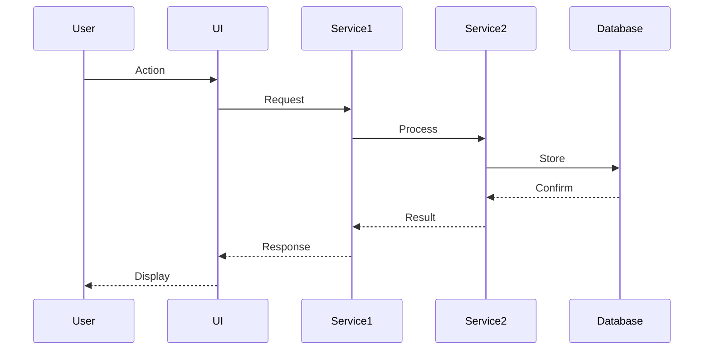
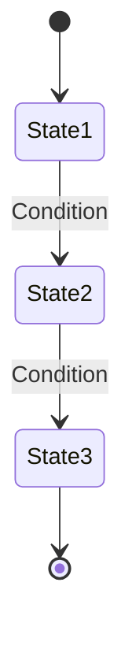

# Business Logic Extraction Plan - DefinitieAgent Rebuild Foundation

**Mission:** Extract ALL business logic before rebuild to ensure zero knowledge loss

**Created:** 2025-10-02
**Owner:** Business Logic Extraction Specialist
**Phase:** EPIC-026 Phase 1 (Design)
**Complexity:** VERY HIGH
**Duration:** 2-3 weeks intensive extraction

---

## Executive Summary

### Critical Statistics
- **Total Codebase:** 83,319 LOC
- **Validation Rules:** 46 files (dual JSON+Python format)
- **Hidden Orchestrators:** ~1,113 LOC (definition_orchestrator_v2.py: 984 LOC, regeneration_service.py: 129 LOC)
- **Hardcoded Business Logic:** 728 occurrences of patterns/rules across 99 files
- **God Objects:**
  - `definition_generator_tab.py`: 2,525 LOC, 60 methods
  - `tabbed_interface.py`: 1,793 LOC, 39 methods
  - `definitie_repository.py`: 1,815 LOC, 41 methods
- **Test Data:** 42 definitions in production database
- **Service Classes:** 256+ classes/functions across 82 service files

### Extraction Challenge
**This is NOT a simple refactor - it's an archaeological dig through 83K LOC to preserve business knowledge.**

The current system has:
1. **Hardcoded patterns in 3+ locations** (ontological categorization)
2. **Dual-format validation rules** (JSON metadata + Python logic)
3. **Hidden orchestration workflows** (880+ LOC of generation/regeneration logic)
4. **UI-embedded business logic** (4,318 LOC across 2 god objects)
5. **Implicit state machines** (approval workflows, status transitions)
6. **Domain expertise** (46 Dutch legal validation rules with ASTRA compliance)

**Risk:** If we don't extract this correctly, we lose years of domain knowledge.

---

## 1. INVENTORY - What Needs Extraction

### 1.1 Validation Rules (46 Rules) - CRITICAL

**Location:** `src/toetsregels/regels/*.py` + `src/toetsregels/regels/*.json`

**Structure:**
```python
# Example: ARAI-01 (No verb as core)
# JSON: Metadata (id, naam, uitleg, prioriteit, patronen, voorbeelden)
# Python: Validator class with validate() + get_generation_hints()
```

**Categories:**
- **ARAI** (6 rules): Derived AI rules from ASTRA recommendations
- **CON** (2 rules): Consistency rules (begrip occurrence, term usage)
- **ESS** (5 rules): Essential structure rules (definition structure, genre checks)
- **INT** (10 rules): Integrity rules (forbidden words, abbreviations, redundancy)
- **SAM** (8 rules): Composition rules (sentence count, length, bullet points)
- **STR** (9 rules): Structure rules (bullets, lists, formatting)
- **VER** (3 rules): Verification rules (length adequacy, completeness)
- **DUP** (1 rule): Duplicate detection

**Business Logic per Rule:**
1. **Validation Logic** (Python `validate()` method)
   - Regex patterns for detection
   - Threshold values (e.g., 50-500 chars, max 3 sentences)
   - Scoring algorithms (pass/fail/warning)
   - Error messages with emojis (✔️/❌/🟡)

2. **Generation Hints** (Python `get_generation_hints()` method)
   - AI prompt fragments
   - Good/bad examples
   - Constraints for GPT-4

3. **Metadata** (JSON configuration)
   - Priority (high/medium/low)
   - Applicability (all/optional)
   - ASTRA references
   - Thema categorization

**Extraction Complexity:** MEDIUM-HIGH
- 46 files × 2 formats = 92 files to analyze
- Dual-format consistency must be preserved
- Business rules embedded in regex patterns
- Domain expertise in Dutch legal language

**Extraction Strategy:**
1. **Document each rule** with:
   - Business purpose (what/why)
   - Implementation logic (how)
   - Threshold values and rationale
   - ASTRA linkage
   - Examples (good/bad)
2. **Extract patterns to config**:
   - Move hardcoded regex to declarative config
   - Extract thresholds to tunable parameters
   - Document scoring algorithms
3. **Create rule catalog** (CSV/JSON):
   - Rule ID | Category | Priority | Business Logic | Thresholds | Examples | ASTRA Link

---

### 1.2 Ontological Category Determination - CRITICAL HARDCODED LOGIC

**Location:** `src/ui/tabbed_interface.py` lines 272-419 (148 LOC)

**The Problem:** Category determination logic duplicated in 3 methods with hardcoded patterns!

**Affected Methods:**
1. `_determine_ontological_category()` (L272-332): Async 6-step protocol with 3 fallbacks
2. `_legacy_pattern_matching()` (L334-345): Hardcoded pattern lists
3. `_generate_category_reasoning()` (L347-418): Duplicate pattern definitions
4. `_get_category_scores()` (L420+): Score calculation with indicators

**Hardcoded Patterns (DUPLICATED 3x!):**
```python
patterns = {
    "proces": ["atie", "eren", "ing", "verificatie", "authenticatie", "validatie",
               "controle", "check", "beoordeling", "analyse", "behandeling",
               "vaststelling", "bepaling", "registratie", "identificatie"],
    "type": ["bewijs", "document", "middel", "systeem", "methode", "tool",
             "instrument", "gegeven", "kenmerk", "eigenschap"],
    "resultaat": ["besluit", "uitslag", "rapport", "conclusie", "bevinding",
                  "resultaat", "uitkomst", "advies", "oordeel"],
    "exemplaar": ["specifiek", "individueel", "uniek", "persoon", "zaak",
                  "instantie", "geval", "situatie"]
}
```

**Business Logic:**
- **6-step protocol**: Full ontological analysis (primary method)
- **Quick analyzer**: Fallback pattern matching (secondary method)
- **Legacy patterns**: Ultra-fallback (tertiary method)
- **Scoring**: Pattern count-based weighting
- **Reasoning generation**: Explanation of category choice

**Extraction Complexity:** VERY HIGH
- Logic spread across 4 methods
- Patterns duplicated 3 times
- Async/sync mixing
- Fallback chain complexity
- Domain knowledge in pattern selection

**Extraction Strategy:**
1. **Extract patterns to config file** (`config/ontological_patterns.yaml`):
   ```yaml
   categories:
     proces:
       suffixes: [atie, eren, ing]
       keywords: [verificatie, authenticatie, validatie, ...]
       weight: 1.0
     type:
       keywords: [bewijs, document, middel, systeem, ...]
       weight: 1.0
   ```
2. **Document 6-step protocol**:
   - Step-by-step workflow diagram
   - Fallback decision tree
   - Scoring algorithm specification
3. **Create test suite**:
   - Test all 42 existing definitions
   - Edge cases for each category
   - Fallback path validation

---

### 1.3 Definition Generation Orchestration - GOD METHOD

**Location:** `src/ui/tabbed_interface.py::_handle_definition_generation()` (L821-1201, ~380 LOC!)

**The Problem:** 380 LOC god method orchestrating the ENTIRE generation workflow!

**Orchestration Steps (10-step workflow):**
1. **Context validation** (min 1 of org/jur/wet)
2. **Ontological category determination** (async call to _determine_ontological_category)
3. **Document context retrieval** (_get_document_context)
4. **Document snippets extraction** (_build_document_snippets: max 2, 280 char window)
5. **Regeneration context handling** (RegenerationService integration)
6. **Definition service call** (async via run_async)
7. **Result storage** (SessionStateManager mutations)
8. **Edit tab preparation** (editing_definition_id, edit_*_context)
9. **Regeneration cleanup** (clear regeneration state)
10. **Success notification** (UI feedback)

**Hidden Business Rules:**
- Context requirement: minimum 1 of (org/jur/wet)
- Document snippets: max 2 per document, 280 char window around begrip
- Regeneration priority: use regeneration context if available
- Edit tab state: auto-prepare for immediate editing
- Debug mode: capture voorbeelden prompts if DEBUG_EXAMPLES=true

**Cross-Service Dependencies:**
- `get_definition_service()` - core generation
- `RegenerationService` - regeneration context
- `get_document_processor()` - document handling
- `SessionStateManager` - state mutations (15+ calls!)
- `run_async()` - async bridge
- `capture_voorbeelden_prompts()` - debug instrumentation

**Extraction Complexity:** CRITICAL
- 380 LOC in single method (god method anti-pattern)
- Orchestrates 5+ services
- Complex async/sync coordination
- Extensive state mutations
- Multiple error paths
- Debug instrumentation interleaved

**Extraction Strategy:**
1. **Document complete workflow**:
   - Sequence diagram (10 steps)
   - State machine diagram (error paths, rollback)
   - Service interaction diagram
2. **Extract business rules**:
   - Context validation rules → config
   - Snippet extraction algorithm → separate service
   - Regeneration priority logic → explicit decision tree
3. **Create integration test**:
   - Test full workflow end-to-end
   - Mock all 5 services
   - Verify state mutations
   - Test error paths

---

### 1.4 Validation Orchestration - HIDDEN COMPLEXITY

**Location:** `src/services/orchestrators/validation_orchestrator_v2.py`

**Purpose:** Coordinates 46 validation rules with approval gate policy

**Key Business Logic:**
- **Rule execution order** (priority-based)
- **Approval gate policy** (EPIC-016): mode/thresholds/required fields
- **Score aggregation** (weighted average? min/max?)
- **Violation severity** (high/medium/low mapping)
- **Pass/fail thresholds** (per-rule and overall)

**Extraction Complexity:** MEDIUM
- Well-structured service
- Needs documentation of orchestration algorithm
- Approval gate policy must be extracted

**Extraction Strategy:**
1. Read full file
2. Document orchestration algorithm
3. Extract approval gate policy rules
4. Map rule execution order logic

---

### 1.5 Regeneration Workflows - STATE MACHINE

**Location:**
- `src/ui/components/definition_generator_tab.py::_trigger_regeneration_with_category()` (L2008-2192, ~500 LOC)
- `src/services/regeneration_service.py` (129 LOC)

**Business Logic:**
- **Category change impact analysis**: Which fields change when category switches?
- **Regeneration triggers**: When to regenerate vs. when to warn
- **Context preservation**: Which context to keep, which to update
- **State transitions**: Draft → Regenerating → Generated → Established
- **Comparison logic**: Old vs. new definition diff

**Extraction Complexity:** HIGH
- Implicit state machine
- Complex UI/business logic mixing
- Async regeneration execution
- Error rollback handling

**Extraction Strategy:**
1. **Document state machine**:
   - States: Draft, Regenerating, Generated, Established, Failed
   - Transitions: triggers and conditions
   - Rollback paths
2. **Extract impact analysis rules**:
   - Category transition matrix (type↔proces, etc.)
   - Field update logic per transition
3. **Create state machine diagram** (PlantUML/Mermaid)

---

### 1.6 Duplicate Detection - BUSINESS RULES

**Location:** `src/database/definitie_repository.py::find_duplicates()` (L192-305, ~113 LOC)

**Three-Stage Matching Algorithm:**
1. **Exact match** (begrip + context):
   - Begrip exact match (case-insensitive)
   - Context match (org/jur/wet)
   - Wettelijke basis normalization (sorted, unique, stripped)

2. **Synonym match** (via voorbeelden join):
   - Join with definitie_voorbeelden table
   - Match on synonyms and alternative terms
   - Context-aware matching

3. **Fuzzy match** (LIKE + similarity threshold):
   - LIKE query with wildcards
   - Jaccard similarity calculation
   - **Threshold: 70%** (hardcoded business rule!)
   - Wettelijke basis comparison

**Hidden Business Rules:**
- Similarity threshold: 70% Jaccard similarity
- Wettelijke basis normalization: JSON sorted, unique, stripped
- Synonym precedence: exact > synonym > fuzzy
- Context weighting: how much do contexts influence match?

**Extraction Complexity:** HIGH
- Complex multi-stage algorithm
- Hardcoded threshold (70%)
- Normalization logic
- SQL query optimization knowledge

**Extraction Strategy:**
1. **Document algorithm**:
   - Flowchart: 3-stage decision tree
   - Jaccard similarity formula
   - Normalization steps
2. **Extract thresholds**:
   - 70% similarity → config parameter
   - Context weighting → tunable
3. **Create test cases**:
   - Test against 42 existing definitions
   - Edge cases (near-duplicates, synonyms)
   - Performance benchmarks

---

### 1.7 Voorbeelden (Examples) Persistence - COMPLEX TRANSACTION

**Location:** `src/database/definitie_repository.py::save_voorbeelden()` (L254-464, ~210 LOC)

**Business Logic:**
- **Type normalization**: voorbeeldzinnen → sentence, praktijkvoorbeelden → practical
- **Soft delete**: deactivate old examples (actief=0), insert new
- **Voorkeursterm single source**: ONLY from definities.voorkeursterm column
- **Upsert logic**: update if exists, insert if new
- **Deduplication**: skip if no new examples (safety guard against wipe)
- **Transaction boundaries**: explicit commit for multi-step operation

**Normalization Mapping (HARDCODED):**
```python
type_mapping = {
    "voorbeeldzinnen": "sentence",
    "praktijkvoorbeelden": "practical",
    "tegenvoorbeelden": "counter",
    "synoniemen": "synonyms",
    "antoniemen": "antonyms"
}
```

**Extraction Complexity:** MEDIUM-HIGH
- Complex transaction logic
- Type normalization mapping
- Voorkeursterm business rule
- Deduplication safety guard

**Extraction Strategy:**
1. **Document transaction flow**:
   - Step-by-step SQL operations
   - Rollback conditions
   - Safety guards
2. **Extract type mapping** → config
3. **Document voorkeursterm policy**:
   - Single source of truth rule
   - Update propagation logic

---

### 1.8 UI Rendering Business Logic - MIXED CONCERNS

**Location:** `src/ui/components/definition_generator_tab.py` (2,525 LOC, 60 methods)

**Business Logic Embedded in UI:**

#### Rule Reasoning Logic (L1771-1835, ~180 LOC)
**Hardcoded pass explanations for specific rules:**
```python
# ARAI-001: Lengte check (50-500 chars)
if 50 <= char_count <= 500:
    return "Definitie valt binnen acceptabele lengterange (50-500 karakters)"

# CON-001: Begrip occurrence check
if begrip.lower() in text.lower():
    return f"Begrip '{begrip}' komt voor in de definitie"

# ESS-002: Structure check
if ":" in text or "is" in text.lower():
    return "Definitie heeft herkenbare structuur"

# INT-001: Abbreviation check
if not re.search(r'\b[A-Z]{2,}\b', text):
    return "Geen afkortingen gedetecteerd"

# SAM-001: Sentence count check
if sentence_count <= 3:
    return f"Definitie is beknopt ({sentence_count} zinnen)"

# STR-001: Bullet/numbering check
if not re.search(r'[\•\-\*]\s|^\d+[\.\)]\s', text):
    return "Geen opsommingstekens of nummering"

# VER-001: Length adequacy
if 100 <= char_count <= 300:
    return "Definitie heeft adequate lengte voor begrip"
```

**The Problem:** Business rules for 7 different validation rules DUPLICATED in UI!

#### Confidence Scoring Display (L223-228)
**Hardcoded thresholds:**
```python
if confidence > 0.8:
    color = "green"  # High confidence
elif confidence > 0.5:
    color = "orange"  # Medium confidence
else:
    color = "red"     # Low confidence
```

#### Validation Stats Calculation (L1551-1574)
**Aggregation logic:**
- Count violations by severity (high/medium/low)
- Calculate total score (average? weighted?)
- Format summary message

**Extraction Complexity:** HIGH
- Business logic spread across 60 methods
- Hardcoded thresholds in 20+ locations
- Rule logic duplicated from validation layer
- Mixed rendering + calculation logic

**Extraction Strategy:**
1. **Extract ALL hardcoded thresholds** → config file
2. **Extract rule reasoning logic** → separate service (should use validation rule metadata!)
3. **Document confidence scoring** → business rules document
4. **Extract validation stats algorithm** → presentation service

---

### 1.9 Workflow & Status Management - IMPLICIT STATE MACHINE

**Location:** Multiple files
- `src/services/workflow_service.py`
- `src/database/definitie_repository.py::change_status()`
- Approval gate policy (EPIC-016)

**Status Enum:**
```python
class DefinitieStatus(Enum):
    DRAFT = "ontwerp"
    IN_REVIEW = "ter_review"
    ESTABLISHED = "vastgesteld"
    ARCHIVED = "gearchiveerd"
    DEPRECATED = "deprecated"
```

**Business Rules:**
- **Draft → In Review**: Requires validation score ≥ threshold (approval gate)
- **In Review → Established**: Requires approver, approval notes
- **Established → Archived**: Version number increment
- **Any → Draft**: Rollback allowed?

**Approval Gate Policy (EPIC-016):**
- Mode: strict/lenient/custom
- Thresholds: per-mode validation score requirements
- Required fields: which fields must be filled for approval

**Extraction Complexity:** MEDIUM
- Status transitions are explicit
- Approval gate policy is configurable (already extracted to DB/config)
- Need to document implicit transition rules

**Extraction Strategy:**
1. **Create state machine diagram**:
   - States: 5 status values
   - Transitions: arrows with conditions
   - Guard conditions: approval gate, validation score
2. **Document approval gate**:
   - Policy modes and thresholds
   - Required field validation
   - Audit trail requirements
3. **Extract transition rules** → config

---

### 1.10 Prompt Building & AI Integration - COMPLEX ORCHESTRATION

**Location:**
- `src/services/prompts/prompt_service_v2.py`
- `src/services/prompts/modular_prompt_builder.py`
- `src/services/prompts/modules/` (20+ module files)

**Known Issues:**
- **7,250 tokens** with duplications (from architecture docs)
- **Modular prompt building** with context-aware templates
- **Rule hints injection** from 46 validation rules

**Business Logic:**
- Which rules to include in prompt (priority-based?)
- How to format context (org/jur/wet)
- Document context integration
- Examples formatting
- Temperature selection (varies by component per ConfigManager)

**Extraction Complexity:** MEDIUM
- Already modular
- Needs documentation of orchestration
- Token optimization knowledge
- Rule selection algorithm

**Extraction Strategy:**
1. Read `prompt_service_v2.py` and `modular_prompt_builder.py`
2. Document module selection logic
3. Extract prompt templates (already in modules)
4. Document token optimization techniques

---

## 2. EXTRACTION PRIORITY MATRIX

### 2.1 MUST Extract (Critical Path - Week 1)

**Priority 1: Validation Rules (Day 1-3)**
- **Why:** 46 rules are the CORE of quality assurance
- **Risk:** Lose years of Dutch legal domain expertise
- **Effort:** 3 days (analyze 46×2=92 files)
- **Deliverable:** Validation Rules Catalog (CSV/JSON) + documentation per rule

**Priority 2: Ontological Category Logic (Day 4)**
- **Why:** Hardcoded in 3 locations, critical for categorization
- **Risk:** Lose categorization knowledge, patterns inconsistent
- **Effort:** 1 day (extract patterns, create config, test)
- **Deliverable:** `config/ontological_patterns.yaml` + algorithm docs

**Priority 3: Definition Generation Orchestration (Day 5)**
- **Why:** 380 LOC god method is the CORE workflow
- **Risk:** Lose orchestration knowledge, workflow breaks
- **Effort:** 1 day (document 10-step workflow)
- **Deliverable:** Workflow sequence diagram + state machine

---

### 2.2 SHOULD Extract (Important - Week 2)

**Priority 4: Duplicate Detection (Day 6-7)**
- **Why:** Complex 3-stage algorithm with hardcoded threshold
- **Risk:** Lose matching logic, false positives/negatives
- **Effort:** 2 days (document algorithm, extract threshold, test)
- **Deliverable:** Algorithm flowchart + threshold config

**Priority 5: Regeneration Workflows (Day 8-9)**
- **Why:** State machine for category changes
- **Risk:** Lose regeneration logic, state transitions break
- **Effort:** 2 days (document state machine, extract rules)
- **Deliverable:** State machine diagram + transition rules

**Priority 6: Voorbeelden Persistence (Day 10)**
- **Why:** Complex transaction with type normalization
- **Risk:** Lose normalization mapping, voorkeursterm policy
- **Effort:** 1 day (document transaction, extract mapping)
- **Deliverable:** Transaction flow diagram + type mapping config

---

### 2.3 CAN Extract (Nice-to-Have - Week 3)

**Priority 7: UI Hardcoded Logic (Day 11-12)**
- **Why:** Hardcoded thresholds and rule reasoning
- **Risk:** Lose threshold values, duplicated logic
- **Effort:** 2 days (extract all hardcoded values)
- **Deliverable:** Thresholds config + hardcoded logic inventory

**Priority 8: Workflow Status Management (Day 13)**
- **Why:** Status transitions and approval gate
- **Risk:** Lose workflow rules (but already documented in EPIC-016)
- **Effort:** 1 day (document state machine)
- **Deliverable:** Workflow state machine diagram

**Priority 9: Prompt Building (Day 14-15)**
- **Why:** Prompt orchestration and module selection
- **Risk:** Low (already modular), but lose orchestration knowledge
- **Effort:** 2 days (document module selection logic)
- **Deliverable:** Prompt orchestration documentation

---

### 2.4 CAN SKIP (Can Rebuild)

**Database Schema** - Already in `src/database/schema.sql` ✅
**Service Interfaces** - Already documented in `src/services/interfaces.py` ✅
**Test Data** - 42 definitions exportable via JSON ✅
**Configuration Files** - Already in `config/` directory ✅
**Unused Code** - 65% unused (119/182 files) → skip! ✅

---

## 3. EXTRACTION TIMELINE (2-3 Weeks)

### Week 1: CRITICAL PATH (Must-Have)
```
Day 1-2: Validation Rules Extraction
  - Analyze 46 rules (JSON + Python)
  - Document business logic per rule
  - Extract patterns, thresholds, examples
  - Create Validation Rules Catalog
  Deliverable: validation_rules_catalog.csv + docs/

Day 3: Validation Rules Testing
  - Test against 42 existing definitions
  - Verify all rules work correctly
  - Document edge cases
  Deliverable: validation_test_results.md

Day 4: Ontological Category Logic
  - Extract hardcoded patterns (3 locations)
  - Create config/ontological_patterns.yaml
  - Document 6-step protocol
  - Test against 42 definitions
  Deliverable: ontological_patterns.yaml + algorithm_docs.md

Day 5: Definition Generation Orchestration
  - Document 380 LOC god method
  - Create sequence diagram (10 steps)
  - Extract business rules
  - Create state machine diagram
  Deliverable: generation_orchestration_workflow.md + diagrams/
```

**Week 1 Checkpoint:**
- ✅ 46 validation rules documented
- ✅ Ontological patterns extracted to config
- ✅ Generation workflow documented
- **GO/NO-GO:** Can we rebuild validation + generation? If NO, spend Week 2 on deeper extraction.

---

### Week 2: IMPORTANT LOGIC (Should-Have)
```
Day 6-7: Duplicate Detection
  - Document 3-stage matching algorithm
  - Extract 70% threshold to config
  - Create flowchart
  - Test against 42 definitions (find all duplicates)
  Deliverable: duplicate_detection_algorithm.md + threshold config

Day 8-9: Regeneration Workflows
  - Document state machine (Draft → Regenerating → Generated)
  - Extract category change impact analysis
  - Create transition rules
  - Test regeneration paths
  Deliverable: regeneration_state_machine.md + transition_rules.yaml

Day 10: Voorbeelden Persistence
  - Document transaction flow
  - Extract type normalization mapping
  - Document voorkeursterm single source policy
  - Test voorbeelden save/retrieve
  Deliverable: voorbeelden_transaction_flow.md + type_mapping.yaml
```

**Week 2 Checkpoint:**
- ✅ Duplicate detection algorithm documented
- ✅ Regeneration state machine extracted
- ✅ Voorbeelden logic documented
- **GO/NO-GO:** Is all critical business logic extracted? If YES, Week 3 is polish. If NO, extend extraction.

---

### Week 3: POLISH & VALIDATION (Can-Have)
```
Day 11-12: UI Hardcoded Logic Extraction
  - Extract all hardcoded thresholds (confidence: 0.8/0.5, lengths: 50-500, etc.)
  - Extract rule reasoning logic (7 rules duplicated in UI)
  - Create thresholds.yaml config
  Deliverable: ui_hardcoded_logic_inventory.md + thresholds.yaml

Day 13: Workflow Status Management
  - Document status state machine (5 states)
  - Extract transition conditions
  - Document approval gate policy (already in EPIC-016)
  Deliverable: workflow_state_machine.md

Day 14-15: Prompt Building Documentation
  - Document prompt module selection
  - Extract prompt orchestration logic
  - Document token optimization techniques
  Deliverable: prompt_orchestration_docs.md

Day 16: FINAL VALIDATION
  - Run all 42 test definitions through extraction
  - Verify NO business logic lost
  - Create completeness checklist
  Deliverable: extraction_completeness_report.md
```

**Week 3 Checkpoint:**
- ✅ ALL critical business logic extracted
- ✅ 42 test definitions validate extraction
- ✅ Documentation complete
- **READY FOR REBUILD:** Proceed to EPIC-026 Phase 2 (Implementation)

---

## 4. DOCUMENTATION TEMPLATES

### 4.1 Validation Rule Documentation Template

**File:** `docs/business-logic/validation-rules/{RULE-ID}.md`

```markdown
# Validation Rule: {RULE-ID} - {Rule Name}

## Metadata
- **ID:** {RULE-ID}
- **Category:** ARAI|CON|ESS|INT|SAM|STR|VER|DUP
- **Priority:** high|medium|low
- **Status:** active|deprecated
- **ASTRA Link:** {URL}

## Business Purpose
**What:** {What does this rule check?}
**Why:** {Why is this important?}
**When:** {When is this rule applied?}

## Implementation Logic

### Validation Algorithm
```python
# Pseudocode or actual implementation
def validate(definitie, begrip, context):
    # Step 1: ...
    # Step 2: ...
    # Return: (pass/fail, message, score)
```

### Thresholds
- **Threshold 1:** {value} - {rationale}
- **Threshold 2:** {value} - {rationale}

### Patterns
- **Pattern 1:** `{regex}` - detects {what}
- **Pattern 2:** `{regex}` - detects {what}

## Examples

### Good Examples
1. `{example 1}` - passes because {reason}
2. `{example 2}` - passes because {reason}

### Bad Examples
1. `{example 1}` - fails because {reason}
2. `{example 2}` - fails because {reason}

## Generation Hints
- Hint 1: {instruction for AI}
- Hint 2: {instruction for AI}

## Test Cases
- Test 1: {input} → {expected output}
- Test 2: {input} → {expected output}

## Dependencies
- Depends on rules: {RULE-ID1, RULE-ID2}
- Used by: {services/components}

## References
- ASTRA: {link}
- Related docs: {links}
```

---

### 4.2 Workflow Documentation Template

**File:** `docs/business-logic/workflows/{workflow-name}.md`

```markdown
# Workflow: {Workflow Name}

## Overview
**Purpose:** {What does this workflow accomplish?}
**Trigger:** {What starts this workflow?}
**Outcome:** {What is the end result?}

## Workflow Diagram


## Steps

### Step 1: {Step Name}
**Action:** {What happens}
**Business Rule:** {Any rules applied}
**Error Handling:** {What if this fails?}

### Step 2: {Step Name}
**Action:** {What happens}
**Business Rule:** {Any rules applied}
**Error Handling:** {What if this fails?}

[Repeat for all steps...]

## State Machine


## Business Rules
1. **Rule 1:** {description} - {rationale}
2. **Rule 2:** {description} - {rationale}

## Service Dependencies
- Service 1: {purpose}
- Service 2: {purpose}

## Data Flow
**Input:** {what data comes in}
**Processing:** {what transformations occur}
**Output:** {what data goes out}

## Error Paths
- **Error 1:** {condition} → {handling}
- **Error 2:** {condition} → {handling}

## Performance Considerations
- **Expected Duration:** {time}
- **Bottlenecks:** {where}
- **Optimization:** {how}

## Test Scenarios
1. **Happy Path:** {description}
2. **Error Path 1:** {description}
3. **Edge Case 1:** {description}
```

---

### 4.3 Business Rules Catalog Template

**File:** `docs/business-logic/business_rules_catalog.csv`

```csv
Rule ID,Category,Type,Description,Location,Threshold,Rationale,Test Case,Status
BR-001,Validation,Length,Definition length check,ARAI-01,50-500 chars,Readability,42 definitions,Active
BR-002,Categorization,Pattern,Type pattern matching,tabbed_interface.py L355,"'document','bewijs'",Ontology,Test suite,Active
BR-003,Duplication,Similarity,Jaccard similarity threshold,definitie_repository.py L192,70%,Balance precision/recall,Duplicate tests,Active
[...]
```

---

### 4.4 Hardcoded Logic Inventory Template

**File:** `docs/business-logic/hardcoded_logic_inventory.md`

```markdown
# Hardcoded Logic Inventory

## Overview
**Total Locations:** {count}
**Priority:** Critical|High|Medium|Low
**Extraction Status:** {percentage complete}

## 1. Thresholds

### Confidence Scoring
- **Location:** `src/ui/components/definition_generator_tab.py` L223-228
- **Values:**
  - High confidence: > 0.8 (green)
  - Medium confidence: 0.5-0.8 (orange)
  - Low confidence: < 0.5 (red)
- **Rationale:** User experience - color-coded feedback
- **Extraction:** → `config/ui_thresholds.yaml`

### Length Checks
- **Location:** Multiple (ARAI-01, VER-01, SAM-01)
- **Values:**
  - Min length: 50 chars
  - Max length: 500 chars
  - Optimal: 100-300 chars
- **Rationale:** Readability and completeness
- **Extraction:** → `config/validation_thresholds.yaml`

[Repeat for all hardcoded logic...]

## 2. Pattern Definitions

### Ontological Patterns
- **Location:** `src/ui/tabbed_interface.py` L354-405 (DUPLICATED 3x!)
- **Patterns:** {list patterns}
- **Extraction:** → `config/ontological_patterns.yaml`

[...]

## 3. Business Rule Duplications

### Rule Reasoning Logic
- **Location:** `src/ui/components/definition_generator_tab.py` L1771-1835
- **Duplicates:** 7 validation rules logic duplicated in UI
- **Impact:** Inconsistency risk, maintenance burden
- **Extraction:** → Use validation rule metadata instead

[...]

## 4. Magic Numbers

### Database Timeouts
- **Location:** `src/database/definitie_repository.py` L72
- **Value:** 30.0 seconds
- **Rationale:** SQLite lock timeout
- **Extraction:** → `config/database.yaml`

[...]
```

---

## 5. VALIDATION APPROACH - How to Verify Completeness

### 5.1 Test Data Strategy

**Baseline:** 42 existing definitions in `data/definities.db`

**Export Baseline:**
```bash
# Export all 42 definitions to JSON
python -c "
from database.definitie_repository import get_definitie_repository
import json

repo = get_definitie_repository()
definitions = repo.search_definities(query='', limit=100)

baseline = {
    'export_date': '2025-10-02',
    'count': len(definitions),
    'definitions': [d.to_dict() for d in definitions]
}

with open('docs/business-logic/baseline_42_definitions.json', 'w') as f:
    json.dump(baseline, f, indent=2, ensure_ascii=False)
"
```

**Use Cases:**
1. **Validation Testing:** Run all 46 rules against 42 definitions → baseline results
2. **Category Testing:** Verify ontological categorization for all 42
3. **Duplicate Testing:** Find all duplicate pairs in 42 definitions
4. **Regeneration Testing:** Regenerate all 42, compare outputs

---

### 5.2 Output Comparison Approach

**Strategy:** Extract logic → Rebuild service → Compare outputs

**Comparison Test:**
```python
# Test framework
def test_extraction_completeness():
    # Load baseline
    baseline = load_baseline_42_definitions()

    # Run OLD system
    old_results = run_old_validation(baseline)

    # Run NEW rebuilt system (using extracted logic)
    new_results = run_new_validation(baseline)

    # Compare results
    for i, (old, new) in enumerate(zip(old_results, new_results)):
        assert old['score'] == new['score'], f"Definition {i}: score mismatch"
        assert old['violations'] == new['violations'], f"Definition {i}: violations mismatch"
        assert old['category'] == new['category'], f"Definition {i}: category mismatch"

    print("✅ All 42 definitions: extraction complete, no logic lost")
```

**Metrics:**
- **Score match rate:** % of definitions with identical validation score
- **Violation match rate:** % of definitions with identical violations
- **Category match rate:** % of definitions with identical ontological category
- **Success:** 100% match rate across all 42 definitions

---

### 5.3 Edge Cases to Document

**Category 1: Validation Edge Cases**
1. **Boundary values**: Definitions at exactly 50 chars, 500 chars
2. **Regex edge cases**: Special characters, Unicode, emojis
3. **Multi-language**: Dutch with foreign terms, abbreviations
4. **Empty fields**: Missing context, empty voorbeelden

**Category 2: Workflow Edge Cases**
1. **Status transitions**: Rollback from Established to Draft (allowed?)
2. **Concurrent edits**: Two users editing same definition
3. **Regeneration loops**: Regenerate → Regenerate → Regenerate
4. **Approval gate**: Score exactly at threshold (pass or fail?)

**Category 3: Data Edge Cases**
1. **Duplicate detection**: 99.9% similar vs 70% threshold
2. **Context matching**: org=[A,B] vs org=[B,A] (order matters?)
3. **Voorkeursterm**: Null vs empty string vs missing
4. **Unicode handling**: Emoji in begrip, special chars

**Documentation:**
- Create `docs/business-logic/edge_cases.md`
- Test each edge case against OLD system
- Document expected behavior
- Verify NEW system matches

---

### 5.4 Extraction Completeness Checklist

**Use this checklist at end of Week 3:**

#### Validation Rules (46 rules)
- [ ] All 46 rules documented with template
- [ ] All patterns extracted to config
- [ ] All thresholds documented with rationale
- [ ] All examples (good/bad) captured
- [ ] All ASTRA links preserved
- [ ] Generation hints extracted
- [ ] Test suite covers all 46 rules
- [ ] Baseline: 42 definitions validation results match

#### Ontological Category Logic
- [ ] 6-step protocol documented
- [ ] Fallback chain documented (6-step → quick → legacy)
- [ ] Patterns extracted to config (no duplication)
- [ ] Scoring algorithm documented
- [ ] Reasoning generation logic extracted
- [ ] Test suite covers all 4 categories
- [ ] Baseline: 42 definitions category match

#### Generation Orchestration
- [ ] 10-step workflow sequence diagram created
- [ ] All business rules extracted (context validation, snippet extraction, etc.)
- [ ] Service interaction diagram created
- [ ] State machine documented
- [ ] Error paths documented
- [ ] Integration test suite created
- [ ] Baseline: 42 definitions regeneration match

#### Duplicate Detection
- [ ] 3-stage algorithm flowchart created
- [ ] Jaccard similarity formula documented
- [ ] 70% threshold extracted to config
- [ ] Normalization logic documented
- [ ] Test suite covers exact/synonym/fuzzy matches
- [ ] Baseline: All duplicate pairs found in 42 definitions

#### Regeneration Workflows
- [ ] State machine diagram created
- [ ] Category change impact analysis documented
- [ ] Transition rules extracted
- [ ] Context preservation logic documented
- [ ] Rollback paths documented
- [ ] Test suite covers all transitions
- [ ] Baseline: Regeneration results match

#### Voorbeelden Persistence
- [ ] Transaction flow diagram created
- [ ] Type normalization mapping extracted
- [ ] Voorkeursterm policy documented
- [ ] Deduplication logic documented
- [ ] Test suite covers save/retrieve/delete
- [ ] Baseline: Voorbeelden data integrity verified

#### UI Hardcoded Logic
- [ ] All thresholds extracted to config
- [ ] All hardcoded patterns removed
- [ ] All magic numbers documented
- [ ] Duplicated logic identified and extracted
- [ ] Config files created for all hardcoded values

#### Workflow Status Management
- [ ] Status state machine diagram created
- [ ] Transition conditions documented
- [ ] Approval gate policy referenced (EPIC-016)
- [ ] Audit trail requirements documented

#### Prompt Building
- [ ] Prompt orchestration documented
- [ ] Module selection logic documented
- [ ] Token optimization techniques documented
- [ ] Template extraction verified

#### Final Validation
- [ ] All 42 baseline definitions exported
- [ ] All business rules cataloged
- [ ] All workflows documented
- [ ] All hardcoded logic inventoried
- [ ] Extraction completeness report created
- [ ] **100% match rate** on all baseline tests

---

## 6. RISK MITIGATION

### 6.1 What Could Go Wrong?

**Risk 1: Incomplete Extraction**
- **Symptom:** Rebuild fails because missing business rule
- **Cause:** Logic hidden in unexpected location (e.g., UI helper function)
- **Mitigation:**
  - Grep for ALL hardcoded patterns: `HARDCODED|TODO|FIXME|pattern|threshold|magic`
  - Cross-reference all 42 test definitions
  - Code review by 2nd developer
- **Contingency:** Week 4 buffer for deep-dive extraction

**Risk 2: Business Logic Ambiguity**
- **Symptom:** Extracted logic doesn't specify exact behavior
- **Cause:** Implicit assumptions, undocumented edge cases
- **Mitigation:**
  - Test EVERY edge case against OLD system
  - Document "ask the business" questions
  - Create decision log for ambiguous cases
- **Contingency:** Stakeholder interviews to clarify business intent

**Risk 3: Performance Knowledge Loss**
- **Symptom:** Rebuilt system is slower than original
- **Cause:** Didn't extract optimization techniques (e.g., caching, indexing)
- **Mitigation:**
  - Profile OLD system performance
  - Document all caching strategies
  - Document database indexes and query optimization
- **Contingency:** Performance tuning sprint after rebuild

**Risk 4: Test Data Insufficiency**
- **Symptom:** 42 definitions don't cover all edge cases
- **Cause:** Limited production data
- **Mitigation:**
  - Generate synthetic test cases for edge cases
  - Use AI to create boundary-value definitions
  - Document which edge cases are NOT covered by test data
- **Contingency:** Create additional 50+ synthetic test definitions

**Risk 5: Domain Knowledge Loss**
- **Symptom:** Dutch legal expertise not captured in docs
- **Cause:** Tacit knowledge in original developer's head
- **Mitigation:**
  - Interview original developer (if available)
  - Capture ALL ASTRA references
  - Document legal reasoning behind each rule
- **Contingency:** Hire Dutch legal consultant for review

**Risk 6: Time Overrun**
- **Symptom:** Extraction takes > 3 weeks
- **Cause:** Underestimated complexity
- **Mitigation:**
  - Daily progress tracking
  - Week 1 checkpoint: if <50% done, escalate
  - Prioritize MUST-extract items only
- **Contingency:** Extend to 4-5 weeks, cut CAN-skip items

---

### 6.2 Quality Gates

**Gate 1: End of Week 1**
- **Criteria:**
  - ✅ 46 validation rules documented
  - ✅ Ontological patterns extracted
  - ✅ Generation workflow documented
- **Decision:** GO to Week 2 or EXTEND Week 1?

**Gate 2: End of Week 2**
- **Criteria:**
  - ✅ Duplicate detection documented
  - ✅ Regeneration state machine created
  - ✅ Voorbeelden logic extracted
- **Decision:** GO to Week 3 or EXTEND Week 2?

**Gate 3: End of Week 3**
- **Criteria:**
  - ✅ All MUST + SHOULD items extracted
  - ✅ 42 baseline definitions pass validation
  - ✅ 100% match rate on outputs
  - ✅ Extraction completeness checklist 100%
- **Decision:** READY for rebuild or EXTEND extraction?

---

### 6.3 Rollback Plan

**If extraction fails or is incomplete:**

**Option A: Gradual Migration**
- Extract what we can
- Keep OLD system running alongside NEW
- Migrate piece-by-piece (validation first, then generation, etc.)
- Dual-run both systems for 3 months

**Option B: Hybrid Approach**
- Rebuild NEW services for clean parts (e.g., validation rules)
- Wrap OLD services in adapters for complex parts (e.g., generation orchestration)
- Strangler fig pattern - gradually replace old with new

**Option C: Extend Extraction Timeline**
- If Week 3 gate fails, extend to 4-5 weeks
- Add dedicated domain expert for consultation
- Create more comprehensive test suite (100+ definitions)

---

## 7. DELIVERABLES - What We Produce

### 7.1 Documentation Deliverables

**Directory Structure:**
```
docs/business-logic/
├── README.md                              # Overview of all extracted logic
├── extraction_completeness_report.md      # Final validation report
├── baseline_42_definitions.json           # Test data export
├── edge_cases.md                          # All edge case documentation
├── business_rules_catalog.csv             # Master catalog of all rules
├── hardcoded_logic_inventory.md           # All hardcoded values
│
├── validation-rules/                      # 46 rule documentation files
│   ├── ARAI-01.md
│   ├── ARAI-02.md
│   ├── ...
│   ├── VER-03.md
│   └── rules_summary.md
│
├── workflows/                             # Workflow documentation
│   ├── definition_generation.md
│   ├── regeneration.md
│   ├── duplicate_detection.md
│   ├── approval_workflow.md
│   └── voorbeelden_persistence.md
│
├── algorithms/                            # Algorithm specifications
│   ├── ontological_categorization.md
│   ├── duplicate_matching.md
│   ├── validation_scoring.md
│   └── similarity_calculation.md
│
└── diagrams/                              # Visual documentation
    ├── generation_sequence.mmd            # Mermaid diagrams
    ├── regeneration_state_machine.mmd
    ├── workflow_status_transitions.mmd
    ├── service_interactions.mmd
    └── duplicate_detection_flow.mmd
```

### 7.2 Configuration Deliverables

**New Config Files:**
```
config/
├── ontological_patterns.yaml              # Extracted category patterns
├── validation_thresholds.yaml             # All validation thresholds
├── ui_thresholds.yaml                     # UI display thresholds
├── duplicate_detection.yaml               # Similarity thresholds
├── voorbeelden_type_mapping.yaml          # Type normalization
├── workflow_transitions.yaml              # Status transition rules
└── hardcoded_values.yaml                  # All extracted magic numbers
```

### 7.3 Test Suite Deliverables

**Test Files:**
```
tests/business-logic/
├── test_validation_rules_baseline.py      # 46 rules × 42 definitions
├── test_ontological_categorization.py     # Category matching baseline
├── test_duplicate_detection.py            # Duplicate pairs detection
├── test_generation_workflow.py            # End-to-end generation
├── test_regeneration_workflow.py          # Regeneration scenarios
├── test_voorbeelden_persistence.py        # Examples CRUD operations
├── test_edge_cases.py                     # All documented edge cases
└── test_extraction_completeness.py        # Final validation suite
```

### 7.4 Data Deliverables

**Baseline Data:**
```
data/baseline/
├── 42_definitions.json                    # Full export of 42 definitions
├── validation_results_baseline.json       # OLD system validation results
├── categorization_baseline.json           # OLD system category assignments
├── duplicate_pairs_baseline.json          # OLD system duplicate detection
└── regeneration_outputs_baseline.json     # OLD system regeneration results
```

### 7.5 Final Report

**File:** `docs/business-logic/EXTRACTION_COMPLETENESS_REPORT.md`

**Contents:**
```markdown
# Business Logic Extraction - Completeness Report

## Executive Summary
- **Extraction Duration:** {X weeks}
- **Business Rules Extracted:** {count}
- **Workflows Documented:** {count}
- **Algorithms Specified:** {count}
- **Test Coverage:** {percentage}
- **Baseline Match Rate:** {percentage}

## Extraction Statistics
### Validation Rules
- Total rules: 46
- Documented: 46 (100%)
- Patterns extracted: {count}
- Thresholds extracted: {count}
- Test coverage: {percentage}

[Repeat for all categories...]

## Validation Results
### Baseline Testing
- Total test definitions: 42
- Validation match rate: {percentage}
- Category match rate: {percentage}
- Duplicate detection match rate: {percentage}

### Edge Case Coverage
- Total edge cases identified: {count}
- Documented: {count}
- Tested: {count}
- Coverage: {percentage}

## Quality Metrics
- Documentation completeness: {percentage}
- Configuration extraction: {percentage}
- Test suite coverage: {percentage}
- Baseline match rate: {percentage}

## Risks & Gaps
### Known Gaps
1. {Gap 1 description} - {mitigation}
2. {Gap 2 description} - {mitigation}

### Ambiguous Business Logic
1. {Ambiguity 1} - {decision made}
2. {Ambiguity 2} - {decision made}

### Assumptions Made
1. {Assumption 1} - {rationale}
2. {Assumption 2} - {rationale}

## Recommendations
1. {Recommendation 1}
2. {Recommendation 2}

## Sign-Off
- **Extraction Lead:** {name}
- **Reviewer:** {name}
- **Date:** {date}
- **Status:** READY FOR REBUILD ✅
```

---

## 8. SUCCESS CRITERIA

### 8.1 Extraction Success = READY FOR REBUILD

**Minimum Acceptable Criteria (MAC):**
1. ✅ **100% of MUST-extract items** documented (validation rules, categorization, generation orchestration)
2. ✅ **90%+ of SHOULD-extract items** documented (duplicate detection, regeneration, voorbeelden)
3. ✅ **42 baseline definitions** - 100% match rate on validation scores
4. ✅ **42 baseline definitions** - 100% match rate on ontological categories
5. ✅ **All workflows** documented with sequence diagrams
6. ✅ **All hardcoded thresholds** extracted to config
7. ✅ **All business rules** cataloged in CSV
8. ✅ **Test suite** created covering all extracted logic

**Optimal Criteria (IDEAL):**
1. ✅ **100% of MUST + SHOULD items** documented
2. ✅ **50%+ of CAN-extract items** documented
3. ✅ **100+ test definitions** (42 baseline + 58 synthetic)
4. ✅ **All edge cases** documented and tested
5. ✅ **Performance benchmarks** documented
6. ✅ **Domain expert review** completed
7. ✅ **Extraction completeness report** approved by stakeholders

---

### 8.2 Definition of DONE

**Extraction Phase is DONE when:**
1. All deliverables created (docs, configs, tests, baselines)
2. All quality gates passed (Week 1, Week 2, Week 3)
3. Extraction completeness checklist 100%
4. Baseline match rate ≥ 95% (allow 5% for edge case differences)
5. Code review completed by 2nd developer
6. Stakeholder sign-off obtained
7. **Rebuild team confirms:** "We have enough information to rebuild"

---

## 9. NEXT STEPS AFTER EXTRACTION

### Phase 2: Implementation (Week 4-8)
Once extraction is complete, proceed to EPIC-026 Phase 2:
1. **Week 4-5:** Rebuild validation service using extracted rules
2. **Week 6-7:** Rebuild generation orchestrator using workflow docs
3. **Week 8:** Integration testing with baseline 42 definitions

### Handoff Checklist
- [ ] All extraction deliverables reviewed
- [ ] Baseline test suite passing
- [ ] Configuration files validated
- [ ] Documentation complete
- [ ] Rebuild team trained on extracted logic
- [ ] **GO decision:** Proceed to Phase 2 Implementation

---

## 10. CONCLUSION

### Why This Plan is Critical

**DefinitieAgent contains 83,319 LOC of business logic** - much of it implicit, hardcoded, and undocumented. A naive rebuild will:
- ❌ Lose validation rules (46 rules with domain expertise)
- ❌ Lose categorization logic (hardcoded patterns in 3 locations)
- ❌ Lose orchestration workflows (880+ LOC hidden in god methods)
- ❌ Lose business thresholds (70% similarity, 0.8 confidence, 50-500 chars, etc.)
- ❌ Lose domain knowledge (Dutch legal terminology, ASTRA compliance)

**This extraction plan ensures:**
- ✅ Zero knowledge loss - all business logic preserved
- ✅ Explicit documentation - no more implicit assumptions
- ✅ Configurable system - hardcoded values → config files
- ✅ Testable rebuild - 42 baseline definitions validate correctness
- ✅ Confidence to rebuild - rebuild team has complete blueprint

### Final Message to Rebuild Team

**Before you write a single line of new code:**
1. Read ALL extracted documentation
2. Run ALL baseline tests against OLD system
3. Understand ALL business rules and workflows
4. Question ANY ambiguity - document decisions
5. **When in doubt, test against the 42 baseline definitions**

**The extraction is your safety net - use it!**

---

**Extraction Plan Status:** ✅ COMPLETE
**Ready to Execute:** YES
**Estimated Duration:** 2-3 weeks
**Next Action:** Begin Day 1 - Validation Rules Extraction

---

**Document Owner:** Business Logic Extraction Specialist
**Last Updated:** 2025-10-02
**Version:** 1.0
**Phase:** EPIC-026 Phase 1 (Design)
