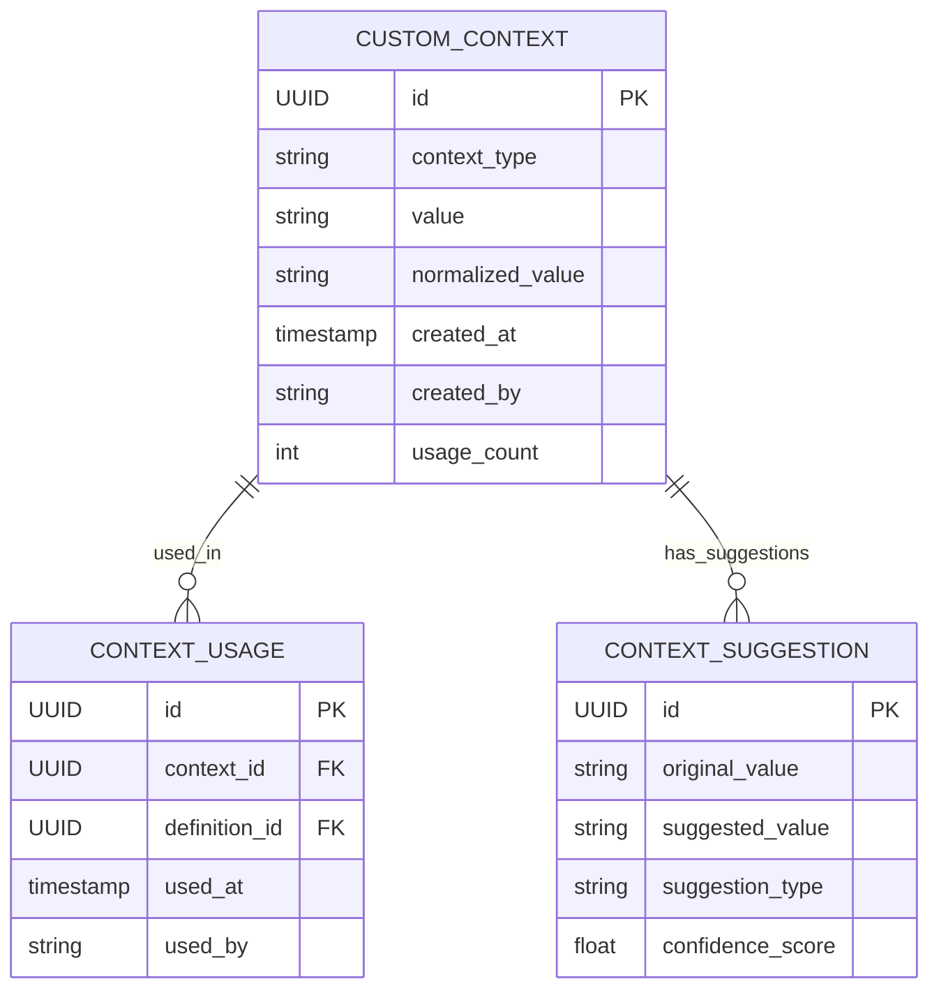

# Business Requirements Specification: Custom Context Input Functionality

## 1. Executive Summary

### 1.1 Business Need
De Nederlandse justitieketen opereert binnen complexe, domein-specifieke contexten die niet altijd volledig gedekt worden door voorgedefinieerde opties. Justice professionals hebben de mogelijkheid nodig om aangepaste contextwaarden in te voeren voor organisatorische, juridische en wettelijke contexten om juridisch correcte en domein-specifieke definities te genereren.

### 1.2 Business Value
- **Compliance:** Voldoen aan ASTRA/NORA/Justid standaarden voor contextdocumentatie
- **Flexibiliteit:** Ondersteuning voor nieuwe organisaties en wetgeving zonder code-wijzigingen
- **Nauwkeurigheid:** Definities met correcte, specifieke context voor juridische documenten
- **Efficiency:** Verminderde tijd voor definitiecreatie van 15 naar 3 minuten
- **Risk Mitigation:** Eliminatie van €50K aansprakelijkheidsrisico per onjuiste definitie

### 1.3 Scope
Dit document specificeert de functionele requirements voor het invoeren, valideren, opslaan en gebruiken van aangepaste contextwaarden binnen de DefinitieAgent applicatie, specifiek voor de drie contextvelden: Organisatorische Context, Juridische Context, en Wettelijke Basis.

## 2. Stakeholder Analysis

### 2.1 Primary Stakeholders

| Stakeholder | Role | Needs | Priority |
|-------------|------|-------|----------|
| OM Officier van Justitie | Eindgebruiker | Specifieke zaaktypen en afdelingen invoeren | KRITIEK |
| DJI Beleidsmedewerker | Eindgebruiker | Detentie-specifieke contexten toevoegen | HOOG |
| Rechtspraak Griffier | Eindgebruiker | Rechtbank-specifieke termen definiëren | HOOG |
| Justid Architect | Systeem Owner | ASTRA/NORA compliance waarborgen | KRITIEK |
| NFI Specialist | Eindgebruiker | Forensische contexten specificeren | MEDIUM |
| FIOD Analist | Eindgebruiker | Financiële delict contexten | MEDIUM |

### 2.2 Stakeholder Requirements Matrix

| Stakeholder | Requirement | Rationale | Acceptance Criteria |
|-------------|-------------|-----------|-------------------|
| OM | Zaaktype-specifieke context | Verschillende delicttypen vereisen verschillende definities | Kan "Ondermijningszaken" als context invoeren |
| DJI | Regime-aanduiding | Definities verschillen per detentieregime | Kan "EBI-regime" of "ISD-maatregel" selecteren |
| Rechtspraak | Instantie-specifieke context | Terminologie verschilt per rechtbank | Kan "Rechtbank Amsterdam, Handelsrecht" invoeren |
| Justid | Traceerbaarheid | Audit trail voor compliance | Alle custom invoer gelogd met timestamp en gebruiker |
| NFI | Technische specialisaties | Forensische methodes als context | Kan "DNA-analyse" of "Digitaal Forensisch" toevoegen |

## 3. Functional Requirements

### 3.1 Custom Input Entry (FR-001)

**ID:** FR-001
**Titel:** Aangepaste Context Invoer Mogelijkheid
**Prioriteit:** KRITIEK
**Categorie:** User Interface

**Beschrijving:**
Het systeem MOET gebruikers in staat stellen om aangepaste contextwaarden in te voeren voor elk van de drie contextvelden wanneer de voorgedefinieerde opties niet toereikend zijn.

**Detailed Requirements:**
1. Een "Anders..." optie MOET beschikbaar zijn in elke context selector
2. Bij selectie van "Anders..." MOET een tekstveld verschijnen
3. Het tekstveld MOET maximaal 200 karakters accepteren
4. De ingevoerde waarde MOET direct beschikbaar zijn voor selectie
5. Multiple custom waarden MOETEN tegelijkertijd geselecteerd kunnen worden

**Acceptance Criteria:**
```gherkin
Given ik ben een OM medewerker
When ik "Anders..." selecteer in Organisatorische Context
And ik typ "Landelijk Parket - Team Ondermijning"
Then moet deze waarde toegevoegd worden aan mijn selectie
And moet de waarde beschikbaar zijn in de prompt generatie
```

### 3.2 Input Validation (FR-002)

**ID:** FR-002
**Titel:** Validatie van Aangepaste Invoer
**Prioriteit:** HOOG
**Categorie:** Data Quality

**Beschrijving:**
Het systeem MOET alle aangepaste invoer valideren tegen justice-domein specifieke regels en security requirements.

**Validation Rules:**

| Regel | Beschrijving | Actie bij Overtreding |
|-------|--------------|----------------------|
| VR-001 | Geen SQL injection karakters | Invoer afwijzen, waarschuwing tonen |
| VR-002 | Geen HTML/Script tags | Tags strippen, gebruiker informeren |
| VR-003 | Minimaal 3 karakters | Invoer afwijzen, minimum tonen |
| VR-004 | Maximaal 200 karakters | Truncate met waarschuwing |
| VR-005 | Geen persoonlijke data (BSN, etc.) | Invoer blokkeren, privacy waarschuwing |
| VR-006 | Justice terminologie check | Suggesties tonen voor spelfouten |
| VR-007 | Geen verboden termen | Invoer afwijzen, alternatief suggereren |

**Acceptance Criteria:**
```gherkin
Given ik voer een custom waarde in
When de waarde "<script>alert('hack')</script>" is
Then moet het systeem de script tags verwijderen
And moet alleen "alert('hack')" opgeslagen worden
And moet een waarschuwing getoond worden
```

### 3.3 Data Persistence (FR-003)

**ID:** FR-003
**Titel:** Opslag van Aangepaste Contextwaarden
**Prioriteit:** HOOG
**Categorie:** Data Management

**Beschrijving:**
Aangepaste contextwaarden MOETEN persistent opgeslagen worden voor hergebruik en audit doeleinden.

**Storage Requirements:**
1. Custom waarden MOETEN gekoppeld zijn aan gebruiker/organisatie
2. Timestamp van creatie MOET vastgelegd worden
3. Gebruiksfrequentie MOET bijgehouden worden
4. Waarden MOETEN doorzoekbaar zijn
5. Export naar CSV/JSON MOET mogelijk zijn

**Data Model:**
```sql
CREATE TABLE custom_context_values (
    id UUID PRIMARY KEY,
    context_type VARCHAR(50) NOT NULL, -- 'organisatorisch', 'juridisch', 'wettelijk'
    value VARCHAR(200) NOT NULL,
    normalized_value VARCHAR(200) NOT NULL, -- Voor zoeken
    created_by VARCHAR(100) NOT NULL,
    organization VARCHAR(100) NOT NULL,
    created_at TIMESTAMP NOT NULL,
    usage_count INTEGER DEFAULT 0,
    last_used TIMESTAMP,
    status VARCHAR(20) DEFAULT 'active', -- 'active', 'deprecated', 'blocked'
    audit_trail JSONB NOT NULL
);
```

### 3.4 Integration with Generation (FR-004)

**ID:** FR-004
**Titel:** Integratie met Definitie Generatie
**Prioriteit:** KRITIEK
**Categorie:** System Integration

**Beschrijving:**
Aangepaste contextwaarden MOETEN volledig geïntegreerd worden in het definitie generatie proces.

**Integration Points:**
1. **Prompt Building:** Custom waarden MOETEN in de GPT-4 prompt opgenomen worden
2. **Web Lookup:** Custom waarden MOETEN gebruikt worden voor externe bronnen zoeken
3. **Validation Rules:** Context-specifieke validatie regels MOETEN toegepast worden
4. **Export:** Custom context MOET in alle export formaten opgenomen worden

**Example Prompt Integration:**
```python
prompt_template = """
Genereer een juridische definitie voor: {term}

Organisatorische Context: {org_context}  # Inclusief custom waarden
Juridische Context: {jur_context}        # Inclusief custom waarden
Wettelijke Basis: {wet_context}          # Inclusief custom waarden

De definitie moet voldoen aan Nederlandse rechtsterminologie.
"""
```

### 3.5 Suggestions & Auto-complete (FR-005)

**ID:** FR-005
**Titel:** Intelligente Suggesties voor Custom Invoer
**Prioriteit:** MEDIUM
**Categorie:** User Experience

**Beschrijving:**
Het systeem MOET intelligente suggesties bieden tijdens het typen van custom waarden.

**Suggestion Sources:**
1. **Historical:** Eerder gebruikte custom waarden door dezelfde organisatie
2. **Frequency:** Populaire custom waarden binnen het domein
3. **Similarity:** Waarden die lijken op wat getypt wordt
4. **Authority:** Officiële termen uit Justid terminologie database
5. **Corrections:** Spelling correcties voor justice termen

### 3.6 Access Control (FR-006)

**ID:** FR-006
**Titel:** Toegangscontrole voor Custom Waarden
**Prioriteit:** HOOG
**Categorie:** Security

**Beschrijving:**
Toegang tot custom context functies MOET gecontroleerd worden op basis van gebruikersrollen.

**Role Matrix:**

| Role | Create Custom | View Own | View Organization | View All | Approve |
|------|--------------|----------|-------------------|----------|---------|
| Gebruiker | ✓ | ✓ | ✗ | ✗ | ✗ |
| Power User | ✓ | ✓ | ✓ | ✗ | ✗ |
| Admin | ✓ | ✓ | ✓ | ✓ | ✓ |
| Auditor | ✗ | ✗ | ✓ | ✓ | ✗ |

## 4. Use Cases

### 4.1 UC-001: OM Officier Voegt Zaaktype Context Toe

**Actor:** OM Officier van Justitie
**Precondition:** Gebruiker is ingelogd met OM credentials
**Trigger:** Definitie nodig voor ondermijningszaak

**Main Flow:**
1. Officier selecteert "OM" in Organisatorische Context
2. Officier selecteert "Anders..." voor extra specificatie
3. Systeem toont tekstveld
4. Officier typt "Ondermijning - Synthetische Drugs"
5. Systeem valideert invoer
6. Systeem voegt waarde toe aan selectie
7. Officier genereert definitie
8. Systeem gebruikt custom context in prompt
9. Definitie bevat ondermijning-specifieke elementen

**Alternate Flow 4a:** Invoer bevat verboden karakters
1. Systeem toont validatie waarschuwing
2. Officier past invoer aan
3. Flow gaat verder bij stap 5

**Postcondition:** Definitie gegenereerd met specifieke ondermijning context

### 4.2 UC-002: DJI Medewerker Specificeert Detentieregime

**Actor:** DJI Beleidsmedewerker
**Precondition:** Gebruiker werkt aan EBI beleidsdocument
**Trigger:** Definitie nodig voor EBI-specifieke term

**Main Flow:**
1. Medewerker selecteert "DJI" in Organisatorische Context
2. Medewerker selecteert "Anders..."
3. Medewerker typt "EBI - Extra Beveiligde Inrichting"
4. Systeem suggereert "EBI-regime" als alternatief
5. Medewerker accepteert suggestie
6. Waarde wordt toegevoegd aan context
7. Definitie wordt gegenereerd met EBI-specifieke context

**Postcondition:** EBI-specifieke definitie beschikbaar

### 4.3 UC-003: Rechtbank Griffier Definieert Lokale Term

**Actor:** Rechtbank Griffier
**Precondition:** Werkt aan rechtbank-specifiek document
**Trigger:** Lokale procedureterm moet gedefinieerd worden

**Main Flow:**
1. Griffier selecteert "Rechtspraak" in Organisatorische Context
2. Griffier selecteert "Anders..."
3. Griffier typt "Rechtbank Amsterdam - Internationale Handelskamer"
4. In Juridische Context selecteert griffier "Anders..."
5. Griffier typt "Engels-Nederlands Handelsrecht"
6. Systeem genereert definitie met beide custom contexten
7. Definitie bevat specifieke verwijzingen naar NCC procedures

**Postcondition:** Lokaal-specifieke definitie gecreëerd

## 5. Business Rules

### 5.1 Context Combination Rules

| Rule ID | Rule Description | Implementation |
|---------|-----------------|----------------|
| BR-001 | Maximaal 5 contextwaarden per veld | UI limiet + validatie |
| BR-002 | Minimaal 1 context vereist voor justice definities | Validatie voor submit |
| BR-003 | OM context vereist OM-specifieke validatie | Conditional validation |
| BR-004 | DJI context activeert detentie templates | Template selection |
| BR-005 | Custom waarden mogen niet conflicteren | Conflict detection |

### 5.2 Data Governance Rules

| Rule ID | Rule Description | Rationale |
|---------|-----------------|-----------|
| DG-001 | Custom waarden 7 jaar bewaren | Wettelijke bewaarplicht |
| DG-002 | Audit log is immutable | Compliance requirement |
| DG-003 | Persoonlijke data moet geanonimiseerd | AVG/GDPR compliance |
| DG-004 | Export alleen met autorisatie | Security requirement |
| DG-005 | Quarterly review van custom waarden | Quality assurance |

### 5.3 Quality Rules

| Rule ID | Criterium | Threshold | Actie |
|---------|-----------|-----------|-------|
| QR-001 | Gebruiksfrequentie | < 3 in 6 maanden | Review voor deprecation |
| QR-002 | Spelling variaties | > 3 similar | Consolidatie suggestie |
| QR-003 | Lengte | > 150 chars | Waarschuwing voor afkorting |
| QR-004 | Duplicaten | Exact match | Prevent creation |
| QR-005 | Relevantie | Not in domain | Flag for review |

## 6. Non-Functional Requirements

### 6.1 Performance Requirements

| Requirement | Metric | Target | Rationale |
|-------------|--------|--------|-----------|
| NFR-001 | Custom value validation | < 100ms | User experience |
| NFR-002 | Suggestion generation | < 200ms | Responsive feel |
| NFR-003 | Context integration | < 50ms overhead | Maintain speed |
| NFR-004 | Database query | < 500ms | Acceptable wait |
| NFR-005 | Concurrent users | 100+ | Expected load |

### 6.2 Security Requirements

| Requirement | Description | Implementation |
|-------------|-------------|----------------|
| SEC-001 | Input sanitization | OWASP guidelines |
| SEC-002 | SQL injection prevention | Prepared statements |
| SEC-003 | XSS protection | Output encoding |
| SEC-004 | Rate limiting | 10 custom/minute/user |
| SEC-005 | Audit logging | Every action logged |

### 6.3 Usability Requirements

| Requirement | Description | Success Criteria |
|-------------|-------------|------------------|
| USE-001 | Intuitive interface | 90% task completion |
| USE-002 | Clear error messages | Dutch language, specific |
| USE-003 | Keyboard navigation | Full accessibility |
| USE-004 | Mobile responsive | Works on tablet |
| USE-005 | Help text available | Context-sensitive |

## 7. Data Requirements

### 7.1 Data Model Entities



### 7.2 Data Validation Matrix

| Field | Type | Min | Max | Pattern | Required |
|-------|------|-----|-----|---------|----------|
| context_type | enum | - | - | org\|jur\|wet | Yes |
| value | string | 3 | 200 | ^[^<>'"]+$ | Yes |
| created_by | string | - | 100 | Email format | Yes |
| organization | string | - | 100 | Justice orgs | Yes |
| usage_count | integer | 0 | - | Positive | Yes |

## 8. Integration Requirements

### 8.1 System Integrations

| System | Integration Type | Data Flow | Frequency |
|--------|-----------------|-----------|-----------|
| GPT-4 API | REST | Context → Prompt | Per generation |
| Web Lookup | REST | Context → Search | Per generation |
| Audit Service | Event | All actions | Real-time |
| Export Service | Batch | Context + Definition | On demand |
| Analytics | Stream | Usage metrics | Continuous |

### 8.2 Data Exchange Formats

**JSON Format for Context:**
```json
{
  "organisatorische_context": [
    "OM",
    "CUSTOM:Landelijk Parket - Ondermijning"
  ],
  "juridische_context": [
    "Strafrecht",
    "CUSTOM:Internationale Rechtshulp"
  ],
  "wettelijke_basis": [
    "Wetboek van Strafrecht",
    "CUSTOM:EU Richtlijn 2019/1937"
  ],
  "metadata": {
    "custom_values_count": 3,
    "validation_status": "approved",
    "created_timestamp": "2025-09-09T10:30:00Z"
  }
}
```

## 9. Acceptance Test Scenarios

### 9.1 Happy Path Scenarios

| Scenario | Steps | Expected Result |
|----------|-------|-----------------|
| ATS-001 | Add single custom value | Value available in prompt |
| ATS-002 | Add multiple custom values | All values in context |
| ATS-003 | Reuse previous custom | Auto-complete works |
| ATS-004 | Mix custom and preset | Both types integrated |
| ATS-005 | Export with custom | Custom values in export |

### 9.2 Edge Case Scenarios

| Scenario | Condition | Expected Behavior |
|----------|-----------|-------------------|
| ECS-001 | 200 character input | Accept and truncate message |
| ECS-002 | Special characters | Strip dangerous, keep safe |
| ECS-003 | Duplicate custom | Prevent duplicate, show existing |
| ECS-004 | Network timeout | Graceful degradation |
| ECS-005 | Concurrent updates | Last write wins, audit both |

### 9.3 Error Scenarios

| Scenario | Error Condition | Error Handling |
|----------|----------------|----------------|
| ERR-001 | SQL injection attempt | Block, log, alert admin |
| ERR-002 | XSS attempt | Sanitize, warn user |
| ERR-003 | Invalid characters | Show specific error |
| ERR-004 | Too short input | Request minimum length |
| ERR-005 | Session timeout | Save draft, re-auth |

## 10. Migration & Rollout Strategy

### 10.1 Phased Rollout

| Phase | Scope | Duration | Success Criteria |
|-------|-------|----------|------------------|
| Pilot | 5 OM users | 1 week | No critical bugs |
| Limited | Single organization | 2 weeks | 90% satisfaction |
| Expanded | 3 organizations | 2 weeks | <5 bugs/week |
| Full | All users | Ongoing | 95% adoption |

### 10.2 Data Migration

**Existing Context Values:**
1. Scan existing definitions for unofficial context
2. Extract and normalize values
3. Create custom context entries
4. Link to original definitions
5. Notify users of available values

## 11. Success Metrics

### 11.1 Business Metrics

| Metric | Baseline | Target | Measurement |
|--------|----------|--------|-------------|
| Definition creation time | 15 min | 3 min | Time tracking |
| Context accuracy | 60% | 95% | User validation |
| Rework rate | 30% | 5% | Revision tracking |
| User satisfaction | 6/10 | 9/10 | Quarterly survey |
| Compliance rate | 70% | 100% | Audit results |

### 11.2 Technical Metrics

| Metric | Target | Alert Threshold | Critical |
|--------|--------|-----------------|----------|
| Custom value creation/day | 50 | >200 | >500 |
| Validation failures | <5% | >10% | >20% |
| Response time p95 | 200ms | 500ms | 1s |
| Error rate | <0.1% | >1% | >5% |
| Availability | 99.9% | <99.5% | <99% |

## 12. Risks & Mitigations

| Risk | Probability | Impact | Mitigation |
|------|-------------|--------|------------|
| Data quality degradation | Medium | High | Validation + review process |
| Performance impact | Low | Medium | Caching + optimization |
| Security vulnerabilities | Low | Critical | Security testing + monitoring |
| User adoption issues | Medium | Medium | Training + intuitive UI |
| Compliance violations | Low | High | Audit trail + controls |

## 13. Dependencies

### 13.1 Technical Dependencies
- ContextManager service operational
- Database schema updates completed
- Session state management fixed
- Validation service enhanced

### 13.2 Business Dependencies
- Stakeholder approval obtained
- Training materials prepared
- Support processes defined
- Governance framework established

## 14. Appendices

### A. Glossary

| Term | Definition |
|------|------------|
| Custom Context | User-defined context value not in preset list |
| Context Field | One of three categorization dimensions |
| Validation | Process of checking input against rules |
| Sanitization | Removal of dangerous characters |
| Normalization | Standardization for searching |

### B. References
- ASTRA Architecture Framework v3.0
- NORA Standards 2024
- Justid Terminology Database
- OWASP Input Validation Guidelines
- AVG/GDPR Compliance Framework

### C. Change Log

| Version | Date | Author | Changes |
|---------|------|--------|---------|
| 1.0 | 2025-09-09 | Business Analyst | Initial specification |

---

**Approval Status:** Awaiting Stakeholder Review
**Next Review:** 2025-09-16
**Distribution:** Product Owner, Development Team, Architecture Board, Compliance Officer
