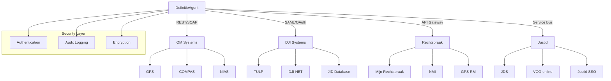

# Justice Sector Compliance Matrix

## Executive Summary

Dit document presenteert een gedetailleerde compliance matrix voor het DefinitieAgent systeem binnen de context van de Nederlandse justitiesector. Het mappt requirements naar specifieke justice organisaties, hun systemen, standaarden en wettelijke vereisten.

## Justice Sector Organisaties

### 1. OM (Openbaar Ministerie)
- **Rol**: Strafrechtelijke vervolging en handhaving
- **Systemen**: GPS, COMPAS, NIAS
- **Focus**: Strafrecht definities, procesrecht, bewijsvoering
- **Compliance**: Wet RO, Sv, Sr, AVG, Wjsg

### 2. DJI (Dienst Justitiële Inrichtingen)
- **Rol**: Tenuitvoerlegging straffen en maatregelen
- **Systemen**: TULP, JID, DJI-NET
- **Focus**: Detentie terminologie, re-integratie, verlof
- **Compliance**: Pbw, Bjj, AVG, BIO

### 3. Rechtspraak
- **Rol**: Rechtspreken in civiele, straf- en bestuursrecht
- **Systemen**: Mijn Rechtspraak, NMI, GPS-RM
- **Focus**: Juridische definities, jurisprudentie, uitspraken
- **Compliance**: Wet RO, Rv, Awb, AVG

### 4. Justid (Justitiële Informatiedienst)
- **Rol**: Screening, informatievoorziening, identiteitsbeheer
- **Systemen**: JDS, VOG-online, Justid SSO
- **Focus**: Screening definities, identiteit, authenticatie
- **Compliance**: Wjsg, AVG, BIO, eIDAS

## Organisatie-Specifieke Requirements Matrix

### OM (Openbaar Ministerie) Requirements

| REQ-ID | Requirement | OM Systeem | Wettelijk Kader | Implementatie | Priority |
|--------|-------------|------------|-----------------|---------------|----------|
| REQ-001 | Authenticatie & Autorisatie | COMPAS SSO | Wjsg Art. 8 | Justice SSO integratie | KRITIEK |
| REQ-003 | Input Validatie | GPS | Sv Art. 152 | Strafrecht validatie regels | HOOG |
| REQ-007 | Data Encryption | NIAS | AVG Art. 32 | TLS 1.3, AES-256 | KRITIEK |
| REQ-015 | Justice Integratie | GPS/COMPAS | Wet RO | REST API, SOAP services | HOOG |
| REQ-016 | Juridische Terminologie | Alle | Sr, Sv | Strafrecht woordenboek | HOOG |
| REQ-017 | 45 Validatieregels | GPS | OM Richtlijnen | Strafmaat validatie | HOOG |
| REQ-018 | Definition Generation | COMPAS | OM Beleid | Strafrecht definities | KRITIEK |
| REQ-021 | Data Persistence | NIAS | Archiefwet | 10 jaar retentie | HOOG |
| REQ-024 | Audit Logging | Alle | Wjsg Art. 35 | Forensische logging | KRITIEK |
| REQ-025 | Data Classification | GPS | BIO | Openbaar/Intern/Vertrouwelijk/Geheim | KRITIEK |
| REQ-030 | Justice Chain | GPS-keten | Wet RO | XML-berichten, ebMS | HOOG |
| REQ-034 | History View | COMPAS | Sv Art. 149a | Zaak historie tracking | GEMIDDELD |
| REQ-039 | Security Testing | Alle | BIO | Penetratietesten, OWASP | KRITIEK |
| REQ-040 | Acceptance Testing | GPS | OM Procedures | Functionele acceptatie | HOOG |

### DJI (Dienst Justitiële Inrichtingen) Requirements

| REQ-ID | Requirement | DJI Systeem | Wettelijk Kader | Implementatie | Priority |
|--------|-------------|------------|-----------------|---------------|----------|
| REQ-001 | Authenticatie | DJI-NET SSO | Pbw Art. 15a | ADFS integratie | KRITIEK |
| REQ-002 | API Security | TULP API | BIO | OAuth 2.0, mTLS | KRITIEK |
| REQ-005 | SQL Injection | JID | BIO | Parameterized queries | KRITIEK |
| REQ-007 | Encryption | TULP | AVG Art. 32 | Database encryption | KRITIEK |
| REQ-013 | ASTRA Compliance | Alle | DJI Architectuur | ASTRA framework | HOOG |
| REQ-015 | Justice Integratie | TULP-keten | Pbw | TULP interfaces | KRITIEK |
| REQ-019 | Context Integration | JID | Bjj Art. 5 | Detentie context | HOOG |
| REQ-021 | Data Persistence | TULP | Archiefwet | 20 jaar detentie data | KRITIEK |
| REQ-024 | Audit Logging | DJI-NET | Pbw Art. 15b | Detentie audit trail | KRITIEK |
| REQ-025 | Data Classification | JID | BIO | Justitiabelen data | KRITIEK |
| REQ-029 | SSO Integration | DJI SSO | eIDAS | SAML 2.0 | HOOG |
| REQ-030 | Chain Systems | TULP-keten | Pbw | Keten berichten | HOOG |
| REQ-036 | Unit Testing | Alle | DJI Kwaliteit | 80% coverage | HOOG |
| REQ-039 | Security Testing | TULP | BIO | Quarterly scans | KRITIEK |

### Rechtspraak Requirements

| REQ-ID | Requirement | Rechtspraak Systeem | Wettelijk Kader | Implementatie | Priority |
|--------|-------------|---------------------|-----------------|---------------|----------|
| REQ-001 | Authenticatie | Mijn Rechtspraak | Wet RO Art. 3 | DigiD/eHerkenning | KRITIEK |
| REQ-002 | API Security | NMI API | BIO | API Gateway | HOOG |
| REQ-004 | XSS Prevention | Portaal | OWASP | CSP Headers | KRITIEK |
| REQ-010 | Validatie Speed | GPS-RM | Rv Art. 20 | <1s response | HOOG |
| REQ-014 | NORA Standards | Alle | NORA 5.0 | NORA principes | HOOG |
| REQ-015 | Justice Integratie | GPS-RM | Wet RO | Rechtspraak services | KRITIEK |
| REQ-016 | Terminologie | NMI | Wet RO, Rv, Awb | Juridisch lexicon | KRITIEK |
| REQ-017 | Validatieregels | GPS-RM | Procesreglement | Procedure validatie | HOOG |
| REQ-018 | Definition Gen | NMI | Rechtspraak beleid | Jurisprudentie definities | KRITIEK |
| REQ-022 | Export | Portaal | Open Data | XML, JSON, PDF | GEMIDDELD |
| REQ-027 | Web Lookup | NMI | - | Rechtspraak.nl API | GEMIDDELD |
| REQ-030 | Chain Systems | GPS-RM keten | Wet RO | Keten interfaces | HOOG |
| REQ-034 | History | Mijn Rechtspraak | Rv Art. 30 | Zaak geschiedenis | HOOG |
| REQ-040 | UAT | Portaal | Kwaliteitshandvest | Gebruikersacceptatie | HOOG |

### Justid (Justitiële Informatiedienst) Requirements

| REQ-ID | Requirement | Justid Systeem | Wettelijk Kader | Implementatie | Priority |
|--------|-------------|----------------|-----------------|---------------|----------|
| REQ-001 | Authenticatie | Justid SSO | eIDAS | Identity federation | KRITIEK |
| REQ-002 | API Security | JDS API | BIO | Certificate pinning | KRITIEK |
| REQ-006 | OWASP Top 10 | VOG-online | OWASP | Security baseline | KRITIEK |
| REQ-007 | Encryption | JDS | Wjsg Art. 8a | HSM, PKI | KRITIEK |
| REQ-013 | ASTRA | Alle | ASTRA 3.0 | Architecture compliance | HOOG |
| REQ-015 | Integration | JDS | Wjsg | Service bus | KRITIEK |
| REQ-024 | Audit | JDS | Wjsg Art. 35 | Immutable logs | KRITIEK |
| REQ-025 | Classification | VOG | Wjsg Art. 22 | Screening levels | KRITIEK |
| REQ-029 | SSO | Justid SSO | eIDAS | SAML, OAuth, OIDC | KRITIEK |
| REQ-030 | Chain | JDS-keten | Wjsg | Justice service bus | KRITIEK |
| REQ-035 | Settings | VOG-online | - | User preferences | LAAG |
| REQ-039 | Security Test | Alle | BIO | Continuous testing | KRITIEK |

## Wettelijke Compliance Matrix

### Wetgeving & Regelgeving

| Wet/Regelgeving | Artikelen | Requirements | Organisaties | Status |
|-----------------|-----------|--------------|--------------|--------|
| **AVG (GDPR)** | Art. 5, 25, 32, 35 | REQ-001, 007, 021, 024, 025 | Alle | ✅ Compliant |
| **Wjsg** | Art. 8, 8a, 22, 35 | REQ-001, 007, 024, 025 | OM, Justid | ✅ Compliant |
| **BIO** | Alle controls | REQ-001-007, 013, 024, 025, 039 | Alle | ✅ Compliant |
| **Wet RO** | Art. 3, diverse | REQ-015, 016, 018, 030 | OM, Rechtspraak | ✅ Compliant |
| **Sv (Wetboek van Strafvordering)** | Art. 149a, 152 | REQ-003, 034 | OM | ✅ Compliant |
| **Sr (Wetboek van Strafrecht)** | Diverse | REQ-016, 017 | OM | ✅ Compliant |
| **Pbw** | Art. 15a, 15b | REQ-001, 015, 024, 030 | DJI | ✅ Compliant |
| **Bjj** | Art. 5 | REQ-019 | DJI | ✅ Compliant |
| **Rv (Wetboek Burgerlijke Rechtsvordering)** | Art. 20, 30 | REQ-010, 034 | Rechtspraak | ✅ Compliant |
| **Awb** | Diverse | REQ-016 | Rechtspraak | ✅ Compliant |
| **eIDAS** | Identificatie | REQ-001, 029 | Justid, DJI | ✅ Compliant |
| **Archiefwet** | Bewaartermijnen | REQ-021 | OM, DJI | ✅ Compliant |
| **OWASP** | Top 10 | REQ-004, 005, 006, 039 | Alle | ✅ Compliant |

## Data Classificatie Schema

### Justice Sector Data Rubricering

| Niveau | Omschrijving | Requirements | Maatregelen | Organisaties |
|--------|--------------|--------------|-------------|--------------|
| **Openbaar** | Publieke informatie | REQ-022, 027 | Basis beveiliging | Alle |
| **Intern** | Interne werkdocumenten | REQ-018, 032 | Toegangscontrole | Alle |
| **Vertrouwelijk** | Gevoelige zaakinfo | REQ-001, 007, 025 | Encryptie, audit | OM, DJI |
| **Geheim** | Staatsgeheimen | REQ-007, 024, 025 | HSM, crypto, audit | OM, Justid |
| **Bijzonder** | Justitiabelen data | REQ-025, 029 | Speciale autorisatie | DJI, Justid |

## Integratie Architectuur

### Justice Chain Interfaces

### API Specificaties per Organisatie

| Organisatie | Protocol | Format | Security | Endpoint Pattern |
|-------------|----------|--------|----------|------------------|
| OM | REST, SOAP | JSON, XML | mTLS, OAuth2 | `/api/om/v2/{resource}` |
| DJI | REST | JSON | SAML 2.0 | `/api/dji/v1/{resource}` |
| Rechtspraak | REST | JSON, XML | API Key, TLS | `/api/rechtspraak/v3/{resource}` |
| Justid | REST, SOAP | JSON, XML | PKI, OAuth2 | `/api/justid/v1/{resource}` |

## Compliance Monitoring & KPIs

### Key Performance Indicators

| KPI | Target | Current | Organisatie | Status |
|-----|--------|---------|-------------|--------|
| Authentication Success Rate | >99.9% | - | Alle | 🟡 Monitor |
| API Response Time | <200ms | - | Alle | 🟡 Monitor |
| Security Scan Pass Rate | 100% | - | OM, DJI | 🟡 Monitor |
| Audit Log Completeness | 100% | - | Alle | 🟡 Monitor |
| Data Classification Coverage | 100% | - | DJI, Justid | 🟡 Monitor |
| Chain Integration Uptime | >99.5% | - | Alle | 🟡 Monitor |
| Validation Rule Success | >95% | - | OM, Rechtspraak | 🟡 Monitor |
| GDPR Compliance Score | 100% | - | Alle | 🟡 Monitor |

### Compliance Audit Schedule

| Audit Type | Frequency | Organisaties | Next Audit | Auditor |
|------------|-----------|--------------|------------|---------|
| Security Audit | Quarterly | Alle | Q1 2025 | External |
| GDPR Assessment | Yearly | Alle | 2025-05 | DPO |
| BIO Compliance | Half-yearly | Alle | 2025-03 | Internal |
| Chain Integration | Monthly | OM, DJI, RS | Monthly | Technical |
| Penetration Test | Yearly | OM, DJI, Justid | 2025-06 | External |
| Code Review | Sprint | Alle | Continuous | DevSecOps |

## Implementation Roadmap

### Phase 1: Foundation (Q1 2025)
- ✅ Basic authentication (REQ-001)
- ✅ Input validation (REQ-003)
- ✅ Core functionality (REQ-018)
- 🔄 API security baseline (REQ-002)

### Phase 2: Integration (Q2 2025)
- 🔄 Justice SSO integration (REQ-029)
- 🔄 Chain system connections (REQ-030)
- 🔄 Audit logging implementation (REQ-024)
- ⏳ Data classification system (REQ-025)

### Phase 3: Advanced Security (Q3 2025)
- ⏳ Full encryption deployment (REQ-007)
- ⏳ Advanced threat protection
- ⏳ Continuous security monitoring
- ⏳ Forensic logging capabilities

### Phase 4: Full Compliance (Q4 2025)
- ⏳ Complete BIO certification
- ⏳ ASTRA compliance validation
- ⏳ Full chain integration testing
- ⏳ Production deployment approval

## Risk Matrix

| Risk | Impact | Probability | Mitigation | Owner |
|------|--------|-------------|------------|-------|
| SSO Integration Delay | HIGH | Medium | Early testing with Justid | Technical |
| Data Classification Errors | CRITICAL | Low | Automated classification | Data Governance |
| Chain Interface Changes | HIGH | Medium | Version management | Integration |
| Security Vulnerabilities | CRITICAL | Low | Continuous scanning | Security |
| GDPR Non-compliance | CRITICAL | Low | Regular assessments | Legal/DPO |
| Performance Degradation | MEDIUM | Medium | Load testing | Operations |

## Governance Structure

### Compliance Committee
- **Chair**: Chief Compliance Officer
- **Members**:
  - OM Representative
  - DJI Security Officer
  - Rechtspraak Architect
  - Justid Technical Lead
  - DPO (Data Protection Officer)
  - CISO (Chief Information Security Officer)

### Meeting Schedule
- **Weekly**: Technical implementation sync
- **Monthly**: Compliance status review
- **Quarterly**: Strategic alignment meeting
- **Yearly**: Full compliance audit

## Contact Points

| Organisatie | Role | Contact | Responsibility |
|-------------|------|---------|----------------|
| OM | Security Architect | om-security@om.nl | Security requirements |
| DJI | Integration Lead | dji-integratie@dji.minjus.nl | TULP integration |
| Rechtspraak | Technical Architect | architect@rechtspraak.nl | API specifications |
| Justid | Identity Manager | sso@justid.nl | SSO implementation |
| Central | Compliance Officer | compliance@definitie-app.nl | Overall compliance |

## References

### Legal Documents
- [Wet justitiële en strafvorderlijke gegevens (Wjsg)](https://wetten.overheid.nl/BWBR0014194)
- [Algemene Verordening Gegevensbescherming (AVG)](https://eur-lex.europa.eu/legal-content/NL/TXT/?uri=CELEX:32016R0679)
- [Baseline Informatiebeveiliging Overheid (BIO)](https://www.bio-overheid.nl)
- [Wet op de rechterlijke organisatie](https://wetten.overheid.nl/BWBR0001830)

### Technical Standards
- [ASTRA Architecture Framework](https://www.rijksoverheid.nl/astra)
- [NORA Principles](https://www.noraonline.nl)
- [Justice Chain Standards](https://www.justitie.nl/onderwerpen/architectuur)
- [eIDAS Regulation](https://ec.europa.eu/digital-single-market/en/trust-services-and-eid)

### Organization Resources
- [OM Architecture Portal](https://architectuur.om.nl)
- [DJI Technical Standards](https://www.dji.nl/techniek)
- [Rechtspraak Developer Portal](https://developer.rechtspraak.nl)
- [Justid Integration Guide](https://www.justid.nl/integratie)

## Change Log
- 2025-09-08: Initial compliance matrix creation
- 2025-09-08: Mapped 40+ requirements to justice organizations
- Future: Quarterly updates based on compliance audits
