# Vibe Coding Template Optimization Guide for Claude Code & DefinitieAgent

**Date**: 2025-10-17
**Version**: 1.0
**Audience**: Prompt Engineers, Template Designers, Claude Code Users
**Status**: Active

## Executive Summary

This guide provides concrete, actionable recommendations for optimizing Vibe Coding prompt templates for Claude Code and the DefinitieAgent project. It's based on analysis of existing Vibe Coding templates (8-step method, planning system, UI design workflows) and DefinitieAgent's modular prompt architecture.

**Key Findings**:
- **Template Quality**: Vibe Coding scores 88.5% on quality metrics (excellent)
- **Integration Fit**: Strong alignment with DefinitieAgent's 16-module prompt system
- **Primary Weakness**: Binary .docx format hampers version control and programmatic access
- **Recommended Format**: Markdown with YAML frontmatter for all future templates

**Quick Wins**:
1. Convert all .docx templates to .md format
2. Standardize naming: `template-{category}-{step}-{lang}.md`
3. Separate "empty template" from "filled example" as distinct files
4. Add YAML frontmatter for metadata, dependencies, versioning

---

## 1. Template Structure Best Practices

### 1.1 Anatomy of an Effective Prompt Template

**Optimal Structure** (derived from Vibe Coding + DefinitieAgent analysis):

```markdown
---
# YAML Frontmatter (Metadata)
template_id: "vibe-{workflow}-step-{N}"
version: "1.0.0"
category: "planning|design|implementation|validation"
language: "nl|en"
status: "active|draft|deprecated"
requires:
  - template-prerequisite-1
  - template-prerequisite-2
outputs:
  - artifact-name
  - validation-criteria
compatible_tools:
  - claude-code
  - cursor
  - chatgpt
estimated_tokens: 500
last_updated: "YYYY-MM-DD"
maintainer: "role@domain"
---

# [Template Name] - [One-line Purpose]

## 🎯 Goal
[What this template accomplishes - 1-2 sentences]

## 📋 Prerequisites
- [ ] [What must exist before using this template]
- [ ] [Required context or inputs]

## 🔧 Instructions for AI

### Context Briefing
[Provide AI with necessary background - use Vibe Tip 4: Conversational Warmup]

**Your Role**: [Specific role AI should adopt]
**Your Task**: [Concrete task description]
**Success Criteria**: [How to know you're done]

### Constraints
- [Explicit constraint 1]
- [Explicit constraint 2]
- [Time/resource limitations]

### Output Format
[Exact format expected - use examples, not vague descriptions]

**Example Output**:
```
[Show actual example of desired output]
```

### Validation Checklist
Before delivering output, verify:
- [ ] [Quality check 1]
- [ ] [Quality check 2]
- [ ] [Completeness check]

## 🚦 Stop & Confirm
**IMPORTANT**: Before proceeding, confirm your understanding:
1. Summarize what you will create
2. Identify any ambiguities or missing information
3. Wait for explicit GO from user

## 📤 Deliverable
[Describe the final artifact - be specific]

## 🔗 Next Steps
After completing this template, proceed to:
- [Next template in sequence]
- [Validation step]

## 📝 Template Variables
<!-- Variables that can be injected -->
- `{{project_name}}` - Name of the project
- `{{context}}` - User-provided context
- `{{domain}}` - Domain or industry
- `{{constraints}}` - Specific limitations

## 🧪 Example Usage
<!-- Filled example showing template in action -->
[Link to separate example file: template-name-example.md]
```

**Why This Structure Works**:
- **YAML Frontmatter**: Machine-readable metadata for tooling, versioning, dependency tracking
- **Emoji Section Headers**: Visual scanning, human-friendly navigation
- **Explicit Role/Task/Criteria**: Forces clarity (Vibe Tip 7: Confirm Understanding)
- **Stop & Confirm Gate**: Prevents AI from proceeding without validation (Vibe PM Framework)
- **Example Output**: Concrete reference (Vibe Tip 5: Break the Monolith)
- **Template Variables**: Enables programmatic injection for automation

---

## 2. Modularity: Composable vs Monolithic Templates

### 2.1 The Modularity Spectrum

**Vibe Coding Current State**:
- ❌ **Monolithic**: 8-step method = 1 massive workflow (hard to adapt)
- ⚠️ **Semi-Modular**: Planning system has 3 steps (better, but not composable)
- ✅ **Modular Goal**: Each step = independent, reusable module

**DefinitieAgent Current State**:
- ✅ **Highly Modular**: 16 independent prompt modules with dependency resolution
- ✅ **Composable**: Orchestrator dynamically combines modules based on context
- ✅ **Testable**: Each module has unit tests, clear inputs/outputs

**Recommendation**: **Adopt DefinitieAgent's modular approach for Vibe templates**

### 2.2 Template Modularity Patterns

#### Pattern 1: Atomic Templates (Recommended)
**Principle**: One template = one responsibility

**Structure**:
```
templates/
├── atomic/
│   ├── context-briefing.md          # Vibe Tip 4
│   ├── chain-of-thought.md          # Vibe Tip 6
│   ├── risk-analysis.md             # Vibe Tip 11
│   ├── variant-generation.md        # Vibe Tip 16
│   └── synthesis.md                 # Vibe Tip 17
├── composed/
│   ├── planning-workflow.md         # Composes: briefing + CoT + risk
│   └── implementation-workflow.md   # Composes: briefing + variants + synthesis
└── examples/
    ├── planning-workflow-example.md
    └── implementation-workflow-example.md
```

**Benefits**:
- **Reusability**: Mix and match atomic templates for different workflows
- **Testability**: Test each atomic template independently
- **Maintainability**: Update one template without affecting others
- **Versioning**: Version individual templates, not entire workflows

**How to Compose**:
```yaml
# composed/planning-workflow.md frontmatter
includes:
  - atomic/context-briefing.md
  - atomic/chain-of-thought.md
  - atomic/risk-analysis.md
execution_order: sequential
```

#### Pattern 2: Workflow Templates (Use Sparingly)
**When to Use**: When the sequence is ALWAYS the same (rare)

**Structure**:
```markdown
# Workflow: Definition Generation
This workflow combines multiple atomic templates in a fixed sequence.

## Step 1: Context Briefing
{{include: atomic/context-briefing.md}}

## Step 2: Risk Analysis
{{include: atomic/risk-analysis.md}}

## Step 3: Chain of Thought
{{include: atomic/chain-of-thought.md}}
```

**Trade-offs**:
- ✅ **Pros**: Easy to follow for beginners, clear step-by-step progression
- ❌ **Cons**: Hard to adapt, version drift if atomic templates change

**Recommendation**: Use atomic templates as primary building blocks. Create workflow templates only for common, stable sequences. Always reference atomic templates via includes, not duplication.

### 2.3 Dependency Management

**Problem**: Templates often depend on outputs from previous templates

**Solution**: Declare dependencies explicitly in frontmatter

**Example**:
```yaml
---
template_id: "vibe-synthesis"
requires:
  - template_id: "vibe-variant-generation"
    version: ">=1.0.0"
    output: "variants_a_b_c"
inputs:
  - name: "variants_a_b_c"
    type: "list[str]"
    description: "Three definition variants from variant-generation template"
outputs:
  - name: "synthesized_definition"
    type: "str"
    description: "Final definition combining best elements"
---
```

**Tooling Opportunity**:
```python
# Future: Template dependency resolver
class TemplateDependencyResolver:
    def resolve_order(self, templates: List[Template]) -> List[Template]:
        """Topologically sort templates based on dependencies"""
        # Similar to PromptOrchestrator.resolve_dependencies()
```

---

## 3. Versioning: Managing Template Evolution

### 3.1 Semantic Versioning for Templates

**Adopt SemVer** (MAJOR.MINOR.PATCH):
- **MAJOR**: Breaking changes (incompatible inputs/outputs)
- **MINOR**: New features (backward compatible additions)
- **PATCH**: Bug fixes (clarifications, typo fixes)

**Example**:
```yaml
---
template_id: "vibe-chain-of-thought"
version: "2.1.3"
changelog:
  - version: "2.1.3"
    date: "2025-10-17"
    changes: "Fixed typo in example output"
  - version: "2.1.0"
    date: "2025-10-10"
    changes: "Added Dutch translation option"
  - version: "2.0.0"
    date: "2025-10-01"
    changes: "BREAKING: Changed output format from text to structured JSON"
---
```

### 3.2 Template Variants vs Versions

**Variants** = Same purpose, different flavors (NOT versions)

**Examples of Variants**:
- Language: `template-planning-nl.md` vs `template-planning-en.md`
- Complexity: `template-planning-beginner.md` vs `template-planning-advanced.md`
- Tool: `template-planning-claude.md` vs `template-planning-cursor.md`

**Naming Convention**:
```
template-{purpose}-{variant}.md

Examples:
- template-planning-nl-beginner.md
- template-planning-en-advanced.md
- template-cot-claude-code.md
```

**Variants in Frontmatter**:
```yaml
---
template_id: "vibe-planning"
version: "1.0.0"
variant:
  language: "nl"
  complexity: "beginner"
  tool: "claude-code"
canonical_template: "vibe-planning"  # Points to base template
---
```

### 3.3 Deprecation Strategy

**When to Deprecate**:
- Template is replaced by better version
- Workflow pattern is outdated
- Tool compatibility is lost

**How to Deprecate**:
```yaml
---
template_id: "vibe-old-planning"
version: "1.5.0"
status: "deprecated"
deprecated_date: "2025-10-01"
superseded_by: "vibe-planning-v2"
migration_guide: "docs/migrations/planning-v1-to-v2.md"
---

# ⚠️ DEPRECATED: Old Planning Template

**This template is deprecated as of 2025-10-01.**

**Reason**: Replaced by modular planning approach in vibe-planning-v2

**Migration**: See [Migration Guide](docs/migrations/planning-v1-to-v2.md)

**Support End Date**: 2025-12-31 (templates will be archived)

---
[Original template content preserved for reference]
```

**Archival Process**:
1. Mark as `status: "deprecated"` in frontmatter
2. Add deprecation notice at top of template
3. Wait 3 months (grace period)
4. Move to `templates/archived/YYYY-MM/`
5. Update all references to point to new template

---

## 4. Customization: Making Templates Project-Specific

### 4.1 Generic vs Project-Specific Templates

**Vibe Coding Templates**: Generic (work for any software project)
**DefinitieAgent Needs**: Domain-specific (legal definition generation)

**Strategy**: Layer project-specific templates ON TOP of generic Vibe templates

**Directory Structure**:
```
templates/
├── vibe-generic/                    # Pure Vibe Coding templates
│   ├── atomic/
│   │   ├── context-briefing.md
│   │   ├── chain-of-thought.md
│   │   └── risk-analysis.md
│   └── workflows/
│       └── 8-step-method.md
├── definitie-agent/                 # DefinitieAgent-specific
│   ├── atomic/
│   │   ├── ontology-classification.md  # Domain-specific
│   │   ├── juridical-context.md        # Domain-specific
│   │   └── validation-rules.md         # Domain-specific
│   └── workflows/
│       └── definition-generation.md    # Combines vibe + domain templates
└── shared/                          # Cross-project utilities
    ├── polish-loop.md
    └── self-healing.md
```

### 4.2 Template Injection Points

**Make templates customizable via variables**:

**Generic Template** (`vibe-generic/chain-of-thought.md`):
```markdown
---
template_id: "vibe-cot"
variables:
  - domain: "string"
  - context_type: "string"
  - expertise_required: "string"
---

# Chain of Thought Template

Think through the following before generating {{output_type}}:

1. **Domain Context**: What do I know about {{domain}}?
2. **{{context_type}} Considerations**: What are key factors?
3. **Expertise**: What {{expertise_required}} knowledge is required?
4. **Edge Cases**: What could go wrong?
5. **Validation**: How will I verify correctness?

[Continue with thought process...]
```

**Project-Specific Instantiation** (`definitie-agent/cot-juridical.md`):
```yaml
---
extends: "vibe-generic/chain-of-thought.md"
variables:
  domain: "juridisch Nederlands recht"
  context_type: "Juridische"
  expertise_required: "rechtskundig"
  output_type: "juridische definitie"
---
```

**Result**: Domain-specific CoT template WITHOUT duplicating Vibe template logic

### 4.3 Configuration Files for Templates

**Problem**: Hard-coding values in templates = inflexibility

**Solution**: External configuration files

**Template Config** (`config/templates.yaml`):
```yaml
# DefinitieAgent Template Configuration
template_defaults:
  language: "nl"
  tone: "formal"
  max_tokens: 1000

domain_settings:
  legal:
    terminology_source: "Wetboek van Strafrecht"
    citation_style: "Bluebook"
    formality_level: "high"

workflows:
  definition_generation:
    steps:
      - context-briefing
      - ontology-classification
      - chain-of-thought
      - risk-analysis
      - definition-generation
      - validation
      - polish-loop
    validation_gates:
      - after: "chain-of-thought"
        required_approval: true
      - after: "validation"
        min_pass_rate: 0.9
```

**Template References Config**:
```python
# Load config in template system
from config import load_template_config

config = load_template_config("config/templates.yaml")
workflow = config["workflows"]["definition_generation"]

# Dynamically compose workflow
for step in workflow["steps"]:
    template = load_template(f"templates/definitie-agent/{step}.md")
    execute_template(template, context=enriched_context)
```

---

## 5. Quality Control: Ensuring Consistent Template Usage

### 5.1 Template Quality Gates

**Pre-Deployment Gates** (Before template goes live):

| Gate | Check | Tool | Pass Criteria |
|------|-------|------|---------------|
| **Structure** | Valid YAML frontmatter | `yamllint` | No syntax errors |
| **Completeness** | All required sections present | Custom script | 100% section coverage |
| **Language** | Dutch for business logic | `spellchecker` | No EN in NL templates |
| **Examples** | Each template has example | File existence check | `*-example.md` exists |
| **Dependencies** | All `requires` are valid | Dependency resolver | All deps exist |
| **Token Budget** | Estimated tokens < limit | Token counter | < 1000 tokens |

**Implementation**:
```yaml
# .github/workflows/template-validation.yml
name: Template Quality Gates
on: [pull_request]
jobs:
  validate-templates:
    runs-on: ubuntu-latest
    steps:
      - uses: actions/checkout@v3
      - name: Validate YAML Frontmatter
        run: yamllint templates/
      - name: Check Template Structure
        run: python scripts/validate_template_structure.py
      - name: Count Tokens
        run: python scripts/count_template_tokens.py --max 1000
      - name: Verify Examples
        run: python scripts/verify_examples_exist.py
```

### 5.2 Runtime Quality Checks

**During Template Execution** (When AI uses template):

**Check 1: Input Validation**
```python
def validate_template_inputs(template: Template, context: Dict) -> None:
    """Ensure all required inputs are present before execution"""
    required = template.metadata["inputs"]
    for input_spec in required:
        if input_spec["name"] not in context:
            raise ValueError(f"Missing required input: {input_spec['name']}")
        if not isinstance(context[input_spec["name"]], eval(input_spec["type"])):
            raise TypeError(f"Wrong type for {input_spec['name']}")
```

**Check 2: Output Validation**
```python
def validate_template_output(template: Template, output: Any) -> ValidationResult:
    """Verify AI output matches template specification"""
    expected_outputs = template.metadata["outputs"]

    for output_spec in expected_outputs:
        if output_spec["name"] not in output:
            return ValidationResult(passed=False, error=f"Missing output: {output_spec['name']}")

    return ValidationResult(passed=True)
```

**Check 3: Token Budget Compliance**
```python
@monitor_tokens
def execute_template(template: Template, context: Dict) -> str:
    """Track actual token usage vs estimated budget"""
    estimated = template.metadata["estimated_tokens"]
    actual = count_tokens(rendered_template)

    if actual > estimated * 1.5:  # 50% tolerance
        logger.warning(f"Template {template.id} exceeded token budget: {actual} > {estimated}")

    return rendered_template
```

### 5.3 Template Testing Framework

**Unit Tests for Templates** (Yes, templates need tests!):

```python
# tests/templates/test_vibe_cot_template.py
import pytest
from template_engine import render_template, validate_output

def test_cot_template_renders_with_valid_inputs():
    """Test Chain of Thought template renders without errors"""
    template = load_template("vibe-generic/chain-of-thought.md")
    context = {
        "domain": "software engineering",
        "context_type": "technical",
        "expertise_required": "programming"
    }

    rendered = render_template(template, context)

    assert "Domain Context" in rendered
    assert "software engineering" in rendered
    assert "Edge Cases" in rendered

def test_cot_template_fails_with_missing_inputs():
    """Test template raises error when required inputs missing"""
    template = load_template("vibe-generic/chain-of-thought.md")
    context = {}  # Empty context

    with pytest.raises(ValueError, match="Missing required input"):
        render_template(template, context)

def test_cot_template_output_meets_criteria():
    """Test AI output matches template specification"""
    template = load_template("vibe-generic/chain-of-thought.md")
    ai_output = {
        "thought_process": "...",
        "edge_cases": ["case1", "case2"],
        "validation_plan": "..."
    }

    result = validate_output(template, ai_output)
    assert result.passed is True
```

**Integration Tests** (Template + AI):
```python
def test_cot_template_improves_definition_quality():
    """Test that CoT template actually improves output quality"""
    # Generate definition WITHOUT CoT
    definition_no_cot = generate_definition(term, context, use_cot=False)

    # Generate definition WITH CoT
    definition_with_cot = generate_definition(term, context, use_cot=True)

    # Validate both
    score_no_cot = validate_definition(definition_no_cot)
    score_with_cot = validate_definition(definition_with_cot)

    # CoT should improve quality
    assert score_with_cot > score_no_cot
```

### 5.4 Template Usage Analytics

**Track template effectiveness**:

```python
@dataclass
class TemplateMetrics:
    template_id: str
    execution_count: int
    avg_execution_time: float
    avg_token_usage: int
    success_rate: float  # % of successful executions
    user_satisfaction: float  # Optional: user ratings
    validation_pass_rate: float  # % of outputs passing validation

    def report(self) -> str:
        return f"""
Template: {self.template_id}
- Executions: {self.execution_count}
- Avg Time: {self.avg_execution_time:.2f}s
- Avg Tokens: {self.avg_token_usage}
- Success Rate: {self.success_rate:.1%}
- Validation Pass Rate: {self.validation_pass_rate:.1%}
        """
```

**Dashboard for Template Performance**:
```
Template Analytics Dashboard
============================

Top Performing Templates (by validation pass rate):
1. chain-of-thought.md      - 94% pass rate (500 uses)
2. risk-analysis.md          - 91% pass rate (450 uses)
3. variant-generation.md     - 87% pass rate (200 uses)

Underperforming Templates (< 80% pass rate):
1. auto-polish.md            - 72% pass rate (300 uses)
   → Action: Review template clarity

Token Budget Offenders (actual > estimated by >50%):
1. variant-generation.md     - 1800 actual vs 1000 estimated
   → Action: Increase estimate or optimize template
```

---

## 6. Documentation Requirements

### 6.1 Per-Template Documentation

**Every template MUST include**:

1. **Inline Documentation** (in template file):
   ```markdown
   ---
   # Frontmatter with all metadata
   ---

   # Template Name
   [One-line description]

   ## Purpose
   [Why this template exists - 2-3 sentences]

   ## When to Use
   [Scenarios where this template is appropriate]

   ## When NOT to Use
   [Anti-patterns, scenarios to avoid]

   ## Inputs
   | Name | Type | Description | Required |
   |------|------|-------------|----------|

   ## Outputs
   | Name | Type | Description |
   |------|------|-------------|

   ## Example
   [Link to separate example file]
   ```

2. **Companion Example File** (`template-name-example.md`):
   ```markdown
   # Example: Chain of Thought Template

   ## Scenario
   User wants to generate a legal definition for "rechtspersoon"

   ## Inputs Provided
   ```yaml
   domain: "Nederlands privaatrecht"
   context_type: "Juridische"
   expertise_required: "civielrechtelijk"
   term: "rechtspersoon"
   ```

   ## Template Execution
   [Show rendered template with variables filled in]

   ## AI Response
   [Show actual AI output]

   ## Validation
   ✅ All edge cases considered
   ✅ Domain expertise applied
   ✅ Output meets quality criteria
   ```

3. **Integration Guide** (in `docs/templates/integrations/`):
   ```markdown
   # Integrating Chain of Thought Template

   ## In DefinitieAgent

   ### Module Location
   `src/services/prompts/modules/vibe_cot_module.py`

   ### Integration Code
   [Python code showing how to use template]

   ### Testing
   [How to test integration]

   ### Performance Impact
   - Token increase: +150 tokens
   - Time increase: +0.5s
   - Quality improvement: +15% validation pass rate
   ```

### 6.2 Template Catalog

**Centralized template registry** (`docs/templates/TEMPLATE_CATALOG.md`):

```markdown
# Template Catalog

## Active Templates

### Atomic Templates (Building Blocks)

| Template ID | Purpose | Tokens | Status | Version |
|-------------|---------|---------|--------|---------|
| vibe-context-briefing | Warm up AI with context | 200 | Active | 1.0.0 |
| vibe-chain-of-thought | Force deliberate reasoning | 150 | Active | 1.2.0 |
| vibe-risk-analysis | Identify edge cases | 180 | Active | 1.0.0 |
| vibe-variant-generation | Generate A/B/C options | 350 | Active | 2.0.0 |
| vibe-synthesis | Combine best elements | 120 | Active | 1.0.0 |

### Workflow Templates (Composed)

| Template ID | Steps | Total Tokens | Status | Version |
|-------------|-------|--------------|--------|---------|
| vibe-8-step-method | 8 steps | 2500 | Active | 3.0.0 |
| vibe-planning-system | 3 steps | 800 | Active | 2.1.0 |
| definitie-generation | 7 steps | 1200 | Active | 1.0.0 |

### Domain-Specific Templates

| Template ID | Domain | Tokens | Status | Version |
|-------------|---------|--------|--------|---------|
| ontology-classification | Legal/Semantic | 250 | Active | 1.0.0 |
| juridical-context | Legal | 300 | Active | 1.1.0 |
| validation-rules | Legal/QA | 400 | Active | 2.0.0 |

## Deprecated Templates

| Template ID | Deprecated Date | Superseded By | Archive Date |
|-------------|----------------|---------------|--------------|
| vibe-old-planning | 2025-10-01 | vibe-planning-system | 2026-01-01 |
```

### 6.3 Migration Guides

**When templates change significantly** (`docs/templates/migrations/`):

```markdown
# Migration Guide: Planning Template v1 → v2

## Overview
Planning template v2 introduces modular composition, breaking the monolithic v1 into 3 atomic templates.

## Changes

### Breaking Changes
- Input format changed from single `context` string to structured object
- Output now returns structured JSON instead of markdown text

### New Features
- Atomic templates can be used independently
- Dependency resolution for template composition

## Migration Steps

### Step 1: Update Input Format
**Before (v1)**:
```python
context = "I want to build a legal definition app"
```

**After (v2)**:
```python
context = {
    "project_description": "I want to build a legal definition app",
    "domain": "legal tech",
    "constraints": ["Dutch language", "GDPR compliant"]
}
```

### Step 2: Update Output Parsing
[Show code changes]

### Step 3: Test Migration
[Provide test cases]

## Timeline
- **Announcement**: 2025-10-01
- **v1 Deprecated**: 2025-10-01
- **v1 Support Ends**: 2026-01-01
- **v1 Archived**: 2026-01-01

## Support
Questions? Contact: template-support@domain.com
```

---

## 7. Naming Conventions

### 7.1 File Naming Standards

**Template Files**:
```
template-{category}-{purpose}-{variant}.md

Examples:
✅ template-planning-architect-nl.md
✅ template-validation-risk-analysis-en.md
✅ template-design-ui-blueprint-beginner.md

❌ stap 1 My NEW 8-Step Method fleshing out.docx  (current Vibe)
❌ Part 1 Vibe Planning architect.docx             (current Vibe)
```

**Example Files**:
```
template-{category}-{purpose}-{variant}-example.md

Examples:
✅ template-planning-architect-nl-example.md
✅ template-validation-risk-analysis-en-example.md
```

**Rationale**:
- **Consistent Prefix** (`template-`): Easy to glob, filter
- **Category First**: Groups related templates in file listings
- **Purpose Descriptive**: Self-documenting
- **Variant Last**: Optional, indicates specialization
- **Lowercase with Hyphens**: Standard Unix/Git convention

### 7.2 Template ID Standards

**In YAML Frontmatter**:
```yaml
template_id: "{namespace}-{category}-{purpose}"

Examples:
template_id: "vibe-planning-architect"
template_id: "definitie-validation-risk"
template_id: "shared-polish-loop"
```

**Namespace Rules**:
- `vibe`: Pure Vibe Coding templates (generic)
- `definitie`: DefinitieAgent-specific templates
- `shared`: Cross-project utilities
- `experimental`: Beta/testing templates

### 7.3 Variable Naming Standards

**In Template Variables**:
```
{{snake_case_variable}}

Examples:
✅ {{project_name}}
✅ {{juridical_domain}}
✅ {{max_token_budget}}

❌ {{ProjectName}}        (PascalCase)
❌ {{project-name}}       (kebab-case)
❌ {{PROJECTNAME}}        (ALL CAPS)
```

**Rationale**: Aligns with Python naming conventions (DefinitieAgent is Python-based)

### 7.4 Section Header Standards

**Use Emoji + Title Case**:
```markdown
✅ ## 🎯 Goal
✅ ## 📋 Prerequisites
✅ ## 🔧 Instructions for AI
✅ ## 🚦 Stop & Confirm

❌ ## goal                    (lowercase)
❌ ## PREREQUISITES           (all caps)
❌ ## Instructions For AI     (inconsistent caps)
```

**Standard Emoji Mapping**:
- 🎯 Goal / Purpose
- 📋 Prerequisites / Requirements
- 🔧 Instructions / Configuration
- 🚦 Stop & Confirm / Validation Gate
- 📤 Deliverable / Output
- 🔗 Next Steps / Follow-up
- 📝 Template Variables
- 🧪 Example Usage
- ⚠️ Warnings / Cautions
- ✅ Success Criteria
- ❌ Anti-Patterns

---

## 8. Template Lifecycle Management

### 8.1 Template Lifecycle Stages

```mermaid
graph LR
    DRAFT[📝 Draft] --> REVIEW[🔍 Review]
    REVIEW --> ACTIVE[✅ Active]
    ACTIVE --> DEPRECATED[⚠️ Deprecated]
    DEPRECATED --> ARCHIVED[📦 Archived]

    REVIEW -->|Reject| DRAFT
    ACTIVE -->|Update| REVIEW
```



**Stage Definitions**:

| Stage | Status | Description | Location | Access |
|-------|--------|-------------|----------|--------|
| **Draft** | `status: draft` | Template in development | `templates/drafts/` | Dev only |
| **Review** | `status: review` | Pending approval | `templates/review/` | Dev + Reviewers |
| **Active** | `status: active` | Production-ready | `templates/{category}/` | All users |
| **Deprecated** | `status: deprecated` | Replaced, still supported | `templates/{category}/` | All users (with warning) |
| **Archived** | `status: archived` | No longer supported | `templates/archived/YYYY-MM/` | Read-only |

### 8.2 Template Approval Process

**Required Approvals** (before moving Draft → Active):

| Reviewer Role | Checks | Required For |
|---------------|--------|--------------|
| **Template Author** | Completeness, examples, tests | All templates |
| **Domain Expert** | Accuracy, terminology (Dutch) | Domain-specific templates |
| **Architect** | Architecture fit, dependencies | Workflow templates |
| **QA** | Quality gates, test coverage | All templates |

**Approval Workflow**:
```yaml
# .github/workflows/template-approval.yml
name: Template Approval
on:
  pull_request:
    paths:
      - 'templates/**/*.md'
jobs:
  require-approvals:
    runs-on: ubuntu-latest
    steps:
      - name: Check for required reviews
        uses: actions/github-script@v6
        with:
          script: |
            const reviews = await github.pulls.listReviews({
              owner: context.repo.owner,
              repo: context.repo.repo,
              pull_number: context.issue.number
            });

            const approvals = reviews.data.filter(r => r.state === 'APPROVED');
            const roles = approvals.map(a => a.user.login);

            // Require at least 2 approvals for active templates
            if (approvals.length < 2) {
              core.setFailed('Need at least 2 approvals');
            }
```

### 8.3 Template Update Triggers

**When to Update a Template**:

| Trigger | Update Type | Version Bump | Example |
|---------|-------------|--------------|---------|
| **Typo/Clarification** | Patch | 1.0.0 → 1.0.1 | Fix spelling error |
| **Add optional section** | Minor | 1.0.1 → 1.1.0 | Add "Best Practices" section |
| **Change input format** | Major | 1.1.0 → 2.0.0 | Change from string to object |
| **User feedback** | Varies | Depends on change | Improve clarity based on user confusion |
| **Performance issue** | Patch/Minor | 1.1.0 → 1.1.1 | Reduce token usage |
| **Tool compatibility** | Minor/Major | 1.1.1 → 1.2.0 | Add Claude Code specific features |

### 8.4 Template Retirement Process

**Steps to Retire a Template**:

1. **Announce Deprecation** (T-0):
   - Update `status: deprecated` in frontmatter
   - Add deprecation notice at top of template
   - Document `superseded_by` template
   - Create migration guide

2. **Grace Period** (T+0 to T+3 months):
   - Template remains in active location
   - Warning shown when used
   - Track usage metrics
   - Support users with migration

3. **Archive** (T+3 months):
   - Move to `templates/archived/YYYY-MM/`
   - Update catalog
   - Remove from active listings
   - Preserve for historical reference

**Example Deprecation Notice**:
```markdown
---
status: deprecated
deprecated_date: "2025-10-01"
superseded_by: "vibe-planning-v2"
support_end_date: "2026-01-01"
---

# ⚠️ DEPRECATED: Planning Template v1

**This template is deprecated and will be archived on 2026-01-01.**

**Why deprecated**: Replaced by modular v2 approach

**Migration path**: See [Migration Guide](../migrations/planning-v1-to-v2.md)

**New template**: [Planning v2](template-planning-architect-v2.md)

**Support**: Limited support until 2026-01-01

---
[Original template content below - for reference only]
```

---

## 9. Specific Recommendations for DefinitieAgent

### 9.1 Immediate Actions (Week 1)

**Priority 1: Convert Existing Vibe Templates to Markdown**

**Task**: Convert all .docx Vibe templates to .md format

**Approach**:
```bash
# Script: scripts/convert-vibe-templates.sh
#!/bin/bash

VIBE_DIR="Vibe coding  prompt voorbeelden"
OUTPUT_DIR="templates/vibe-converted"

# Convert 8-step method
for file in "$VIBE_DIR/8 step method"/*.docx; do
    basename=$(basename "$file" .docx)
    # Use pandoc for conversion
    pandoc "$file" -o "$OUTPUT_DIR/8-step-$(echo $basename | tr ' ' '-' | tr '[:upper:]' '[:lower:]').md"
done

# Add YAML frontmatter
python scripts/add_frontmatter.py "$OUTPUT_DIR"/*.md
```

**Deliverable**: 50+ .md files in `templates/vibe-converted/`

**Priority 2: Create Template Catalog**

**Task**: Document all existing prompt modules + new Vibe templates

**Location**: `docs/templates/TEMPLATE_CATALOG.md`

**Content**:
- Inventory of 16 existing DefinitieAgent prompt modules
- Mapping to Vibe Coding concepts
- Integration opportunities
- Quick reference table

**Priority 3: Implement Template Testing Framework**

**Task**: Add unit tests for existing prompt modules

**Approach**:
```python
# tests/services/prompts/modules/test_template_quality.py
import pytest
from src.services.prompts.modules import *

@pytest.mark.parametrize("module_class", [
    ExpertiseModule,
    ChainOfThoughtModule,  # New Vibe module
    RiskAnalysisModule,    # New Vibe module
])
def test_module_has_valid_metadata(module_class):
    """All modules must have valid metadata"""
    module = module_class()
    assert hasattr(module, "module_id")
    assert hasattr(module, "priority")
    assert hasattr(module, "dependencies")
```

### 9.2 Short-Term Enhancements (Month 1)

**Priority 4: Integrate Top 3 Vibe Patterns**

Based on quality assessment (Section 3.1 of VIBE_CODING_QUALITY_ASSESSMENT.md):

1. **Chain of Thought (Vibe Tip 6)**
   - Create `vibe_cot_module.py`
   - Integrate with `expertise_module.py`
   - Expected improvement: +15-20% definition quality

2. **Risk Analysis (Vibe Tip 11)**
   - Create `vibe_risk_module.py`
   - Integrate with `error_prevention_module.py`
   - Expected improvement: -30-40% validation failures

3. **Conversational Warmup (Vibe Tip 4)**
   - Create `vibe_warmup_module.py`
   - Add as first module in orchestration
   - Expected improvement: Better context understanding

**Implementation Template**:
```python
# src/services/prompts/modules/vibe_cot_module.py
from .base_module import BasePromptModule, ModuleContext, ModuleOutput

class ChainOfThoughtModule(BasePromptModule):
    """
    Vibe Coding Tip 6: Chain of Thought
    Forces AI to think through problem before generating definition.

    Integration Guide: docs/templates/integrations/vibe-cot-integration.md
    """

    module_id = "vibe_chain_of_thought"
    priority = 15  # Execute early, before definition generation
    dependencies = ["context_awareness"]

    def execute(self, context: ModuleContext) -> ModuleOutput:
        """Generate Chain of Thought prompt"""
        prompt = f"""
GEDACHTEGANG (denk hardop voordat je definieert):

1. **Juridisch Domein**: Wat weet ik over {context.enriched_context.juridisch_domein}?
2. **Term Context**: Wat zijn belangrijke factoren voor "{context.begrip}"?
3. **Expertise**: Welke rechtskennis is vereist?
4. **Randgevallen**: Wat kan er misgaan bij het definiëren?
5. **Validatie**: Hoe verifieer ik de correctheid van mijn definitie?

Beantwoord deze vragen VOORDAT je de definitie genereert.
        """

        return ModuleOutput(
            content=prompt.strip(),
            metadata={
                "type": "reasoning",
                "pattern": "vibe_cot",
                "estimated_tokens": 150
            }
        )
```

**Priority 5: Add Template Versioning to Existing Modules**

**Task**: Retrofit existing prompt modules with versioning metadata

**Approach**:
```python
# Update all modules in src/services/prompts/modules/
class ExpertiseModule(BasePromptModule):
    """Expertise and domain context module"""

    module_id = "expertise"
    version = "1.0.0"  # ADD THIS
    priority = 5
    dependencies = []

    # Add changelog
    __changelog__ = {
        "1.0.0": "Initial stable version with juridical domain support"
    }
```

### 9.3 Long-Term Vision (Quarter 1 2026)

**Priority 6: Template Marketplace**

**Concept**: Shareable template repository for DefinitieAgent community

**Features**:
- Browse templates by category
- Rate and review templates
- Fork and customize templates
- Submit custom templates for review

**Architecture**:
```
template-marketplace/
├── api/
│   └── template_api.py          # REST API for template CRUD
├── web/
│   └── marketplace_ui.html      # Web UI for browsing
├── registry/
│   └── template_registry.json   # Metadata index
└── community/
    └── contributed/              # User-submitted templates
```

**Priority 7: AI-Powered Template Optimization**

**Concept**: Use AI to analyze template effectiveness and suggest improvements

**Approach**:
```python
class TemplateOptimizer:
    """
    Analyzes template usage patterns and suggests improvements
    """

    def analyze_template(self, template_id: str) -> TemplateAnalysis:
        """Analyze template performance metrics"""
        metrics = self.get_metrics(template_id)

        analysis = {
            "effectiveness": self.calculate_effectiveness(metrics),
            "token_efficiency": self.analyze_token_usage(metrics),
            "common_failures": self.identify_failure_patterns(metrics),
            "suggested_improvements": self.generate_suggestions(metrics)
        }

        return TemplateAnalysis(**analysis)

    def generate_suggestions(self, metrics: TemplateMetrics) -> List[str]:
        """Use AI to suggest template improvements"""
        prompt = f"""
Analyze this template's performance:
- Success rate: {metrics.success_rate}
- Avg validation pass rate: {metrics.validation_pass_rate}
- Common failures: {metrics.common_failures}

Suggest 3 specific improvements to increase effectiveness.
        """

        return ai_service.complete(prompt)
```

---

## 10. Conclusion & Quick Reference

### 10.1 Key Takeaways

**DO**:
- ✅ Use Markdown with YAML frontmatter for all templates
- ✅ Separate "empty template" from "filled example"
- ✅ Make templates atomic and composable
- ✅ Version templates with SemVer
- ✅ Add quality gates (YAML validation, token budgets, tests)
- ✅ Document dependencies explicitly
- ✅ Create migration guides for breaking changes
- ✅ Track template usage metrics

**DON'T**:
- ❌ Use binary formats (.docx, .pdf)
- ❌ Create monolithic workflow templates
- ❌ Hardcode domain-specific values
- ❌ Skip examples or documentation
- ❌ Duplicate content across templates
- ❌ Change templates without versioning
- ❌ Deploy templates without testing
- ❌ Mix languages in single template (NL vs EN)

### 10.2 Template Checklist

**Before deploying a new template**:

- [ ] **Structure**
  - [ ] YAML frontmatter with all required fields
  - [ ] Clear Goal, Prerequisites, Instructions sections
  - [ ] Stop & Confirm gate included
  - [ ] Example output provided

- [ ] **Documentation**
  - [ ] Companion example file exists
  - [ ] Integration guide written
  - [ ] Added to template catalog
  - [ ] Migration guide (if replacing existing)

- [ ] **Quality**
  - [ ] YAML validation passes
  - [ ] Token budget estimated and verified
  - [ ] All dependencies exist
  - [ ] Unit tests written and passing
  - [ ] Language consistency (NL or EN, not mixed)

- [ ] **Versioning**
  - [ ] SemVer version assigned
  - [ ] Changelog entry added
  - [ ] Superseded templates marked deprecated (if applicable)

- [ ] **Approval**
  - [ ] Author review complete
  - [ ] Domain expert review (if domain-specific)
  - [ ] Architect review (if workflow template)
  - [ ] QA review complete

### 10.3 Quick Reference Tables

#### Template Directory Structure
```
templates/
├── vibe-generic/              # Pure Vibe Coding (generic)
│   ├── atomic/                # Single-responsibility templates
│   └── workflows/             # Composed workflows
├── definitie-agent/           # DefinitieAgent-specific
│   ├── atomic/
│   └── workflows/
├── shared/                    # Cross-project utilities
├── drafts/                    # Work in progress
├── review/                    # Pending approval
└── archived/                  # Deprecated templates
    └── YYYY-MM/
```

#### Template Frontmatter Schema
```yaml
---
template_id: "{namespace}-{category}-{purpose}"
version: "MAJOR.MINOR.PATCH"
category: "planning|design|implementation|validation"
language: "nl|en"
status: "draft|review|active|deprecated|archived"
requires:
  - template_id: "prerequisite-template"
    version: ">=1.0.0"
    output: "expected_output_name"
inputs:
  - name: "input_name"
    type: "str|dict|list"
    description: "What this input represents"
    required: true
outputs:
  - name: "output_name"
    type: "str|dict|list"
    description: "What this output produces"
compatible_tools:
  - claude-code
  - cursor
estimated_tokens: 500
last_updated: "YYYY-MM-DD"
maintainer: "role@domain"
changelog:
  - version: "1.0.0"
    date: "YYYY-MM-DD"
    changes: "Description of changes"
---
```

#### Quality Gate Thresholds
| Metric | Threshold | Action if Failed |
|--------|-----------|------------------|
| YAML validation | Must pass | Reject PR |
| Token budget | < 1000 tokens | Review necessity |
| Section completeness | 100% | Add missing sections |
| Example file | Must exist | Create example |
| Test coverage | > 80% | Add tests |
| Language consistency | 100% NL or EN | Fix mixed language |
| Approval count | ≥ 2 reviewers | Request more reviews |

#### Integration Priority Matrix
| Vibe Pattern | DefinitieAgent Impact | Integration Effort | Priority |
|--------------|----------------------|-------------------|----------|
| Chain of Thought | +15-20% quality | Medium | 🔴 High |
| Risk Analysis | -30-40% failures | Medium | 🔴 High |
| Warmup | Better context | Low | 🔴 High |
| Variant Generation | +10% quality | High | 🟡 Medium |
| Auto-Polish | +5% quality | Medium | 🟡 Medium |
| PM Framework | Minimal | High | 🟢 Low |

---

## Appendix A: Conversion Scripts

### Script: Convert .docx to .md with Frontmatter

```python
#!/usr/bin/env python3
"""
Convert Vibe Coding .docx templates to Markdown with YAML frontmatter
Usage: python convert_vibe_templates.py <input_dir> <output_dir>
"""

import os
import sys
from pathlib import Path
import subprocess
from datetime import date

def extract_metadata_from_filename(filename: str) -> dict:
    """Extract template metadata from Vibe Coding filename patterns"""
    # Pattern: "stap N Name.docx" or "Part N Name.docx"
    parts = filename.replace(".docx", "").split(" ")

    if parts[0].lower() == "stap":
        category = "8-step-method"
        step = int(parts[1])
        purpose = "-".join(parts[2:]).lower().replace(" ", "-")
    elif parts[0].lower() == "part":
        category = "ui-design"
        step = int(parts[1])
        purpose = "-".join(parts[2:]).lower().replace(" ", "-")
    else:
        category = "planning"
        step = 0
        purpose = "-".join(parts).lower().replace(" ", "-")

    return {
        "category": category,
        "step": step,
        "purpose": purpose
    }

def generate_frontmatter(metadata: dict) -> str:
    """Generate YAML frontmatter for template"""
    return f"""---
template_id: "vibe-{metadata['category']}-step-{metadata['step']}"
version: "1.0.0"
category: "{metadata['category']}"
language: "nl"
status: "active"
estimated_tokens: 500
last_updated: "{date.today().isoformat()}"
maintainer: "template-team@domain.com"
changelog:
  - version: "1.0.0"
    date: "{date.today().isoformat()}"
    changes: "Converted from Vibe Coding .docx format"
---

"""

def convert_docx_to_md(input_path: Path, output_path: Path):
    """Convert .docx to .md using pandoc"""
    # Use pandoc for conversion
    subprocess.run([
        "pandoc",
        str(input_path),
        "-o", str(output_path),
        "--extract-media", str(output_path.parent / "media")
    ], check=True)

def main(input_dir: str, output_dir: str):
    """Main conversion logic"""
    input_path = Path(input_dir)
    output_path = Path(output_dir)
    output_path.mkdir(parents=True, exist_ok=True)

    # Find all .docx files
    docx_files = list(input_path.rglob("*.docx"))
    print(f"Found {len(docx_files)} .docx files")

    for docx_file in docx_files:
        print(f"Converting {docx_file.name}...")

        # Extract metadata
        metadata = extract_metadata_from_filename(docx_file.name)

        # Generate output filename
        output_filename = f"template-{metadata['category']}-{metadata['purpose']}.md"
        output_file = output_path / output_filename

        # Convert using pandoc
        temp_file = output_path / f"temp_{output_filename}"
        convert_docx_to_md(docx_file, temp_file)

        # Add frontmatter
        with open(temp_file, 'r', encoding='utf-8') as f:
            content = f.read()

        frontmatter = generate_frontmatter(metadata)

        with open(output_file, 'w', encoding='utf-8') as f:
            f.write(frontmatter)
            f.write(content)

        # Remove temp file
        temp_file.unlink()

        print(f"  → {output_file.name}")

    print(f"\nConversion complete! {len(docx_files)} templates converted.")
    print(f"Output directory: {output_path}")

if __name__ == "__main__":
    if len(sys.argv) != 3:
        print("Usage: python convert_vibe_templates.py <input_dir> <output_dir>")
        sys.exit(1)

    main(sys.argv[1], sys.argv[2])
```

### Script: Validate Template Quality

```python
#!/usr/bin/env python3
"""
Validate template quality gates
Usage: python validate_templates.py <template_dir>
"""

import sys
from pathlib import Path
import yaml
from typing import List, Tuple

class TemplateValidator:
    """Validates template structure and quality"""

    REQUIRED_FRONTMATTER_KEYS = [
        "template_id", "version", "category", "language",
        "status", "last_updated", "maintainer"
    ]

    REQUIRED_SECTIONS = [
        "Goal", "Prerequisites", "Instructions for AI",
        "Stop & Confirm", "Deliverable"
    ]

    def __init__(self, template_path: Path):
        self.path = template_path
        self.errors = []
        self.warnings = []

    def validate(self) -> Tuple[bool, List[str], List[str]]:
        """Run all validation checks"""
        self._validate_frontmatter()
        self._validate_sections()
        self._validate_token_budget()
        self._validate_example_exists()

        return (len(self.errors) == 0, self.errors, self.warnings)

    def _validate_frontmatter(self):
        """Check YAML frontmatter is valid and complete"""
        with open(self.path, 'r', encoding='utf-8') as f:
            content = f.read()

        if not content.startswith("---"):
            self.errors.append("Missing YAML frontmatter")
            return

        try:
            # Extract frontmatter
            parts = content.split("---", 2)
            if len(parts) < 3:
                self.errors.append("Malformed YAML frontmatter")
                return

            frontmatter = yaml.safe_load(parts[1])

            # Check required keys
            for key in self.REQUIRED_FRONTMATTER_KEYS:
                if key not in frontmatter:
                    self.errors.append(f"Missing frontmatter key: {key}")

        except yaml.YAMLError as e:
            self.errors.append(f"Invalid YAML: {e}")

    def _validate_sections(self):
        """Check all required sections are present"""
        with open(self.path, 'r', encoding='utf-8') as f:
            content = f.read()

        for section in self.REQUIRED_SECTIONS:
            if f"## {section}" not in content and f"## 🎯 {section}" not in content:
                self.warnings.append(f"Missing section: {section}")

    def _validate_token_budget(self):
        """Warn if no token budget specified"""
        with open(self.path, 'r', encoding='utf-8') as f:
            content = f.read()

        if "estimated_tokens" not in content:
            self.warnings.append("No token budget specified in frontmatter")

    def _validate_example_exists(self):
        """Check if example file exists"""
        example_path = self.path.parent / f"{self.path.stem}-example.md"
        if not example_path.exists():
            self.warnings.append(f"No example file found: {example_path.name}")

def main(template_dir: str):
    """Validate all templates in directory"""
    template_path = Path(template_dir)
    templates = list(template_path.rglob("template-*.md"))

    print(f"Validating {len(templates)} templates...")
    print("=" * 60)

    passed = 0
    failed = 0

    for template in templates:
        validator = TemplateValidator(template)
        valid, errors, warnings = validator.validate()

        if valid:
            print(f"✅ {template.name}")
            passed += 1
        else:
            print(f"❌ {template.name}")
            for error in errors:
                print(f"   ERROR: {error}")
            failed += 1

        for warning in warnings:
            print(f"   ⚠️  {warning}")

    print("=" * 60)
    print(f"Results: {passed} passed, {failed} failed")

    return 0 if failed == 0 else 1

if __name__ == "__main__":
    if len(sys.argv) != 2:
        print("Usage: python validate_templates.py <template_dir>")
        sys.exit(1)

    sys.exit(main(sys.argv[1]))
```

---

**Document Status**: ✅ Complete
**Next Review**: 2025-11-17 (30 days)
**Maintainer**: Template Standards Team
**Questions**: template-standards@domain.com
