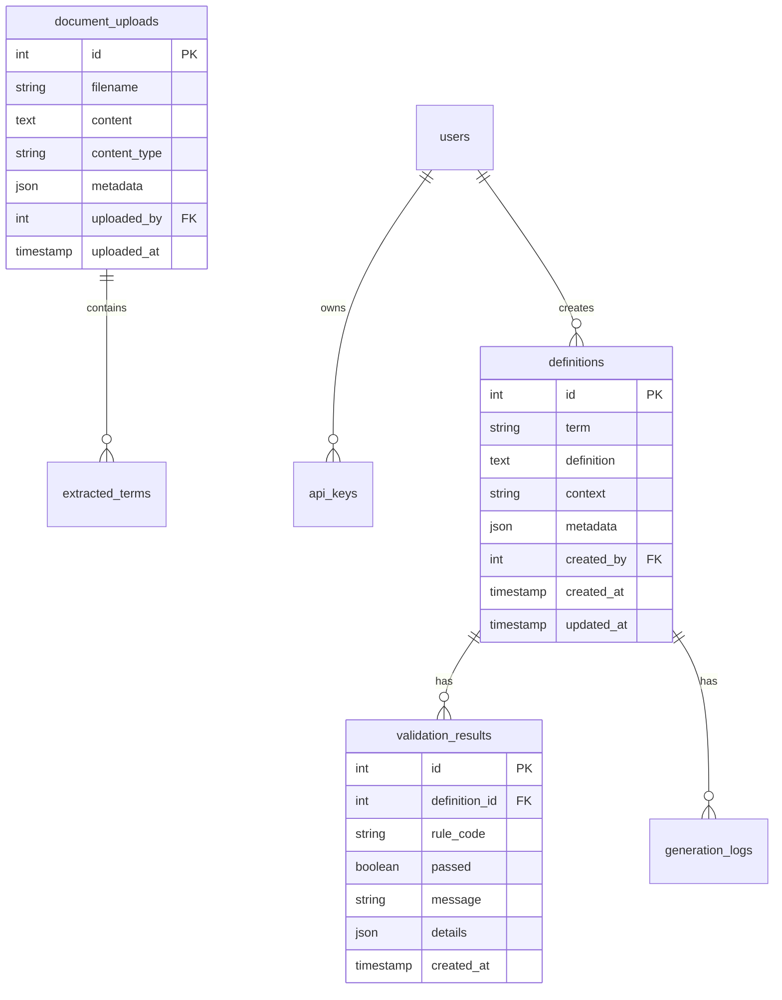

# Database Schema Documentation

## Overview

DefinitieAgent gebruikt SQLite voor ontwikkeling en test omgevingen, met een geplande migratie naar PostgreSQL voor productie. De database gebruikt SQLAlchemy 2.0 als ORM.

## Schema Diagram



## Tables

### definitions

Hoofdtabel voor opgeslagen definities.

| Column | Type | Constraints | Description |
|--------|------|-------------|-------------|
| id | INTEGER | PRIMARY KEY, AUTOINCREMENT | Unieke identifier |
| term | TEXT | NOT NULL, INDEX | Het gedefinieerde begrip |
| definition | TEXT | NOT NULL | De definitie tekst |
| context | TEXT | NULL | Context (juridisch, technisch, etc.) |
| context_type | TEXT | NULL | Type context (proces, resultaat, etc.) |
| metadata | JSON | NULL | Extra metadata (model, temperature, etc.) |
| source | TEXT | NULL | Bron van de definitie |
| version | INTEGER | DEFAULT 1 | Versienummer voor tracking |
| created_by | INTEGER | NULL, FK(users.id) | Gebruiker die definitie maakte |
| created_at | TIMESTAMP | DEFAULT CURRENT_TIMESTAMP | Aanmaak tijdstip |
| updated_at | TIMESTAMP | DEFAULT CURRENT_TIMESTAMP | Laatste wijziging |

**Indexes:**
- `idx_definitions_term` op (term)
- `idx_definitions_context` op (context)
- `idx_definitions_created_at` op (created_at)

### validation_results

Opslag van validatie resultaten per regel.

| Column | Type | Constraints | Description |
|--------|------|-------------|-------------|
| id | INTEGER | PRIMARY KEY, AUTOINCREMENT | Unieke identifier |
| definition_id | INTEGER | NOT NULL, FK(definitions.id) | Link naar definitie |
| rule_code | TEXT | NOT NULL | Toetsregel code (bijv. SAM-01) |
| passed | BOOLEAN | NOT NULL | Of regel geslaagd is |
| message | TEXT | NULL | Feedback message |
| details | JSON | NULL | Extra details van validatie |
| severity | TEXT | DEFAULT 'error' | ernst niveau (error, warning, info) |
| created_at | TIMESTAMP | DEFAULT CURRENT_TIMESTAMP | Validatie tijdstip |

**Indexes:**
- `idx_validation_definition` op (definition_id)
- `idx_validation_rule` op (rule_code)

### document_uploads

Geüploade documenten voor begrip extractie.

| Column | Type | Constraints | Description |
|--------|------|-------------|-------------|
| id | INTEGER | PRIMARY KEY, AUTOINCREMENT | Unieke identifier |
| filename | TEXT | NOT NULL | Originele bestandsnaam |
| content | TEXT | NOT NULL | Document inhoud (plain text) |
| content_type | TEXT | NULL | MIME type |
| file_size | INTEGER | NULL | Bestandsgrootte in bytes |
| metadata | JSON | NULL | Extra metadata |
| processing_status | TEXT | DEFAULT 'pending' | Status van verwerking |
| uploaded_by | INTEGER | NULL, FK(users.id) | Uploader |
| uploaded_at | TIMESTAMP | DEFAULT CURRENT_TIMESTAMP | Upload tijdstip |

### extracted_terms

Begrippen geëxtraheerd uit documenten.

| Column | Type | Constraints | Description |
|--------|------|-------------|-------------|
| id | INTEGER | PRIMARY KEY, AUTOINCREMENT | Unieke identifier |
| document_id | INTEGER | NOT NULL, FK(document_uploads.id) | Bron document |
| term | TEXT | NOT NULL | Geëxtraheerd begrip |
| frequency | INTEGER | DEFAULT 1 | Aantal voorkomens |
| context_snippets | JSON | NULL | Context voorbeelden |
| confidence | REAL | NULL | Vertrouwensscore (0-1) |
| created_at | TIMESTAMP | DEFAULT CURRENT_TIMESTAMP | Extractie tijdstip |

### generation_logs

Logs van alle generatie pogingen.

| Column | Type | Constraints | Description |
|--------|------|-------------|-------------|
| id | INTEGER | PRIMARY KEY, AUTOINCREMENT | Unieke identifier |
| definition_id | INTEGER | NULL, FK(definitions.id) | Resulterende definitie |
| term | TEXT | NOT NULL | Opgevraagd begrip |
| mode | TEXT | NOT NULL | Generatie mode |
| model | TEXT | NOT NULL | Gebruikt AI model |
| prompt_tokens | INTEGER | NULL | Aantal prompt tokens |
| completion_tokens | INTEGER | NULL | Aantal completion tokens |
| total_cost | REAL | NULL | Geschatte kosten |
| duration_ms | INTEGER | NULL | Verwerkingstijd |
| error | TEXT | NULL | Error message indien gefaald |
| metadata | JSON | NULL | Extra logging data |
| created_at | TIMESTAMP | DEFAULT CURRENT_TIMESTAMP | Log tijdstip |

### users (Planned)

Gebruikers tabel voor toekomstige authenticatie.

| Column | Type | Constraints | Description |
|--------|------|-------------|-------------|
| id | INTEGER | PRIMARY KEY, AUTOINCREMENT | Unieke identifier |
| email | TEXT | UNIQUE, NOT NULL | Email adres |
| username | TEXT | UNIQUE, NULL | Gebruikersnaam |
| full_name | TEXT | NULL | Volledige naam |
| role | TEXT | DEFAULT 'user' | Rol (user, admin, api) |
| is_active | BOOLEAN | DEFAULT TRUE | Account actief |
| created_at | TIMESTAMP | DEFAULT CURRENT_TIMESTAMP | Registratie datum |

### api_keys (Planned)

API keys voor programmatische toegang.

| Column | Type | Constraints | Description |
|--------|------|-------------|-------------|
| id | INTEGER | PRIMARY KEY, AUTOINCREMENT | Unieke identifier |
| user_id | INTEGER | NOT NULL, FK(users.id) | Eigenaar |
| key_hash | TEXT | UNIQUE, NOT NULL | Gehashte API key |
| name | TEXT | NULL | Beschrijvende naam |
| permissions | JSON | NULL | Toegestane operaties |
| rate_limit | INTEGER | DEFAULT 1000 | Requests per uur |
| last_used_at | TIMESTAMP | NULL | Laatste gebruik |
| expires_at | TIMESTAMP | NULL | Vervaldatum |
| created_at | TIMESTAMP | DEFAULT CURRENT_TIMESTAMP | Aanmaak datum |

## Migrations

### Current Version: 003

```sql
-- 001_initial_schema.sql
CREATE TABLE definitions (...);

-- 002_add_validation.sql
CREATE TABLE validation_results (...);

-- 003_add_metadata_fields.sql
ALTER TABLE definitions ADD COLUMN context_type TEXT;
ALTER TABLE definitions ADD COLUMN version INTEGER DEFAULT 1;
```

### Planned Migrations

```sql
-- 004_add_user_system.sql
CREATE TABLE users (...);
CREATE TABLE api_keys (...);
ALTER TABLE definitions ADD COLUMN created_by INTEGER REFERENCES users(id);

-- 005_add_versioning.sql
CREATE TABLE definition_versions (
    id INTEGER PRIMARY KEY,
    definition_id INTEGER NOT NULL,
    version_number INTEGER NOT NULL,
    definition_text TEXT NOT NULL,
    changed_by INTEGER REFERENCES users(id),
    change_reason TEXT,
    created_at TIMESTAMP DEFAULT CURRENT_TIMESTAMP,
    UNIQUE(definition_id, version_number)
);
```

## Indexes Strategy

Voor optimale performance:

1. **Primary indexes** op foreign keys
2. **Composite indexes** voor veel voorkomende queries:
   ```sql
   CREATE INDEX idx_definitions_term_context ON definitions(term, context);
   CREATE INDEX idx_validation_composite ON validation_results(definition_id, passed);
   ```

3. **Full-text search** (PostgreSQL):
   ```sql
   CREATE INDEX idx_definitions_fts ON definitions USING gin(to_tsvector('dutch', definition));
   ```

## Data Retention

- **Definitions**: Permanent bewaard
- **Validation results**: 90 dagen (configurable)
- **Generation logs**: 30 dagen
- **Document uploads**: 7 dagen na processing

## Backup Strategy

1. **Development**: Dagelijkse SQLite file backup
2. **Production**: 
   - Continue replicatie naar standby
   - Dagelijkse snapshots
   - Weekly off-site backups

## Performance Considerations

1. **Connection pooling**: Max 20 connections
2. **Query optimization**: 
   - Gebruik prepared statements
   - Batch inserts voor bulk operations
3. **Caching strategy**:
   - Redis voor frequent opgevraagde definities
   - In-memory cache voor validation rules

## Security

1. **Encryption at rest**: Database files encrypted
2. **SQL injection prevention**: Parameterized queries only
3. **Access control**: Row-level security voor multi-tenant
4. **Audit logging**: Alle wijzigingen gelogd