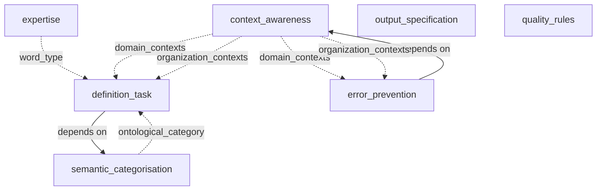

# Module Dependency Analysis Report

## Overview

Total modules analyzed: 7

## Module Afhankelijkheden

### context_awareness
- **Direct Afhankelijkheden**: None
- **Shared Data Set**: ['domain_contexts', 'organization_contexts']
- **Shared Data Get**: None

### definition_task
- **Direct Afhankelijkheden**: ['semantic_categorisation']
- **Shared Data Set**: None
- **Shared Data Get**: ['word_type', 'ontological_category', 'domain_contexts', 'organization_contexts']

### error_prevention
- **Direct Afhankelijkheden**: ['context_awareness']
- **Shared Data Set**: None
- **Shared Data Get**: ['domain_contexts', 'organization_contexts']

### expertise
- **Direct Afhankelijkheden**: None
- **Shared Data Set**: ['word_type']
- **Shared Data Get**: None

### output_specification
- **Direct Afhankelijkheden**: None
- **Shared Data Set**: ['character_limit_warning']
- **Shared Data Get**: None

### quality_rules
- **Direct Afhankelijkheden**: None
- **Shared Data Set**: None
- **Shared Data Get**: None

### semantic_categorisation
- **Direct Afhankelijkheden**: None
- **Shared Data Set**: ['ontological_category']
- **Shared Data Get**: None

## Coupling Analysis

### Independent Modules
Modules with no direct afhankelijkheden:
- context_awareness
- expertise
- output_specification
- quality_rules
- semantic_categorisation

### Direct Afhankelijkheden
- **definition_task** depends on: semantic_categorisation
- **error_prevention** depends on: context_awareness

### Data Flow Afhankelijkheden
- **definition_task**
  - Needs: word_type, ontological_category, domain_contexts, organization_contexts
  - Provides: None
- **error_prevention**
  - Needs: domain_contexts, organization_contexts
  - Provides: None

### Dependency Chains
1. definition_task → semantic_categorisation
2. error_prevention → context_awareness

## Modularity Assessment

- **Modularity Score**: 71.4% (5/7 modules are independent)
- **Tightly Coupled Pairs**: 0
- **Longest Dependency Chain**: 2

## Recommendations

## Dependency Graph

