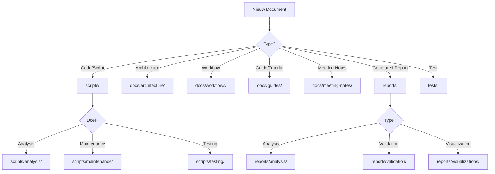

# 📚 Document Organization & Governance Workflow

## 🎯 Doel
Een systematische aanpak voor het opschonen van de huidige documentatie chaos en het etableren van duurzame documentatie praktijken voor de toekomst.

## 🤖 Claude Code Optimized Workflow

Dit is een solo-developer workflow geoptimaliseerd voor werken met Claude Code. Alle documentatie en code wordt via Claude Code gegenereerd, dus de focus ligt op:

1. **Automatische organisatie** - Scripts die alles voor je regelen
2. **Pre-commit hooks** - Voorkomt dat files op verkeerde plekken komen
3. **Clear conventions** - Zodat Claude Code altijd weet waar files horen

## 📋 Workflow Fases

### Fase 1: Assessment & Planning (Information Architect)
```bash
*agent ia
*task document-audit
```

**Activiteiten:**
1. Inventariseer alle documenten in root directory
2. Analyseer huidige folder structuur
3. Identificeer duplicaten en redundantie
4. Documenteer naming inconsistenties
5. Creëer migratie plan

**Output:**
- `DOCUMENT_MIGRATION_PLAN.md`
- Nieuwe folder structuur design

### Fase 2: Structuur Implementatie (DevOps Engineer)
```bash
*agent devops
*task create-folder-structure
```

**Nieuwe Structuur:**
```
/
├── docs/
│   ├── architectuur/       # Alle architectuur docs
│   │   ├── huidig/        # Huidige architectuur
│   │   └── beslissingen/  # ADRs
│   ├── werkwijzen/        # Workflow documentatie
│   ├── handleidingen/     # Gebruiker & developer handleidingen
│   ├── api/               # API documentatie
│   └── vergaderingen/     # Vergadering notities
├── rapporten/             # Gegenereerde rapporten (JSON, HTML)
│   ├── analyse/          # Analyse rapporten
│   └── validatie/        # Test & validatie rapporten
├── scripts/              # Alle scripts
│   ├── analyse/          # Analyse scripts
│   ├── onderhoud/        # Onderhoud scripts
│   └── testen/          # Test scripts
└── docs/
    └── archief/         # Bestaand archief met datum
        └── 2025-01/     # JJJJ-MM formaat
```

### Fase 3: Document Migratie (Information Architect + DevOps)
```bash
*agent ia
*checklist document-migration
```

**Migratie Regels:**
1. **Root Directory Files:**
   - `*.py` → `/scripts/analysis/`
   - `test_*.py` → `/tests/regression/`
   - `*_report.json` → `/reports/analysis/`
   - `*.html` → `/reports/visualizations/`
   - Project docs (`*.md`) → Appropriate `/docs/` subfolder

2. **Naming Conventions:**
   - Gebruik Engels (niet Nederlands)
   - Lowercase met hyphens: `document-name.md`
   - Datum prefix voor meeting notes: `2025-01-27-meeting-name.md`
   - Geen UPPERCASE files (behalve README.md, LICENSE, etc.)

3. **Archive Strategy:**
   - Alles ouder dan 3 maanden → `/archive/YYYY-MM/`
   - Behoud 1 niveau diep maximum
   - Voeg `ARCHIVED_` prefix toe aan filename

### Fase 4: Governance Setup (DevOps Engineer)
```bash
*agent devops
*task setup-doc-governance
```

**Pre-commit Hooks:**
```yaml
# .pre-commit-config.yaml toevoeging
- repo: local
  hooks:
    - id: check-doc-location
      name: Check document location
      entry: scripts/hooks/check-doc-location.py
      language: python
      files: '\.(md|rst|txt)$'

    - id: enforce-naming
      name: Enforce naming conventions
      entry: scripts/hooks/enforce-naming.py
      language: python
      files: '.*'
```

**GitHub Actions:**
```yaml
# .github/workflows/doc-quality.yml
name: Documentation Quality

on: [push, pull_request]

jobs:
  doc-checks:
    runs-on: ubuntu-latest
    steps:
      - name: Check documentation structure
        run: python scripts/validate-doc-structure.py

      - name: Find orphaned docs
        run: python scripts/find-orphaned-docs.py

      - name: Generate doc index
        run: python scripts/generate-doc-index.py
```

### Fase 5: Claude Code Integration
```bash
# Update README.md met file placement rules
```

**Voor Claude Code:**
1. README.md sectie met folder structuur
2. Pre-commit hooks die automatisch draaien
3. Clear error messages wanneer files verkeerd geplaatst worden

## 🔄 Toekomstige Document Plaatsing

### Beslisboom voor Nieuwe Documenten:



### Automated Placement Rules:

1. **IDE/Editor Plugins:**
   - VS Code extension voor correct file placement
   - Template generators met correcte paths

2. **CI/CD Checks:**
   - Block PRs met files in wrong locations
   - Auto-suggest correct location
   - Generate warnings voor naming violations

3. **Git Hooks:**
   - Pre-commit: Check file locations
   - Pre-push: Validate structure integrity

## 📊 Success Metrics

- [ ] Geen files in root behalve config files
- [ ] Alle docs follow naming conventions
- [ ] Archive is flat en datum-gebaseerd
- [ ] 100% van team kent de regels
- [ ] 0 violations in laatste sprint

## 🚀 Quick Start

```bash
# Start de workflow
*agent ia
*task document-audit

# Na audit, begin migratie
*agent devops
*task create-migration-script

# Execute migration
./scripts/migrate-documents.sh --dry-run
./scripts/migrate-documents.sh --execute

# Setup governance
*agent devops
*task setup-doc-governance

# Train team
*agent pm
*checklist team-documentation-training
```

## 📝 Notities

- Begin met een dry-run van alle moves
- Commit changes in logical chunks
- Update alle references na moves
- Test build pipeline na grote changes
- Bewaar migration log voor troubleshooting

---
*Workflow created by BMad Orchestrator*
*Last updated: 2025-01-27*
